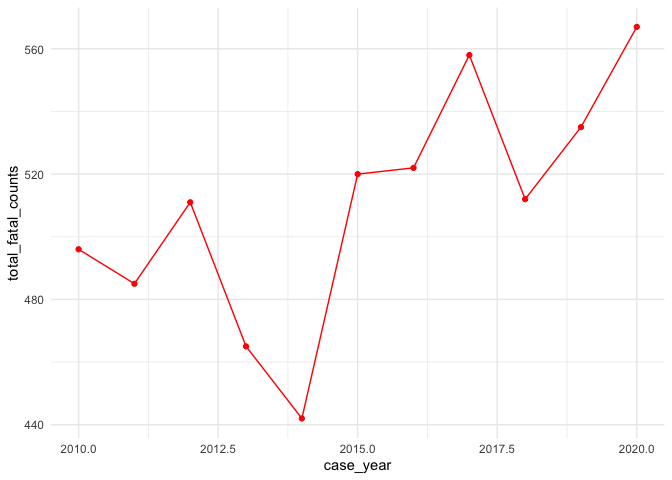
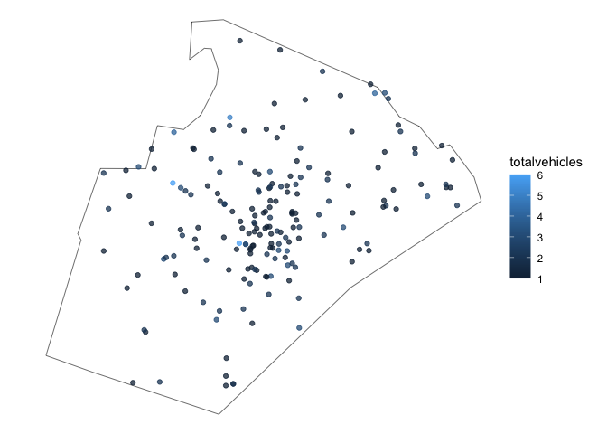

<!-- README.md is generated from README.Rmd. Please edit that file -->

# crashapi

<!-- badges: start -->

[](https://CRAN.R-project.org/package=crashapi)
[](https://lifecycle.r-lib.org/articles/stages.html#experimental)
[](https://opensource.org/licenses/MIT)
[](https://app.codecov.io/gh/elipousson/crashapi?branch=main)
[](https://www.repostatus.org/#active)
<!-- badges: end -->

The goal of the crashapi R package is to provide functions for
downloading data from the National Highway Traffic Safety Administration
(NHTSA) [Fatality Analysis Reporting System (FARS)
API](https://crashviewer.nhtsa.dot.gov/CrashAPI/).

What is FARS? NHTSA explains: “The Fatality Analysis Reporting System
(FARS) contains data on all vehicle crashes in the United States that
occur on a public roadway and involve a fatality.”

## Installation

You can install the development version of crashapi using the pak
package:

``` r
pak::pkg_install("elipousson/crashapi")
```

## Background

### Fatality Analysis Reporting System (FARS) API support

Supported APIs for this package include:

- [x] Get Crash List Information
- [x] Get Crash Details
- [x] Get Crashes By Location
- [x] Get Crashes By Vehicle
- [x] Get Summary Counts
- [x] Get Variables and Get Variable Attributes
- [x] Get FARS Data By Year
- [x] Get Crashes By Occupant (partial support)

Most of these APIs support XML, JSV, CSV, and JSON output formats. This
package only uses JSON with the exception of `get_fars_year()` (which
supports downloading CSV files).

For reference, this package also includes a list of terms and NHTSA
technical definitions in `fars_terms` and a list of variable labels in
`fars_vars_labels`.

The FARS API currently provides access to data from 2010 to 2022. The
[NHTSA website](https://www-fars.nhtsa.dot.gov/Help/helplinks.aspx) also
provides additional information on the release data and version status
for the FARS data files available through the API:

| Data Year | File Version | Release Date      |
|-----------|--------------|-------------------|
| 2010      | Final        | December 11, 2012 |
| 2011      | Final        | November 13, 2013 |
| 2012      | Final        | December 12, 2013 |
| 2013      | Final        | December 14, 2014 |
| 2014      | Final        | December 18, 2015 |
| 2015      | Final        | December 16, 2016 |
| 2016      | Final        | December 14, 2017 |
| 2017      | Final        | December 18, 2018 |
| 2018      | Final        | June 24, 2021     |
| 2019      | Final        | March 2, 2022     |
| 2020      | Final        | April 3, 2023     |
| 2021      | Final        | August 19, 2024   |
| 2022      | Annual       | August 19, 2024   |

### Additional data access functionality

The `get_fars_zip()` function can be used to access FARS data files from
1975 to 2020 that that are not available via the API but are available
for download on through [the NHTSA File Downloads
site](https://www.nhtsa.gov/file-downloads?p=nhtsa/downloads/FARS/) as
zipped CSV or SAS files (not available through the NHTSA FARS API). This
site also provides extensive technical documentation on coding and use
of the FARS data files.

Earlier data along with data from the the [General Estimates
System](https://www.nhtsa.gov/national-automotive-sampling-system-nass/nass-general-estimates-system)
(GES) / [Crash Report Sampling
System](https://www.nhtsa.gov/crash-data-systems/crash-report-sampling-system-crss)
(CRSS) is also available through the [Fatality and Injury Reporting
System Tool](https://cdan.dot.gov/query) (FIRST).

## Examples

``` r
library(crashapi)
library(ggplot2)
```

Most features for the package can be accessed using the `get_fars()`
function that selects the appropriate API-specific function based on the
provided parameters. You can also set the API to use with the `api`
parameter or use an API-specific function (e.g. `get_fars_summary()`).

For example, you can use the `get_fars()` access state-level summary
data on crash and fatality counts.

``` r
# Get summary crash count and fatality count data for Maryland from 2010 to 2019
md_summary <-
  get_fars(
    year = c(2010, 2021),
    state = "MD",
    api = "summary count"
  )

ggplot(md_summary, aes(x = CaseYear, y = TotalFatalCounts)) +
  geom_point(color = "red") +
  geom_line(color = "red", group = 1) +
  theme_minimal()
```



You can download crash data and set geometry to TRUE optionally convert
the data frame into an `sf` object for mapping.

``` r
crashes_sf <-
  get_fars(
    year = c(2018, 2021),
    state = "NC",
    county = "Wake County",
    geometry = TRUE
  )

nc <- sf::st_read(system.file("shape/nc.shp", package = "sf"))
#> Reading layer `nc' from data source 
#>   `/Users/elipousson/Library/R/arm64/4.4/library/sf/shape/nc.shp' 
#>   using driver `ESRI Shapefile'
#> Simple feature collection with 100 features and 14 fields
#> Geometry type: MULTIPOLYGON
#> Dimension:     XY
#> Bounding box:  xmin: -84.32385 ymin: 33.88199 xmax: -75.45698 ymax: 36.58965
#> Geodetic CRS:  NAD27
wake_co <- sf::st_transform(nc[nc$NAME == "Wake", ], 4326)

# Map crashes
ggplot() +
  geom_sf(
    data = wake_co,
    fill = NA, color = "black"
  ) +
  geom_sf(
    data = sf::st_crop(crashes_sf, wake_co),
    aes(color = TOTALVEHICLES),
    alpha = 0.75
  ) +
  theme_void()
#> Warning in st_is_longlat(x): bounding box has potentially an invalid value
#> range for longlat data
#> Warning in st_is_longlat(x): bounding box has potentially an invalid value
#> range for longlat data
```



You can list crashes and filter by the number of vehicles involved.

``` r
# Get fatal crashes in New York state from 2019 with 5 to 10 vehicles
get_fars(
  year = 2019,
  state = "NY",
  vehicles = c(5, 10)
)
#>      CountyName                  CrashDate Fatals Peds Persons St_Case State
#> 1     BRONX (5) /Date(1549865820000-0500)/      2    1       7  360042    36
#> 2     ERIE (29) /Date(1551915000000-0500)/      1    0       4  360159    36
#> 3   QUEENS (81) /Date(1561656240000-0400)/      1    0       6  360319    36
#> 4     BRONX (5) /Date(1561866000000-0400)/      1    0      11  360339    36
#> 5    KINGS (47) /Date(1564564080000-0400)/      1    0       5  360440    36
#> 6 SUFFOLK (103) /Date(1563792360000-0400)/      1    0       2  360551    36
#> 7   ORANGE (71) /Date(1558274040000-0400)/      1    0       1  360277    36
#>   StateName TotalVehicles
#> 1  New York             5
#> 2  New York             5
#> 3  New York             5
#> 4  New York             5
#> 5  New York             5
#> 6  New York             6
#> 7  New York             6
```

If you call `get_fars()` or `get_fars_crashes()` with details set to
TRUE, additional information from `get_fars_cases()` (including the
crash date and time) is appended to the crash data frame.

``` r
# Get fatal crashes for Anne Arundel County, MD for 2019 and append details
crashes_detailed <-
  get_fars(
    year = 2019,
    state = "MD",
    county = "Anne Arundel County",
    details = TRUE
  )
#> ■■■■■                             15% | ETA: 23s
#> ■■■■■■■■■■■■                      38% | ETA: 16s
#> ■■■■■■■■■■■■■■■                   48% | ETA: 14s
#> ■■■■■■■■■■■■■■■■■■■               60% | ETA: 11s
#> ■■■■■■■■■■■■■■■■■■■■■■            70% | ETA:  8s
#> ■■■■■■■■■■■■■■■■■■■■■■■■■■        82% | ETA:  5s
#> ■■■■■■■■■■■■■■■■■■■■■■■■■■■■■     95% | ETA:  1s

# Show 10 fatal crashes at random
dplyr::slice_sample(crashes_detailed, n = 10)
#>    CITY       CITYNAME COUNTY       COUNTYNAME CaseYear FATALS    LATITUDE
#> 1     0 NOT APPLICABLE      3 ANNE ARUNDEL (3)     2019      1 39.21617222
#> 2     0 NOT APPLICABLE      3 ANNE ARUNDEL (3)     2019      1 39.11144722
#> 3     0 NOT APPLICABLE      3 ANNE ARUNDEL (3)     2019      1 38.81519722
#> 4     0 NOT APPLICABLE      3 ANNE ARUNDEL (3)     2019      1 39.19551111
#> 5     0 NOT APPLICABLE      3 ANNE ARUNDEL (3)     2019      2 39.17067778
#> 6     0 NOT APPLICABLE      3 ANNE ARUNDEL (3)     2019      1 39.02736667
#> 7     0 NOT APPLICABLE      3 ANNE ARUNDEL (3)     2019      1 39.13838333
#> 8     0 NOT APPLICABLE      3 ANNE ARUNDEL (3)     2019      1 39.17808889
#> 9     0 NOT APPLICABLE      3 ANNE ARUNDEL (3)     2019      1 39.20472500
#> 10    0 NOT APPLICABLE      3 ANNE ARUNDEL (3)     2019      1 38.98215833
#>         LONGITUD STATE STATENAME ST_CASE TOTALVEHICLES TWAY_ID TWAY_ID2
#> 1  -76.698411110    24  Maryland  240069             3   I-195     <NA>
#> 2  -76.781183330    24  Maryland  240463             1  SR-295     <NA>
#> 3  -76.554083330    24  Maryland  240123             2  SR-468     <NA>
#> 4  -76.597869440    24  Maryland  240333             2  SR-710  CR-3700
#> 5  -76.730925000    24  Maryland  240169             2  SR-295     <NA>
#> 6  -76.708527780    24  Maryland  240048             1 CR-2633     <NA>
#> 7  -76.600591670    24  Maryland  240119             1    SR-2   OP-226
#> 8  -76.723630560    24  Maryland  240190             2  SR-295     <NA>
#> 9  -76.690747220    24  Maryland  240294             2  SR-295     <NA>
#> 10 -76.531572220    24  Maryland  240116             2  SR-450     <NA>
#>    VE_FORMS ARR_HOUR                   ARR_HOURNAME ARR_MIN
#> 1         3       99 Unknown EMS Scene Arrival Hour      99
#> 2         1       99 Unknown EMS Scene Arrival Hour      99
#> 3         2       99 Unknown EMS Scene Arrival Hour      99
#> 4         2       99 Unknown EMS Scene Arrival Hour      99
#> 5         2       99 Unknown EMS Scene Arrival Hour      99
#> 6         1       99 Unknown EMS Scene Arrival Hour      99
#> 7         1       99 Unknown EMS Scene Arrival Hour      99
#> 8         1       99 Unknown EMS Scene Arrival Hour      99
#> 9         1       99 Unknown EMS Scene Arrival Hour      99
#> 10        2       99 Unknown EMS Scene Arrival Hour      99
#>                          ARR_MINNAME
#> 1  Unknown EMS Scene Arrival Minutes
#> 2  Unknown EMS Scene Arrival Minutes
#> 3  Unknown EMS Scene Arrival Minutes
#> 4  Unknown EMS Scene Arrival Minutes
#> 5  Unknown EMS Scene Arrival Minutes
#> 6  Unknown EMS Scene Arrival Minutes
#> 7  Unknown EMS Scene Arrival Minutes
#> 8  Unknown EMS Scene Arrival Minutes
#> 9  Unknown EMS Scene Arrival Minutes
#> 10 Unknown EMS Scene Arrival Minutes
#>                                                                                                                                                                                                                                                                                                                                                                                                                                                               CEvents
#> 1                                                                                                                                                                                                                                                12, 98, 12 Clock Point, Not Reported, 12, 8, 12 Clock Point, 8 Clock Point, 2019, 2019, 1, 2, 12, 12, Motor Vehicle In-Transport, Motor Vehicle In-Transport, 24, 24, Maryland, Maryland, 240069, 240069, 1, 1, 2, 3
#> 2                                                                                                                                                                                                                                     55, 12, Non-Harmful Event, 12 Clock Point, 55, 77, Non-Harmful Event, Not a Motor Vehicle, 2019, 2019, 1, 2, 64, 42, Ran Off Roadway - Left, Tree (Standing Only), 24, 24, Maryland, Maryland, 240463, 240463, 1, 1, 5555, 9999
#> 3                                                                                                                                                                                                                                             55, 12, Non-Harmful Event, 12 Clock Point, 55, 12, Non-Harmful Event, 12 Clock Point, 2019, 2019, 1, 2, 68, 12, Cross Centerline, Motor Vehicle In-Transport, 24, 24, Maryland, Maryland, 240123, 240123, 1, 1, 5555, 2
#> 4                                                                                                                                                                                                                                                12, 0, 12 Clock Point, Non-Collision, 12, 77, 12 Clock Point, Not a Motor Vehicle, 2019, 2019, 1, 2, 12, 1, Motor Vehicle In-Transport, Rollover/Overturn, 24, 24, Maryland, Maryland, 240333, 240333, 1, 1, 2, 9999
#> 5                                                                                                                                                                                                                                                  12, 0, 12 Clock Point, Non-Collision, 4, 77, 4 Clock Point, Not a Motor Vehicle, 2019, 2019, 1, 2, 12, 1, Motor Vehicle In-Transport, Rollover/Overturn, 24, 24, Maryland, Maryland, 240169, 240169, 1, 2, 2, 9999
#> 6                                                                                                                                                                                                                                                                                                                                                                  12, 12 Clock Point, 77, Not a Motor Vehicle, 2019, 1, 8, Pedestrian, 24, Maryland, 240048, 1, 9999
#> 7                                                                                                                                                                                                                                                                                                                                                                12, 12 Clock Point, 77, Not a Motor Vehicle, 2019, 1, 9, Pedalcyclist, 24, Maryland, 240119, 1, 9999
#> 8  55, 12, 98, 19, Non-Harmful Event, 12 Clock Point, Not Reported, Other Objects or Person Set-In-Motion, 55, 77, 77, 8, Non-Harmful Event, Not a Motor Vehicle, Not a Motor Vehicle, 8 Clock Point, 2019, 2019, 2019, 2019, 1, 2, 3, 4, 63, 8, 18, 14, Ran Off Roadway - Right, Pedestrian, Other Object (not fixed), Parked Motor Vehicle, 24, 24, 24, 24, Maryland, Maryland, Maryland, Maryland, 240190, 240190, 240190, 240190, 1, 1, 1, 1, 5555, 9999, 9999, 2
#> 9                                                                                                                                                                                                                                              55, 12, Non-Harmful Event, 12 Clock Point, 55, 6, Non-Harmful Event, 6 Clock Point, 2019, 2019, 1, 2, 63, 14, Ran Off Roadway - Right, Parked Motor Vehicle, 24, 24, Maryland, Maryland, 240294, 240294, 1, 1, 5555, 2
#> 10                                                                                                                                                                                                                                                                                                                                                          12, 12 Clock Point, 9, 9 Clock Point, 2019, 1, 12, Motor Vehicle In-Transport, 24, Maryland, 240116, 1, 2
#>    CF1
#> 1    0
#> 2    0
#> 3    0
#> 4    0
#> 5    0
#> 6    0
#> 7    0
#> 8   14
#> 9    0
#> 10   0
#>                                                                                                                     CF1NAME
#> 1                                                                                                                      None
#> 2                                                                                                                      None
#> 3                                                                                                                      None
#> 4                                                                                                                      None
#> 5                                                                                                                      None
#> 6                                                                                                                      None
#> 7                                                                                                                      None
#> 8  Motor Vehicle struck by falling cargo,or something that came loose from or something that was set in motion by a vehicle
#> 9                                                                                                                      None
#> 10                                                                                                                     None
#>    CF2 CF2NAME CF3 CF3NAME CrashRFs DAY DAY_WEEK DAY_WEEKNAME DRUNK_DR FUNC_SYS
#> 1    0    None   0    None       NA  15        6       Friday        1        1
#> 2    0    None   0    None       NA   5        7     Saturday        1        3
#> 3    0    None   0    None       NA  10        6       Friday        0        5
#> 4    0    None   0    None       NA  26        2       Monday        0        4
#> 5    0    None   0    None       NA  14        6       Friday        0        7
#> 6    0    None   0    None       NA  20        4    Wednesday        0        5
#> 7    0    None   0    None       NA   5        1       Sunday        0        3
#> 8    0    None   0    None       NA  30        1       Sunday        0        3
#> 9    0    None   0    None       NA  14        7     Saturday        1        4
#> 10   0    None   0    None       NA  22        2       Monday        0        3
#>                  FUNC_SYSNAME HARM_EV                HARM_EVNAME HOSP_HR
#> 1                  Interstate      12 Motor Vehicle In-Transport      99
#> 2  Principal Arterial - Other      42       Tree (Standing Only)      88
#> 3             Major Collector      12 Motor Vehicle In-Transport      99
#> 4              Minor Arterial      12 Motor Vehicle In-Transport      99
#> 5                       Local      12 Motor Vehicle In-Transport      88
#> 6             Major Collector       8                 Pedestrian      88
#> 7  Principal Arterial - Other       9               Pedalcyclist      99
#> 8  Principal Arterial - Other       8                 Pedestrian      99
#> 9              Minor Arterial      14       Parked Motor Vehicle      99
#> 10 Principal Arterial - Other      12 Motor Vehicle In-Transport      99
#>                         HOSP_HRNAME HOSP_MN                       HOSP_MNNAME
#> 1                           Unknown      99 Unknown EMS Hospital Arrival Time
#> 2  Not Applicable (Not Transported)      88  Not Applicable (Not Transported)
#> 3                           Unknown      99 Unknown EMS Hospital Arrival Time
#> 4                           Unknown      99 Unknown EMS Hospital Arrival Time
#> 5  Not Applicable (Not Transported)      88  Not Applicable (Not Transported)
#> 6  Not Applicable (Not Transported)      88  Not Applicable (Not Transported)
#> 7                           Unknown      99 Unknown EMS Hospital Arrival Time
#> 8                           Unknown      99 Unknown EMS Hospital Arrival Time
#> 9                           Unknown      99 Unknown EMS Hospital Arrival Time
#> 10                          Unknown      99 Unknown EMS Hospital Arrival Time
#>    HOUR        HOURNAME LATITUDENAME LGT_COND       LGT_CONDNAME  LONGITUDNAME
#> 1     1   1:00am-1:59am  39.21617222        2 Dark - Not Lighted -76.698411110
#> 2    23 11:00pm-11:59pm  39.11144722        3     Dark - Lighted -76.781183330
#> 3     7   7:00am-7:59am  38.81519722        1           Daylight -76.554083330
#> 4    11 11:00am-11:59am  39.19551111        1           Daylight -76.597869440
#> 5    22 10:00pm-10:59pm  39.17067778        3     Dark - Lighted -76.730925000
#> 6    18   6:00pm-6:59pm  39.02736667        2 Dark - Not Lighted -76.708527780
#> 7    11 11:00am-11:59am  39.13838333        1           Daylight -76.600591670
#> 8    18   6:00pm-6:59pm  39.17808889        1           Daylight -76.723630560
#> 9    15   3:00pm-3:59pm  39.20472500        1           Daylight -76.690747220
#> 10    8   8:00am-8:59am  38.98215833        1           Daylight -76.531572220
#>    MAN_COLL
#> 1         2
#> 2         0
#> 3         2
#> 4         2
#> 5         6
#> 6         0
#> 7         0
#> 8         0
#> 9         0
#> 10        6
#>                                                                     MAN_COLLNAME
#> 1                                                                 Front-to-Front
#> 2  The First Harmful Event was Not a Collision with a Motor Vehicle in Transport
#> 3                                                                 Front-to-Front
#> 4                                                                 Front-to-Front
#> 5                                                                          Angle
#> 6  The First Harmful Event was Not a Collision with a Motor Vehicle in Transport
#> 7  The First Harmful Event was Not a Collision with a Motor Vehicle in Transport
#> 8  The First Harmful Event was Not a Collision with a Motor Vehicle in Transport
#> 9  The First Harmful Event was Not a Collision with a Motor Vehicle in Transport
#> 10                                                                         Angle
#>    MILEPT MILEPTNAME MINUTE MINUTENAME MONTH MonthName NHS
#> 1      26         26     26         26     3     March   1
#> 2       0       None     42         42     1   January   1
#> 3      36         36     53         53     5       May   0
#> 4       9          9     57         57     8    August   0
#> 5       9          9     30         30     6      June   0
#> 6      12         12     25         25     2  February   0
#> 7     343        343     39         39     5       May   0
#> 8      90         90     20         20     6      June   0
#> 9     119        119     46         46     9 September   0
#> 10    102        102      0          0     4     April   0
#>                           NHSNAME
#> 1      This section IS ON the NHS
#> 2      This section IS ON the NHS
#> 3  This section IS NOT on the NHS
#> 4  This section IS NOT on the NHS
#> 5  This section IS NOT on the NHS
#> 6  This section IS NOT on the NHS
#> 7  This section IS NOT on the NHS
#> 8  This section IS NOT on the NHS
#> 9  This section IS NOT on the NHS
#> 10 This section IS NOT on the NHS
#>                                                                                     NMDrugs
#> 1                                                                                      NULL
#> 2                                                                                      NULL
#> 3                                                                                      NULL
#> 4                                                                                      NULL
#> 5                                                                                      NULL
#> 6       2019, 1, Tested, No Drugs Found/Negative, 15, Liver, 1, 24, MD, Maryland, 240048, 0
#> 7  2019, 1, Tested, No Drugs Found/Negative, 1, Whole Blood, 1, 24, MD, Maryland, 240119, 0
#> 8        2019, 1, Tested, No Drugs Found/Negative, 2, Urine, 1, 24, MD, Maryland, 240190, 0
#> 9                                                                                      NULL
#> 10                                                                                     NULL
#>    NMPersonRF
#> 1          NA
#> 2          NA
#> 3          NA
#> 4          NA
#> 5          NA
#> 6          NA
#> 7          NA
#> 8          NA
#> 9          NA
#> 10         NA
#>                                                                          NMRace
#> 1                                                                          NULL
#> 2                                                                          NULL
#> 3                                                                          NULL
#> 4                                                                          NULL
#> 5                                                                          NULL
#> 6                      2019, 0, No, 1, 1, 1, White, 24, MD, Maryland, 240048, 0
#> 7  2019, 0, No, 1, 1, 2, Black or African American, 24, MD, Maryland, 240119, 0
#> 8  2019, 0, No, 1, 1, 2, Black or African American, 24, MD, Maryland, 240190, 0
#> 9                                                                          NULL
#> 10                                                                         NULL
#>    NOT_HOUR NOT_HOURNAME NOT_MIN NOT_MINNAME
#> 1        99      Unknown      99     Unknown
#> 2        99      Unknown      99     Unknown
#> 3        99      Unknown      99     Unknown
#> 4        99      Unknown      99     Unknown
#> 5        99      Unknown      99     Unknown
#> 6        99      Unknown      99     Unknown
#> 7        99      Unknown      99     Unknown
#> 8        99      Unknown      99     Unknown
#> 9        99      Unknown      99     Unknown
#> 10       99      Unknown      99     Unknown
#>                                                                                                                                                                                                                                                                                                                                                                                                                                                                                                                                                                                                                                                                                                                                                                                                                                                                                                                                                                                                                                                                                                                                                                                                                                            NPersons
#> 1                                                                                                                                                                                                                                                                                                                                                                                                                                                                                                                                                                                                                                                                                                                                                                                                                                                                                                                                                                                                                                                                                                                                                                                                                                              NULL
#> 2                                                                                                                                                                                                                                                                                                                                                                                                                                                                                                                                                                                                                                                                                                                                                                                                                                                                                                                                                                                                                                                                                                                                                                                                                                              NULL
#> 3                                                                                                                                                                                                                                                                                                                                                                                                                                                                                                                                                                                                                                                                                                                                                                                                                                                                                                                                                                                                                                                                                                                                                                                                                                              NULL
#> 4                                                                                                                                                                                                                                                                                                                                                                                                                                                                                                                                                                                                                                                                                                                                                                                                                                                                                                                                                                                                                                                                                                                                                                                                                                              NULL
#> 5                                                                                                                                                                                                                                                                                                                                                                                                                                                                                                                                                                                                                                                                                                                                                                                                                                                                                                                                                                                                                                                                                                                                                                                                                                              NULL
#> 6  26, 26 Years, 97, Not a Motor Vehicle Occupant, 9, Not Reported, 0, 0.000 % BAC, 2, Test Given, 1, Blood, NA, NA, NA, 3, ANNE ARUNDEL (3), 2019, 20, 20, 20, 18, 18:00-18:59, 43, 43, 2, February, 1843, 1843, 2019, 2019, NA, NA, NA, NA, 7, Died at Scene, 9, Reported as Unknown, NA, NA, NA, NA, NA, NA, 9, Reported as Unknown, NA, NA, NA, NA, NA, NA, 8, Not Reported, 2, Test Given, 8, Not Applicable, 0, Ejection Path Not Applicable, NA, NA, 0, Not Extricated or Not Applicable, NA, NA, 5, Major Collector, NA, NA, NA, NA, 8, Pedestrian, 8, Not a Motor Vehicle Occupant, 96, Not a Motor Vehicle Occupant, 7, Non-Hispanic, 0, Not Transported, 18, 6:00pm-6:59pm, NA, NA, NA, NA, NA, NA, 4, Fatal Injury (K), 0, 0, 18, 18, 11, Not at Intersection - On Roadway, Not in Marked Crosswalk, NA, NA, NA, NA, 0, The First Harmful Event was Not a Collision with a Motor Vehicle in Transport, 25, 25, NA, NA, 2, February, NA, NA, 1, 5, Pedestrian, 0, None, 0, None, 0, None, NA, NA, NA, 8, Not a Motor Vehicle Occupant, 96, Not a Motor Vehicle Occupant, NA, NA, NA, NA, 2, Urban, NA, 0, No, 0, Not a Motor Vehicle Occupant, 1, Male, NA, NA, 24, Maryland, 1, NA, 240048, NA, NA, 0, 1, NA, NA, NA, NA, NA, NA, 0, No
#> 7                             55, 55 Years, 97, Not a Motor Vehicle Occupant, 9, Not Reported, 130, 0.130 % BAC, 2, Test Given, 1, Blood, NA, NA, NA, 3, ANNE ARUNDEL (3), 2019, 5, 5, 5, 13, 13:00-13:59, 39, 39, 5, May, 1339, 1339, 2019, 2019, NA, NA, NA, NA, 0, Not Applicable, 9, Reported as Unknown, NA, NA, NA, NA, NA, NA, 9, Reported as Unknown, NA, NA, NA, NA, NA, NA, 8, Not Reported, 2, Test Given, 8, Not Applicable, 0, Ejection Path Not Applicable, NA, NA, 0, Not Extricated or Not Applicable, NA, NA, 3, Principal Arterial - Other, NA, NA, NA, NA, 9, Pedalcyclist, 8, Not a Motor Vehicle Occupant, 96, Not a Motor Vehicle Occupant, 7, Non-Hispanic, 5, EMS Ground, 11, 11:00am-11:59am, NA, NA, NA, NA, NA, NA, 4, Fatal Injury (K), 2, 2, 0, 0, 3, At Intersection - Not In Crosswalk, NA, NA, NA, NA, 0, The First Harmful Event was Not a Collision with a Motor Vehicle in Transport, 39, 39, NA, NA, 5, May, NA, NA, 1, 6, Bicyclist, 0, None, 0, None, 0, None, NA, NA, NA, 8, Not a Motor Vehicle Occupant, 96, Not a Motor Vehicle Occupant, NA, NA, NA, NA, 2, Urban, NA, 0, No, 0, Not a Motor Vehicle Occupant, 1, Male, NA, NA, 24, Maryland, 1, NA, 240119, NA, NA, 0, 1, NA, NA, NA, NA, NA, NA, 0, No
#> 8                           41, 41 Years, 97, Not a Motor Vehicle Occupant, 9, Not Reported, 20, 0.020 % BAC, 2, Test Given, 1, Blood, NA, NA, NA, 3, ANNE ARUNDEL (3), 2019, 30, 30, 30, 18, 18:00-18:59, 33, 33, 6, June, 1833, 1833, 2019, 2019, NA, NA, NA, NA, 7, Died at Scene, 0, No (Alcohol Not Involved), NA, NA, NA, NA, NA, NA, 0, No (drugs not involved), NA, NA, NA, NA, NA, NA, 8, Not Reported, 2, Test Given, 8, Not Applicable, 0, Ejection Path Not Applicable, NA, NA, 0, Not Extricated or Not Applicable, NA, NA, 3, Principal Arterial - Other, NA, NA, NA, NA, 8, Pedestrian, 8, Not a Motor Vehicle Occupant, 96, Not a Motor Vehicle Occupant, 7, Non-Hispanic, 0, Not Transported, 18, 6:00pm-6:59pm, NA, NA, NA, NA, NA, NA, 4, Fatal Injury (K), 0, 0, 13, 13, 20, Shoulder/Roadside, NA, NA, NA, NA, 0, The First Harmful Event was Not a Collision with a Motor Vehicle in Transport, 20, 20, NA, NA, 6, June, NA, NA, 1, 5, Pedestrian, 0, None, 0, None, 0, None, NA, NA, NA, 8, Not a Motor Vehicle Occupant, 96, Not a Motor Vehicle Occupant, NA, NA, NA, NA, 2, Urban, NA, 0, No, 0, Not a Motor Vehicle Occupant, 1, Male, NA, NA, 24, Maryland, 1, NA, 240190, NA, NA, 0, 1, NA, NA, NA, NA, NA, NA, 1, Yes
#> 9                                                                                                                                                                                                                                                                                                                                                                                                                                                                                                                                                                                                                                                                                                                                                                                                                                                                                                                                                                                                                                                                                                                                                                                                                                              NULL
#> 10                                                                                                                                                                                                                                                                                                                                                                                                                                                                                                                                                                                                                                                                                                                                                                                                                                                                                                                                                                                                                                                                                                                                                                                                                                             NULL
#>                                                                                                                                                                                                                                                                     NmCrashes
#> 1                                                                                                                                                                                                                                                                        NULL
#> 2                                                                                                                                                                                                                                                                        NULL
#> 3                                                                                                                                                                                                                                                                        NULL
#> 4                                                                                                                                                                                                                                                                        NULL
#> 5                                                                                                                                                                                                                                                                        NULL
#> 6  2019, 2019, 4, 9, In Roadway Improperly (Standing, Lying, Working, Playing, etc.), Wrong-Way Riding or Walking, 4, 9, In Roadway Improperly (Standing, Lying, Working, Playing, etc.), Wrong-Way Riding or Walking, 1, 1, 24, 24, Maryland, Maryland, 240048, 240048, 0, 0
#> 7                          2019, 2019, 2, 3, Failure to Yield Right-Of-Way, Failure to Obey Traffic Signs, Signals or Officer, 2, 3, Failure to Yield Right-Of-Way, Failure to Obey Traffic Signs, Signals or Officer, 1, 1, 24, 24, Maryland, Maryland, 240119, 240119, 0, 0
#> 8                                                                                                                                                                                                              2019, 0, None Noted, 0, None Noted, 1, 24, Maryland, 240190, 0
#> 9                                                                                                                                                                                                                                                                        NULL
#> 10                                                                                                                                                                                                                                                                       NULL
#>                                                                    NmDistract
#> 1                                                                        NULL
#> 2                                                                        NULL
#> 3                                                                        NULL
#> 4                                                                        NULL
#> 5                                                                        NULL
#> 6    2019, 96, Not Reported, 96, Not Reported, 1, 24, MD, Maryland, 240048, 0
#> 7    2019, 96, Not Reported, 96, Not Reported, 1, 24, MD, Maryland, 240119, 0
#> 8  2019, 0, Not Distracted, 0, Not Distracted, 1, 24, MD, Maryland, 240190, 0
#> 9                                                                        NULL
#> 10                                                                       NULL
#>                                                                NmImpairs
#> 1                                                                   NULL
#> 2                                                                   NULL
#> 3                                                                   NULL
#> 4                                                                   NULL
#> 5                                                                   NULL
#> 6  2019, 99, Reported as Unknown if Impaired, 1, 24, Maryland, 240048, 0
#> 7  2019, 99, Reported as Unknown if Impaired, 1, 24, Maryland, 240119, 0
#> 8            2019, 0, None/Apparently Normal, 1, 24, Maryland, 240190, 0
#> 9                                                                   NULL
#> 10                                                                  NULL
#>                                                                                                             NmPriors
#> 1                                                                                                               NULL
#> 2                                                                                                               NULL
#> 3                                                                                                               NULL
#> 4                                                                                                               NULL
#> 5                                                                                                               NULL
#> 6   2019, 5, Movement Along Roadway with Traffic (In or Adjacent to Travel Lane), NA, NA, 1, 24, Maryland, 240048, 0
#> 7                                                      2019, 3, Crossing Roadway, NA, NA, 1, 24, Maryland, 240119, 0
#> 8  2019, 12, Disabled Vehicle Related (Working on, Pushing, Leaving/Approaching), NA, NA, 1, 24, Maryland, 240190, 0
#> 9                                                                                                               NULL
#> 10                                                                                                              NULL
#>    PEDS PERMVIT PERNOTMVIT PERSONS PVH_INVL
#> 1     0       6          0       6        0
#> 2     0       1          0       1        0
#> 3     0       3          0       3        0
#> 4     0       2          0       2        0
#> 5     0       3          0       3        0
#> 6     1       2          1       2        0
#> 7     1       1          1       1        0
#> 8     1       1          1       1        1
#> 9     0       1          2       3        1
#> 10    0       2          0       2        0
#>                                                                                                                                                                                                                                                                                                                                                                                                                                                                                                                                                                                                                                                                                                                                                                                                                                                                                                                                                                                                                                                                                                                                     ParkWorks
#> 1                                                                                                                                                                                                                                                                                                                                                                                                                                                                                                                                                                                                                                                                                                                                                                                                                                                                                                                                                                                                                                                                                                                                        NULL
#> 2                                                                                                                                                                                                                                                                                                                                                                                                                                                                                                                                                                                                                                                                                                                                                                                                                                                                                                                                                                                                                                                                                                                                        NULL
#> 3                                                                                                                                                                                                                                                                                                                                                                                                                                                                                                                                                                                                                                                                                                                                                                                                                                                                                                                                                                                                                                                                                                                                        NULL
#> 4                                                                                                                                                                                                                                                                                                                                                                                                                                                                                                                                                                                                                                                                                                                                                                                                                                                                                                                                                                                                                                                                                                                                        NULL
#> 5                                                                                                                                                                                                                                                                                                                                                                                                                                                                                                                                                                                                                                                                                                                                                                                                                                                                                                                                                                                                                                                                                                                                        NULL
#> 6                                                                                                                                                                                                                                                                                                                                                                                                                                                                                                                                                                                                                                                                                                                                                                                                                                                                                                                                                                                                                                                                                                                                        NULL
#> 7                                                                                                                                                                                                                                                                                                                                                                                                                                                                                                                                                                                                                                                                                                                                                                                                                                                                                                                                                                                                                                                                                                                                        NULL
#> 8  2019, 51, Cross Country/Intercity Bus, 5, Charter/Tour, 22, Bus, 30, 0, 0, Not Applicable, 0, No or Not Reported, 3, 26,001 lbs. or more, NA, NA, NA, NA, 8, Pedestrian, 0, Not Applicable, 0, Not Applicable, 0, Not Applicable, 1, No, 0, Not Applicable, 0, No, 18, 6:00pm-6:59pm, NA, NA, 8, 8 Clock Point, NA, NA, 98, Other Make, NA, Other Make Van Hool, 0, The First Harmful Event was Not a Collision with a Motor Vehicle in Transport, 57, US DOT, 1759030, 1759030, 571759030, 571759030, 20, 20, 908, NA, 2012, 2012, 6, June, 12, Motor Vehicle In-Transport, 0, None, 6, Driverless/Motor Vehicle Parked/Stopped Off Roadway, 17, Illinois, 3, Vehicle Used as Other Bus, 5, Not Towed, 0, No Trailing Units, NA, NA, NA, No Trailing Units, NA, NA, NA, No Trailing Units, NA, NA, NA, No Trailing Units, 2, Motor Vehicle Not In-Transport Within the Trafficway, 0, No Underride or Override Noted, 0, None, 0, None, 2, Minor Damage, 1, YE2DG13B5C20, YE2DG13B5C20, Y, C, 2, 0, E, 2, D, G, 1, 3, B, 5, NA, NA, NA, NA, NA, NA, 21, Bus (seats for more than 15 occupants, including driver), 24, Maryland, 240190, 2
#> 9                        2019, 4, 4-door sedan, hardtop, 0, Not a Bus, 0, Not Applicable (N/A), 14, 1, 0, Not Applicable, 0, No or Not Reported, 0, Not Applicable, NA, NA, NA, NA, 14, Parked Motor Vehicle, 0, Not Applicable, 0, Not Applicable, 0, Not Applicable, 1, No, 0, Not Applicable, 0, No, 15, 3:00pm-3:59pm, NA, NA, 6, 6 Clock Point, NA, NA, 41, Mazda, NA, Mazda Mazda3, 0, The First Harmful Event was Not a Collision with a Motor Vehicle in Transport, 0, Not Applicable, 0, Not Applicable, 0, Not Applicable, 46, 46, 51, NA, 2018, 2018, 9, September, 12, Motor Vehicle In-Transport, 2, 2, 6, Driverless/Motor Vehicle Parked/Stopped Off Roadway, 34, New Jersey, 0, No Special Use, 2, Towed Due to Disabling Damage, 0, No Trailing Units, NA, NA, NA, No Trailing Units, NA, NA, NA, No Trailing Units, NA, NA, NA, No Trailing Units, 2, Motor Vehicle Not In-Transport Within the Trafficway, 0, No Underride or Override Noted, 0, None, 0, None, 6, Disabling Damage, 1, 3MZBN1V34JM2, 3MZBN1V34JM2, 3, J, M, 2, M, Z, B, N, 1, V, 3, 4, NA, NA, NA, NA, NA, NA, 0, Not Applicable, 24, Maryland, 240294, 2
#> 10                                                                                                                                                                                                                                                                                                                                                                                                                                                                                                                                                                                                                                                                                                                                                                                                                                                                                                                                                                                                                                                                                                                                       NULL
#>                                                                                                                                                                                                                                                                                                                                                                                                                                                                                 PbTypes
#> 1                                                                                                                                                                                                                                                                                                                                                                                                                                                                                  NULL
#> 2                                                                                                                                                                                                                                                                                                                                                                                                                                                                                  NULL
#> 3                                                                                                                                                                                                                                                                                                                                                                                                                                                                                  NULL
#> 4                                                                                                                                                                                                                                                                                                                                                                                                                                                                                  NULL
#> 5                                                                                                                                                                                                                                                                                                                                                                                                                                                                                  NULL
#> 6                               0, Not a Cyclist, 0, Not a Cyclist, 7, Not a Cyclist, 7, Not a Cyclist, 7, Not a Cyclist, 2019, 8, Not Applicable, 8, Not Applicable, 26, 26 Years, 0, None Noted, 5, Pedestrian, 1, Male, 0, None Noted, 0, None Noted, 400, Walking/Running Along Roadway, 410, Walking/Running Along Roadway With Traffic - From Behind, 8, Not Applicable, 8, Not Applicable, 3, Not At Intersection, 3, Travel Lane, 8, Not Applicable, 1, 24, Maryland, 240048, 0
#> 7  158, Bicyclist Failed to Yield - Signalized Intersection, 153, Bicyclist Ride Out - Signalized Intersection, 2, Facing Traffic, 1, At Intersection, 1, Travel Lane, 2019, 7, Not a Pedestrian, 7, Not a Pedestrian, 55, 55 Years, 0, None Noted, 6, Bicyclist, 1, Male, 0, None Noted, 0, None Noted, 0, Not a Pedestrian, 0, Not a Pedestrian, 7, Not a Pedestrian, 7, Not a Pedestrian, 7, Not a Pedestrian, 77, Not a Pedestrian, 7, Not a Pedestrian, 1, 24, Maryland, 240119, 0
#> 8                                 0, Not a Cyclist, 0, Not a Cyclist, 7, Not a Cyclist, 7, Not a Cyclist, 7, Not a Cyclist, 2019, 8, Not Applicable, 8, Not Applicable, 41, 41 Years, 0, None Noted, 5, Pedestrian, 1, Male, 0, None Noted, 0, None Noted, 100, Unusual Circumstances, 150, Motor Vehicle Loss of Control, 8, Not Applicable, 8, Not Applicable, 3, Not At Intersection, 4, Paved Shoulder / Bicycle Lane / Parking Lane, 8, Not Applicable, 1, 24, Maryland, 240190, 0
#> 9                                                                                                                                                                                                                                                                                                                                                                                                                                                                                  NULL
#> 10                                                                                                                                                                                                                                                                                                                                                                                                                                                                                 NULL
#>       RAIL       RAILNAME RD_OWNER          RD_OWNERNAME RELJCT1 RELJCT1NAME
#> 1  0000000 Not Applicable        1  State Highway Agency       0          No
#> 2  0000000 Not Applicable        1  State Highway Agency       0          No
#> 3  0000000 Not Applicable        1  State Highway Agency       0          No
#> 4  0000000 Not Applicable        1  State Highway Agency       0          No
#> 5  0000000 Not Applicable        1  State Highway Agency       0          No
#> 6  0000000 Not Applicable        2 County Highway Agency       0          No
#> 7  0000000 Not Applicable        1  State Highway Agency       0          No
#> 8  0000000 Not Applicable        1  State Highway Agency       0          No
#> 9  0000000 Not Applicable        1  State Highway Agency       1         Yes
#> 10 0000000 Not Applicable        1  State Highway Agency       0          No
#>    RELJCT2                            RELJCT2NAME REL_ROAD REL_ROADNAME
#> 1        1                           Non-Junction        1   On Roadway
#> 2        5             Entrance/Exit Ramp Related        3    On Median
#> 3        1                           Non-Junction        1   On Roadway
#> 4        2                           Intersection        1   On Roadway
#> 5        5             Entrance/Exit Ramp Related        1   On Roadway
#> 6        1                           Non-Junction        1   On Roadway
#> 7        2                           Intersection        1   On Roadway
#> 8        1                           Non-Junction        2  On Shoulder
#> 9       19 Other location within Interchange Area        8         Gore
#> 10       8                Driveway Access Related        1   On Roadway
#>    ROAD_FNC ROAD_FNCNAME ROUTE     ROUTENAME RUR_URB RUR_URBNAME SCH_BUS
#> 1        NA           NA     1    Interstate       2       Urban       0
#> 2        NA           NA     3 State Highway       2       Urban       0
#> 3        NA           NA     3 State Highway       2       Urban       0
#> 4        NA           NA     3 State Highway       2       Urban       0
#> 5        NA           NA     3 State Highway       2       Urban       0
#> 6        NA           NA     4   County Road       2       Urban       0
#> 7        NA           NA     3 State Highway       2       Urban       0
#> 8        NA           NA     3 State Highway       2       Urban       0
#> 9        NA           NA     3 State Highway       2       Urban       0
#> 10       NA           NA     3 State Highway       2       Urban       0
#>    SCH_BUSNAME SP_JUR              SP_JURNAME
#> 1           No      0 No Special Jurisdiction
#> 2           No      1   National Park Service
#> 3           No      0 No Special Jurisdiction
#> 4           No      0 No Special Jurisdiction
#> 5           No      0 No Special Jurisdiction
#> 6           No      0 No Special Jurisdiction
#> 7           No      0 No Special Jurisdiction
#> 8           No      0 No Special Jurisdiction
#> 9           No      0 No Special Jurisdiction
#> 10          No      0 No Special Jurisdiction
#>                                   SafetyEQs State TYP_INT           TYP_INTNAME
#> 1                                      NULL    24       1   Not an Intersection
#> 2                                      NULL    24       1   Not an Intersection
#> 3                                      NULL    24       1   Not an Intersection
#> 4                                      NULL    24       2 Four-Way Intersection
#> 5                                      NULL    24       1   Not an Intersection
#> 6  2019, NA, NA, 1, 24, Maryland, 240048, 0    24       1   Not an Intersection
#> 7  2019, NA, NA, 1, 24, Maryland, 240119, 0    24       2 Four-Way Intersection
#> 8  2019, NA, NA, 1, 24, Maryland, 240190, 0    24       1   Not an Intersection
#> 9                                      NULL    24       1   Not an Intersection
#> 10                                     NULL    24       1   Not an Intersection
#>    VE_TOTAL
#> 1         3
#> 2         1
#> 3         2
#> 4         2
#> 5         2
#> 6         1
#> 7         1
#> 8         2
#> 9         2
#> 10        2
#>                                                                                                                                                                                                                                                                                                                                                                                                                                                                                                                                                                                                                                                                                                                                                                                                                                                                                                                                                                                                                                                                                                                                                                                                                                                                                                                                                                                                                                                                                                                                                                                                                                                                                                                                                                                                                                                                                                                                                                                                                                                                                                                                                                                                                                                                                                                                                                                                                                                                                                                                                                                                                                                                                                                                                                                                                                                                                                                                                                                                                                                                                                                                                                                                                                                                                                                                                                                                                                                                                                                                                                                                                                                                                                                                                                                                                                                                                                                                                                                                                                                                                                                                                                                                                                                                                                                                                                                                                                                                                                                                                                                                                                                                                                                                                                                                                                                                                                                                                                                                                                                                                                                                                                                                                                                                                                                                                                                                                                                                                                                                                                                                                                                                                                                                                                                                                                                                                                                                                                                                                                                                                                                                                                                                                                                                                                                                                                                                                                                                                                                                                                                                                                                                                                                                                                                                                                                                                                                                                                                                                                                                                                                                                                                                                                                                                                                                                                                                                                                                                                                                                                                                                                                                                                                                                                                                                                                                                                                                                                                                                                                                                                                                                                                                                                                                                                                                                                                                                                                                                                                                                                                                                                                                                                                                                                                                                                                                                                                                                                                                                                                                                                                                                                                                                                                                                                                                                                                                                                                                                                                                                                                                                                                                                                                                                                                                                                                                                                                                                                                                                                                                                                                                                                                                                                                                                                                                                                                                                                                                                                                                                                                                                                                                                                                                                                                                                                                                                                                                                                                                                                                                                                                                                                                                                                                                                                                                                                                                                                                                                                                                                                                                                                                                                                                                                                                                                                                                                                                                                                                                                                                                                                                                                                                                                                                                                                                                                                                                                                                                                                                                                                                                                                                                                                                                                                                                                                                                                                                                                                                                                                                                                                                                                                                                                                                                                                                                                                                                                                                                                                                                                                                                                                                                                                                                                                                                                                                                                                                                                                                                                                                                                                                                                                                                                                                                                                                                                                                                                                                                                                                                                                                                                                                                                                                                                                                                                                                                                                                                                                                                                                                                                                                                                                                                                                                                                                                                                                                                                                                                                                                                                                                                                                                                                                                                                                                                                                                                                                                                                                                                                                                                                                                                                                                                                                                                                                                                                                                                                                                                                                                                                                                                                                                                                                                                                                                                                                                                                                                                                                                                                                                                                                                                                                                                                                                                                                                                                                                                                                                                                                                                                                                                                                                                                                                                                                                                                                                                                                                                                                                                                                                                                                                                                                                                                                                                                                                                                                                                                                                                                                                                                                                                                                                                                                                                                                                                                                                                                                                                                                                                                                                                                                                                                                                                                                                                                                                                                                                                                                                                                                                                                                                                                                                                                                                                                                                                                                                                                                                                                                                                                                                                                                                                                                                                                                                                                                                                                                                                                                                                                                                                                                                                                                                                                                                                                                                                                                                                                                                                                                                                                                                                                                                                                                                                                                                                                                                                                                                                                                                                                                                                                                                                                                                                                                                                                                                                                                                                                                                                                                                                                                                                                                                                                                                                                                                                                                                                                                                                                                                                                                                                                                                                                                                                                                                                                                                                                                                                                                                                                                                                                                                                                                                                                                                                                                                                                                                                                                                                                                                                                                                                                                                                                                                                                                                                                                                                                                                                                                                                                                                                                                                                                                                                                                                                                                                                                                                                                                                                                                                                                                                                                                                                                                                                                                                                                                                                                          Vehicles
#> 1  50, 51, 98, G50-Same Trafficway, Opposite Direction-Head-On-Lateral Move (Left/Right), G51-Same Trafficway, Opposite Direction-Head-On-Lateral Move (Going Straight), M98-Other Crash Type, NA, NA, NA, NA, NA, NA, NA, NA, NA, NA, NA, NA, NA, NA, NA, NA, NA, NA, 14, 20, 14, Compact Utility (Utility Vehicle Categories "Small" and "Midsize"), Minivan (Chrysler Town and Country, Caravan, Grand Caravan, Voyager, Voyager, Honda-Odyssey, ...), Compact Utility (Utility Vehicle Categories "Small" and "Midsize"), 0, 0, 0, Not a Bus, Not a Bus, Not a Bus, 0, 0, 0, Not Applicable (N/A), Not Applicable (N/A), Not Applicable (N/A), 0, 0, 0, No (CDL), No (CDL), No (CDL), 2019, 2019, 2019, NA, NA, NA, 15, 15, 15, 0, 1, 0, 6, 6, 2, Disabling Damage, Disabling Damage, Minor Damage, 1, 0, 0, Yes, No, No, 69, 66, 70, 1, 1, 1, Yes, Yes, Yes, 0, 0, 0, None, None, None, 0, 0, 0, None, None, None, 0, 0, 0, None, None, None, 0, 0, 0, None, None, None, 130, 145, 125, 130 lbs., 145 lbs., 125 lbs., 20794, 22193, 20895, 20794, 22193, 20895, 2019, 2019, 2019, 1, 11, 12, 1 Clock Value, 11 Clock Value, 12 Clock Value, 1, 11, 12, 1 Clock Value, 11 Clock Value, 12 Clock Value, 24, 24, 24, Maryland, Maryland, Maryland, 240069, 240069, 240069, 1, 1, 1, 2019, 2019, 1, 12, 1 Clock Value, 12 Clock Value, 1, 12, 1 Clock Value, 12 Clock Value, 24, 24, Maryland, Maryland, 240069, 240069, 2, 2, 2019, 2019, 2019, 7, 8, 9, 7 Clock Value, 8 Clock Value, 9 Clock Value, 7, 8, 9, 7 Clock Value, 8 Clock Value, 9 Clock Value, 24, 24, 24, Maryland, Maryland, Maryland, 240069, 240069, 240069, 3, 3, 3, 2019, 0, Not Distracted, 0, Not Distracted, 24, Maryland, 240069, 1, 2019, 0, Not Distracted, 0, Not Distracted, 24, Maryland, 240069, 2, 2019, 0, Not Distracted, 0, Not Distracted, 24, Maryland, 240069, 3, 2019, 9, Under the Influence of Alcohol, Drugs or Medication, 24, Maryland, 240069, 1, 2019, 0, None/Apparently Normal, 24, Maryland, 240069, 2, 2019, 0, None/Apparently Normal, 24, Maryland, 240069, 3, 0, 0, 0, Not Applicable, Not Applicable, Not Applicable, 0, 0, 0, No or Not Reported, No or Not Reported, No or Not Reported, 0, 0, 2, No Record, No Record, February, 0, 0, 2018, No Record, No Record, 2018, 2019, 0, None, 24, Maryland, 240069, 0, None, 1, 2019, 0, None, 24, Maryland, 240069, 0, None, 2, 2019, 98, Not Reported, 24, Maryland, 240069, 98, Not Reported, 3, 0, 0, 0, Not Applicable, Not Applicable, Not Applicable, NA, NA, NA, NA, NA, NA, NA, NA, NA, NA, NA, NA, 12, 12, 12, Motor Vehicle In-Transport, Motor Vehicle In-Transport, Motor Vehicle In-Transport, 0, 0, 0, Not Applicable, Not Applicable, Not Applicable, 0, 0, 0, Not Applicable, Not Applicable, Not Applicable, 1, 1, 1, No, No, No, 0, 0, 0, Not Applicable, Not Applicable, Not Applicable, 0, 0, 0, Not Applicable, Not Applicable, Not Applicable, 0, 0, 0, No, No, No, 1, 1, 1, 1:00am-1:59am, 1:00am-1:59am, 1:00am-1:59am, NA, NA, NA, NA, NA, NA, 12, 12, 8, 12 Clock Point, 12 Clock Point, 8 Clock Point, NA, NA, NA, NA, NA, NA, 0, 0, 0, Not an Articulated Vehicle, Not an Articulated Vehicle, Not an Articulated Vehicle, 0, 0, 2, No Record, No Record, February, 0, 0, 2018, No Record, No Record, 2018, 3, 3, 3, Valid license for this class vehicle, Valid license for this class vehicle, Valid license for this class vehicle, 0, 0, 0, No Endorsements required for this vehicle, No Endorsements required for this vehicle, No Endorsements required for this vehicle, 0, 0, 0, No Restrictions or Not Applicable, No Restrictions or Not Applicable, No Restrictions or Not Applicable, 24, 51, 24, Maryland, Virginia, Maryland, 6, 6, 6, Valid, Valid, Valid, 1, 1, 1, Full Driver License, Full Driver License, Full Driver License, 49, 35, 41, Toyota, Nissan/Datsun, Mazda, 49402, 35443, 41403, Toyota RAV4 *, Nissan/Datsun Quest, Mazda CX5, 2, 2, 2, Front-to-Front, Front-to-Front, Front-to-Front, 0, 0, 0, Not Applicable, Not Applicable, Not Applicable, 0, 0, 0, Not Applicable, Not Applicable, Not Applicable, 0, 0, 0, Not Applicable, Not Applicable, Not Applicable, 26, 26, 26, 26, 26, 26, 402, 443, 403, RAV4 *, Quest, CX5, 2008, 2005, 2018, 2008, 2005, 2018, 3, 3, 3, 12, 12, 12, Motor Vehicle In-Transport, Motor Vehicle In-Transport, Motor Vehicle In-Transport, 2019, 4, Motor Vehicle, 4, Motor Vehicle, 24, Maryland, 240069, 1, 2019, 98, Not Reported, 98, Not Reported, 24, Maryland, 240069, 2, 2019, 98, Not Reported, 98, Not Reported, 24, Maryland, 240069, 3, March, March, March, NA, NA, NA, NA, NA, NA, NA, NA, NA, NA, NA, NA, NA, NA, NA, NA, NA, NA, 1, 2, 3, 1, 2, 3, 2, 1, 2, Driver (in this crash) Not Registered Owner (Other Private Owner Listed), Driver (in this crash) was  Registered Owner, Driver (in this crash) Not Registered Owner (Other Private Owner Listed), Tracking, Tracking, Tracking, 2, 1, 1, Stayed on roadway, but left original travel lane, Stayed in original travel lane, Stayed in original travel lane, 0, 0, 0, None, None, None, 0, 0, 0, None, None, None, 0, 0, 0, None, None, None, 0, 0, 1, None, None, 1, NA, NA, NA, 0, 0, 0, None, None, None, 0, 0, 0, None, None, None, 0, 0, 0, None, None, None, NA, NA, NA, 1, 1, 1, Going Straight, Going Straight, Going Straight, 54, 54, 62, Traveling in opposite direction, Traveling in opposite direction, From opposite direction  over left lane line, 7, 99, 99, Steering right, Unknown/Not Reported, Unknown/Not Reported, NA, NA, NA, 34, 34 Years, 1, Deployed- Front, 1, Evidential Test (breath, blood, urine), 160, 0.160 % BAC, 2, Test Given, 1, Blood, 14, Compact Utility (Utility Vehicle Categories "Small" and "Midsize"), NA, 3, ANNE ARUNDEL (3), 2019, 15, 88, Not Applicable (Non-Fatal), 88, Not Applicable (Non-fatal), 88, Not Applicable (Non-fatal), 88, Not Applicable (Non-Fatal), 8888, Not Applicable (Non-fatal), 8888, Not Applicable (Non-fatal), NA, NA, NA, NA, 0, Not Applicable, 1, Yes (Alcohol Involved), NA, NA, NA, NA, NA, NA, 8, Not Reported, NA, NA, NA, NA, NA, NA, 8, Not Reported, 0, Test Not Given, 0, Not Ejected, 0, Ejection Path Not Applicable, 0, Not Applicable, 0, Not Extricated or Not Applicable, 0, No or Not Reported, 1, Interstate, NA, NA, NA, NA, 12, Motor Vehicle In-Transport, 7, None Used/Not Applicable, 20, Not Applicable, 0, Not A Fatality (not Applicable), 5, EMS Ground, 1, 1:00am-1:59am, NA, NA, 12, 12 Clock Point, NA, NA, 1, Possible Injury (C), 999, Unknown, 99, Unknown, 0, Occupant of a Motor Vehicle, 49, Toyota, NA, Toyota RAV4 *, 2, Front-to-Front, 26, 26, 2008, 2008, 3, March, NA, 2019, 0, Test Not Given, 0, Test Not Given, 1, 24, MD, Maryland, 240069, 1, 1, 1, Driver of a Motor Vehicle In-Transport, 0, None, 0, None, 0, None, NA, NA, 0, No Indication of Mis-Use, 3, Shoulder and Lap Belt Used, NA, NA, 0, No Rollover, 2, Urban, 2019, 0, No, 1, 1, 0, Not a Fatality (not Applicable), 24, MD, Maryland, 240069, 1, 0, No, 11, Front Seat, Left Side, 2, Female, 0, No Special Use, 24, Maryland, 0, NA, 240069, 0, No Trailing Units, 1, 3, NA, NA, NA, NA, NA, NA, 8, Not Applicable (not a fatality), 46, 48, 46 Years, 48 Years, 1, 1, Deployed- Front, Deployed- Front, 9, 9, Not Reported, Not Reported, 996, 0, Test Not Given, 0.000 % BAC, 0, 2, Test Not Given, Test Given, 0, 1, Test Not Given, Blood, 20, 20, Minivan (Chrysler Town and Country, Caravan, Grand Caravan, Voyager, Voyager, Honda-Odyssey, ...), Minivan (Chrysler Town and Country, Caravan, Grand Caravan, Voyager, Voyager, Honda-Odyssey, ...), NA, NA, 3, 3, ANNE ARUNDEL (3), ANNE ARUNDEL (3), 2019, 2019, 15, 15, 88, 15, Not Applicable (Non-Fatal), 15, 88, 1, Not Applicable (Non-fatal), 1:00-1:59, 88, 35, Not Applicable (Non-fatal), 35, 88, 3, Not Applicable (Non-Fatal), March, 8888, 135, Not Applicable (Non-fatal), 135, 8888, 2019, Not Applicable (Non-fatal), 2019, NA, NA, NA, NA, NA, NA, NA, NA, 0, 7, Not Applicable, Died at Scene, 0, 8, No (Alcohol Not Involved), Not Reported, NA, NA, NA, NA, NA, NA, NA, NA, NA, NA, NA, NA, 0, 8, No (drugs not involved), Not Reported, NA, NA, NA, NA, NA, NA, NA, NA, NA, NA, NA, NA, 8, 8, Not Reported, Not Reported, 0, 2, Test Not Given, Test Given, 0, 0, Not Ejected, Not Ejected, 0, 0, Ejection Path Not Applicable, Ejection Path Not Applicable, 0, 0, Not Applicable, Not Applicable, 0, 9, Not Extricated or Not Applicable, Unknown, 0, 0, No or Not Reported, No or Not Reported, 1, 1, Interstate, Interstate, NA, NA, NA, NA, NA, NA, NA, NA, 12, 12, Motor Vehicle In-Transport, Motor Vehicle In-Transport, 7, 7, None Used/Not Applicable, None Used/Not Applicable, 20, 20, Not Applicable, Not Applicable, 0, 7, Not A Fatality (not Applicable), Non-Hispanic, 5, 0, EMS Ground, Not Transported, 1, 1, 1:00am-1:59am, 1:00am-1:59am, NA, NA, NA, NA, 12, 12, 12 Clock Point, 12 Clock Point, NA, NA, NA, NA, 1, 4, Possible Injury (C), Fatal Injury (K), 999, 0, Unknown, 0, 99, 9, Unknown, 9, 0, 0, Occupant of a Motor Vehicle, Occupant of a Motor Vehicle, 35, 35, Nissan/Datsun, Nissan/Datsun, NA, NA, Nissan/Datsun Quest, Nissan/Datsun Quest, 2, 2, Front-to-Front, Front-to-Front, 26, 26, 26, 26, 2005, 2005, 2005, 2005, 3, 3, March, March, NA, NA, 2019, 0, Test Not Given, 0, Test Not Given, 1, 24, MD, Maryland, 240069, 2, 2019, 1, Tested, No Drugs Found/Negative, 2, Urine, 2, 24, MD, Maryland, 240069, 2, 1, 2, 1, 2, Driver of a Motor Vehicle In-Transport, Passenger of a Motor Vehicle In-Transport, 0, 0, None, None, 0, 0, None, None, 0, 0, None, None, NA, NA, NA, NA, 0, 0, No Indication of Mis-Use, No Indication of Mis-Use, 3, 3, Shoulder and Lap Belt Used, Shoulder and Lap Belt Used, NA, NA, NA, NA, 0, 0, No Rollover, No Rollover, 2, 2, Urban, Urban, 2019, 0, No, 1, 1, 0, Not a Fatality (not Applicable), 24, MD, Maryland, 240069, 2, 2019, 0, No, 1, 2, 1, White, 24, MD, Maryland, 240069, 2, 0, 0, No, No, 11, 13, Front Seat, Left Side, Front Seat, Right Side, 1, 1, Male, Male, 0, 0, No Special Use, No Special Use, 24, 24, Maryland, Maryland, 0, 0, NA, NA, 240069, 240069, 0, 0, No Trailing Units, No Trailing Units, 2, 2, 3, 3, NA, NA, NA, NA, NA, NA, NA, NA, NA, NA, NA, NA, 8, 0, Not Applicable (not a fatality), No, 21, 61, 19, 21 Years, 61 Years, 19 Years, 20, 20, 20, Not Deployed, Not Deployed, Not Deployed, 9, 9, 9, Not Reported, Not Reported, Not Reported, 996, 996, 996, Test Not Given, Test Not Given, Test Not Given, 0, 0, 0, Test Not Given, Test Not Given, Test Not Given, 0, 0, 0, Test Not Given, Test Not Given, Test Not Given, 14, 14, 14, Compact Utility (Utility Vehicle Categories "Small" and "Midsize"), Compact Utility (Utility Vehicle Categories "Small" and "Midsize"), Compact Utility (Utility Vehicle Categories "Small" and "Midsize"), NA, NA, NA, 3, 3, 3, ANNE ARUNDEL (3), ANNE ARUNDEL (3), ANNE ARUNDEL (3), 2019, 2019, 2019, 15, 15, 15, 88, 88, 88, Not Applicable (Non-Fatal), Not Applicable (Non-Fatal), Not Applicable (Non-Fatal), 88, 88, 88, Not Applicable (Non-fatal), Not Applicable (Non-fatal), Not Applicable (Non-fatal), 88, 88, 88, Not Applicable (Non-fatal), Not Applicable (Non-fatal), Not Applicable (Non-fatal), 88, 88, 88, Not Applicable (Non-Fatal), Not Applicable (Non-Fatal), Not Applicable (Non-Fatal), 8888, 8888, 8888, Not Applicable (Non-fatal), Not Applicable (Non-fatal), Not Applicable (Non-fatal), 8888, 8888, 8888, Not Applicable (Non-fatal), Not Applicable (Non-fatal), Not Applicable (Non-fatal), NA, NA, NA, NA, NA, NA, NA, NA, NA, NA, NA, NA, 0, 0, 0, Not Applicable, Not Applicable, Not Applicable, 0, 8, 8, No (Alcohol Not Involved), Not Reported, Not Reported, NA, NA, NA, NA, NA, NA, NA, NA, NA, NA, NA, NA, NA, NA, NA, NA, NA, NA, 0, 8, 8, No (drugs not involved), Not Reported, Not Reported, NA, NA, NA, NA, NA, NA, NA, NA, NA, NA, NA, NA, NA, NA, NA, NA, NA, NA, 8, 8, 8, Not Reported, Not Reported, Not Reported, 0, 0, 0, Test Not Given, Test Not Given, Test Not Given, 0, 0, 0, Not Ejected, Not Ejected, Not Ejected, 0, 0, 0, Ejection Path Not Applicable, Ejection Path Not Applicable, Ejection Path Not Applicable, 0, 0, 0, Not Applicable, Not Applicable, Not Applicable, 0, 0, 0, Not Extricated or Not Applicable, Not Extricated or Not Applicable, Not Extricated or Not Applicable, 0, 0, 0, No or Not Reported, No or Not Reported, No or Not Reported, 1, 1, 1, Interstate, Interstate, Interstate, NA, NA, NA, NA, NA, NA, NA, NA, NA, NA, NA, NA, 12, 12, 12, Motor Vehicle In-Transport, Motor Vehicle In-Transport, Motor Vehicle In-Transport, 7, 7, 7, None Used/Not Applicable, None Used/Not Applicable, None Used/Not Applicable, 20, 20, 20, Not Applicable, Not Applicable, Not Applicable, 0, 0, 0, Not A Fatality (not Applicable), Not A Fatality (not Applicable), Not A Fatality (not Applicable), 0, 0, 0, Not Transported, Not Transported, Not Transported, 1, 1, 1, 1:00am-1:59am, 1:00am-1:59am, 1:00am-1:59am, NA, NA, NA, NA, NA, NA, 8, 8, 8, 8 Clock Point, 8 Clock Point, 8 Clock Point, NA, NA, NA, NA, NA, NA, 0, 0, 0, No Apparent Injury (O), No Apparent Injury (O), No Apparent Injury (O), 999, 999, 999, Unknown, Unknown, Unknown, 99, 99, 99, Unknown, Unknown, Unknown, 0, 0, 0, Occupant of a Motor Vehicle, Occupant of a Motor Vehicle, Occupant of a Motor Vehicle, 41, 41, 41, Mazda, Mazda, Mazda, NA, NA, NA, Mazda CX5, Mazda CX5, Mazda CX5, 2, 2, 2, Front-to-Front, Front-to-Front, Front-to-Front, 26, 26, 26, 26, 26, 26, 2018, 2018, 2018, 2018, 2018, 2018, 3, 3, 3, March, March, March, NA, NA, NA, 2019, 0, Test Not Given, 0, Test Not Given, 1, 24, MD, Maryland, 240069, 3, 2019, 0, Test Not Given, 0, Test Not Given, 2, 24, MD, Maryland, 240069, 3, 2019, 0, Test Not Given, 0, Test Not Given, 3, 24, MD, Maryland, 240069, 3, 1, 2, 3, 1, 2, 2, Driver of a Motor Vehicle In-Transport, Passenger of a Motor Vehicle In-Transport, Passenger of a Motor Vehicle In-Transport, 0, 0, 0, None, None, None, 0, 0, 0, None, None, None, 0, 0, 0, None, None, None, NA, NA, NA, NA, NA, NA, 0, 0, 0, No Indication of Mis-Use, No Indication of Mis-Use, No Indication of Mis-Use, 3, 3, 3, Shoulder and Lap Belt Used, Shoulder and Lap Belt Used, Shoulder and Lap Belt Used, NA, NA, NA, NA, NA, NA, 0, 0, 0, No Rollover, No Rollover, No Rollover, 2, 2, 2, Urban, Urban, Urban, 2019, 0, No, 1, 1, 0, Not a Fatality (not Applicable), 24, MD, Maryland, 240069, 3, 2019, 0, No, 1, 2, 0, Not a Fatality (not Applicable), 24, MD, Maryland, 240069, 3, 2019, 0, No, 1, 3, 0, Not a Fatality (not Applicable), 24, MD, Maryland, 240069, 3, 0, 0, 0, No, No, No, 11, 51, 13, Front Seat, Left Side, Other Passenger in enclosed passenger or cargo area, Front Seat, Right Side, 1, 2, 2, Male, Female, Female, 0, 0, 0, No Special Use, No Special Use, No Special Use, 24, 24, 24, Maryland, Maryland, Maryland, 0, 0, 0, NA, NA, NA, 240069, 240069, 240069, 0, 0, 0, No Trailing Units, No Trailing Units, No Trailing Units, 3, 3, 3, 3, 3, 3, NA, NA, NA, NA, NA, NA, NA, NA, NA, NA, NA, NA, NA, NA, NA, NA, NA, NA, 8, 8, 8, Not Applicable (not a fatality), Not Applicable (not a fatality), Not Applicable (not a fatality), 24, 51, 24, Maryland, Virginia, Maryland, 0, 0, 0, No Rollover, No Rollover, No Rollover, 0, 0, 0, No Rollover, No Rollover, No Rollover, 0, 0, 0, No Special Use, No Special Use, No Special Use, 0, 0, 0, No, No, No, 24, 24, 24, Maryland, Maryland, Maryland, 240069, 240069, 240069, 2, 2, 5, Towed Due to Disabling Damage, Towed Due to Disabling Damage, Not Towed, 0, 0, 0, No Trailing Units, No Trailing Units, No Trailing Units, 998, 998, 998, Not Reported, Not Reported, Not Reported, NA, NA, NA, NA, NA, NA, No Trailing Units, No Trailing Units, No Trailing Units, NA, NA, NA, NA, NA, NA, No Trailing Units, No Trailing Units, No Trailing Units, NA, NA, NA, NA, NA, NA, No Trailing Units, No Trailing Units, No Trailing Units, 0, 0, 0, No Underride or Override Noted, No Underride or Override Noted, No Underride or Override Noted, NA, NA, NA, NA, NA, NA, 1, 1, 1, Motor Vehicle In-Transport (Inside or Outside the Trafficway), Motor Vehicle In-Transport (Inside or Outside the Trafficway), Motor Vehicle In-Transport (Inside or Outside the Trafficway), 1, 1, 1, Straight, Straight, Straight, 1, 2, 3, 0, 0, 0, None, None, None, 0, 0, 0, None, None, None, 3, 3, 3, 12, 98, 12 Clock Point, Not Reported, 12, 8, 12 Clock Point, 8 Clock Point, 2019, 2019, 1, 2, 12, 12, Motor Vehicle In-Transport, Motor Vehicle In-Transport, 24, 24, Maryland, Maryland, 240069, 240069, 1, 1, 1, 2, 1, 1, 2, 3, 12, 12 Clock Point, 12, 12 Clock Point, 2019, 1, 12, Motor Vehicle In-Transport, 24, Maryland, 240069, 2, 1, 1, 2, 98, Not Reported, 8, 8 Clock Point, 2019, 2, 12, Motor Vehicle In-Transport, 24, Maryland, 240069, 3, 1, 1, 3, JTMBK31VX850, 5N1BV28U95N1, JM3KFBCM3J04, JTMBK31VX850, 5N1BV28U95N1, JM3KFBCM3J04, J, 5, J, 8, 5, J, 5, N, 0, 0, 1, 4, T, N, M, M, 1, 3, B, B, K, K, V, F, 3, 2, B, 1, 8, C, V, U, M, X, 9, 3, 2, 2, 2, Two lanes, Two lanes, Two lanes, 2, 2, 2, Blacktop, Bituminous, or Asphalt, Blacktop, Bituminous, or Asphalt, Blacktop, Bituminous, or Asphalt, NA, NA, NA, NA, NA, NA, NA, NA, NA, NA, NA, NA, NA, NA, NA, NA, NA, NA, 1, 1, 1, Level, Level, Level, 55, 55, 55, 55 MPH, 55 MPH, 55 MPH, 1, 1, 1, Dry, Dry, Dry, 0, 0, 0, No Controls, No Controls, No Controls, 0, 0, 0, No Controls, No Controls, No Controls, 3, 3, 3, Two-Way,  Divided, Positive  Median Barrier, Two-Way,  Divided, Positive  Median Barrier, Two-Way,  Divided, Positive  Median Barrier, 0, 0, 0, Not Applicable, Not Applicable, Not Applicable, 2, All Wheel Std, NA, NA, NA, NA, V-type, UT, Sport Utility Vehicle, NA, F, Fuel Injection, 2019, NA, 6, 3.5, 0, 214, 4, AWD, All Wheel Drive, 4, N, Not Available, DOHC, Double Overhead Camshaft, NA, NA, NA, Y, G, U, Unknown, Gas, 1, 0 - 6,000#, N, NA, NA, C175, Toyota, 27070, TOYT, I, Import, 5, NA, JPN, Japan, NA, NA, NA, NA, NA, NA, 7, Du Frnt/Sd/Hd Air Bgs/Rr Hd Ar Bgs/Act Belts, NA, NA, F, Immobilizer and keyless entry, P, Non Luxury Compact CUV, 3675, 24, Maryland, NA, 240069, NA, NA, NA, NA, 45, 17R225, U, Unknown, U, Unknown, NA, NA, U, Unknown, SUV, Sport Utility, U, Unknown, NA, NA, NA, T, Truck, 1, TOYOTA, RAV4, NA, NA, NA, NA, LIMITED, 2008, 4, 24, 4, 104.7, 104.7, 2, All Wheel Std, NA, NA, NA, NA, V-type, PV, Van Passenger, NA, F, Fuel Injection, 2019, NA, 6, 3.5, 0, 214, 4, FWD, Front Wheel Drive, 2, N, Not Available, DOHC, Double Overhead Camshaft, 180, NISSAN, 3.5L, NA, G, U, Unknown, Gas, 1, 0 - 6,000#, N, NA, NA, C163, Nissan, 23700, NISS, I, Import, N, CANTON, USA, United States, MI, MICHIGAN, NA, NA, 39, 16R225, S, Du Ar Bgs Frnt Hd and Sd/Act Blts/ w/Ato Pss Snsr, NA, NA, I, Immobilizer, W, Non Luxury Mid Size Van, 3914, 24, Maryland, NA, 240069, NA, NA, NA, NA, 39, 16R225, N, Standard Axle, S, Single, R, Regular, HYD, HYDRAULIC, VAN, Van, ME, Medium Duty, B, NA, NA, T, Truck, 2, NISSAN, QUEST, SE, SL, NA, NA, S, 2005, 4, 24, 4, 124, 124, 2, All Wheel Std, NA, NA, NA, NA, In-Line, UT, Sport Utility Vehicle, NA, F, Fuel Injection, 2019, NA, 4, 2.5, 0, 152, 4, AWD, All Wheel Drive, 4, N, Not Available, DOHC, Double Overhead Camshaft, 235, MAZDA, NA, Y, G, D, Direct, Gas, 1, 0 - 6,000#, N, NA, NA, C134, Ford, 27515, MAZD, I, Import, 0, HIROSHIMA, JPN, Japan, NA, NA, NA, NA, 44, 17R215, 7, Du Frnt/Sd/Hd Air Bgs/Rr Hd Ar Bgs/Act Belts, NA, NA, F, Immobilizer and keyless entry, P, Non Luxury Compact CUV, 3655, 24, Maryland, NA, 240069, N, No, NA, NA, 44, 17R215, NA, NA, NA, NA, R, Regular, HYD, HYDRAULIC, SUV, Sport Utility, NA, NA, NA, N, No, T, Truck, 3, MAZDA, CX-5, NA, NA, NA, NA, TOURING, 2018, 4, 16, 4, 106.3, 106.3, NA, NA, NA, NA, NA, NA, NA, NA, NA, NA, NA, NA, NA, NA, NA, NA, NA, NA, NA, NA, NA, NA, NA, NA, NA, NA, NA, NA, NA, NA, NA, NA, NA, NA, NA, NA, NA, NA, NA, NA, NA, NA, NA, NA, Sport Utility Vehicle (SUV)/Multi-Purpose Vehicle (MPV), 7, NA, NA, NA, Not Applicable, 0, NA, Not Applicable, 0, 2019, NA, NA, NA, NA, NA, NA, Not Applicable, 0, NA, NA, NA, NA, 3456, 213, 3, 5, 4WD/4-Wheel Drive/4x4, 2, NA, NA, NA, NA, NA, NA, 269, 314, V-Shaped, 2, Water, 2, 6, NA, NA, Toyota, 2GR-FE, 200, NA, NA, NA, Dual Overhead Cam (DOHC), 2, NA, NA, NA, NA, NA, NA, NA, NA, Gasoline, 4, NA, NA, NA, NA, NA, NA, Class 1C: 4,001 - 5,000 lb (1,814 - 2,268 kg), 12, NA, NA, NA, NA, NA, NA, NA, NA, NA, NA, NA, NA, TOYOTA, 448, TOYOTA MOTOR NORTH AMERICA, INC, 962, RAV4, 2217, 2008, Not Applicable, 0, Not Applicable, 0, NA, NA, NA, NA, NA, NA, NA, NA, NA, NA, NA, NA, TAHARA, Toyota Motor Corp., JAPAN, 3, AICHI, NA, NA, NA, NA, NA, NA, NA, NA, 24, 240069, NA, NA, NA, NA, NA, NA, ACA33L/ACA38L/GSA33L/GSA38L, Wagon body style, NA, NA, Direct, 1, NA, NA, NA, NA, NA, NA, NA, High (without Third seat), , NA, NA, NA, NA, NA, 1, 0, 8/20/2021 1:26:35 PM, JTMBK31V*85******, MULTIPURPOSE PASSENGER VEHICLE (MPV), 7, NA, NA, NA, NA, NA, NA, NA, NA, NA, NA, NA, NA, NA, NA, NA, NA, NA, NA, NA, NA, NA, NA, NA, Standard, 1, NA, NA, NA, NA, NA, NA, NA, NA, NA, NA, NA, NA, NA, NA, NA, NA, NA, NA, NA, NA, NA, NA, NA, NA, NA, NA, NA, Minivan, 2, NA, Hydraulic, 2, Not Applicable, 0, NA, Not Applicable, 0, 2019, NA, NA, NA, NA, NA, NA, Not Applicable, 0, NA, NA, NA, NA, 3500, 213, 3, 4, 4x2, 7, NA, NA, NA, NA, NA, NA, NA, NA, NA, NA, NA, NA, NA, NA, NA, NA, NA, NA, NA, NA, NA, NA, NA, NA, NA, NA, NA, NA, NA, NA, NA, Gasoline, 4, NA, NA, NA, NA, NA, NA, Class 1D: 5,001 - 6,000 lb (2,268 - 2,722 kg), 13, NA, NA, NA, NA, NA, NA, NA, NA, NA, NA, NA, NA, NISSAN, 478, NISSAN NORTH AMERICA, INC, 997, Quest, 1917, 2005, Not Applicable, 0, Not Applicable, 0, NA, NA, NA, NA, NA, 4-wheel ABS, NA, NA, NA, NA, NA, NA, CANTON, USA Canton Plant, UNITED STATES (USA), 6, MISSISSIPPI, NA, NA, NA, NA, NA, NA, NA, NA, 24, 240069, NA, NA, NA, NA, NA, NA, NA, , NA, NA, NA, NA, NA, NA, NA, NA, NA, NA, NA, , , NA, NA, NA, NA, NA, 2, 0, 8/20/2021 1:28:50 PM, 5N1BV28U*5N******, MULTIPURPOSE PASSENGER VEHICLE (MPV), 7, NA, NA, NA, NA, NA, NA, NA, NA, Mazda Advanced Keyless Entry and Start System: Standard; Rear Cross Traffic Alert: Standard; Electronic parking brake: Standard; Hill Launch Assist: Standard, Standard, 1, NA, NA, 1st and 2nd Rows, 4, 1st Row (Driver and Passenger), 3, NA, NA, NA, NA, 1st Row (Driver and Passenger), 3, Standard, 1, NA, NA, NA, NA, Standard, 1, NA, NA, 2, Standard, 1, 26215, NA, NA, NA, NA, NA, NA, NA, NA, NA, NA, NA, NA, NA, Standard, 1, Sport Utility Vehicle (SUV)/Multi-Purpose Vehicle (MPV), 7, NA, NA, NA, Not Applicable, 0, NA, Not Applicable, 0, 2019, NA, NA, NA, Standard, 1, NA, Not Applicable, 0, Standard, 1, NA, NA, 2500, 152, 2, 4, 4WD/4-Wheel Drive/4x4, 2, Standard, 1, NA, NA, Standard, 1, 187, NA, In-Line, 1, NA, NA, 4, NA, NA, Mazda, PY Cylinder Deactivation, 139, NA, NA, NA, NA, NA, NA, NA, NA, NA, Standard, 1, NA, NA, Gasoline, 4, NA, NA, NA, NA, NA, NA, Class 1C: 4,001 - 5,000 lb (1,814 - 2,268 kg), 12, NA, NA, NA, NA, Standard, 1, NA, NA, Standard, 1, Standard, 1, MAZDA, 473, MAZDA MOTOR CORPORATION, 1041, CX-5, 2369, 2018, Not Applicable, 0, Not Applicable, 0, NA, NA, NA, NA, NA, NA, NA, NA, NA, NA, NA, NA, HIROSHIMA, Mazda Motor Corporation, JAPAN, 3, NA, NA, NA, NA, NA, NA, NA, NA, NA, 24, 240069, Manual, 1, NA, 5, Standard, 1, NA, Wagon Body Type, Left-Hand Drive (LHD), 1, Direct, 1, NA, NA, Standard, 1, 6, Automatic, 2, Touring, , NA, NA, NA, NA, NA, 3, 0, 8/20/2021 2:47:34 PM, JM3KFBCM*J0******, MULTIPURPOSE PASSENGER VEHICLE (MPV), 7, 106, NA, NA, NA, 19, 19, 4, NA, 2019, 0, None, 24, Maryland, 240069, 1, NA, NA, 2019, 0, None, 24, Maryland, 240069, 2, NA, NA, 2019, 0, None, 24, Maryland, 240069, 3, NA, NA, 2019, 0, No Obstruction Noted, 24, Maryland, 240069, 1, NA, NA, 2019, 0, No Obstruction Noted, 24, Maryland, 240069, 2, NA, NA, 2019, 98, Other Visual Obstruction, 24, Maryland, 240069, 3, NA, NA, 12, 98, 12 Clock Point, Not Reported, 2019, 2019, 12, 12, Motor Vehicle In-Transport, Motor Vehicle In-Transport, 24, 24, Maryland, Maryland, 240069, 240069, 1, 1, 1, 2, 12, 12 Clock Point, 2019, 12, Motor Vehicle In-Transport, 24, Maryland, 240069, 2, 1, 8, 8 Clock Point, 2019, 12, Motor Vehicle In-Transport, 24, Maryland, 240069, 3, 1
#> 2                                                                                                                                                                                                                                                                                                                                                                                                                                                                                                                                                                                                                                                                                                                                                                                                                                                                                                                                                                                                                                                                                                                                                                                                                                                                                                                                                                                                                                                                                                                                                                                                                                                                                                                                                                                                                                                                                                                                                                                                                                                                                                                                                                                                                                                                                                                                                                                                                                                                                                                                                                                                                                                                                                                                                                                                                                                                                                                                                                                                                                                                                                                                                                                                                                                                                                                                                                                                                                                                                                                                                                                                                                                                                                                                                                                                                                                                                                                                                                                                                                                                                                                                                                                                                                                                                                                                                                                                                                                                                                                                                                                                                                                                                                                                                                                                                                                                                                                                                                                                                                                                                                                                                                                                                                                                                                                                                                                                                                                                                                                                                                                                                                                                                                                                                                                                                                                                                                                                                                                                                                                                                                                                                                                                                                                                                                                                                                                                                                                                                                                                                                                                                                                                                                                                                                                                                                                                                                                                                                                                                                                                                                                                                                                                                                                                                                                                                                                                                                                                                                                                                                                                                                                                                                                                                                                                                                                                                                                                                                                                                                                                                                                                                                                                                                                                                                                                                                                                                                                                                                                                                                                                                                                                                                                                                                                                                                                                                                                                                                                                                                                                                                                                                                                                                                                                                                                                                                                                                                                                                                                                                                                                                                                                                                                                                                                                                                                                                                                                                                                                                                                                                                                                                                                                                                                                                                                                                                                                                                                                                                                                                                                                                                                                                                                                                                                                                                                                                                                                                                                                                                                                                                                                                                                                                                                                                                                                                                                                                                                                                                                                                                                                                                                                                                                                                                                                                                                                                                                                                                                                                                                                                                                                                                                                                                                                                                                                                                                                                                                                                                                                                                                                                                                                                                                                                                                                                                                                                                                                                                                                                                                                                                                                                                                                                                                                                                                                                                                                                                                                                                                                                                                                                                                                                                                                                                                                                                                                                                                                                                                                                                                                                                                                                                                                                                                                                                                                                                                                                                                                                                                                                                                                                                                                                                                                                                                                                                                                                                                                                                                                                                                                                                                                                                                                                                                                                                                                                                                                                                                                                                                                                                                                                                                                                                                                                                                                                                                                                                                                                                                                                                                                                                                                                                                                                                                                                                                                                                                                                                                                                                                                                                                                                                                                                                                                                                                                                                                                                                                                                                                                                                                                                                                                                                                                                                                                                                                                                                                                                                                                                                                                                                                                                                                                                                                                                                                                                                                                                                                                                                                                                                                                                                                                                                                                                                                                                                                                                                                                                                                                                7, B7-Single Driver-Left Roadside Departure-Control/Traction Loss, NA, NA, NA, NA, NA, NA, 4, 4-door sedan, hardtop, 0, Not a Bus, 0, Not Applicable (N/A), 0, No (CDL), 2019, NA, 5, 1, 6, Disabling Damage, 1, Yes, 65, 1, Yes, 0, None, 0, None, 0, None, 0, None, 158, 158 lbs., 20708, 20708, 2019, 12, 12 Clock Value, 12, 12 Clock Value, 24, Maryland, 240463, 1, 2019, 99, Reported as Unknown if Distracted, 99, Reported as Unknown if Distracted, 24, Maryland, 240463, 1, 2019, 9, Under the Influence of Alcohol, Drugs or Medication, 24, Maryland, 240463, 1, 0, Not Applicable, 0, No or Not Reported, 8, August, 2018, 2018, 2019, 0, None, 24, Maryland, 240463, 0, None, 1, 0, Not Applicable, NA, NA, NA, NA, 42, Tree (Standing Only), 0, Not Applicable, 0, Not Applicable, 1, No, 0, Not Applicable, 0, Not Applicable, 0, No, 23, 11:00pm-11:59pm, NA, NA, 12, 12 Clock Point, NA, NA, 0, Not an Articulated Vehicle, 8, August, 2018, 2018, 3, Valid license for this class vehicle, 0, No Endorsements required for this vehicle, 0, No Restrictions or Not Applicable, 24, Maryland, 6, Valid, 1, Full Driver License, 13, Lincoln, 13013, Lincoln Zephyr/MKZ, 0, The First Harmful Event was Not a Collision with a Motor Vehicle in Transport, 0, Not Applicable, 0, Not Applicable, 0, Not Applicable, 42, 42, 13, Zephyr/MKZ, 2007, 2007, 1, 42, Tree (Standing Only), 2019, 98, Not Reported, 98, Not Reported, 24, Maryland, 240463, 1, January, NA, NA, NA, NA, NA, NA, 1, 1, 1, Driver (in this crash) was  Registered Owner, Precrash stability unknown, 4, Departed roadway, 0, None, 0, None, 0, None, 1, 1, NA, 0, None, 0, None, 0, None, NA, 1, Going Straight, 6, Traveling Too Fast for Conditions or Road Configuration, 99, Unknown/Not Reported, NA, 62, 62 Years, 98, Not Reported, 1, Evidential Test (breath, blood, urine), 220, 0.220 % BAC, 2, Test Given, 1, Blood, 4, 4-door sedan, hardtop, NA, 3, ANNE ARUNDEL (3), 2019, 5, 6, 6, 0, 0:00-0:59, 10, 10, 1, January, 10, 10, 2019, 2019, NA, NA, NA, NA, 7, Died at Scene, 1, Yes (Alcohol Involved), NA, NA, NA, NA, NA, NA, 1, Yes (drugs involved), NA, NA, NA, NA, NA, NA, 1, Evidential Test (Blood, Urine), 2, Test Given, 0, Not Ejected, 0, Ejection Path Not Applicable, 0, Not Applicable, 1, Extricated, 0, No or Not Reported, 3, Principal Arterial - Other, NA, NA, NA, NA, 42, Tree (Standing Only), 7, None Used/Not Applicable, 20, Not Applicable, 7, Non-Hispanic, 0, Not Transported, 23, 11:00pm-11:59pm, NA, NA, 12, 12 Clock Point, NA, NA, 4, Fatal Injury (K), 0, 0, 28, 28, 0, Occupant of a Motor Vehicle, 13, Lincoln, NA, Lincoln Zephyr/MKZ, 0, The First Harmful Event was Not a Collision with a Motor Vehicle in Transport, 42, 42, 2007, 2007, 1, January, NA, 2019, 996, Other Drug, 1, Whole Blood, 1, 24, MD, Maryland, 240463, 1, 1, 1, Driver of a Motor Vehicle In-Transport, 0, None, 0, None, 0, None, NA, NA, 7, None Used/Not Applicable, 99, Reported as Unknown, NA, NA, 0, No Rollover, 2, Urban, 2019, 0, No, 1, 1, 2, Black or African American, 24, MD, Maryland, 240463, 1, 0, No, 11, Front Seat, Left Side, 1, Male, 0, No Special Use, 24, Maryland, 0, NA, 240463, 0, No Trailing Units, 1, 1, NA, NA, NA, NA, NA, NA, 0, No, 24, Maryland, 0, No Rollover, 0, No Rollover, 0, No Special Use, 3, Yes, Exceeded Speed Limit, 24, Maryland, 240463, 2, Towed Due to Disabling Damage, 0, No Trailing Units, 998, Not Reported, NA, NA, No Trailing Units, NA, NA, No Trailing Units, NA, NA, No Trailing Units, 0, No Underride or Override Noted, NA, NA, 1, Motor Vehicle In-Transport (Inside or Outside the Trafficway), 1, Straight, 1, 0, None, 0, None, 1, 55, 12, Non-Harmful Event, 12 Clock Point, 55, 77, Non-Harmful Event, Not a Motor Vehicle, 2019, 2019, 1, 2, 64, 42, Ran Off Roadway - Left, Tree (Standing Only), 24, 24, Maryland, Maryland, 240463, 240463, 1, 1, 1, 2, 1, 1, 5555, 9999, 3LNHM28T67R6, 3LNHM28T67R6, 3, 7, R, 6, L, N, H, M, 2, 8, T, 6, 2, Two lanes, 2, Blacktop, Bituminous, or Asphalt, NA, NA, NA, NA, NA, NA, 1, Level, 55, 55 MPH, 1, Dry, 0, No Controls, 0, No Controls, 6, Entrance/Exit Ramp, 0, Not Applicable, 2, All Wheel Std, NA, NA, NA, NA, V-type, SD, Sedan, NA, F, Fuel Injection, 2019, NA, 6, 3.5, 0, 214, 4, AWD, All Wheel Drive, 0, N, Not Available, DOHC, Double Overhead Camshaft, NA, NA, NA, NA, G, U, Unknown, Gas, NA, NA, N, NA, NA, C134, Ford, 31175, LINC, D, Domestic, R, HERMOSILLO, MEX, Mexico, NA, NA, NA, NA, NA, NA, W, Du Ar Bgs FrntHdSd/ActBlts/AtoPassSnsr/RrDuSdArBgs, NA, NA, B, Immobilizer / keyless entry / and alarm, G, Luxury Traditional Compact, 3672, 24, Maryland, NA, 240463, NA, NA, NA, NA, 45, 17R225, NA, NA, NA, NA, NA, NA, NA, NA, NA, NA, NA, NA, NA, NA, NA, P, Passenger Car, 1, LINCOLN, MKZ, NA, NA, NA, NA, NA, 2007, 4, 24, 0, 107.4, 107.4, NA, NA, NA, NA, NA, All Rows, 6, 1st Row (Driver and Passenger), 3, NA, NA, NA, NA, 1st Row (Driver and Passenger), 3, NA, NA, NA, NA, NA, NA, NA, NA, NA, NA, NA, NA, NA, NA, NA, NA, NA, NA, NA, NA, NA, NA, NA, NA, NA, NA, NA, NA, NA, Sedan/Saloon, 13, NA, NA, NA, Not Applicable, 0, NA, Not Applicable, 0, 2019, NA, NA, NA, NA, NA, NA, Not Applicable, 0, NA, NA, NA, NA, 3500, 213, 3, 4, AWD/All-Wheel Drive, 3, NA, NA, NA, NA, NA, NA, 210, NA, V-Shaped, 2, NA, NA, 6, NA, NA, Ford, NA, 156, NA, NA, NA, NA, NA, NA, NA, NA, NA, NA, NA, NA, NA, Gasoline, 4, NA, NA, NA, NA, NA, NA, NA, NA, NA, NA, NA, NA, NA, NA, NA, NA, NA, NA, NA, NA, LINCOLN, 464, FORD MOTOR COMPANY, MEXICO, 979, MKZ, 1790, 2007, Not Applicable, 0, Not Applicable, 0, NA, NA, NA, NA, NA, NA, NA, NA, NA, NA, NA, NA, HERMOSILLO, NA, MEXICO, 12, NA, NA, NA, NA, NA, NA, NA, NA, NA, 24, 240463, Manual, 1, NA, NA, NA, NA, Zephyr, , NA, NA, NA, NA, NA, NA, NA, NA, NA, NA, NA, , , NA, Not Applicable, 0, Not Applicable, 0, 1, 0, 8/20/2021 2:10:29 PM, 3LNHM28T*7R******, PASSENGER CAR, 2, NA, NA, NA, NA, NA, NA, NA, NA, 2019, 0, None, 24, Maryland, 240463, 1, NA, NA, 2019, 0, No Obstruction Noted, 24, Maryland, 240463, 1, NA, NA, 55, 12, Non-Harmful Event, 12 Clock Point, 2019, 2019, 64, 42, Ran Off Roadway - Left, Tree (Standing Only), 24, 24, Maryland, Maryland, 240463, 240463, 1, 1, 1, 2
#> 3                                                                                                                                                                                                                                                                                                                                                                                                                                                                                                                                                                                                                                                                                                                                                                                                                                                                                                                                                                                                                                                                                                                                                                                                                                                                                                                                                                                                                                                                                                                                                                                                                                                                                                                                                                                                                                                                                                                                                                                                                                                                                                                                                                                                                                                                                                                                                                                                                                                                                                                                                                                                                                                                                                                                                                                                                                                                                                                                                                                                                                                                                                                                                                                                                                                                                                                                                                                                                                                                                                                                                                                                                                                                                                                                                                                                                                                                                                                                                                                                                                                                                                                                                                                                                                                                                                                                                                                                                                                                                                                                                                                                                                                                                                                                                                                                                                                                                                                                                                                                                                                                                                                                                                                                                                                                                                                                                                                                                                                                                                                                                                                                                                                                                                                                                                                                                                                                                                                                                                                                                                                                                                                                                                                                                                                                                                                                                                                                                                                                                                                                                                                                                                                                                                                                                                                                                                                                                                                                                                                                                                                                                                                                                                                                                                                                                                                                                                                                                                                                                                                                                                                                                                                                                                                                                                                                                                                                                                                                                                                                                                                                                                                                                                                                                                                                                                                                                                                                                                                                                                                                                                                                                                                                                                                                                                                                                                                                                                                                                                                                                                         50, 51, G50-Same Trafficway, Opposite Direction-Head-On-Lateral Move (Left/Right), G51-Same Trafficway, Opposite Direction-Head-On-Lateral Move (Going Straight), NA, NA, NA, NA, NA, NA, NA, NA, NA, NA, NA, NA, 5, 14, 5-door/4-door hatchback, Compact Utility (Utility Vehicle Categories "Small" and "Midsize"), 0, 0, Not a Bus, Not a Bus, 0, 0, Not Applicable (N/A), Not Applicable (N/A), 0, 0, No (CDL), No (CDL), 2019, 2019, NA, NA, 10, 10, 1, 0, 6, 6, Disabling Damage, Disabling Damage, 0, 0, No, No, 63, 65, 1, 1, Yes, Yes, 6, 0, Careless Driving, None, 36, 0, Operating the Vehicle in an Erratic, Reckless or Negligent Manner., None, 0, 0, None, None, 0, 0, None, None, 200, 130, 200 lbs., 130 lbs., 20733, 20778, 20733, 20778, 2019, 2019, 2019, 1, 11, 12, 1 Clock Value, 11 Clock Value, 12 Clock Value, 1, 11, 12, 1 Clock Value, 11 Clock Value, 12 Clock Value, 24, 24, 24, Maryland, Maryland, Maryland, 240123, 240123, 240123, 1, 1, 1, 2019, 2019, 2019, 1, 11, 12, 1 Clock Value, 11 Clock Value, 12 Clock Value, 1, 11, 12, 1 Clock Value, 11 Clock Value, 12 Clock Value, 24, 24, 24, Maryland, Maryland, Maryland, 240123, 240123, 240123, 2, 2, 2, 2019, 99, Reported as Unknown if Distracted, 99, Reported as Unknown if Distracted, 24, Maryland, 240123, 1, 2019, 0, Not Distracted, 0, Not Distracted, 24, Maryland, 240123, 2, 2019, 99, Reported as Unknown if Impaired, 24, Maryland, 240123, 1, 2019, 0, None/Apparently Normal, 24, Maryland, 240123, 2, 0, 0, Not Applicable, Not Applicable, 0, 0, No or Not Reported, No or Not Reported, 11, 0, November, No Record, 2018, 0, 2018, No Record, 2019, 0, None, 24, Maryland, 240123, 0, None, 1, 2019, 0, None, 24, Maryland, 240123, 0, None, 2, 0, 0, Not Applicable, Not Applicable, NA, NA, NA, NA, NA, NA, NA, NA, 12, 12, Motor Vehicle In-Transport, Motor Vehicle In-Transport, 0, 0, Not Applicable, Not Applicable, 0, 0, Not Applicable, Not Applicable, 1, 1, No, No, 0, 0, Not Applicable, Not Applicable, 0, 0, Not Applicable, Not Applicable, 0, 0, No, No, 7, 7, 7:00am-7:59am, 7:00am-7:59am, NA, NA, NA, NA, 12, 12, 12 Clock Point, 12 Clock Point, NA, NA, NA, NA, 0, 0, Not an Articulated Vehicle, Not an Articulated Vehicle, 11, 0, November, No Record, 2018, 0, 2018, No Record, 3, 3, Valid license for this class vehicle, Valid license for this class vehicle, 0, 0, No Endorsements required for this vehicle, No Endorsements required for this vehicle, 0, 0, No Restrictions or Not Applicable, No Restrictions or Not Applicable, 24, 24, Maryland, Maryland, 6, 6, Valid, Valid, 1, 1, Full Driver License, Full Driver License, 37, 49, Honda, Toyota, 37039, 49403, Honda Fit, Toyota Highlander, 2, 2, Front-to-Front, Front-to-Front, 0, 0, Not Applicable, Not Applicable, 0, 0, Not Applicable, Not Applicable, 0, 0, Not Applicable, Not Applicable, 53, 53, 53, 53, 39, 403, Fit, Highlander, 2019, 2017, 2019, 2017, 5, 5, 12, 12, Motor Vehicle In-Transport, Motor Vehicle In-Transport, 2019, 98, Not Reported, 98, Not Reported, 24, Maryland, 240123, 1, 2019, 98, Not Reported, 98, Not Reported, 24, Maryland, 240123, 2, May, May, NA, NA, NA, NA, NA, NA, NA, NA, NA, NA, NA, NA, 1, 2, 1, 2, 2, 2, Driver (in this crash) Not Registered Owner (Other Private Owner Listed), Driver (in this crash) Not Registered Owner (Other Private Owner Listed), Precrash stability unknown, Tracking, 2, 1, Stayed on roadway, but left original travel lane, Stayed in original travel lane, 0, 0, None, None, 0, 0, None, None, 0, 0, None, None, 0, 0, None, None, NA, NA, 0, 0, None, None, 0, 0, None, None, 1, 0, 1, None, NA, NA, 14, 1, Negotiating a Curve, Going Straight, 10, 60, Over the lane line on left side of travel lane, From adjacent lane (same direction) over left lane line, 99, 99, Unknown/Not Reported, Unknown/Not Reported, NA, NA, 22, 22 Years, 8, Deployed- Combination, 9, Not Reported, 995, Not Reported, 8, Not Reported, 95, Not Reported, 5, 5-door/4-door hatchback, NA, 3, ANNE ARUNDEL (3), 2019, 10, 10, 10, 9, 9:00-9:59, 10, 10, 5, May, 910, 910, 2019, 2019, NA, NA, NA, NA, 0, Not Applicable, 0, No (Alcohol Not Involved), NA, NA, NA, NA, NA, NA, 0, No (drugs not involved), NA, NA, NA, NA, NA, NA, 8, Not Reported, 8, Not Reported, 0, Not Ejected, 0, Ejection Path Not Applicable, 0, Not Applicable, 9, Unknown, 0, No or Not Reported, 5, Major Collector, NA, NA, NA, NA, 12, Motor Vehicle In-Transport, 7, None Used/Not Applicable, 20, Not Applicable, 7, Non-Hispanic, 1, EMS Air, 7, 7:00am-7:59am, NA, NA, 12, 12 Clock Point, NA, NA, 4, Fatal Injury (K), 1, 1, 17, 17, 0, Occupant of a Motor Vehicle, 37, Honda, NA, Honda Fit, 2, Front-to-Front, 53, 53, 2019, 2019, 5, May, NA, 2019, 95, Not Reported, 96, Not Reported, 1, 24, MD, Maryland, 240123, 1, 1, 1, Driver of a Motor Vehicle In-Transport, 0, None, 0, None, 0, None, NA, NA, 0, No Indication of Mis-Use, 3, Shoulder and Lap Belt Used, NA, NA, 0, No Rollover, 2, Urban, 2019, 0, No, 1, 1, 1, White, 24, MD, Maryland, 240123, 1, 0, No, 11, Front Seat, Left Side, 2, Female, 0, No Special Use, 24, Maryland, 0, NA, 240123, 0, No Trailing Units, 1, 2, NA, NA, NA, NA, NA, NA, 0, No, 43, 8, 43 Years, 8 Years, 8, 8, Deployed- Combination, Deployed- Combination, 9, 9, Not Reported, Not Reported, 996, 996, Test Not Given, Test Not Given, 0, 0, Test Not Given, Test Not Given, 0, 0, Test Not Given, Test Not Given, 14, 14, Compact Utility (Utility Vehicle Categories "Small" and "Midsize"), Compact Utility (Utility Vehicle Categories "Small" and "Midsize"), NA, NA, 3, 3, ANNE ARUNDEL (3), ANNE ARUNDEL (3), 2019, 2019, 10, 10, 88, 88, Not Applicable (Non-Fatal), Not Applicable (Non-Fatal), 88, 88, Not Applicable (Non-fatal), Not Applicable (Non-fatal), 88, 88, Not Applicable (Non-fatal), Not Applicable (Non-fatal), 88, 88, Not Applicable (Non-Fatal), Not Applicable (Non-Fatal), 8888, 8888, Not Applicable (Non-fatal), Not Applicable (Non-fatal), 8888, 8888, Not Applicable (Non-fatal), Not Applicable (Non-fatal), NA, NA, NA, NA, NA, NA, NA, NA, 0, 0, Not Applicable, Not Applicable, 0, 8, No (Alcohol Not Involved), Not Reported, NA, NA, NA, NA, NA, NA, NA, NA, NA, NA, NA, NA, 0, 8, No (drugs not involved), Not Reported, NA, NA, NA, NA, NA, NA, NA, NA, NA, NA, NA, NA, 8, 8, Not Reported, Not Reported, 0, 0, Test Not Given, Test Not Given, 0, 0, Not Ejected, Not Ejected, 0, 0, Ejection Path Not Applicable, Ejection Path Not Applicable, 0, 0, Not Applicable, Not Applicable, 0, 0, Not Extricated or Not Applicable, Not Extricated or Not Applicable, 0, 0, No or Not Reported, No or Not Reported, 5, 5, Major Collector, Major Collector, NA, NA, NA, NA, NA, NA, NA, NA, 12, 12, Motor Vehicle In-Transport, Motor Vehicle In-Transport, 7, 7, None Used/Not Applicable, None Used/Not Applicable, 20, 20, Not Applicable, Not Applicable, 0, 0, Not A Fatality (not Applicable), Not A Fatality (not Applicable), 5, 5, EMS Ground, EMS Ground, 7, 7, 7:00am-7:59am, 7:00am-7:59am, NA, NA, NA, NA, 12, 12, 12 Clock Point, 12 Clock Point, NA, NA, NA, NA, 2, 2, Suspected Minor Injury (B), Suspected Minor Injury (B), 999, 999, Unknown, Unknown, 99, 99, Unknown, Unknown, 0, 0, Occupant of a Motor Vehicle, Occupant of a Motor Vehicle, 49, 49, Toyota, Toyota, NA, NA, Toyota Highlander, Toyota Highlander, 2, 2, Front-to-Front, Front-to-Front, 53, 53, 53, 53, 2017, 2017, 2017, 2017, 5, 5, May, May, NA, NA, 2019, 0, Test Not Given, 0, Test Not Given, 1, 24, MD, Maryland, 240123, 2, 2019, 0, Test Not Given, 0, Test Not Given, 2, 24, MD, Maryland, 240123, 2, 1, 2, 1, 2, Driver of a Motor Vehicle In-Transport, Passenger of a Motor Vehicle In-Transport, 0, 0, None, None, 0, 0, None, None, 0, 0, None, None, NA, NA, NA, NA, 0, 0, No Indication of Mis-Use, No Indication of Mis-Use, 3, 10, Shoulder and Lap Belt Used, Child Restraint System - Forward Facing, NA, NA, NA, NA, 0, 0, No Rollover, No Rollover, 2, 2, Urban, Urban, 2019, 0, No, 1, 1, 0, Not a Fatality (not Applicable), 24, MD, Maryland, 240123, 2, 2019, 0, No, 1, 2, 0, Not a Fatality (not Applicable), 24, MD, Maryland, 240123, 2, 0, 0, No, No, 11, 23, Front Seat, Left Side, Second Seat, Right Side, 2, 2, Female, Female, 0, 0, No Special Use, No Special Use, 24, 24, Maryland, Maryland, 0, 0, NA, NA, 240123, 240123, 0, 0, No Trailing Units, No Trailing Units, 2, 2, 2, 2, NA, NA, NA, NA, NA, NA, NA, NA, NA, NA, NA, NA, 8, 8, Not Applicable (not a fatality), Not Applicable (not a fatality), 24, 24, Maryland, Maryland, 0, 0, No Rollover, No Rollover, 0, 0, No Rollover, No Rollover, 0, 0, No Special Use, No Special Use, 0, 0, No, No, 24, 24, Maryland, Maryland, 240123, 240123, 2, 2, Towed Due to Disabling Damage, Towed Due to Disabling Damage, 0, 0, No Trailing Units, No Trailing Units, 998, 998, Not Reported, Not Reported, NA, NA, NA, NA, No Trailing Units, No Trailing Units, NA, NA, NA, NA, No Trailing Units, No Trailing Units, NA, NA, NA, NA, No Trailing Units, No Trailing Units, 0, 0, No Underride or Override Noted, No Underride or Override Noted, NA, NA, NA, NA, 1, 1, Motor Vehicle In-Transport (Inside or Outside the Trafficway), Motor Vehicle In-Transport (Inside or Outside the Trafficway), 3, 3, Curve - Left, Curve - Left, 1, 2, 0, 0, None, None, 0, 0, None, None, 2, 2, 55, 12, Non-Harmful Event, 12 Clock Point, 55, 12, Non-Harmful Event, 12 Clock Point, 2019, 2019, 1, 2, 68, 12, Cross Centerline, Motor Vehicle In-Transport, 24, 24, Maryland, Maryland, 240123, 240123, 1, 1, 1, 2, 1, 1, 5555, 2, 12, 12 Clock Point, 12, 12 Clock Point, 2019, 2, 12, Motor Vehicle In-Transport, 24, Maryland, 240123, 2, 1, 1, 2, 3HGGK5H40KM7, 5TDDGRFH1HS0, 3HGGK5H40KM7, 5TDDGRFH1HS0, 3, 5, K, H, M, S, 7, 0, H, T, G, D, G, D, K, G, 5, R, H, F, 4, H, 0, 1, 2, 2, Two lanes, Two lanes, 2, 2, Blacktop, Bituminous, or Asphalt, Blacktop, Bituminous, or Asphalt, NA, NA, NA, NA, NA, NA, NA, NA, NA, NA, NA, NA, 1, 1, Level, Level, 45, 45, 45 MPH, 45 MPH, 1, 1, Dry, Dry, 0, 0, No Controls, No Controls, 0, 0, No Controls, No Controls, 2, 2, Two-Way, Divided, Unprotected Median, Two-Way, Divided, Unprotected Median, 0, 0, Not Applicable, Not Applicable, 2, All Wheel Std, NA, NA, NA, NA, In-Line, HB, Hatchback, NA, F, Fuel Injection, 2019, NA, 4, 1.5, 0, 91, 4, FWD, Front Wheel Drive, 0, N, Not Available, DOHC, Double Overhead Camshaft, NA, NA, NA, Y, G, D, Direct, Gas, NA, NA, N, NA, NA, C141, Honda, 16990, HOND, B, Import Built in North America, M, CELAYA, MEX, Mexico, NA, NA, NA, NA, 27, 15R185, 7, Du Frnt/Sd/Hd Air Bgs/Rr Hd Ar Bgs/Act Belts, NA, NA, D, Sentry key / keyless entry / and alarm, D, Non Luxury Traditional Sub Compact, 2522, 24, Maryland, NA, 240123, N, No, NA, NA, 27, 15R185, NA, NA, NA, NA, NA, NA, NA, NA, NA, NA, NA, NA, NA, N, No, P, Passenger Car, 1, HONDA, FIT, NA, NA, NA, NA, LX, 2019, 4, 16, 0, 99.6, 99.6, 2, All Wheel Std, 1.87, NiMH, Nickel Metal Hydride, 288, V-type, UT, Sport Utility Vehicle, NA, F, Fuel Injection, 2019, NA, 6, 3.5, 0, 214, 4, AWD, All Wheel Drive, 4, S, Standard, DOHC, Double Overhead Camshaft, 207, TOYOTA, 3.5L, Y, B, D, Direct, Electric and Gas Hybrid, 1, 0 - 6,000#, N, NA, NA, C175, Toyota, 44760, TOYT, B, Import Built in North America, S, PRINCETON, USA, United States, IN, INDIANA, NA, NA, 47, 17R245, 7, Du Frnt/Sd/Hd Air Bgs/Rr Hd Ar Bgs/Act Belts, NA, NA, B, Immobilizer / keyless entry / and alarm, V, Non Luxury Mid Size CUV, 4965, 24, Maryland, NA, 240123, N, No, NA, NA, 47, 17R245, N, Standard Axle, S, Single, R, Regular, HYD, HYDRAULIC, SUV, Sport Utility, ME, Medium Duty, U, N, No, T, Truck, 2, TOYOTA, HIGHLANDER, LTD PLATINUM, NA, NA, NA, HYBRID LIMITED, 2017, 4, 24, 4, 109.8, 109.8, NA, NA, NA, NA, NA, 1st and 2nd Rows, 4, 1st Row (Driver and Passenger), 3, NA, NA, NA, NA, 1st Row (Driver and Passenger), 3, NA, NA, NA, NA, NA, NA, NA, NA, NA, NA, NA, NA, NA, NA, NA, NA, NA, NA, NA, NA, NA, NA, NA, NA, NA, NA, NA, NA, NA, Hatchback/Liftback/Notchback, 5, NA, NA, NA, Not Applicable, 0, NA, Not Applicable, 0, 2019, NA, NA, NA, NA, NA, NA, Not Applicable, 0, NA, NA, NA, NA, 1500, 91, 1, 5, 4x2, 7, NA, NA, NA, NA, NA, NA, 128, NA, In-Line, 1, Water, 2, 4, NA, NA, HONDA, L15B1, 95, 4, NA, NA, Dual Overhead Cam (DOHC), 2, NA, NA, NA, NA, NA, NA, Stoichiometric Gasoline Direct Injection (SGDI), 1, Gasoline, 4, NA, NA, NA, NA, NA, NA, Class 1B: 3,001 - 4,000 lb (1,360 - 1,814 kg), 11, NA, NA, NA, NA, NA, NA, NA, NA, NA, NA, NA, NA, HONDA, 474, HONDA DE MEXICO, 992, Fit, 2127, 2019, Not Applicable, 0, Not Applicable, 0, NA, NA, NA, NA, NA, NA, NA, NA, NA, NA, NA, NA, CELAYA, NA, MEXICO, 12, GUANAJUATO, NA, NA, NA, NA, NA, NA, NA, NA, 24, 240123, Manual, 1, NA, NA, NA, NA, NA, , NA, NA, Indirect, 2, NA, NA, NA, NA, NA, Continuously Variable Transmission (CVT), 7, LX, , NA, Not Applicable, 0, Not Applicable, 0, 1, 0, 8/20/2021 2:49:37 PM, 3HGGK5H4*KM******, PASSENGER CAR, 2, NA, NA, NA, NA, NA, NA, NA, NA, NA, Standard, 1, Standard, 1, All Rows, 6, 1st Row (Driver and Passenger), 3, Driver Seat Only, 1, Passenger Seat Only, 2, 1st Row (Driver and Passenger), 3, Standard, 1, Standard, 1, Standard, 1, NA, NA, NA, NA, 2, Standard, 1, 44760, NA, NA, NA, NA, NA, NA, NA, Nickel-Metal-Hydride/NiMH, 2, NA, NA, NA, NA, Standard, 1, Sport Utility Vehicle (SUV)/Multi-Purpose Vehicle (MPV), 7, Calipers / Front Vented Discs | Rear Solid Discs, NA, NA, Not Applicable, 0, NA, Not Applicable, 0, 2019, NA, NA, NA, Standard, 1, 4861, Not Applicable, 0, Standard, 1, NA, NA, 3500, 213, 3, 5, 4WD/4-Wheel Drive/4x4, 2, Standard, 1, NA, NA, Standard, 1, 256, NA, V-Shaped, 2, NA, NA, 6, Strong HEV (Hybrid Electric Vehicle), 2, Toyota, 2GR-FXS, 4JM+2FM, 190, NA, NA, NA, Dual Overhead Cam (DOHC), 2, CD + Stereo, 2, NA, NA, Standard, 1, NA, NA, Gasoline, 4, Electric, 2, NA, NA, NA, NA, Class 2E: 6,001 - 7,000 lb (2,722 - 3,175 kg), 14, NA, NA, NA, NA, Standard, 1, NA, NA, Standard, 1, Standard, 1, TOYOTA, 448, TOYOTA MOTOR MANUFACTURING, INDIANA, INC., 1087, Highlander, 2213, 2017, Not Applicable, 0, Not Applicable, 0, NA, NA, Entertainment System: Entune Multimedia Bundle (8-in. high-resolution touch-screen with split-screen display, AM/FM CD player, MP3/WMA playback capability, JBL GreenEdge speakers, auxiliary audio jack, USB 2.0 port with iPod connectivity and control, adva, NA, NA, PORT+DIRECT, NA, NA, Optional, 3, Standard, 1, NA, Toyota Motor Manufacturing, Indiana, Inc., UNITED STATES (USA), 6, INDIANA, NA, NA, NA, NA, NA, NA, NA, NA, 24, 240123, Manual, 1, 3, 7, Standard, 1, ASU50L/GSU50L/GSU55L/GVU58L, Wagon body style, Left-Hand Drive (LHD), 1, Direct, 1, NA, 64, Standard, 1, NA, Electronic Continuously Variable (e-CVT), 4, Ltd/Ltd Platinum Hybrid, G Grade, NA, NA, NA, NA, NA, 2, 0, 8/20/2021 2:49:37 PM, 5TDDGRFH*HS******, MULTIPURPOSE PASSENGER VEHICLE (MPV), 7, 109, NA, Standard, 5, 19, 19, 4, NA, 2019, 0, None, 24, Maryland, 240123, 1, NA, NA, 2019, 0, None, 24, Maryland, 240123, 2, NA, NA, 2019, 0, No Obstruction Noted, 24, Maryland, 240123, 1, NA, NA, 2019, 0, No Obstruction Noted, 24, Maryland, 240123, 2, NA, NA, 55, 12, Non-Harmful Event, 12 Clock Point, 2019, 2019, 68, 12, Cross Centerline, Motor Vehicle In-Transport, 24, 24, Maryland, Maryland, 240123, 240123, 1, 1, 1, 2, 12, 12 Clock Point, 2019, 12, Motor Vehicle In-Transport, 24, Maryland, 240123, 2, 1
#> 4                                                                                                                                                                                                                                                                                                                                                                                                                                                                                                                                                                                                                                                                                                                                                                                                                                                                                                                                                                                                                                                                                                                                                                                                                                                                                                                                                                                                                                                                                                                                                                                                                                                                                                                                                                                                                                                                                                                                                                                                                                                                                                                                                                                                                                                                                                                                                                                                                                                                                                                                                                                                                                                                                                                                                                                                                                                                                                                                                                                                                                                                                                                                                                                                                                                                                                                                                                                                                                                                                                                                                                                                                                                                                                                                                                                                                                                                                                                                                                                                                                                                                                                                                                                                                                                                                                                                                                                                                                                                                                                                                                                                                                                                                                                                                                                                                                                                                                                                                                                                                                                                                                                                                                                                                                                                                                                                                                                                                                                                                                                                                                                                                                                                                                                                                                                                                                                                                                                                                                                                                                                                                                                                                                                                                                                                                                                                                                                                                                                                                                                                                                                                                                                                                                                                                                                                                                                                                                                                                                                                                                                                                                                                                                                                                                                                                                                                                                                                                                                                                                                                                                                                                                                                                                                                                                                                                                                                                                                                                                                                                                                                                                                                                                                                                                                                                                                                                                                                                                                                                                                                                                                                                                                                                                                                                                                                                                                                                                                                                                                                                                                                                                                                                                                                                                                                                                                                                                                                                                                                                                                                                                                                                                                                                                                                                                                                                                                                                                                                                                                                                                                                                                                                                                                                                                                                                                                                                                                                                                                                                                                                                                                                                                                                                                                                                                                                                                                                                                                                                                                                                                                                                                                                                                                                                                                     68, 69, J68-Trafficway Vehicle Turning-Turn Across Path-Initial Opposite Directions (Left/Right), J69-Trafficway Vehicle Turning-Turn Across Path-Initial Opposite Directions (Going Straight), NA, NA, NA, NA, NA, NA, NA, NA, NA, NA, NA, NA, 4, 15, 4-door sedan, hardtop, Large utility (ANSI D16.1 Utility Vehicle Categories and "Full Size" and "Large"), 0, 0, Not a Bus, Not a Bus, 0, 0, Not Applicable (N/A), Not Applicable (N/A), 0, 0, No (CDL), No (CDL), 2019, 2019, NA, NA, 26, 26, 1, 0, 2, 2, Minor Damage, Minor Damage, 0, 0, No, No, 62, 67, 1, 1, Yes, Yes, 0, 10, None, Looked But Did Not See, 0, 0, None, None, 0, 0, None, None, 0, 0, None, None, 130, 220, 130 lbs., 220 lbs., 21060, 21226, 21060, 21226, 2019, 12, 12 Clock Value, 12, 12 Clock Value, 24, Maryland, 240333, 1, 2019, 2019, 2019, 2019, 1, 2, 11, 12, 1 Clock Value, 2 Clock Value, 11 Clock Value, 12 Clock Value, 1, 2, 11, 12, 1 Clock Value, 2 Clock Value, 11 Clock Value, 12 Clock Value, 24, 24, 24, 24, Maryland, Maryland, Maryland, Maryland, 240333, 240333, 240333, 240333, 2, 2, 2, 2, 2019, 0, Not Distracted, 0, Not Distracted, 24, Maryland, 240333, 1, 2019, 99, Reported as Unknown if Distracted, 99, Reported as Unknown if Distracted, 24, Maryland, 240333, 2, 2019, 0, None/Apparently Normal, 24, Maryland, 240333, 1, 2019, 0, None/Apparently Normal, 24, Maryland, 240333, 2, 0, 0, Not Applicable, Not Applicable, 0, 0, No or Not Reported, No or Not Reported, 0, 3, No Record, March, 0, 2018, No Record, 2018, 2019, 0, None, 24, Maryland, 240333, 0, None, 1, 2019, 0, None, 24, Maryland, 240333, 0, None, 2, 0, 0, Not Applicable, Not Applicable, NA, NA, NA, NA, NA, NA, NA, NA, 12, 12, Motor Vehicle In-Transport, Motor Vehicle In-Transport, 0, 0, Not Applicable, Not Applicable, 0, 0, Not Applicable, Not Applicable, 1, 1, No, No, 0, 0, Not Applicable, Not Applicable, 0, 0, Not Applicable, Not Applicable, 0, 0, No, No, 11, 11, 11:00am-11:59am, 11:00am-11:59am, NA, NA, NA, NA, 12, 12, 12 Clock Point, 12 Clock Point, NA, NA, NA, NA, 0, 0, Not an Articulated Vehicle, Not an Articulated Vehicle, 0, 3, No Record, March, 0, 2018, No Record, 2018, 3, 3, Valid license for this class vehicle, Valid license for this class vehicle, 0, 0, No Endorsements required for this vehicle, No Endorsements required for this vehicle, 0, 0, No Restrictions or Not Applicable, No Restrictions or Not Applicable, 24, 24, Maryland, Maryland, 6, 6, Valid, Valid, 1, 1, Full Driver License, Full Driver License, 18, 20, Buick / Opel, Chevrolet, 18002, 20421, Buick / Opel LeSabre/Centurion/ Estate Wagon, Invicta, Custom, Limited, T-Type, Ltd, C.M.I, LE, Chevrolet Fullsize Blazer/Tahoe, 2, 2, Front-to-Front, Front-to-Front, 0, 0, Not Applicable, Not Applicable, 0, 0, Not Applicable, Not Applicable, 0, 0, Not Applicable, Not Applicable, 57, 57, 57, 57, 2, 421, LeSabre/Centurion/ Estate Wagon, Invicta, Custom, Limited, T-Type, Ltd, C.M.I, LE, Fullsize Blazer/Tahoe, 2003, 2016, 2003, 2016, 8, 8, 12, 12, Motor Vehicle In-Transport, Motor Vehicle In-Transport, 2019, 98, Not Reported, 98, Not Reported, 24, Maryland, 240333, 1, 2019, 98, Not Reported, 98, Not Reported, 24, Maryland, 240333, 2, August, August, NA, NA, NA, NA, NA, NA, NA, NA, NA, NA, NA, NA, 1, 1, 1, 1, 1, 1, Driver (in this crash) was  Registered Owner, Driver (in this crash) was  Registered Owner, Tracking, Precrash stability unknown, 1, 1, Stayed in original travel lane, Stayed in original travel lane, 0, 0, None, None, 0, 0, None, None, 0, 0, None, None, 0, 0, None, None, NA, NA, 0, 0, None, None, 0, 0, None, None, 0, 1, None, 1, NA, NA, 11, 1, Turning Left, Going Straight, 15, 62, Turning Left, From opposite direction  over left lane line, 99, 99, Unknown/Not Reported, Unknown/Not Reported, NA, NA, 87, 87 Years, 8, Deployed- Combination, 9, Not Reported, 0, 0.000 % BAC, 2, Test Given, 1, Blood, 4, 4-door sedan, hardtop, NA, 3, ANNE ARUNDEL (3), 2019, 26, 11, 11, 11, 11:00-11:59, 37, 37, 9, September, 1137, 1137, 2019, 2019, NA, NA, NA, NA, 0, Not Applicable, 0, No (Alcohol Not Involved), NA, NA, NA, NA, NA, NA, 0, No (drugs not involved), NA, NA, NA, NA, NA, NA, 8, Not Reported, 2, Test Given, 0, Not Ejected, 0, Ejection Path Not Applicable, 0, Not Applicable, 9, Unknown, 0, No or Not Reported, 4, Minor Arterial, NA, NA, NA, NA, 12, Motor Vehicle In-Transport, 7, None Used/Not Applicable, 20, Not Applicable, 7, Non-Hispanic, 5, EMS Ground, 11, 11:00am-11:59am, NA, NA, 12, 12 Clock Point, NA, NA, 4, Fatal Injury (K), 383, 383, 40, 40, 0, Occupant of a Motor Vehicle, 18, Buick / Opel, NA, Buick / Opel LeSabre/Centurion/ Estate Wagon, Invicta, Custom, Limited, T-Type, Ltd, C.M.I, LE, 2, Front-to-Front, 57, 57, 2003, 2003, 8, August, NA, 2019, 177, MORPHINE, 1, Whole Blood, 1, 24, MD, Maryland, 240333, 1, 1, 1, Driver of a Motor Vehicle In-Transport, 0, None, 0, None, 0, None, NA, NA, 0, No Indication of Mis-Use, 3, Shoulder and Lap Belt Used, NA, NA, 1, Rollover, Tripped by Object/Vehicle, 2, Urban, 2019, 0, No, 1, 1, 1, White, 24, MD, Maryland, 240333, 1, 0, No, 11, Front Seat, Left Side, 2, Female, 0, No Special Use, 24, Maryland, 0, NA, 240333, 0, No Trailing Units, 1, 2, NA, NA, NA, NA, NA, NA, 0, No, 33, 33 Years, 8, Deployed- Combination, 9, Not Reported, 996, Test Not Given, 0, Test Not Given, 0, Test Not Given, 15, Large utility (ANSI D16.1 Utility Vehicle Categories and "Full Size" and "Large"), NA, 3, ANNE ARUNDEL (3), 2019, 26, 88, Not Applicable (Non-Fatal), 88, Not Applicable (Non-fatal), 88, Not Applicable (Non-fatal), 88, Not Applicable (Non-Fatal), 8888, Not Applicable (Non-fatal), 8888, Not Applicable (Non-fatal), NA, NA, NA, NA, 0, Not Applicable, 0, No (Alcohol Not Involved), NA, NA, NA, NA, NA, NA, 0, No (drugs not involved), NA, NA, NA, NA, NA, NA, 8, Not Reported, 0, Test Not Given, 0, Not Ejected, 0, Ejection Path Not Applicable, 0, Not Applicable, 0, Not Extricated or Not Applicable, 0, No or Not Reported, 4, Minor Arterial, NA, NA, NA, NA, 12, Motor Vehicle In-Transport, 7, None Used/Not Applicable, 20, Not Applicable, 0, Not A Fatality (not Applicable), 5, EMS Ground, 11, 11:00am-11:59am, NA, NA, 12, 12 Clock Point, NA, NA, 3, Suspected Serious Injury (A), 999, Unknown, 99, Unknown, 0, Occupant of a Motor Vehicle, 20, Chevrolet, NA, Chevrolet Fullsize Blazer/Tahoe, 2, Front-to-Front, 57, 57, 2016, 2016, 8, August, NA, 2019, 0, Test Not Given, 0, Test Not Given, 1, 24, MD, Maryland, 240333, 2, 1, 1, Driver of a Motor Vehicle In-Transport, 0, None, 0, None, 0, None, NA, NA, 0, No Indication of Mis-Use, 3, Shoulder and Lap Belt Used, NA, NA, 0, No Rollover, 2, Urban, 2019, 0, No, 1, 1, 0, Not a Fatality (not Applicable), 24, MD, Maryland, 240333, 2, 0, No, 11, Front Seat, Left Side, 2, Female, 0, No Special Use, 24, Maryland, 0, NA, 240333, 0, No Trailing Units, 2, 2, NA, NA, NA, NA, NA, NA, 8, Not Applicable (not a fatality), 24, 24, Maryland, Maryland, 1, 0, On Roadway, No Rollover, 1, 0, Rollover, Tripped by Object/Vehicle, No Rollover, 0, 0, No Special Use, No Special Use, 0, 4, No, Yes, Too Fast for Conditions, 24, 24, Maryland, Maryland, 240333, 240333, 3, 3, Towed Not Due to Disabling Damage, Towed Not Due to Disabling Damage, 0, 0, No Trailing Units, No Trailing Units, 998, 998, Not Reported, Not Reported, NA, NA, NA, NA, No Trailing Units, No Trailing Units, NA, NA, NA, NA, No Trailing Units, No Trailing Units, NA, NA, NA, NA, No Trailing Units, No Trailing Units, 0, 0, No Underride or Override Noted, No Underride or Override Noted, NA, NA, NA, NA, 1, 1, Motor Vehicle In-Transport (Inside or Outside the Trafficway), Motor Vehicle In-Transport (Inside or Outside the Trafficway), 1, 1, Straight, Straight, 1, 2, 0, 0, None, None, 0, 0, None, None, 2, 2, 12, 0, 12 Clock Point, Non-Collision, 12, 77, 12 Clock Point, Not a Motor Vehicle, 2019, 2019, 1, 2, 12, 1, Motor Vehicle In-Transport, Rollover/Overturn, 24, 24, Maryland, Maryland, 240333, 240333, 1, 1, 1, 2, 1, 1, 2, 9999, 12, 12 Clock Point, 12, 12 Clock Point, 2019, 1, 12, Motor Vehicle In-Transport, 24, Maryland, 240333, 2, 1, 1, 2, 1G4HP52K9341, 1GNSKBKC2GR4, 1G4HP52K9341, 1GNSKBKC2GR4, 1, 1, 3, G, 4, R, 1, 4, G, G, 4, N, H, S, P, K, 5, B, 2, K, K, C, 9, 2, 2, 2, Two lanes, Two lanes, 2, 2, Blacktop, Bituminous, or Asphalt, Blacktop, Bituminous, or Asphalt, NA, NA, NA, NA, NA, NA, NA, NA, NA, NA, NA, NA, 1, 1, Level, Level, 45, 45, 45 MPH, 45 MPH, 1, 1, Dry, Dry, 1, 1, Device Not Functioning, Device Not Functioning, 3, 3, Traffic control signal(on colors) not known whether or not Pedestrian Signal, Traffic control signal(on colors) not known whether or not Pedestrian Signal, 3, 3, Two-Way,  Divided, Positive  Median Barrier, Two-Way,  Divided, Positive  Median Barrier, 0, 0, Not Applicable, Not Applicable, 2, All Wheel Std, NA, NA, NA, NA, V-type, SD, Sedan, NA, F, Fuel Injection, 2019, NA, 6, 3.8, 0, 231, 4, FWD, Front Wheel Drive, 0, N, Not Available, NA, NA, NA, NA, NA, NA, G, U, Unknown, Gas, NA, NA, N, NA, NA, C137, General Motors, 25645, BUIC, D, Domestic, 4, ORION, USA, United States, MI, MICHIGAN, NA, NA, NA, NA, E, Dual Front Air Bag/Active Belts, NA, NA, P, Pass Key, K, Non Luxury Traditional Full Size, 3567, 24, Maryland, NA, 240333, NA, NA, NA, NA, 31, 15R215, NA, NA, NA, NA, NA, NA, NA, NA, NA, NA, NA, NA, NA, NA, NA, P, Passenger Car, 1, BUICK, LESABRE, NA, NA, NA, NA, CUSTOM, 2003, 2, 12, 0, 112.2, 112.2, 2, All Wheel Std, NA, N/A, Not Applicable, NA, V-type, UT, Sport Utility Vehicle, NA, F, Fuel Injection, 2019, NA, 8, 5.3, 0, 323, 4, 4RD, Rear Wheel Drive w/4x4, 4, N, Not Available, OHV, Overhead Valve, 80, GENERAL MOTORS, 5.3L, Y, G, D, Direct, Gas, 2, 6,001 - 10,000#, N, NA, NA, C137, General Motors, 55030, CHEV, D, Domestic, R, ARLINGTON, USA, United States, TX, TEXAS, NA, NA, 73, 18R265, S, Du Ar Bgs Frnt Hd and Sd/Act Blts/ w/Ato Pss Snsr, NA, NA, G, Sentry key and keyless entry, Z, Non Luxury Full Size SUV, 5602, 24, Maryland, NA, 240333, N, No, NA, NA, 73, 18R265, N, Standard Axle, S, Single, U, Unknown, HYD, HYDRAULIC, SUV, Sport Utility, ME, Medium Duty, B, N, No, T, Truck, 2, CHEVROLET, TAHOE, NA, NA, NA, NA, K1500 LT, 2016, 2, 16, 4, 116, 116, NA, NA, NA, NA, NA, NA, NA, 1st Row (Driver and Passenger), 3, NA, NA, NA, NA, NA, NA, NA, NA, NA, NA, NA, NA, NA, NA, NA, NA, NA, NA, NA, NA, NA, NA, NA, NA, NA, NA, NA, NA, NA, NA, NA, NA, NA, NA, NA, Sedan/Saloon, 13, NA, NA, NA, Not Applicable, 0, NA, Not Applicable, 0, 2019, NA, NA, NA, NA, NA, NA, Not Applicable, 0, NA, NA, NA, NA, 3800, 231, 3, 4, NA, NA, NA, NA, NA, NA, NA, NA, NA, NA, V-Shaped, 2, NA, NA, 6, NA, NA, GMPTG Flint, L36, NA, NA, NA, NA, Overhead Valve (OHV), 3, NA, NA, NA, NA, NA, NA, Sequential Fuel Injection (SFI), 4, NA, NA, NA, NA, NA, NA, NA, NA, NA, NA, NA, NA, NA, NA, NA, NA, NA, NA, NA, NA, NA, NA, BUICK, 468, GENERAL MOTORS LLC, 984, LeSabre, 8842, 2003, Not Applicable, 0, Not Applicable, 0, NA, NA, NA, NA, NA, Name Plate: Chevrolet, Pontiac, Buick, NA, NA, NA, NA, NA, NA, ORION, NA-GM Corp, UNITED STATES (USA), 6, MICHIGAN, NA, NA, NA, NA, NA, NA, NA, NA, 24, 240333, Manual, 1, NA, NA, NA, NA, Custom, , NA, NA, NA, NA, NA, NA, NA, NA, NA, NA, NA, , , NA, Not Applicable, 0, Not Applicable, 0, 1, 0, 8/20/2021 2:56:00 PM, 1G4HP52K*34******, PASSENGER CAR, 2, NA, NA, NA, NA, NA, NA, NA, 4, NA, NA, NA, NA, NA, All Rows, 6, 1st Row (Driver and Passenger), 3, NA, NA, NA, NA, 1st Row (Driver and Passenger), 3, NA, NA, NA, NA, NA, NA, NA, NA, NA, NA, NA, NA, NA, NA, NA, NA, NA, NA, NA, NA, NA, NA, NA, NA, NA, NA, NA, NA, NA, Sport Utility Vehicle (SUV)/Multi-Purpose Vehicle (MPV), 7, NA, Hydraulic, 2, Not Applicable, 0, NA, Not Applicable, 0, 2019, NA, NA, NA, NA, NA, NA, Not Applicable, 0, NA, NA, NA, NA, 5300, 323, 5, 4, 4WD/4-Wheel Drive/4x4, 2, NA, NA, NA, NA, NA, NA, NA, NA, NA, NA, NA, NA, 8, NA, NA, GM, L83 - SIDI, VVT, AFM, E85 MAX, Aluminum., NA, NA, NA, NA, NA, NA, NA, NA, NA, NA, NA, NA, Stoichiometric Gasoline Direct Injection (SGDI), 1, Gasoline, 4, NA, NA, NA, NA, NA, NA, Class 2F: 7,001 - 8,000 lb (3,175 - 3,629 kg), 15, NA, NA, NA, NA, NA, NA, NA, NA, NA, NA, NA, NA, CHEVROLET, 467, GENERAL MOTORS LLC, 984, Tahoe, 1852, 2016, Not Applicable, 0, Not Applicable, 0, NA, NA, NA, NA, NA, NA, NA, Front Inboard Seat Side air bag in front row., NA, NA, NA, NA, ARLINGTON, GMNA, UNITED STATES (USA), 6, TEXAS, NA, NA, NA, NA, NA, NA, NA, NA, 24, 240333, Manual, 1, NA, NA, NA, NA, LT, , NA, NA, Direct, 1, NA, NA, NA, NA, NA, NA, NA, , , NA, NA, NA, NA, NA, 2, 0, 8/20/2021 1:45:17 PM, 1GNSKBKC*GR******, MULTIPURPOSE PASSENGER VEHICLE (MPV), 7, NA, NA, NA, NA, NA, NA, NA, NA, 2019, 0, None, 24, Maryland, 240333, 1, NA, NA, 2019, 0, None, 24, Maryland, 240333, 2, NA, NA, 2019, 0, No Obstruction Noted, 24, Maryland, 240333, 1, NA, NA, 2019, 0, No Obstruction Noted, 24, Maryland, 240333, 2, NA, NA, 12, 0, 12 Clock Point, Non-Collision, 2019, 2019, 12, 1, Motor Vehicle In-Transport, Rollover/Overturn, 24, 24, Maryland, Maryland, 240333, 240333, 1, 1, 1, 2, 12, 12 Clock Point, 2019, 12, Motor Vehicle In-Transport, 24, Maryland, 240333, 2, 1
#> 5                                                                                                                                                                                                                                                                                                                                                                                                                                                                                                                                                                                                                                                                                                                                                                                                                                                                                                                                                                                                                                                                                                                                                                                                                                                                                                                                                                                                                                                                                                                                                                                                                                                                                                                                                                                                                                                                                                                                                                                                                                                                                                                                                                                                                                                                                                                                                                                                                                                                                                                                                                                                                                                                                                                                                                                                                                                                                                                                                                                                                                                                                                                                                                                                                                                                                                                                                                                                                                                                                                                                                                                                                                                                                                                                                                                                                                                                                                                                                                                                                                                                                                                                                                                                                                                                                                                                                                                                                                                                                                                                                                                                                                                                                                                                                                                                                                                                                                                                                                                                                                                                                                                                                                                                                                                                                                                                                                                                                                                                                                                                                                                                                                                                                                                                                                                                                                                                                                                                                                                                                                                                                                                                                                                                                                                                                                                                                                                                                                                                                                                                                                                                                                                                                                                                                                                                                                                                                                                                                                                                                                                                                                                                                                                                                                                                                                                                                                                                                                                                                                                                                                                                                                                                                                                                                                                                                                                                                                                                                                                                                                                                                                                                                                                                                                                                                                                                                                                                                                                                                                                                                                                                                                                                                                                                                                                                                                                                                                                                                                                                                                                                                                                                                                                                                                                                                                                                                                                                                                                                                                                                                                                                                                                                                                                                                                                                                                                                                                                                                                                                                                                                                                                                                                                                                                                                                                                                                                    48, 48, F48-Same Trafficway, Same Direction-Angle, Sideswipe-Specifics Other, F48-Same Trafficway, Same Direction-Angle, Sideswipe-Specifics Other, NA, NA, NA, NA, NA, NA, NA, NA, NA, NA, NA, NA, 4, 14, 4-door sedan, hardtop, Compact Utility (Utility Vehicle Categories "Small" and "Midsize"), 0, 0, Not a Bus, Not a Bus, 0, 0, Not Applicable (N/A), Not Applicable (N/A), 0, 0, No (CDL), No (CDL), 2019, 2019, NA, NA, 14, 14, 0, 2, 6, 6, Disabling Damage, Disabling Damage, 0, 0, No, No, 61, 67, 1, 1, Yes, Yes, 58, 0, Overcorrecting, None, 0, 0, None, None, 0, 0, None, None, 0, 0, None, None, 125, 160, 125 lbs., 160 lbs., 21076, 21144, 21076, 21144, 2019, 12, 12 Clock Value, 12, 12 Clock Value, 24, Maryland, 240169, 1, 2019, 2019, 2019, 4, 9, 13, 4 Clock Value, 9 Clock Value, Top, 4, 9, 13, 4 Clock Value, 9 Clock Value, Top, 24, 24, 24, Maryland, Maryland, Maryland, 240169, 240169, 240169, 2, 2, 2, 2019, 0, Not Distracted, 0, Not Distracted, 24, Maryland, 240169, 1, 2019, 0, Not Distracted, 0, Not Distracted, 24, Maryland, 240169, 2, 2019, 0, None/Apparently Normal, 24, Maryland, 240169, 1, 2019, 99, Reported as Unknown if Impaired, 24, Maryland, 240169, 2, 0, 0, Not Applicable, Not Applicable, 0, 0, No or Not Reported, No or Not Reported, 0, 0, No Record, No Record, 0, 0, No Record, No Record, 2019, 0, None, 24, Maryland, 240169, 0, None, 1, 2019, 98, Not Reported, 24, Maryland, 240169, 98, Not Reported, 2, 0, 0, Not Applicable, Not Applicable, NA, NA, NA, NA, NA, NA, NA, NA, 12, 12, Motor Vehicle In-Transport, Motor Vehicle In-Transport, 0, 0, Not Applicable, Not Applicable, 0, 0, Not Applicable, Not Applicable, 1, 1, No, No, 0, 0, Not Applicable, Not Applicable, 0, 0, Not Applicable, Not Applicable, 0, 0, No, No, 22, 22, 10:00pm-10:59pm, 10:00pm-10:59pm, NA, NA, NA, NA, 12, 4, 12 Clock Point, 4 Clock Point, NA, NA, NA, NA, 0, 0, Not an Articulated Vehicle, Not an Articulated Vehicle, 0, 0, No Record, No Record, 0, 0, No Record, No Record, 3, 3, Valid license for this class vehicle, Valid license for this class vehicle, 0, 0, No Endorsements required for this vehicle, No Endorsements required for this vehicle, 0, 0, No Restrictions or Not Applicable, No Restrictions or Not Applicable, 24, 24, Maryland, Maryland, 6, 6, Valid, Valid, 1, 1, Full Driver License, Full Driver License, 37, 37, Honda, Honda, 37031, 37402, Honda Civic/CRX, del Sol, Honda CR-V, 6, 6, Angle, Angle, 0, 0, Not Applicable, Not Applicable, 0, 0, Not Applicable, Not Applicable, 0, 0, Not Applicable, Not Applicable, 30, 30, 30, 30, 31, 402, Civic/CRX, del Sol, CR-V, 2015, 2015, 2015, 2015, 6, 6, 12, 1, Motor Vehicle In-Transport, Rollover/Overturn, 2019, 98, Not Reported, 98, Not Reported, 24, Maryland, 240169, 1, 2019, 98, Not Reported, 98, Not Reported, 24, Maryland, 240169, 2, June, June, NA, NA, NA, NA, NA, NA, NA, NA, NA, NA, NA, NA, 1, 2, 1, 2, 1, 1, Driver (in this crash) was  Registered Owner, Driver (in this crash) was  Registered Owner, Precrash stability unknown, Precrash stability unknown, 4, 1, Departed roadway, Stayed in original travel lane, 0, 0, None, None, 0, 0, None, None, 0, 0, None, None, 0, 0, None, None, NA, NA, 0, 0, None, None, 0, 0, None, None, 0, 0, None, None, NA, NA, 1, 1, Going Straight, Going Straight, 10, 61, Over the lane line on left side of travel lane, From adjacent lane (same direction) over right lane line, 99, 99, Unknown/Not Reported, Unknown/Not Reported, NA, NA, 28, 28 Years, 1, Deployed- Front, 9, Not Reported, 996, Test Not Given, 0, Test Not Given, 0, Test Not Given, 4, 4-door sedan, hardtop, NA, 3, ANNE ARUNDEL (3), 2019, 14, 88, Not Applicable (Non-Fatal), 88, Not Applicable (Non-fatal), 88, Not Applicable (Non-fatal), 88, Not Applicable (Non-Fatal), 8888, Not Applicable (Non-fatal), 8888, Not Applicable (Non-fatal), NA, NA, NA, NA, 0, Not Applicable, 0, No (Alcohol Not Involved), NA, NA, NA, NA, NA, NA, 0, No (drugs not involved), NA, NA, NA, NA, NA, NA, 8, Not Reported, 0, Test Not Given, 0, Not Ejected, 0, Ejection Path Not Applicable, 0, Not Applicable, 0, Not Extricated or Not Applicable, 0, No or Not Reported, 7, Local, NA, NA, NA, NA, 12, Motor Vehicle In-Transport, 7, None Used/Not Applicable, 20, Not Applicable, 0, Not A Fatality (not Applicable), 0, Not Transported, 22, 10:00pm-10:59pm, NA, NA, 12, 12 Clock Point, NA, NA, 0, No Apparent Injury (O), 999, Unknown, 99, Unknown, 0, Occupant of a Motor Vehicle, 37, Honda, NA, Honda Civic/CRX, del Sol, 6, Angle, 30, 30, 2015, 2015, 6, June, NA, 2019, 0, Test Not Given, 0, Test Not Given, 1, 24, MD, Maryland, 240169, 1, 1, 1, Driver of a Motor Vehicle In-Transport, 0, None, 0, None, 0, None, NA, NA, 0, No Indication of Mis-Use, 3, Shoulder and Lap Belt Used, NA, NA, 0, No Rollover, 2, Urban, 2019, 0, No, 1, 1, 0, Not a Fatality (not Applicable), 24, MD, Maryland, 240169, 1, 0, No, 11, Front Seat, Left Side, 2, Female, 0, No Special Use, 24, Maryland, 0, NA, 240169, 0, No Trailing Units, 1, 2, NA, NA, NA, NA, NA, NA, 8, Not Applicable (not a fatality), 60, 59, 60 Years, 59 Years, 2, 2, Deployed- Side (door, seatback), Deployed- Side (door, seatback), 9, 9, Not Reported, Not Reported, 0, 0, 0.000 % BAC, 0.000 % BAC, 2, 2, Test Given, Test Given, 1, 1, Blood, Blood, 14, 14, Compact Utility (Utility Vehicle Categories "Small" and "Midsize"), Compact Utility (Utility Vehicle Categories "Small" and "Midsize"), NA, NA, 3, 3, ANNE ARUNDEL (3), ANNE ARUNDEL (3), 2019, 2019, 14, 14, 14, 14, 14, 14, 22, 22, 22:00-22:59, 22:00-22:59, 47, 54, 47, 54, 6, 6, June, June, 2247, 2254, 2247, 2254, 2019, 2019, 2019, 2019, NA, NA, NA, NA, NA, NA, NA, NA, 7, 7, Died at Scene, Died at Scene, 0, 8, No (Alcohol Not Involved), Not Reported, NA, NA, NA, NA, NA, NA, NA, NA, NA, NA, NA, NA, 0, 8, No (drugs not involved), Not Reported, NA, NA, NA, NA, NA, NA, NA, NA, NA, NA, NA, NA, 8, 8, Not Reported, Not Reported, 2, 0, Test Given, Test Not Given, 0, 0, Not Ejected, Not Ejected, 0, 0, Ejection Path Not Applicable, Ejection Path Not Applicable, 0, 0, Not Applicable, Not Applicable, 9, 9, Unknown, Unknown, 0, 0, No or Not Reported, No or Not Reported, 7, 7, Local, Local, NA, NA, NA, NA, NA, NA, NA, NA, 12, 12, Motor Vehicle In-Transport, Motor Vehicle In-Transport, 7, 7, None Used/Not Applicable, None Used/Not Applicable, 20, 20, Not Applicable, Not Applicable, 99, 99, Unknown, Unknown, 0, 0, Not Transported, Not Transported, 22, 22, 10:00pm-10:59pm, 10:00pm-10:59pm, NA, NA, NA, NA, 4, 4, 4 Clock Point, 4 Clock Point, NA, NA, NA, NA, 4, 4, Fatal Injury (K), Fatal Injury (K), 0, 0, 0, 0, 17, 24, 17, 24, 0, 0, Occupant of a Motor Vehicle, Occupant of a Motor Vehicle, 37, 37, Honda, Honda, NA, NA, Honda CR-V, Honda CR-V, 6, 6, Angle, Angle, 30, 30, 30, 30, 2015, 2015, 2015, 2015, 6, 6, June, June, NA, NA, 2019, 996, Other Drug, 2, Urine, 1, 24, MD, Maryland, 240169, 2, 2019, 0, Test Not Given, 0, Test Not Given, 2, 24, MD, Maryland, 240169, 2, 1, 2, 1, 2, Driver of a Motor Vehicle In-Transport, Passenger of a Motor Vehicle In-Transport, 0, 0, None, None, 0, 0, None, None, 0, 0, None, None, NA, NA, NA, NA, 0, 0, No Indication of Mis-Use, No Indication of Mis-Use, 3, 3, Shoulder and Lap Belt Used, Shoulder and Lap Belt Used, NA, NA, NA, NA, 1, 1, Rollover, Tripped by Object/Vehicle, Rollover, Tripped by Object/Vehicle, 2, 2, Urban, Urban, 2019, 0, No, 1, 1, 99, Unknown, 24, MD, Maryland, 240169, 2, 2019, 0, No, 1, 2, 99, Unknown, 24, MD, Maryland, 240169, 2, 0, 0, No, No, 11, 13, Front Seat, Left Side, Front Seat, Right Side, 2, 1, Female, Male, 0, 0, No Special Use, No Special Use, 24, 24, Maryland, Maryland, 0, 0, NA, NA, 240169, 240169, 0, 0, No Trailing Units, No Trailing Units, 2, 2, 2, 2, NA, NA, NA, NA, NA, NA, NA, NA, NA, NA, NA, NA, 9, 9, Unknown, Unknown, 24, 24, Maryland, Maryland, 0, 1, No Rollover, On Roadway, 0, 1, No Rollover, Rollover, Tripped by Object/Vehicle, 0, 0, No Special Use, No Special Use, 4, 0, Yes, Too Fast for Conditions, No, 24, 24, Maryland, Maryland, 240169, 240169, 2, 2, Towed Due to Disabling Damage, Towed Due to Disabling Damage, 0, 0, No Trailing Units, No Trailing Units, 998, 998, Not Reported, Not Reported, NA, NA, NA, NA, No Trailing Units, No Trailing Units, NA, NA, NA, NA, No Trailing Units, No Trailing Units, NA, NA, NA, NA, No Trailing Units, No Trailing Units, 0, 0, No Underride or Override Noted, No Underride or Override Noted, NA, NA, NA, NA, 1, 1, Motor Vehicle In-Transport (Inside or Outside the Trafficway), Motor Vehicle In-Transport (Inside or Outside the Trafficway), 1, 1, Straight, Straight, 1, 2, 0, 0, None, None, 0, 0, None, None, 2, 2, 12, 12 Clock Point, 4, 4 Clock Point, 2019, 1, 12, Motor Vehicle In-Transport, 24, Maryland, 240169, 1, 1, 1, 2, 12, 0, 12 Clock Point, Non-Collision, 4, 77, 4 Clock Point, Not a Motor Vehicle, 2019, 2019, 1, 2, 12, 1, Motor Vehicle In-Transport, Rollover/Overturn, 24, 24, Maryland, Maryland, 240169, 240169, 2, 2, 1, 2, 1, 2, 2, 9999, 2HGFB2F86FH5, 2HKRM4H32FH6, 2HGFB2F86FH5, 2HKRM4H32FH6, 2, 2, F, F, H, H, 5, 6, H, H, G, K, F, R, B, M, 2, 4, F, H, 8, 3, 6, 2, 1, 3, One lane, Three lanes, 2, 2, Blacktop, Bituminous, or Asphalt, Blacktop, Bituminous, or Asphalt, NA, NA, NA, NA, NA, NA, NA, NA, NA, NA, NA, NA, 2, 2, Grade, Unknown Slope, Grade, Unknown Slope, 98, 55, Not Reported, 55 MPH, 1, 1, Dry, Dry, 0, 0, No Controls, No Controls, 0, 0, No Controls, No Controls, 6, 3, Entrance/Exit Ramp, Two-Way,  Divided, Positive  Median Barrier, 0, 0, Not Applicable, Not Applicable, 2, All Wheel Std, NA, NA, NA, NA, In-Line, SD, Sedan, NA, F, Fuel Injection, 2019, NA, 4, 1.8, 0, 110, 4, FWD, Front Wheel Drive, 2, N, Not Available, SOHC, Single Overhead Camshaft, NA, NA, NA, Y, G, M, Multiport, Gas, NA, NA, N, NA, NA, C141, Honda, 21190, HOND, B, Import Built in North America, H, ALLISTON, CAN, Canada, ON, ONTARIO, NA, NA, U, Unknown, 7, Du Frnt/Sd/Hd Air Bgs/Rr Hd Ar Bgs/Act Belts, NA, NA, B, Immobilizer / keyless entry / and alarm, F, Non Luxury Traditional Compact, 2868, 24, Maryland, NA, 240169, N, No, NA, NA, 37, 16R205, NA, NA, NA, NA, NA, NA, NA, NA, NA, NA, NA, NA, NA, N, No, P, Passenger Car, 1, HONDA, CIVIC, NA, NA, NA, NA, EX, 2015, 4, 16, 4, 105.1, 105.1, 2, All Wheel Std, NA, NA, NA, NA, In-Line, UT, Sport Utility Vehicle, NA, F, Fuel Injection, 2019, NA, 4, 2.4, 0, 146, 4, AWD, All Wheel Drive, 4, N, Not Available, DOHC, Double Overhead Camshaft, 230, HONDA, 2.4L, Y, G, D, Direct, Gas, 1, 0 - 6,000#, N, NA, NA, C141, Honda, 24695, HOND, B, Import Built in North America, H, ALLISTON, CAN, Canada, ON, ONTARIO, NA, NA, 38, 16R215, 7, Du Frnt/Sd/Hd Air Bgs/Rr Hd Ar Bgs/Act Belts, NA, NA, F, Immobilizer and keyless entry, P, Non Luxury Compact CUV, 3479, 24, Maryland, NA, 240169, N, No, NA, NA, 38, 16R215, NA, NA, NA, NA, U, Unknown, HYD, HYDRAULIC, SUV, Sport Utility, ME, Medium Duty, NA, N, No, T, Truck, 2, HONDA, CR-V, NA, NA, NA, NA, LX, 2015, 4, 16, 4, 103.1, 103.1, NA, NA, NA, NA, NA, 1st Row (Driver and Passenger), 3, 1st Row (Driver and Passenger), 3, NA, NA, NA, NA, 1st Row (Driver and Passenger), 3, NA, NA, NA, NA, NA, NA, NA, NA, NA, NA, NA, NA, NA, NA, NA, NA, NA, NA, NA, NA, NA, NA, NA, NA, NA, NA, NA, NA, NA, Sedan/Saloon, 13, NA, NA, NA, Not Applicable, 0, NA, Not Applicable, 0, 2019, NA, NA, NA, NA, NA, NA, Not Applicable, 0, NA, NA, NA, NA, 1802, 110, 1, 4, NA, NA, NA, NA, NA, NA, NA, NA, 143, NA, In-Line, 1, NA, NA, 4, NA, NA, NA, R18Z1, 106, NA, NA, NA, Single Overhead Cam (SOHC), 4, NA, NA, NA, NA, NA, NA, NA, NA, Gasoline, 4, NA, NA, NA, NA, NA, NA, Class 1B: 3,001 - 4,000 lb (1,360 - 1,814 kg), 11, NA, NA, NA, NA, NA, NA, NA, NA, NA, NA, NA, NA, HONDA, 474, HONDA OF CANADA MFG., INC., 990, Civic, 1863, 2015, Not Applicable, 0, Not Applicable, 0, NA, NA, NA, NA, NA, NA, NA, seat belts: front, rear, rear center, NA, NA, NA, NA, ALLISTON, NA, CANADA, 1, ONTARIO, NA, NA, NA, NA, NA, NA, NA, NA, 24, 240169, Manual, 1, NA, NA, NA, NA, EX, , NA, NA, Indirect, 2, NA, NA, NA, NA, NA, Continuously Variable Transmission (CVT), 7, , , NA, Not Applicable, 0, Not Applicable, 0, 1, 0, 8/20/2021 1:37:22 PM, 2HGFB2F8*FH******, PASSENGER CAR, 2, NA, NA, NA, NA, NA, NA, NA, NA, NA, NA, NA, NA, NA, 1st and 2nd Rows, 4, 1st Row (Driver and Passenger), 3, NA, NA, NA, NA, 1st Row (Driver and Passenger), 3, NA, NA, NA, NA, NA, NA, NA, NA, NA, NA, NA, NA, NA, NA, NA, NA, NA, NA, NA, NA, NA, NA, NA, NA, NA, NA, NA, NA, NA, Sport Utility Vehicle (SUV)/Multi-Purpose Vehicle (MPV), 7, NA, NA, NA, Not Applicable, 0, NA, Not Applicable, 0, 2019, NA, NA, NA, NA, NA, NA, Not Applicable, 0, NA, NA, NA, NA, 2359, 144, 2, 5, AWD/All-Wheel Drive, 3, NA, NA, NA, NA, NA, NA, 185, NA, In-Line, 1, NA, NA, 4, NA, NA, NA, K24W9, 137, NA, NA, NA, Dual Overhead Cam (DOHC), 2, NA, NA, NA, NA, NA, NA, NA, NA, Gasoline, 4, NA, NA, NA, NA, NA, NA, Class 1C: 4,001 - 5,000 lb (1,814 - 2,268 kg), 12, NA, NA, NA, NA, NA, NA, NA, NA, NA, NA, NA, NA, HONDA, 474, HONDA OF CANADA MFG., INC., 990, CR-V, 1865, 2015, Not Applicable, 0, Not Applicable, 0, NA, NA, NA, NA, NA, NA, NA, seat belts: front, rear, rear center, NA, NA, NA, NA, ALLISTON, NA, CANADA, 1, ONTARIO, NA, NA, NA, NA, NA, NA, NA, NA, 24, 240169, Manual, 1, NA, NA, NA, NA, LX, , NA, NA, Indirect, 2, NA, NA, NA, NA, NA, Continuously Variable Transmission (CVT), 7, , , NA, NA, NA, NA, NA, 2, 0, 8/20/2021 1:37:27 PM, 2HKRM4H3*FH******, MULTIPURPOSE PASSENGER VEHICLE (MPV), 7, NA, NA, NA, NA, NA, NA, NA, NA, 2019, 99, Unknown Violation(s), 24, Maryland, 240169, 1, NA, NA, 2019, 0, None, 24, Maryland, 240169, 2, NA, NA, 2019, 0, No Obstruction Noted, 24, Maryland, 240169, 1, NA, NA, 2019, 0, No Obstruction Noted, 24, Maryland, 240169, 2, NA, NA, 12, 12 Clock Point, 2019, 12, Motor Vehicle In-Transport, 24, Maryland, 240169, 1, 1, 4, 0, 4 Clock Point, Non-Collision, 2019, 2019, 12, 1, Motor Vehicle In-Transport, Rollover/Overturn, 24, 24, Maryland, Maryland, 240169, 240169, 2, 2, 1, 2
#> 6                                                                                                                                                                                                                                                                                                                                                                                                                                                                                                                                                                                                                                                                                                                                                                                                                                                                                                                                                                                                                                                                                                                                                                                                                                                                                                                                                                                                                                                                                                                                                                                                                                                                                                                                                                                                                                                                                                                                                                                                                                                                                                                                                                                                                                                                                                                                                                                                                                                                                                                                                                                                                                                                                                                                                                                                                                                                                                                                                                                                                                                                                                                                                                                                                                                                                                                                                                                                                                                                                                                                                                                                                                                                                                                                                                                                                                                                                                                                                                                                                                                                                                                                                                                                                                                                                                                                                                                                                                                                                                                                                                                                                                                                                                                                                                                                                                                                                                                                                                                                                                                                                                                                                                                                                                                                                                                                                                                                                                                                                                                                                                                                                                                                                                                                                                                                                                                                                                                                                                                                                                                                                                                                                                                                                                                                                                                                                                                                                                                                                                                                                                                                                                                                                                                                                                                                                                                                                                                                                                                                                                                                                                                                                                                                                                                                                                                                                                                                                                                                                                                                                                                                                                                                                                                                                                                                                                                                                                                                                                                                                                                                                                                                                                                                                                                                                                                                                                                                                                                                                                                                                                                                                                                                                                                                                                                                                                                                                                                                                                                                                                                                                                                                                                                                                                                                                                                                                                                                                                                                                                                                                                                                                                                                                                                                                                                                                                                                                                                                                                                                                                                                                                                                                                                                                                                                                                                                                                                                                                                                                                                                                                                                                                                                                                                                                                                                                                                                                                                                                                                                                                                                                                                                                                                                                                                                                                                                                                                                                                                                                                                                                                                                                                                                                                                                                                                                                                                                                                                                                                                                                                                                                                                                                                                                                                                                                                                                                                                                                                                                                                                                                                                                                                                                                                                                                                                                                                                                                                                                                                                                                                                                                                                                                                                                                                                                                                                                                                                                                                                                                                                                                                                                                                                                                                                                                                                                                                                                                                                                                                                                                                                                                                                                                                                                                                                                                                                                                                                                                                                                                                                                                                                                                                                                                                                                                                                                                                                                                                                                                                                                                                                                                                                                                                                                                                                                                                                                                                                                                                                                                                                                                                                                                                                                                                                                                                                                                                                                                                                                                                                                                                                                                                                                                                                                                                                                                                                                                                    13, C13-Single Driver-Forward Impact-Pedestrian/ Animal, NA, NA, NA, NA, NA, NA, 20, Minivan (Chrysler Town and Country, Caravan, Grand Caravan, Voyager, Voyager, Honda-Odyssey, ...), 0, Not a Bus, 0, Not Applicable (N/A), 0, No (CDL), 2019, NA, 20, 0, 4, Functional Damage, 0, No, 66, 1, Yes, 0, None, 0, None, 0, None, 0, None, 185, 185 lbs., 21401, 21401, 2019, 12, 12 Clock Value, 12, 12 Clock Value, 24, Maryland, 240048, 1, 2019, 99, Reported as Unknown if Distracted, 99, Reported as Unknown if Distracted, 24, Maryland, 240048, 1, 2019, 96, Other Physical Impairment, 24, Maryland, 240048, 1, 0, Not Applicable, 0, No or Not Reported, 0, No Record, 0, No Record, 2019, 0, None, 24, Maryland, 240048, 0, None, 1, 0, Not Applicable, NA, NA, NA, NA, 8, Pedestrian, 0, Not Applicable, 0, Not Applicable, 1, No, 0, Not Applicable, 0, Not Applicable, 0, No, 18, 6:00pm-6:59pm, NA, NA, 12, 12 Clock Point, NA, NA, 0, Not an Articulated Vehicle, 0, No Record, 0, No Record, 3, Valid license for this class vehicle, 0, No Endorsements required for this vehicle, 0, No Restrictions or Not Applicable, 24, Maryland, 6, Valid, 1, Full Driver License, 37, Honda, 37441, Honda Odyssey, 0, The First Harmful Event was Not a Collision with a Motor Vehicle in Transport, 0, Not Applicable, 0, Not Applicable, 0, Not Applicable, 25, 25, 441, Odyssey, 2010, 2010, 2, 8, Pedestrian, 2019, 98, Not Reported, 98, Not Reported, 24, Maryland, 240048, 1, February, NA, NA, NA, NA, NA, NA, 2, 2, 2, Driver (in this crash) Not Registered Owner (Other Private Owner Listed), Tracking, 1, Stayed in original travel lane, 0, None, 0, None, 0, None, 0, None, NA, 0, None, 0, None, 0, None, NA, 1, Going Straight, 80, Pedestrian in road, 99, Unknown/Not Reported, NA, 33, 16, 33 Years, 16 Years, 20, 20, Not Deployed, Not Deployed, 1, 9, Evidential Test (breath, blood, urine), Not Reported, 0, 996, 0.000 % BAC, Test Not Given, 2, 0, Test Given, Test Not Given, 2, 0, Breath Test (AC), Test Not Given, 20, 20, Minivan (Chrysler Town and Country, Caravan, Grand Caravan, Voyager, Voyager, Honda-Odyssey, ...), Minivan (Chrysler Town and Country, Caravan, Grand Caravan, Voyager, Voyager, Honda-Odyssey, ...), NA, NA, 3, 3, ANNE ARUNDEL (3), ANNE ARUNDEL (3), 2019, 2019, 20, 20, 88, 88, Not Applicable (Non-Fatal), Not Applicable (Non-Fatal), 88, 88, Not Applicable (Non-fatal), Not Applicable (Non-fatal), 88, 88, Not Applicable (Non-fatal), Not Applicable (Non-fatal), 88, 88, Not Applicable (Non-Fatal), Not Applicable (Non-Fatal), 8888, 8888, Not Applicable (Non-fatal), Not Applicable (Non-fatal), 8888, 8888, Not Applicable (Non-fatal), Not Applicable (Non-fatal), NA, NA, NA, NA, NA, NA, NA, NA, 0, 0, Not Applicable, Not Applicable, 0, 8, No (Alcohol Not Involved), Not Reported, NA, NA, NA, NA, NA, NA, NA, NA, NA, NA, NA, NA, 8, 8, Not Reported, Not Reported, NA, NA, NA, NA, NA, NA, NA, NA, NA, NA, NA, NA, 8, 8, Not Reported, Not Reported, 8, 0, Not Reported, Test Not Given, 0, 0, Not Ejected, Not Ejected, 0, 0, Ejection Path Not Applicable, Ejection Path Not Applicable, 0, 0, Not Applicable, Not Applicable, 0, 0, Not Extricated or Not Applicable, Not Extricated or Not Applicable, 0, 0, No or Not Reported, No or Not Reported, 5, 5, Major Collector, Major Collector, NA, NA, NA, NA, NA, NA, NA, NA, 8, 8, Pedestrian, Pedestrian, 7, 7, None Used/Not Applicable, None Used/Not Applicable, 20, 20, Not Applicable, Not Applicable, 0, 0, Not A Fatality (not Applicable), Not A Fatality (not Applicable), 0, 0, Not Transported, Not Transported, 18, 18, 6:00pm-6:59pm, 6:00pm-6:59pm, NA, NA, NA, NA, 12, 12, 12 Clock Point, 12 Clock Point, NA, NA, NA, NA, 0, 0, No Apparent Injury (O), No Apparent Injury (O), 999, 999, Unknown, Unknown, 99, 99, Unknown, Unknown, 0, 0, Occupant of a Motor Vehicle, Occupant of a Motor Vehicle, 37, 37, Honda, Honda, NA, NA, Honda Odyssey, Honda Odyssey, 0, 0, The First Harmful Event was Not a Collision with a Motor Vehicle in Transport, The First Harmful Event was Not a Collision with a Motor Vehicle in Transport, 25, 25, 25, 25, 2010, 2010, 2010, 2010, 2, 2, February, February, NA, NA, 2019, 95, Not Reported, 96, Not Reported, 1, 24, MD, Maryland, 240048, 1, 2019, 0, Test Not Given, 0, Test Not Given, 2, 24, MD, Maryland, 240048, 1, 1, 2, 1, 2, Driver of a Motor Vehicle In-Transport, Passenger of a Motor Vehicle In-Transport, 0, 0, None, None, 0, 0, None, None, 0, 0, None, None, NA, NA, NA, NA, 0, 0, No Indication of Mis-Use, No Indication of Mis-Use, 3, 3, Shoulder and Lap Belt Used, Shoulder and Lap Belt Used, NA, NA, NA, NA, 0, 0, No Rollover, No Rollover, 2, 2, Urban, Urban, 2019, 0, No, 1, 1, 0, Not a Fatality (not Applicable), 24, MD, Maryland, 240048, 1, 2019, 0, No, 1, 2, 0, Not a Fatality (not Applicable), 24, MD, Maryland, 240048, 1, 0, 0, No, No, 11, 13, Front Seat, Left Side, Front Seat, Right Side, 1, 1, Male, Male, 0, 0, No Special Use, No Special Use, 24, 24, Maryland, Maryland, 0, 0, NA, NA, 240048, 240048, 0, 0, No Trailing Units, No Trailing Units, 1, 1, 1, 1, NA, NA, NA, NA, NA, NA, NA, NA, NA, NA, NA, NA, 8, 8, Not Applicable (not a fatality), Not Applicable (not a fatality), 24, Maryland, 0, No Rollover, 0, No Rollover, 0, No Special Use, 0, No, 24, Maryland, 240048, 3, Towed Not Due to Disabling Damage, 0, No Trailing Units, 998, Not Reported, NA, NA, No Trailing Units, NA, NA, No Trailing Units, NA, NA, No Trailing Units, 0, No Underride or Override Noted, NA, NA, 1, Motor Vehicle In-Transport (Inside or Outside the Trafficway), 1, Straight, 1, 0, None, 0, None, 1, 12, 12 Clock Point, 77, Not a Motor Vehicle, 2019, 1, 8, Pedestrian, 24, Maryland, 240048, 1, 1, 1, 9999, 5FNRL3H78AB0, 5FNRL3H78AB0, 5, A, B, 0, F, N, R, L, 3, H, 7, 8, 2, Two lanes, 2, Blacktop, Bituminous, or Asphalt, NA, NA, NA, NA, NA, NA, 1, Level, 40, 40 MPH, 2, Wet, 0, No Controls, 0, No Controls, 1, Two-Way, Not Divided, 0, Not Applicable, 2, All Wheel Std, NA, NA, NA, NA, V-type, PV, Van Passenger, NA, F, Fuel Injection, 2019, NA, 6, 3.5, 0, 214, 4, FWD, Front Wheel Drive, 2, N, Not Available, SOHC, Single Overhead Camshaft, 230, HONDA, 3.5L, Y, G, M, Multiport, Gas, 2, 6,001 - 10,000#, N, NA, NA, C141, Honda, 35005, HOND, B, Import Built in North America, B, LINCOLN, USA, United States, AL, ALABAMA, NA, NA, 40, 16R235, 7, Du Frnt/Sd/Hd Air Bgs/Rr Hd Ar Bgs/Act Belts, NA, NA, B, Immobilizer / keyless entry / and alarm, W, Non Luxury Mid Size Van, 4574, 24, Maryland, NA, 240048, N, No, NA, NA, 40, 16R235, N, Standard Axle, S, Single, R, Regular, HYD, HYDRAULIC, VAN, Van, ME, Medium Duty, B, N, No, T, Truck, 1, HONDA, ODYSSEY, NA, NA, NA, NA, EXL, 2010, 4, 24, 4, 118.1, 118.1, NA, NA, NA, NA, NA, All Rows, 6, 1st Row (Driver and Passenger), 3, NA, NA, NA, NA, 1st Row (Driver and Passenger), 3, NA, NA, NA, NA, NA, NA, NA, NA, NA, NA, NA, NA, NA, NA, NA, NA, NA, NA, NA, NA, NA, NA, NA, NA, NA, NA, NA, NA, NA, Minivan, 2, NA, NA, NA, Not Applicable, 0, NA, Not Applicable, 0, 2019, NA, NA, NA, NA, NA, NA, Not Applicable, 0, NA, NA, NA, NA, 3471, 212, 3, 5, NA, NA, NA, NA, NA, NA, NA, NA, 244, NA, V-Shaped, 2, Water, 2, 6, NA, NA, Honda, J35A7, 181, NA, NA, NA, Single Overhead Cam (SOHC), 4, Rear Entertainment System, 1, NA, NA, NA, NA, NA, NA, Gasoline, 4, NA, NA, NA, NA, NA, NA, Class 1D: 5,001 - 6,000 lb (2,268 - 2,722 kg), 13, NA, NA, NA, NA, NA, NA, NA, NA, NA, NA, NA, NA, HONDA, 474, HONDA DEVELOPMENT & MANUFACTURING OF AMERICA, LLC, 988, Odyssey, 1869, 2010, Not Applicable, 0, Not Applicable, 0, NA, NA, NA, NA, NA, NA, NA, Side Curtain Air bag (Mid/Rr outer positions). Seat Belt (Mid/Rr center position)., NA, NA, NA, NA, LINCOLN, NA, UNITED STATES (USA), 6, ALABAMA, NA, NA, NA, NA, NA, NA, NA, NA, 24, 240048, Manual, 1, NA, NA, NA, NA, NA, , NA, NA, Direct, 1, NA, NA, NA, NA, 5, Automatic, 2, EX (with leather), , NA, NA, NA, NA, NA, 1, 0, 8/20/2021 1:26:26 PM, 5FNRL3H7*AB******, MULTIPURPOSE PASSENGER VEHICLE (MPV), 7, NA, NA, NA, NA, NA, NA, NA, NA, 2019, 0, None, 24, Maryland, 240048, 1, NA, NA, 2019, 0, No Obstruction Noted, 24, Maryland, 240048, 1, NA, NA, 12, 12 Clock Point, 2019, 8, Pedestrian, 24, Maryland, 240048, 1, 1
#> 7                                                                                                                                                                                                                                                                                                                                                                                                                                                                                                                                                                                                                                                                                                                                                                                                                                                                                                                                                                                                                                                                                                                                                                                                                                                                                                                                                                                                                                                                                                                                                                                                                                                                                                                                                                                                                                                                                                                                                                                                                                                                                                                                                                                                                                                                                                                                                                                                                                                                                                                                                                                                                                                                                                                                                                                                                                                                                                                                                                                                                                                                                                                                                                                                                                                                                                                                                                                                                                                                                                                                                                                                                                                                                                                                                                                                                                                                                                                                                                                                                                                                                                                                                                                                                                                                                                                                                                                                                                                                                                                                                                                                                                                                                                                                                                                                                                                                                                                                                                                                                                                                                                                                                                                                                                                                                                                                                                                                                                                                                                                                                                                                                                                                                                                                                                                                                                                                                                                                                                                                                                                                                                                                                                                                                                                                                                                                                                                                                                                                                                                                                                                                                                                                                                                                                                                                                                                                                                                                                                                                                                                                                                                                                                                                                                                                                                                                                                                                                                                                                                                                                                                                                                                                                                                                                                                                                                                                                                                                                                                                                                                                                                                                                                                                                                                                                                                                                                                                                                                                                                                                                                                                                                                                                                                                                                                                                                                                                                                                                                                                                                                                                                                                                                                                                                                                                                                                                                                                                                                                                                                                                                                                                                                                                                                                                                                                                                                                                                                                                                                                                                                                                                                                                                                                                                                                                                                                                                                                                                                                                                                                                                                                                                                                                                                                                                                                                                                                                                                                                                                                                                                                                                                                                                                                                                                                                                                                                                                                                                                                                                                                                                                                                                                                                                                                                                                                                                                                                                                                                                                                                                                                                                                                                                                                                                                                                                                                                                                                                                                                                                                                                                                                                                                                                                                                                                                                                                                                                                                                                                                                                                                                                                                                                                                                                                                                                                                                                                                                                                                                                                                                                                                                                                                                                                                                                                                                                                                                                                                                                                                                                                                                                                                                                                                                                                                                                                                                                                                                                                                                                                                                                                                                                                                                                                                                                                                                                                                                                                                                                                                                                                                                                                                                                                                                                                                                                                                                                                                                                                                                                                                                                                                                                                                                                                                                                                                                                                                                                                                                                                                                                                                                                                                                                                                                                                                                                                                                                                                                                                                                                                                                                                                                                                                                                                                                                                                                                                                                                                                                                                                                                                                                                                                                                                                                                                                                                                                                                                                                                                                                                                                                                                                                                                                                                                                                                                                                                                                                                                                                                                                                                                                                                                                                                                                                                                                                                                                                  13, C13-Single Driver-Forward Impact-Pedestrian/ Animal, NA, NA, NA, NA, NA, NA, 4, 4-door sedan, hardtop, 0, Not a Bus, 0, Not Applicable (N/A), 0, No (CDL), 2019, NA, 5, 0, 6, Disabling Damage, 0, No, 71, 1, Yes, 0, None, 0, None, 0, None, 0, None, 185, 185 lbs., 21061, 21061, 2019, 2019, 12, 13, 12 Clock Value, Top, 12, 13, 12 Clock Value, Top, 24, 24, Maryland, Maryland, 240119, 240119, 1, 1, 2019, 0, Not Distracted, 0, Not Distracted, 24, Maryland, 240119, 1, 2019, 0, None/Apparently Normal, 24, Maryland, 240119, 1, 0, Not Applicable, 0, No or Not Reported, 11, November, 2017, 2017, 2019, 98, Not Reported, 24, Maryland, 240119, 98, Not Reported, 1, 0, Not Applicable, NA, NA, NA, NA, 9, Pedalcyclist, 0, Not Applicable, 0, Not Applicable, 1, No, 0, Not Applicable, 0, Not Applicable, 0, No, 11, 11:00am-11:59am, NA, NA, 12, 12 Clock Point, NA, NA, 0, Not an Articulated Vehicle, 11, November, 2017, 2017, 3, Valid license for this class vehicle, 0, No Endorsements required for this vehicle, 0, No Restrictions or Not Applicable, 24, Maryland, 6, Valid, 1, Full Driver License, 54, Acura, 54035, Acura TL, 0, The First Harmful Event was Not a Collision with a Motor Vehicle in Transport, 0, Not Applicable, 0, Not Applicable, 0, Not Applicable, 39, 39, 35, TL, 2007, 2007, 5, 9, Pedalcyclist, 2019, 98, Not Reported, 98, Not Reported, 24, Maryland, 240119, 1, May, NA, NA, NA, NA, NA, NA, 1, 1, 2, Driver (in this crash) Not Registered Owner (Other Private Owner Listed), Precrash stability unknown, 1, Stayed in original travel lane, 0, None, 0, None, 1, 1, 0, None, NA, 0, None, 0, None, 0, None, NA, 1, Going Straight, 83, Pedalcyclist or other non-motorist in road, 7, Steering right, NA, 29, 29 Years, 20, Not Deployed, 9, Not Reported, 996, Test Not Given, 0, Test Not Given, 0, Test Not Given, 4, 4-door sedan, hardtop, NA, 3, ANNE ARUNDEL (3), 2019, 5, 88, Not Applicable (Non-Fatal), 88, Not Applicable (Non-fatal), 88, Not Applicable (Non-fatal), 88, Not Applicable (Non-Fatal), 8888, Not Applicable (Non-fatal), 8888, Not Applicable (Non-fatal), NA, NA, NA, NA, 0, Not Applicable, 0, No (Alcohol Not Involved), NA, NA, NA, NA, NA, NA, 0, No (drugs not involved), NA, NA, NA, NA, NA, NA, 8, Not Reported, 0, Test Not Given, 0, Not Ejected, 0, Ejection Path Not Applicable, 0, Not Applicable, 0, Not Extricated or Not Applicable, 0, No or Not Reported, 3, Principal Arterial - Other, NA, NA, NA, NA, 9, Pedalcyclist, 7, None Used/Not Applicable, 20, Not Applicable, 0, Not A Fatality (not Applicable), 0, Not Transported, 11, 11:00am-11:59am, NA, NA, 12, 12 Clock Point, NA, NA, 0, No Apparent Injury (O), 999, Unknown, 99, Unknown, 0, Occupant of a Motor Vehicle, 54, Acura, NA, Acura TL, 0, The First Harmful Event was Not a Collision with a Motor Vehicle in Transport, 39, 39, 2007, 2007, 5, May, NA, 2019, 0, Test Not Given, 0, Test Not Given, 1, 24, MD, Maryland, 240119, 1, 1, 1, Driver of a Motor Vehicle In-Transport, 0, None, 0, None, 0, None, NA, NA, 0, No Indication of Mis-Use, 3, Shoulder and Lap Belt Used, NA, NA, 0, No Rollover, 2, Urban, 2019, 0, No, 1, 1, 0, Not a Fatality (not Applicable), 24, MD, Maryland, 240119, 1, 0, No, 11, Front Seat, Left Side, 1, Male, 0, No Special Use, 24, Maryland, 0, NA, 240119, 0, No Trailing Units, 1, 1, NA, NA, NA, NA, NA, NA, 8, Not Applicable (not a fatality), 24, Maryland, 0, No Rollover, 0, No Rollover, 0, No Special Use, 0, No, 24, Maryland, 240119, 2, Towed Due to Disabling Damage, 0, No Trailing Units, 998, Not Reported, NA, NA, No Trailing Units, NA, NA, No Trailing Units, NA, NA, No Trailing Units, 0, No Underride or Override Noted, NA, NA, 1, Motor Vehicle In-Transport (Inside or Outside the Trafficway), 1, Straight, 1, 0, None, 0, None, 1, 12, 12 Clock Point, 77, Not a Motor Vehicle, 2019, 1, 9, Pedalcyclist, 24, Maryland, 240119, 1, 1, 1, 9999, 19UUA76517A0, 19UUA76517A0, 1, 7, A, 0, 9, U, U, A, 7, 6, 5, 1, 3, Three lanes, 2, Blacktop, Bituminous, or Asphalt, NA, NA, NA, NA, NA, NA, 1, Level, 45, 45 MPH, 2, Wet, 3, Device Functioning Properly, 3, Traffic control signal(on colors) not known whether or not Pedestrian Signal, 1, Two-Way, Not Divided, 0, Not Applicable, 2, All Wheel Std, NA, NA, NA, NA, V-type, SD, Sedan, NA, F, Fuel Injection, 2019, NA, 6, 3.5, 0, 214, 4, FWD, Front Wheel Drive, 0, N, Not Available, SOHC, Single Overhead Camshaft, NA, NA, NA, NA, G, U, Unknown, Gas, NA, NA, N, NA, NA, C141, Honda, 38125, ACUR, B, Import Built in North America, A, MARYSVILLE, USA, United States, OH, OHIO, NA, NA, NA, NA, 7, Du Frnt/Sd/Hd Air Bgs/Rr Hd Ar Bgs/Act Belts, NA, NA, B, Immobilizer / keyless entry / and alarm, G, Luxury Traditional Compact, 3623, 24, Maryland, NA, 240119, NA, NA, NA, NA, 46, 17R235, NA, NA, NA, NA, NA, NA, NA, NA, NA, NA, NA, NA, NA, NA, NA, P, Passenger Car, 1, ACURA, TL, NA, NA, NA, NA, TYPE S, 2007, 4, 24, 0, 107.9, 107.9, NA, NA, NA, NA, NA, 1st and 2nd Rows, 4, 1st Row (Driver and Passenger), 3, NA, NA, NA, NA, 1st Row (Driver and Passenger), 3, NA, NA, NA, NA, NA, NA, NA, NA, NA, NA, NA, NA, NA, NA, NA, NA, NA, NA, NA, NA, NA, NA, NA, NA, NA, NA, NA, NA, NA, Sedan/Saloon, 13, NA, NA, NA, Not Applicable, 0, NA, Not Applicable, 0, 2019, NA, NA, NA, NA, NA, NA, Not Applicable, 0, NA, NA, NA, NA, 3471, 212, 3, 4, NA, NA, NA, NA, NA, NA, NA, NA, 286, NA, V-Shaped, 2, NA, NA, 6, NA, NA, Honda, J35A8, 213, NA, NA, NA, Single Overhead Cam (SOHC), 4, NA, NA, NA, NA, NA, NA, NA, NA, Gasoline, 4, NA, NA, NA, NA, NA, NA, Class 1C: 4,001 - 5,000 lb (1,814 - 2,268 kg), 12, NA, NA, NA, NA, NA, NA, NA, NA, NA, NA, NA, NA, ACURA, 475, HONDA DEVELOPMENT & MANUFACTURING OF AMERICA, LLC, 988, TL, 1873, 2007, Not Applicable, 0, Not Applicable, 0, NA, NA, NA, NA, NA, NA, NA, NA, NA, NA, NA, NA, MARYSVILLE, NA, UNITED STATES (USA), 6, OHIO, NA, NA, NA, NA, NA, NA, NA, NA, 24, 240119, Manual, 1, NA, NA, NA, NA, Type-S, , NA, NA, NA, NA, NA, NA, NA, NA, 5, Automatic, 2, , , NA, Not Applicable, 0, Not Applicable, 0, 1, 0, 8/20/2021 1:34:47 PM, 19UUA765*7A******, PASSENGER CAR, 2, NA, NA, NA, NA, NA, NA, NA, NA, 2019, 0, None, 24, Maryland, 240119, 1, NA, NA, 2019, 0, No Obstruction Noted, 24, Maryland, 240119, 1, NA, NA, 12, 12 Clock Point, 2019, 9, Pedalcyclist, 24, Maryland, 240119, 1, 1
#> 8                                                                                                                                                                                                                                                                                                                                                                                                                                                                                                                                                                                                                                                                                                                                                                                                                                                                                                                                                                                                                                                                                                                                                                                                                                                                                                                                                                                                                                                                                                                                                                                                                                                                                                                                                                                                                                                                                                                                                                                                                                                                                                                                                                                                                                                                                                                                                                                                                                                                                                                                                                                                                                                                                                                                                                                                                                                                                                                                                                                                                                                                                                                                                                                                                                                                                                                                                                                                                                                                                                                                                                                                                                                                                                                                                                                                                                                                                                                                                                                                                                                                                                                                                                                                                                                                                                                                                                                                                                                                                                                                                                                                                                                                                                                                                                                                                                                                                                                                                                                                                                                                                                                                                                                                                                                                                                                                                                                                                                                                                                                                                                                                                                                                                                                                                                                                                                                                                                                                                                                                                                                                                                                                                                                                                                                                                                                                                                                                                                                                                                                                                                                                                                                                                                                                                                                                                                                                                                                                                                                                                                                                                                                                                                                                                                                                                                                                                                                                                                                                                                                                                                                                                                                                                                                                                                                                                                                                                                                                                                                                                                                                                                                                                                                                                                                                                                                                                                                                                                                                                                                                                                                                                                                                                                                                                                                                                                                                                                                                                                                                                                                                                                                                                                                                                                                                                                                                                                                                                                                                                                                                                                                                                                                                                                                                                                                                                                                                                                                                                                                                                                                                                                                                                                                                                                                                                                                                                                                                                                                                                                                                                                                                                                                                                                                                                                                                                                                                                                                                                                                                                                                                                                                                                                                                                                                                                                                                                                                                                                                                                                                                                                                                                                                                                                                                                                                                                                                                                                                                                                                                                                                                                                                                                                                                                                                                                                                                                                                                                                                                                                                                                                                                                                                                                                                                                                                                                                                                                                                                                                                                                                                                                                                                                                                                                                                                                                                                                                                                                                                                                                                                                                                                                                                                                                                                                                                                                                                                                                                                                                                                                                                                                                                                                                                                                                                                                                                                                                                                                                                                                                                                                                                                                                                                                                                                                                                                                                                                                                                                                                                                                                                                                                                                                                                                                                                                                                                                                                                                                                                                                                                                                                                                                                                                                                                                                                                                                                                                                                                                                                                                                                                                                                                                                                                                                                                                                                                                                                                                                                                                                                                                                                                                                                                                                                                                                                                                                                                                                                                                                                                                                                                                                                                                                            13, C13-Single Driver-Forward Impact-Pedestrian/ Animal, NA, NA, NA, NA, NA, NA, 4, 4-door sedan, hardtop, 0, Not a Bus, 0, Not Applicable (N/A), 0, No (CDL), 2019, NA, 30, 0, 4, Functional Damage, 0, No, 69, 1, Yes, 6, Careless Driving, 27, Improper or Erratic Lane Changing, 36, Operating the Vehicle in an Erratic, Reckless or Negligent Manner., 0, None, 135, 135 lbs., 21076, 21076, 2019, 2019, 2019, 1, 11, 12, 1 Clock Value, 11 Clock Value, 12 Clock Value, 1, 11, 12, 1 Clock Value, 11 Clock Value, 12 Clock Value, 24, 24, 24, Maryland, Maryland, Maryland, 240190, 240190, 240190, 1, 1, 1, 2019, 93, Inattention (Inattentive), Details Unknown, 93, Inattention (Inattentive), Details Unknown, 24, Maryland, 240190, 1, 2019, 2019, 9, 2, Under the Influence of Alcohol, Drugs or Medication, Asleep or Fatigued, 24, 24, Maryland, Maryland, 240190, 240190, 1, 1, 0, Not Applicable, 0, No or Not Reported, 0, No Record, 0, No Record, 2019, 0, None, 24, Maryland, 240190, 0, None, 1, 0, Not Applicable, NA, NA, NA, NA, 8, Pedestrian, 0, Not Applicable, 0, Not Applicable, 1, No, 0, Not Applicable, 0, Not Applicable, 1, Yes, 18, 6:00pm-6:59pm, NA, NA, 12, 12 Clock Point, NA, NA, 0, Not an Articulated Vehicle, 0, No Record, 0, No Record, 0, Not licensed, 0, No Endorsements required for this vehicle, 0, No Restrictions or Not Applicable, 24, Maryland, 0, Not licensed, 0, Not Licensed, 59, Lexus, 59032, Lexus LS-400/430/460/460L/600h/600hL, 0, The First Harmful Event was Not a Collision with a Motor Vehicle in Transport, 0, Not Applicable, 0, Not Applicable, 0, Not Applicable, 20, 20, 32, LS-400/430/460/460L/600h/600hL, 2015, 2015, 6, 8, Pedestrian, 2019, 0, Driver Did Not Maneuver to Avoid, 0, Driver Did Not Maneuver to Avoid, 24, Maryland, 240190, 1, June, NA, NA, NA, NA, NA, NA, 1, 1, 2, Driver (in this crash) Not Registered Owner (Other Private Owner Listed), Tracking, 4, Departed roadway, 0, None, 0, None, 0, None, 0, None, NA, 0, None, 0, None, 0, None, NA, 1, Going Straight, 13, Off the edge of the road on the right side, 1, No Avoidance Maneuver, NA, 23, 23 Years, 20, Not Deployed, 1, Evidential Test (breath, blood, urine), 0, 0.000 % BAC, 2, Test Given, 2, Breath Test (AC), 4, 4-door sedan, hardtop, NA, 3, ANNE ARUNDEL (3), 2019, 30, 88, Not Applicable (Non-Fatal), 88, Not Applicable (Non-fatal), 88, Not Applicable (Non-fatal), 88, Not Applicable (Non-Fatal), 8888, Not Applicable (Non-fatal), 8888, Not Applicable (Non-fatal), NA, NA, NA, NA, 0, Not Applicable, 0, No (Alcohol Not Involved), NA, NA, NA, NA, NA, NA, 1, Yes (drugs involved), NA, NA, NA, NA, NA, NA, 1, Evidential Test (Blood, Urine), 2, Test Given, 0, Not Ejected, 0, Ejection Path Not Applicable, 0, Not Applicable, 0, Not Extricated or Not Applicable, 0, No or Not Reported, 3, Principal Arterial - Other, NA, NA, NA, NA, 8, Pedestrian, 7, None Used/Not Applicable, 20, Not Applicable, 0, Not A Fatality (not Applicable), 5, EMS Ground, 18, 6:00pm-6:59pm, NA, NA, 12, 12 Clock Point, NA, NA, 1, Possible Injury (C), 999, Unknown, 99, Unknown, 0, Occupant of a Motor Vehicle, 59, Lexus, NA, Lexus LS-400/430/460/460L/600h/600hL, 0, The First Harmful Event was Not a Collision with a Motor Vehicle in Transport, 20, 20, 2015, 2015, 6, June, NA, 2019, 1, Tested, No Drugs Found/Negative, 1, Whole Blood, 1, 24, MD, Maryland, 240190, 1, 1, 1, Driver of a Motor Vehicle In-Transport, 0, None, 0, None, 0, None, NA, NA, 0, No Indication of Mis-Use, 3, Shoulder and Lap Belt Used, NA, NA, 0, No Rollover, 2, Urban, 2019, 0, No, 1, 1, 0, Not a Fatality (not Applicable), 24, MD, Maryland, 240190, 1, 0, No, 11, Front Seat, Left Side, 2, Female, 0, No Special Use, 24, Maryland, 0, NA, 240190, 0, No Trailing Units, 1, 1, NA, NA, NA, NA, NA, NA, 8, Not Applicable (not a fatality), 24, Maryland, 0, No Rollover, 0, No Rollover, 0, No Special Use, 0, No, 24, Maryland, 240190, 3, Towed Not Due to Disabling Damage, 0, No Trailing Units, 998, Not Reported, NA, NA, No Trailing Units, NA, NA, No Trailing Units, NA, NA, No Trailing Units, 0, No Underride or Override Noted, NA, NA, 1, Motor Vehicle In-Transport (Inside or Outside the Trafficway), 1, Straight, 1, 0, None, 0, None, 1, 55, 12, 98, 19, Non-Harmful Event, 12 Clock Point, Not Reported, Other Objects or Person Set-In-Motion, 55, 77, 77, 8, Non-Harmful Event, Not a Motor Vehicle, Not a Motor Vehicle, 8 Clock Point, 2019, 2019, 2019, 2019, 1, 2, 3, 4, 63, 8, 18, 14, Ran Off Roadway - Right, Pedestrian, Other Object (not fixed), Parked Motor Vehicle, 24, 24, 24, 24, Maryland, Maryland, Maryland, Maryland, 240190, 240190, 240190, 240190, 1, 1, 1, 1, 1, 2, 3, 4, 1, 1, 1, 1, 5555, 9999, 9999, 2, JTHDL5EF4F50, JTHDL5EF4F50, J, F, 5, 0, T, H, D, L, 5, E, F, 4, 2, Two lanes, 2, Blacktop, Bituminous, or Asphalt, NA, NA, NA, NA, NA, NA, 1, Level, 55, 55 MPH, 1, Dry, 0, No Controls, 0, No Controls, 3, Two-Way,  Divided, Positive  Median Barrier, 0, Not Applicable, 2, All Wheel Std, NA, NA, NA, NA, V-type, SD, Sedan, NA, F, Fuel Injection, 2019, NA, 8, 4.6, 0, 281, 4, AWD, All Wheel Drive, 4, S, Standard, DOHC, Double Overhead Camshaft, 207, TOYOTA, NA, Y, G, S, Sequential, Gas, NA, NA, N, NA, NA, C175, Toyota, 82305, LEXS, I, Import, 5, TAHARA, JPN, Japan, NA, NA, NA, NA, 55, 18R235, 7, Du Frnt/Sd/Hd Air Bgs/Rr Hd Ar Bgs/Act Belts, NA, NA, D, Sentry key / keyless entry / and alarm, L, Luxury Traditional Full Size, 4695, 24, Maryland, NA, 240190, N, No, NA, NA, 55, 18R235, NA, NA, NA, NA, NA, NA, NA, NA, NA, NA, NA, NA, NA, N, No, P, Passenger Car, 1, LEXUS, LS, NA, NA, NA, NA, 460L, 2015, 4, 32, 4, 121.7, 121.7, NA, NA, NA, NA, NA, All Rows, 6, 1st Row (Driver and Passenger), 3, 1st Row (Driver and Passenger), 3, NA, NA, 1st Row (Driver and Passenger), 3, NA, NA, NA, NA, NA, NA, NA, NA, NA, NA, NA, NA, NA, NA, NA, NA, NA, NA, NA, NA, NA, NA, NA, NA, NA, NA, NA, NA, NA, Sedan/Saloon, 13, NA, NA, NA, Not Applicable, 0, NA, Not Applicable, 0, 2019, NA, NA, NA, NA, NA, NA, Not Applicable, 0, NA, NA, NA, NA, 4600, 280, 4, 4, 4WD/4-Wheel Drive/4x4, 2, NA, NA, NA, NA, NA, NA, NA, NA, V-Shaped, 2, NA, NA, 8, NA, NA, NA, 2UR-FSE + 1KM, NA, NA, NA, NA, NA, NA, NA, NA, NA, NA, NA, NA, Stoichiometric Gasoline Direct Injection (SGDI), 1, Gasoline, 4, NA, NA, NA, NA, NA, NA, NA, NA, NA, NA, NA, NA, NA, NA, NA, NA, NA, NA, NA, NA, LEXUS, 515, TOYOTA MOTOR NORTH AMERICA, INC, 962, LS, 2182, 2015, Not Applicable, 0, Not Applicable, 0, NA, NA, NA, NA, NA, NA, NA, NA, NA, NA, NA, NA, TAHARA PLANT, TOYOTA CITY, Toyota Motor Corp., JAPAN, 3, AICHI, NA, NA, NA, NA, NA, NA, NA, NA, 24, 240190, Manual, 1, NA, NA, NA, NA, UVF46L, , NA, NA, Direct, 1, NA, NA, NA, NA, NA, NA, NA, 460, , NA, Not Applicable, 0, Not Applicable, 0, 1, 0, 8/20/2021 2:51:48 PM, JTHDL5EF*F5******, PASSENGER CAR, 2, NA, NA, Long, 1, NA, NA, NA, NA, 2019, 2019, 7, 8, Hit-and-run, fail to stop after crash, Fail to give aid, info., wait for police after crash, 24, 24, Maryland, Maryland, 240190, 240190, 1, 1, NA, NA, NA, NA, 2019, 0, No Obstruction Noted, 24, Maryland, 240190, 1, NA, NA, 55, 12, 98, 19, Non-Harmful Event, 12 Clock Point, Not Reported, Other Objects or Person Set-In-Motion, 2019, 2019, 2019, 2019, 63, 8, 18, 14, Ran Off Roadway - Right, Pedestrian, Other Object (not fixed), Parked Motor Vehicle, 24, 24, 24, 24, Maryland, Maryland, Maryland, Maryland, 240190, 240190, 240190, 240190, 1, 1, 1, 1, 1, 2, 3, 4
#> 9                                                                                                                                                                                                                                                                                                                                                                                                                                                                                                                                                                                                                                                                                                                                                                                                                                                                                                                                                                                                                                                                                                                                                                                                                                                                                                                                                                                                                                                                                                                                                                                                                                                                                                                                                                                                                                                                                                                                                                                                                                                                                                                                                                                                                                                                                                                                                                                                                                                                                                                                                                                                                                                                                                                                                                                                                                                                                                                                                                                                                                                                                                                                                                                                                                                                                                                                                                                                                                                                                                                                                                                                                                                                                                                                                                                                                                                                                                                                                                                                                                                                                                                                                                                                                                                                                                                                                                                                                                                                                                                                                                                                                                                                                                                                                                                                                                                                                                                                                                                                                                                                                                                                                                                                                                                                                                                                                                                                                                                                                                                                                                                                                                                                                                                                                                                                                                                                                                                                                                                                                                                                                                                                                                                                                                                                                                                                                                                                                                                                                                                                                                                                                                                                                                                                                                                                                                                                                                                                                                                                                                                                                                                                                                                                                                                                                                                                                                                                                                                                                                                                                                                                                                                                                                                                                                                                                                                                                                                                                                                                                                                                                                                                                                                                                                                                                                                                                                                                                                                                                                                                                                                                                                                                                                                                                                                                                                                                                                                                                                                                                                                                                                                                                                                                                                                                                                                                                                                                                                                                                                                                                                                                                                                                                                                                                                                                                                                                                                                                                                                                                                                                                                                                                                                                                                                                                                                                                                                                                                                                                                                                                                                                                                                                                                                                                                                                                                                                                                                                                                                                                                                                                                                                                                                                                                                                                                                                                                                                                                                                                                                                                                                                                                                                                                                                                                                                                                                                                                                                                                                                                                                                                                                                                                                                                                                                                                                                                                                                                                                                                                                                                                                                                                                                                                                                                                                                                                                                                                                                                                                                                                                                                                                                                                                                                                                                                                                                                                                                                                                                                                                                                                                                                                                                                                                                                                                                                                                                                                                                                                                                                                                                                                                                                                                                                                                                                                                                                                                                                                                                                                                                                                                                                                                                                                                                                                                                                                                                                                                                                                                                                                                                                                                                                                                                                                                                                                                                                                                                                                                                                                                                                                                                                                                                                                                                                                                                                                                                                                                                                                                                                                                                                                                                                                                                                                                                                                                                                                                                                                                                                                                                                                                                                                                                                                                                                                                                                                                                                                                                                                                                                                                                                                                                                                                                                                                                                                                                                                                                                                                                                                                                                                                                                                            1, A1-Single Driver-Right Roadside Departure-Drive Off Road, NA, NA, NA, NA, NA, NA, 34, Light Pickup, 0, Not a Bus, 0, Not Applicable (N/A), 0, No (CDL), 2019, NA, 14, 0, 6, Disabling Damage, 1, Yes, 69, 1, Yes, 91, Non-Traffic Violation Charged - manslaughter, homicide or other assault committed without malice., 0, None, 0, None, 0, None, 175, 175 lbs., 21122, 21122, 2019, 2019, 2019, 1, 11, 12, 1 Clock Value, 11 Clock Value, 12 Clock Value, 1, 11, 12, 1 Clock Value, 11 Clock Value, 12 Clock Value, 24, 24, 24, Maryland, Maryland, Maryland, 240294, 240294, 240294, 1, 1, 1, 2019, 99, Reported as Unknown if Distracted, 99, Reported as Unknown if Distracted, 24, Maryland, 240294, 1, 2019, 2019, 9, 96, Under the Influence of Alcohol, Drugs or Medication, Other Physical Impairment, 24, 24, Maryland, Maryland, 240294, 240294, 1, 1, 0, Not Applicable, 0, No or Not Reported, 7, July, 2017, 2017, 2019, 0, None, 24, Maryland, 240294, 0, None, 1, 0, Not Applicable, NA, NA, NA, NA, 14, Parked Motor Vehicle, 0, Not Applicable, 0, Not Applicable, 1, No, 0, Not Applicable, 0, Not Applicable, 0, No, 15, 3:00pm-3:59pm, NA, NA, 12, 12 Clock Point, NA, NA, 0, Not an Articulated Vehicle, 7, July, 2017, 2017, 3, Valid license for this class vehicle, 0, No Endorsements required for this vehicle, 0, No Restrictions or Not Applicable, 24, Maryland, 6, Valid, 1, Full Driver License, 20, Chevrolet, 20481, Chevrolet C, K, R, V-series pickup/Silverado, 0, The First Harmful Event was Not a Collision with a Motor Vehicle in Transport, 0, Not Applicable, 0, Not Applicable, 0, Not Applicable, 46, 46, 481, C, K, R, V-series pickup/Silverado, 2002, 2002, 9, 14, Parked Motor Vehicle, 2019, 98, Not Reported, 98, Not Reported, 24, Maryland, 240294, 1, September, NA, NA, NA, NA, NA, NA, 1, 1, 1, Driver (in this crash) was  Registered Owner, Tracking, 4, Departed roadway, 0, None, 0, None, 0, None, 0, None, NA, 0, None, 0, None, 1, 1, NA, 1, Going Straight, 13, Off the edge of the road on the right side, 99, Unknown/Not Reported, NA, 29, 29 Years, 1, Deployed- Front, 2, Preliminary Breath Test (PBT), 0, 0.000 % BAC, 2, Test Given, 1, Blood, 34, Light Pickup, NA, 3, ANNE ARUNDEL (3), 2019, 14, 88, Not Applicable (Non-Fatal), 88, Not Applicable (Non-fatal), 88, Not Applicable (Non-fatal), 88, Not Applicable (Non-Fatal), 8888, Not Applicable (Non-fatal), 8888, Not Applicable (Non-fatal), NA, NA, NA, NA, 0, Not Applicable, 1, Yes (Alcohol Involved), NA, NA, NA, NA, NA, NA, 1, Yes (drugs involved), NA, NA, NA, NA, NA, NA, 7, Other, 2, Test Given, 0, Not Ejected, 0, Ejection Path Not Applicable, 0, Not Applicable, 0, Not Extricated or Not Applicable, 0, No or Not Reported, 4, Minor Arterial, NA, NA, NA, NA, 14, Parked Motor Vehicle, 7, None Used/Not Applicable, 20, Not Applicable, 0, Not A Fatality (not Applicable), 5, EMS Ground, 15, 3:00pm-3:59pm, NA, NA, 12, 12 Clock Point, NA, NA, 2, Suspected Minor Injury (B), 999, Unknown, 99, Unknown, 0, Occupant of a Motor Vehicle, 20, Chevrolet, NA, Chevrolet C, K, R, V-series pickup/Silverado, 0, The First Harmful Event was Not a Collision with a Motor Vehicle in Transport, 46, 46, 2002, 2002, 9, September, NA, 2019, 998, Tested For Drugs, Drugs Found, Type unknown/Positive, 97, Unknown Specimen, 1, 24, MD, Maryland, 240294, 1, 1, 1, Driver of a Motor Vehicle In-Transport, 0, None, 0, None, 0, None, NA, NA, 7, None Used/Not Applicable, 99, Reported as Unknown, NA, NA, 0, No Rollover, 2, Urban, 2019, 0, No, 1, 1, 0, Not a Fatality (not Applicable), 24, MD, Maryland, 240294, 1, 0, No, 11, Front Seat, Left Side, 1, Male, 0, No Special Use, 24, Maryland, 0, NA, 240294, 0, No Trailing Units, 1, 1, NA, NA, NA, NA, NA, NA, 8, Not Applicable (not a fatality), 24, Maryland, 0, No Rollover, 0, No Rollover, 0, No Special Use, 0, No, 24, Maryland, 240294, 2, Towed Due to Disabling Damage, 0, No Trailing Units, 998, Not Reported, NA, NA, No Trailing Units, NA, NA, No Trailing Units, NA, NA, No Trailing Units, 0, No Underride or Override Noted, NA, NA, 1, Motor Vehicle In-Transport (Inside or Outside the Trafficway), 1, Straight, 1, 0, None, 0, None, 1, 55, 12, Non-Harmful Event, 12 Clock Point, 55, 6, Non-Harmful Event, 6 Clock Point, 2019, 2019, 1, 2, 63, 14, Ran Off Roadway - Right, Parked Motor Vehicle, 24, 24, Maryland, Maryland, 240294, 240294, 1, 1, 1, 2, 1, 1, 5555, 2, 1GCEK19V02E1, 1GCEK19V02E1, 1, 2, E, 1, G, C, E, K, 1, 9, V, 0, 2, Two lanes, 2, Blacktop, Bituminous, or Asphalt, NA, NA, NA, NA, NA, NA, 1, Level, 55, 55 MPH, 1, Dry, 0, No Controls, 0, No Controls, 3, Two-Way,  Divided, Positive  Median Barrier, 0, Not Applicable, 2, All Wheel Std, NA, NA, NA, NA, V-type, PK, Pickup, NA, F, Fuel Injection, 2019, NA, 8, 4.8, 0, 293, 4, 4RD, Rear Wheel Drive w/4x4, 4, N, Not Available, NA, NA, 80, GENERAL MOTORS, 4.8L, NA, G, U, Unknown, Gas, 2, 6,001 - 10,000#, N, NA, NA, C137, General Motors, 26697, CHEV, D, Domestic, E, PONTIAC EAST, USA, United States, MI, MICHIGAN, NA, NA, NA, NA, Z, Du Ar Bgs Frnt/Act Blts/Pass Deactivate/cutoff, NA, NA, T, Other, 4, Non Luxury Full Size Half Ton Pickup, 4910, 24, Maryland, NA, 240294, NA, NA, NA, NA, NA, NA, N, Standard Axle, S, Single, R, Regular, HYD, HYDRAULIC, EXT, Extended Cab, ME, Medium Duty, B, NA, NA, T, Truck, 1, CHEVROLET, SILVERADO, NA, NA, NA, NA, K1500, 2002, 0, 0, 4, 157.5, 143.5, NA, NA, NA, NA, NA, NA, NA, NA, NA, NA, NA, NA, NA, NA, NA, NA, NA, NA, NA, NA, NA, NA, NA, NA, NA, NA, NA, NA, NA, NA, NA, NA, NA, NA, NA, NA, NA, NA, NA, NA, NA, NA, NA, NA, Pickup, 60, NA, Hydraulic, 2, Not Applicable, 0, NA, Not Applicable, 0, 2019, NA, NA, NA, NA, NA, NA, Not Applicable, 0, NA, NA, NA, NA, 4800, 292, 4, NA, 4WD/4-Wheel Drive/4x4, 2, NA, NA, NA, NA, NA, NA, NA, NA, V-Shaped, 2, NA, NA, 8, NA, NA, NA, LR4, NA, NA, NA, NA, NA, NA, NA, NA, NA, NA, NA, NA, Multipoint Fuel Injection (MPFI), 3, Gasoline, 4, NA, NA, NA, NA, NA, NA, Class 2E: 6,001 - 7,000 lb (2,722 - 3,175 kg), 14, NA, NA, NA, NA, NA, NA, NA, NA, NA, NA, NA, NA, CHEVROLET, 467, GENERAL MOTORS LLC, 984, Silverado, 1850, 2002, Not Applicable, 0, Not Applicable, 0, NA, NA, NA, NA, NA, Iron, NA, NA, NA, NA, NA, NA, PONTIAC, Gm Truck Group, UNITED STATES (USA), 6, MICHIGAN, NA, NA, NA, NA, NA, NA, NA, NA, 24, 240294, NA, NA, NA, NA, NA, NA, 1500, , NA, NA, NA, NA, NA, NA, NA, NA, NA, NA, NA, 1/2 Ton, , NA, NA, NA, Extra/Super/ Quad/Double/King/Extended, 2, 1, 0, 8/20/2021 1:54:24 PM, 1GCEK19V*2E******, TRUCK, 3, NA, NA, NA, NA, NA, NA, NA, NA, 2019, 2019, 11, 1, Driving while intoxicated (alcohol or drugs) or BAC above limit (any detectable BAC for CDLs), Manslaughter or homicide, 24, 24, Maryland, Maryland, 240294, 240294, 1, 1, NA, NA, NA, NA, 2019, 0, No Obstruction Noted, 24, Maryland, 240294, 1, NA, NA, 55, 12, Non-Harmful Event, 12 Clock Point, 2019, 2019, 63, 14, Ran Off Roadway - Right, Parked Motor Vehicle, 24, 24, Maryland, Maryland, 240294, 240294, 1, 1, 1, 2
#> 10                                                                                                                                                                                                                                                                                                                                                                                                                                                                                                                                                                                                                                                                                                                                                                                                                                                                                                                                                                                                                                                                                                                                                                                                                                                                                                                                                                                                                                                                                                                                                                                                                                                                                                                                                                                                                                                                                                                                                                                                                                                                                                                                                                                                                                                                                                                                                                                                                                                                                                                                                                                                                                                                                                                                                                                                                                                                                                                                                                                                                                                                                                                                                                                                                                                                                                                                                                                                                                                                                                                                                                                                                                                                                                                                                                                                                                                                                                                                                                                                                                                                                                                                                                                                                                                                                                                                                                                                                                                                                                                                                                                                                                                                                                                                                                                                                                                                                                                                                                                                                                                                                                                                                                                                                                                                                                                                                                                                                                                                                                                                                                                                                                                                                                                                                                                                                                                                                                                                                                                                                                                                                                                                                                                                                                                                                                                                                                                                                                                                                                                                                                                                                                                                                                                                                                                                                                                                                                                                                                                                                                                                                                                                                                                                                                                                                                                                                                                                                                                                                                                                                                                                                                                                                                                                                                                                                                                                                                                                                                                                                                                                                                                                                                                                                                                                                                                                                                                                                                                                                                                                                                                                                                                                                                                                                                                                                                                                                                                                                                                                                                                                                                                                                                                                                                                                                                                                                                                                                                                                                                                                                                                                                                                                                                                                                                                                                                                                                                                                                                                                                                                                                                                                                                                                                                                                                                                                                                                                                                                                                                                                                                                                                                                                                                                                                                                                                                                                                                                                                                                                                                                                                                                                                                                                                                                                                                                                                                                                                                                                                                                                                                                                                                                                                                                                                                                                                                                                                                                                                                                                                                                                                                                                                        83, 82, K83-Trafficway Vehicle Turning-Turn Into Path-Turn Into Opposite Directions (Going Straight), K82-Trafficway Vehicle Turning-Turn Into Path-Turn Into Opposite Directions (Turning Left), NA, NA, NA, NA, NA, NA, NA, NA, NA, NA, NA, NA, 34, 2, Light Pickup, 2-door sedan,hardtop,coupe, 0, 0, Not a Bus, Not a Bus, 0, 0, Not Applicable (N/A), Not Applicable (N/A), 0, 0, No (CDL), No (CDL), 2019, 2019, NA, NA, 22, 22, 0, 1, 6, 6, Disabling Damage, Disabling Damage, 0, 0, No, No, 67, 69, 1, 1, Yes, Yes, 0, 38, None, Failure to Yield Right-of-Way, 0, 0, None, None, 0, 0, None, None, 0, 0, None, None, 150, 150, 150 lbs., 150 lbs., 21061, 21231, 21061, 21231, 2019, 2019, 2019, 1, 11, 12, 1 Clock Value, 11 Clock Value, 12 Clock Value, 1, 11, 12, 1 Clock Value, 11 Clock Value, 12 Clock Value, 24, 24, 24, Maryland, Maryland, Maryland, 240116, 240116, 240116, 1, 1, 1, 2019, 2019, 2019, 8, 9, 10, 8 Clock Value, 9 Clock Value, 10 Clock Value, 8, 9, 10, 8 Clock Value, 9 Clock Value, 10 Clock Value, 24, 24, 24, Maryland, Maryland, Maryland, 240116, 240116, 240116, 2, 2, 2, 2019, 0, Not Distracted, 0, Not Distracted, 24, Maryland, 240116, 1, 2019, 0, Not Distracted, 0, Not Distracted, 24, Maryland, 240116, 2, 2019, 0, None/Apparently Normal, 24, Maryland, 240116, 1, 2019, 98, Not Reported, 24, Maryland, 240116, 2, 0, 0, Not Applicable, Not Applicable, 0, 0, No or Not Reported, No or Not Reported, 12, 0, December, No Record, 2018, 0, 2018, No Record, 2019, 0, None, 24, Maryland, 240116, 0, None, 1, 2019, 0, None, 24, Maryland, 240116, 0, None, 2, 0, 0, Not Applicable, Not Applicable, NA, NA, NA, NA, NA, NA, NA, NA, 12, 12, Motor Vehicle In-Transport, Motor Vehicle In-Transport, 0, 0, Not Applicable, Not Applicable, 0, 0, Not Applicable, Not Applicable, 1, 1, No, No, 0, 0, Not Applicable, Not Applicable, 0, 0, Not Applicable, Not Applicable, 0, 0, No, No, 8, 8, 8:00am-8:59am, 8:00am-8:59am, NA, NA, NA, NA, 12, 9, 12 Clock Point, 9 Clock Point, NA, NA, NA, NA, 0, 0, Not an Articulated Vehicle, Not an Articulated Vehicle, 12, 0, December, No Record, 2018, 0, 2018, No Record, 3, 3, Valid license for this class vehicle, Valid license for this class vehicle, 0, 0, No Endorsements required for this vehicle, No Endorsements required for this vehicle, 0, 0, No Restrictions or Not Applicable, No Restrictions or Not Applicable, 24, 24, Maryland, Maryland, 6, 6, Valid, Valid, 1, 1, Full Driver License, Full Driver License, 12, 20, Ford, Chevrolet, 12481, 20016, Ford F-Series pickup, Chevrolet Cavalier, 6, 6, Angle, Angle, 0, 0, Not Applicable, Not Applicable, 0, 0, Not Applicable, Not Applicable, 0, 0, Not Applicable, Not Applicable, 0, 0, 0, 0, 481, 16, F-Series pickup, Cavalier, 2018, 2004, 2018, 2004, 4, 4, 12, 12, Motor Vehicle In-Transport, Motor Vehicle In-Transport, 2019, 98, Not Reported, 98, Not Reported, 24, Maryland, 240116, 1, 2019, 98, Not Reported, 98, Not Reported, 24, Maryland, 240116, 2, April, April, NA, NA, NA, NA, NA, NA, NA, NA, NA, NA, NA, NA, 1, 1, 1, 1, 1, 1, Driver (in this crash) was  Registered Owner, Driver (in this crash) was  Registered Owner, Tracking, Tracking, 1, 1, Stayed in original travel lane, Stayed in original travel lane, 0, 0, None, None, 0, 0, None, None, 0, 0, None, None, 1, 0, 1, None, NA, NA, 0, 0, None, None, 0, 0, None, None, 0, 0, None, None, NA, NA, 1, 11, Going Straight, Turning Left, 72, 15, From driveway, turning into opposite direction, Turning Left, 99, 99, Unknown/Not Reported, Unknown/Not Reported, NA, NA, 23, 23 Years, 2, Deployed- Side (door, seatback), 9, Not Reported, 996, Test Not Given, 0, Test Not Given, 0, Test Not Given, 34, Light Pickup, NA, 3, ANNE ARUNDEL (3), 2019, 22, 88, Not Applicable (Non-Fatal), 88, Not Applicable (Non-fatal), 88, Not Applicable (Non-fatal), 88, Not Applicable (Non-Fatal), 8888, Not Applicable (Non-fatal), 8888, Not Applicable (Non-fatal), NA, NA, NA, NA, 0, Not Applicable, 0, No (Alcohol Not Involved), NA, NA, NA, NA, NA, NA, 0, No (drugs not involved), NA, NA, NA, NA, NA, NA, 8, Not Reported, 0, Test Not Given, 0, Not Ejected, 0, Ejection Path Not Applicable, 0, Not Applicable, 0, Not Extricated or Not Applicable, 0, No or Not Reported, 3, Principal Arterial - Other, NA, NA, NA, NA, 12, Motor Vehicle In-Transport, 7, None Used/Not Applicable, 20, Not Applicable, 0, Not A Fatality (not Applicable), 5, EMS Ground, 8, 8:00am-8:59am, NA, NA, 12, 12 Clock Point, NA, NA, 2, Suspected Minor Injury (B), 999, Unknown, 99, Unknown, 0, Occupant of a Motor Vehicle, 12, Ford, NA, Ford F-Series pickup, 6, Angle, 0, 0, 2018, 2018, 4, April, NA, 2019, 0, Test Not Given, 0, Test Not Given, 1, 24, MD, Maryland, 240116, 1, 1, 1, Driver of a Motor Vehicle In-Transport, 0, None, 0, None, 0, None, NA, NA, 0, No Indication of Mis-Use, 3, Shoulder and Lap Belt Used, NA, NA, 0, No Rollover, 2, Urban, 2019, 0, No, 1, 1, 0, Not a Fatality (not Applicable), 24, MD, Maryland, 240116, 1, 0, No, 11, Front Seat, Left Side, 1, Male, 0, No Special Use, 24, Maryland, 0, NA, 240116, 0, No Trailing Units, 1, 2, NA, NA, NA, NA, NA, NA, 8, Not Applicable (not a fatality), 59, 59 Years, 20, Not Deployed, 9, Not Reported, 0, 0.000 % BAC, 2, Test Given, 1, Blood, 2, 2-door sedan,hardtop,coupe, NA, 3, ANNE ARUNDEL (3), 2019, 22, 22, 22, 8, 8:00-8:59, 56, 56, 4, April, 856, 856, 2019, 2019, NA, NA, NA, NA, 0, Not Applicable, 0, No (Alcohol Not Involved), NA, NA, NA, NA, NA, NA, 0, No (drugs not involved), NA, NA, NA, NA, NA, NA, 8, Not Reported, 2, Test Given, 0, Not Ejected, 0, Ejection Path Not Applicable, 0, Not Applicable, 9, Unknown, 0, No or Not Reported, 3, Principal Arterial - Other, NA, NA, NA, NA, 12, Motor Vehicle In-Transport, 7, None Used/Not Applicable, 20, Not Applicable, 7, Non-Hispanic, 5, EMS Ground, 8, 8:00am-8:59am, NA, NA, 9, 9 Clock Point, NA, NA, 4, Fatal Injury (K), 0, 0, 56, 56, 0, Occupant of a Motor Vehicle, 20, Chevrolet, NA, Chevrolet Cavalier, 6, Angle, 0, 0, 2004, 2004, 4, April, NA, 2019, 996, Other Drug, 1, Whole Blood, 1, 24, MD, Maryland, 240116, 2, 1, 1, Driver of a Motor Vehicle In-Transport, 0, None, 0, None, 0, None, NA, NA, 0, No Indication of Mis-Use, 3, Shoulder and Lap Belt Used, NA, NA, 0, No Rollover, 2, Urban, 2019, 0, No, 1, 1, 1, White, 24, MD, Maryland, 240116, 2, 0, No, 11, Front Seat, Left Side, 2, Female, 0, No Special Use, 24, Maryland, 0, NA, 240116, 0, No Trailing Units, 2, 2, NA, NA, NA, NA, NA, NA, 0, No, 24, 24, Maryland, Maryland, 0, 0, No Rollover, No Rollover, 0, 0, No Rollover, No Rollover, 0, 0, No Special Use, No Special Use, 0, 0, No, No, 24, 24, Maryland, Maryland, 240116, 240116, 2, 2, Towed Due to Disabling Damage, Towed Due to Disabling Damage, 0, 0, No Trailing Units, No Trailing Units, 998, 998, Not Reported, Not Reported, NA, NA, NA, NA, No Trailing Units, No Trailing Units, NA, NA, NA, NA, No Trailing Units, No Trailing Units, NA, NA, NA, NA, No Trailing Units, No Trailing Units, 0, 0, No Underride or Override Noted, No Underride or Override Noted, NA, NA, NA, NA, 1, 1, Motor Vehicle In-Transport (Inside or Outside the Trafficway), Motor Vehicle In-Transport (Inside or Outside the Trafficway), 1, 0, Straight, Non-Trafficway or Driveway Access, 1, 2, 0, 0, None, None, 0, 0, None, None, 2, 2, 12, 12 Clock Point, 9, 9 Clock Point, 2019, 1, 12, Motor Vehicle In-Transport, 24, Maryland, 240116, 1, 1, 1, 2, 12, 12 Clock Point, 9, 9 Clock Point, 2019, 1, 12, Motor Vehicle In-Transport, 24, Maryland, 240116, 2, 1, 1, 2, 1FTEW1EP8JFE, 1G1JC12F1471, 1FTEW1EP8JFE, 1G1JC12F1471, 1, 1, J, 4, F, 7, E, 1, F, G, T, 1, E, J, W, C, 1, 1, E, 2, P, F, 8, 1, 4, 0, Four lanes, Non-Trafficway or Driveway Access, 2, 0, Blacktop, Bituminous, or Asphalt, Non-Trafficway or Driveway Access, NA, NA, NA, NA, NA, NA, NA, NA, NA, NA, NA, NA, 1, 0, Level, Non-Trafficway or Driveway Access, 30, 0, 30 MPH, No Statutory Limit/Non-Trafficway or Driveway Access, 1, 0, Dry, Non-Trafficway or Driveway Access, 3, 3, Device Functioning Properly, Device Functioning Properly, 40, 40, Warning Sign, Warning Sign, 1, 0, Two-Way, Not Divided, Non-Trafficway or Driveway Access, 0, 0, Not Applicable, Not Applicable, 2, All Wheel Std, NA, NA, NA, NA, V-type, PK, Pickup, NA, F, Fuel Injection, 2019, NA, 6, 2.7, 0, 165, 4, 4RD, Rear Wheel Drive w/4x4, 4, N, Not Available, DOHC, Double Overhead Camshaft, 70, FORD, 2.7L, Y, G, D, Direct, Gas, 2, 6,001 - 10,000#, N, NA, NA, C134, Ford, 37755, FORD, D, Domestic, F, DEARBORN, USA, United States, MI, MICHIGAN, NA, NA, 47, 17R245, 7, Du Frnt/Sd/Hd Air Bgs/Rr Hd Ar Bgs/Act Belts, NA, NA, B, Immobilizer / keyless entry / and alarm, 4, Non Luxury Full Size Half Ton Pickup, 4729, 24, Maryland, NA, 240116, N, No, NA, NA, 47, 17R245, U, Unknown, S, Single, R, Regular, HYD, HYDRAULIC, CRW, Crew Cab, ME, Medium Duty, B, Y, Yes, T, Truck, 1, FORD, F150, NA, NA, NA, NA, SUPERCREW, 2018, 4, 24, 4, 157, 145, 5, All Wheel Opt, NA, NA, NA, NA, In-Line, CP, Coupe, NA, F, Fuel Injection, 2019, NA, 4, 2.2, 0, 134, 2, FWD, Front Wheel Drive, 0, N, Not Available, DOHC, Double Overhead Camshaft, NA, NA, NA, NA, G, U, Unknown, Gas, NA, NA, N, NA, NA, C137, General Motors, 14235, CHEV, D, Domestic, 7, LORDSTOWN, USA, United States, OH, OHIO, NA, NA, NA, NA, E, Dual Front Air Bag/Active Belts, NA, NA, P, Pass Key, F, Non Luxury Traditional Compact, 2617, 24, Maryland, NA, 240116, NA, NA, NA, NA, 17, 14R195, NA, NA, NA, NA, NA, NA, NA, NA, NA, NA, NA, NA, NA, NA, NA, P, Passenger Car, 2, CHEVROLET, CAVALIER, NA, NA, NA, NA, NA, 2004, 0, 0, 0, 104.1, 104.1, NA, NA, NA, NA, NA, NA, NA, 1st Row (Driver and Passenger), 3, NA, NA, NA, NA, 1st and 2nd Rows, 4, NA, NA, NA, NA, NA, NA, NA, NA, NA, NA, NA, NA, NA, NA, NA, NA, NA, NA, NA, NA, NA, NA, NA, NA, NA, NA, NA, NA, NA, Pickup, 60, NA, Hydraulic, 2, Not Applicable, 0, NA, Not Applicable, 0, 2019, NA, NA, NA, NA, NA, NA, Not Applicable, 0, NA, NA, NA, NA, 2700, 164, 2, NA, 4WD/4-Wheel Drive/4x4, 2, NA, NA, NA, NA, NA, NA, 325, NA, V-Shaped, 2, NA, NA, 6, NA, NA, Ford, 2.7L-4V, 242, NA, NA, NA, NA, NA, NA, NA, NA, NA, NA, NA, NA, NA, Gasoline, 4, NA, NA, NA, NA, NA, NA, Class 2E: 6,001 - 7,000 lb (2,722 - 3,175 kg), 14, NA, NA, NA, NA, NA, NA, NA, NA, NA, NA, NA, NA, FORD, 460, FORD MOTOR COMPANY, USA, 976, F-150, 1801, 2018, Not Applicable, 0, Not Applicable, 0, NA, NA, NA, NA, NA, NA, NA, NA, NA, NA, NA, NA, DEARBORN, Dearborn, UNITED STATES (USA), 6, MICHIGAN, NA, NA, NA, NA, NA, NA, NA, NA, 24, 240116, Manual, 1, NA, NA, NA, NA, NA, , NA, NA, Direct, 1, NA, NA, NA, NA, NA, NA, NA, , , NA, NA, NA, Crew/ Super Crew/ Crew Max, 4, 1, 0, 8/20/2021 1:33:59 PM, 1FTEW1EP*JF******, TRUCK, 3, NA, NA, NA, NA, NA, NA, NA, NA, NA, NA, NA, NA, NA, NA, NA, 1st Row (Driver and Passenger), 3, NA, NA, NA, NA, NA, NA, NA, NA, NA, NA, NA, NA, NA, NA, NA, NA, NA, NA, NA, NA, NA, NA, NA, NA, NA, NA, NA, NA, NA, NA, NA, NA, NA, NA, NA, Coupe, 3, NA, NA, NA, Not Applicable, 0, NA, Not Applicable, 0, 2019, NA, NA, NA, NA, NA, NA, Not Applicable, 0, NA, NA, NA, NA, 2200, 134, 2, 2, NA, NA, NA, NA, NA, NA, NA, NA, 170, NA, In-Line, 1, NA, NA, 4, NA, NA, GM, L61, 126, NA, NA, NA, Dual Overhead Cam (DOHC), 2, NA, NA, NA, NA, NA, NA, Multipoint Fuel Injection (MPFI), 3, Gasoline, 4, NA, NA, NA, NA, NA, NA, NA, NA, NA, NA, NA, NA, NA, NA, NA, NA, NA, NA, NA, NA, CHEVROLET, 467, GENERAL MOTORS LLC, 984, Cavalier, 8834, 2004, Not Applicable, 0, Not Applicable, 0, NA, NA, NA, NA, NA, Name Plate: Chevrolet, Pontiac, Saturn, Oldsmobile, NA, NA, NA, NA, NA, NA, LORDSTOWN, NA-GM Corp, UNITED STATES (USA), 6, OHIO, NA, NA, NA, NA, NA, NA, NA, NA, 24, 240116, Manual, 1, NA, NA, NA, NA, NA, , NA, NA, NA, NA, NA, NA, NA, NA, NA, NA, NA, , , NA, Not Applicable, 0, Not Applicable, 0, 2, 0, 8/20/2021 2:49:25 PM, 1G1JC12F*47******, PASSENGER CAR, 2, NA, NA, NA, NA, NA, NA, NA, NA, 2019, 0, None, 24, Maryland, 240116, 1, NA, NA, 2019, 0, None, 24, Maryland, 240116, 2, NA, NA, 2019, 0, No Obstruction Noted, 24, Maryland, 240116, 1, NA, NA, 2019, 0, No Obstruction Noted, 24, Maryland, 240116, 2, NA, NA, 12, 12 Clock Point, 2019, 12, Motor Vehicle In-Transport, 24, Maryland, 240116, 1, 1, 9, 9 Clock Point, 2019, 12, Motor Vehicle In-Transport, 24, Maryland, 240116, 2, 1
#>    WEATHER WEATHER1 WEATHER1NAME WEATHER2                         WEATHER2NAME
#> 1       98       98 Not Reported        0 No Additional Atmospheric Conditions
#> 2        1        1        Clear        0 No Additional Atmospheric Conditions
#> 3        1        1        Clear        0 No Additional Atmospheric Conditions
#> 4        1        1        Clear        0 No Additional Atmospheric Conditions
#> 5        1        1        Clear        0 No Additional Atmospheric Conditions
#> 6        4        4         Snow        0 No Additional Atmospheric Conditions
#> 7        2        2         Rain        0 No Additional Atmospheric Conditions
#> 8        1        1        Clear        0 No Additional Atmospheric Conditions
#> 9       10       10       Cloudy        0 No Additional Atmospheric Conditions
#> 10      10       10       Cloudy        0 No Additional Atmospheric Conditions
#>     WEATHERNAME WRK_ZONE WRK_ZONENAME Weathers YEAR
#> 1  Not Reported        0         None       NA 2019
#> 2         Clear        0         None       NA 2019
#> 3         Clear        0         None       NA 2019
#> 4         Clear        0         None       NA 2019
#> 5         Clear        0         None       NA 2019
#> 6          Snow        0         None       NA 2019
#> 7          Rain        0         None       NA 2019
#> 8         Clear        0         None       NA 2019
#> 9        Cloudy        0         None       NA 2019
#> 10       Cloudy        0         None       NA 2019
```

## Related packages and projects

- [rfars](https://github.com/s87jackson/rfars) aims to “simplify the
  process of analyzing FARS data” by providing access to FARS downloads
  and preprocessed data back to 2015.
- [stats19](https://github.com/ropensci/stats19) “provides functions for
  downloading and formatting road crash data” from “the UK’s official
  road traffic casualty database, STATS19.”
- [njtr1](https://github.com/gavinrozzi/njtr1): “An R interface to New
  Jersey traffic crash data reported on form NJTR-1.”
- [wisdotcrashdatabase](https://github.com/jacciz/wisdotcrashdatabase):
  “A package used for internal WisDOT crash database pulls and
  analysis.”
- [nzcrash](https://github.com/nacnudus/nzcrash): “An R package to
  distribute New Zealand crash data in a convenient form.”
- [GraphHopper Open Traffic
  Collection](https://github.com/graphhopper/open-traffic-collection):
  “Collections of URLs pointing to traffic information portals which
  contain open data or at least data which is free to use.”
- [Open Crash Data
  Index](https://docs.google.com/spreadsheets/d/1rmn6GbHNkfWLLDEEmA87iuy2yHdh7hBybCTZiQJEY0k/edit?usp=sharing):
  A Google Sheet listing a range of city, county, regional and state
  sources for crash data including non-injury crashes as well as the
  fatal crashes available through the FARS API. Contributions for crash
  data from other U.S. cities and states are welcome.
