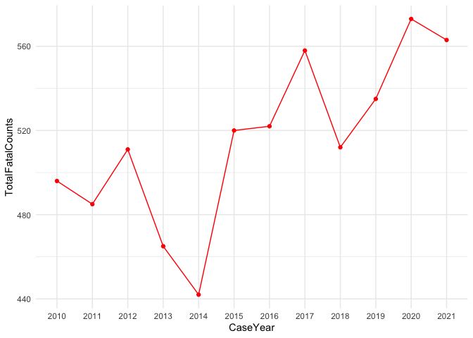

<!-- README.md is generated from README.Rmd. Please edit that file -->

# crashapi

<!-- badges: start -->

[](https://CRAN.R-project.org/package=crashapi)
[](https://lifecycle.r-lib.org/articles/stages.html#experimental)
[](https://opensource.org/licenses/MIT)
<!-- badges: end -->

The goal of the crashapi R package is to provide functions for
downloading data from the National Highway Traffic Safety Administration
(NHTSA) [Fatality Analysis Reporting System (FARS)
API](https://crashviewer.nhtsa.dot.gov/CrashAPI/).

What is FARS? NHTSA explains: “The Fatality Analysis Reporting System
(FARS) contains data on all vehicle crashes in the United States that
occur on a public roadway and involve a fatality.”

Supported APIs for this package include:

-   [x] Get Crash List Information
-   [x] Get Crash Details
-   [x] Get Crashes By Location
-   [x] Get Crashes By Vehicle
-   [x] Get Summary Counts
-   [x] Get Variables and Get Variable Attributes
-   [x] Get FARS Data By Year

Most of these APIs support XML, JSV, CSV, and JSON output formats. This
package only uses JSON with the exception of get\_fars\_year (which
supports downloading CSV files).

Currently unsupported APIs include:

-   [ ] Get Crashes By Occupant

For reference, this package also includes a list of terms and NHTSA
technical definitions in `fars_terms`.

The FARS API currently only provides access to data from 2010 to 2019.
The `get_fars_zip` function can be used to access FARS data files from
1975 to 2019 that that are available for download on through [the NHTSA
File Downloads
site](https://www.nhtsa.gov/file-downloads?p=nhtsa/downloads/FARS/) as
zipped CSV or SAS files (not available through the NHTSA FARS API). This
site also provides extensive technical documentation on coding and use
of the FARS data files.

Earlier data along with data from the the [General Estimates
System](https://www.nhtsa.gov/national-automotive-sampling-system-nass/nass-general-estimates-system)
(GES) / [Crash Report Sampling
System](https://www.nhtsa.gov/crash-data-systems/crash-report-sampling-system-crss)
(CRSS) is also available through the [Fatality and Injury Reporting
System Tool](https://cdan.dot.gov/query) (FIRST).

The [NHTSA website](https://www-fars.nhtsa.dot.gov/Help/helplinks.aspx)
also provides additional information on the release data and version
status for the FARS data files:

| Data Year | File Version | Release Date      |
|-----------|--------------|-------------------|
| 2010      | Final        | December 11, 2012 |
| 2011      | Final        | November 13, 2013 |
| 2012      | Final        | December 12, 2013 |
| 2013      | Final        | December 14, 2014 |
| 2014      | Final        | December 18, 2015 |
| 2015      | Final        | December 16, 2016 |
| 2016      | Final        | December 14, 2017 |
| 2017      | Final        | December 18, 2018 |
| 2018      | Final        | June 24, 2021     |
| 2019      | Annual       | June 24, 2021     |

## Installation

You can install the development version of crashapi using the remotes
package:

``` r
remotes::install_github("elipousson/crashapi")
```

## Examples

``` r
library(crashapi)
library(ggplot2)
```

``` r
# Get fatal crashes in NY from 2019 with 5 to 10 vehicles
get_fars(
  year = 2019,
  state = "NY",
  vehicles = c(5, 10)
)
#> Setting `api` to 'state list' based on the `get_fars()` parameters.
#>      CountyName                  CrashDate Fatals Peds Persons St_Case State
#> 1     BRONX (5) /Date(1549865820000-0500)/      2    1       7  360042    36
#> 2     ERIE (29) /Date(1551915000000-0500)/      1    0       4  360159    36
#> 3   ORANGE (71) /Date(1558274040000-0400)/      1    0       1  360277    36
#> 4   QUEENS (81) /Date(1561656240000-0400)/      1    0       6  360319    36
#> 5     BRONX (5) /Date(1561866000000-0400)/      1    0      11  360339    36
#> 6    KINGS (47) /Date(1564564080000-0400)/      1    0       5  360440    36
#> 7 SUFFOLK (103) /Date(1563792360000-0400)/      1    0       2  360551    36
#>   StateName TotalVehicles
#> 1  New York             5
#> 2  New York             5
#> 3  New York             6
#> 4  New York             5
#> 5  New York             5
#> 6  New York             5
#> 7  New York             6
```

``` r
# Get fatal crashes for Baltimore County, MD from 2017 to 2018
baltimore_co_crashes <- get_fars(
  year = c(2017, 2018),
  state = "MD",
  county = "Baltimore County",
  geometry = TRUE
)

# Show 10 fatal crashes at random
dplyr::slice_sample(baltimore_co_crashes, n = 10)
#> Simple feature collection with 10 features and 15 fields
#> Geometry type: POINT
#> Dimension:     XY
#> Bounding box:  xmin: -76.80255 ymin: 39.25286 xmax: -76.45716 ymax: 39.66937
#> Geodetic CRS:  WGS 84
#>    CITY       CITYNAME COUNTY    COUNTYNAME CaseYear FATALS LATITUDE  LONGITUD
#> 1     0 NOT APPLICABLE      5 BALTIMORE (5)     2017      2 39.25286 -76.45716
#> 2     0 NOT APPLICABLE      5 BALTIMORE (5)     2017      1 39.66937 -76.80255
#> 3     0 NOT APPLICABLE      5 BALTIMORE (5)     2018      1 39.30716 -76.72991
#> 4     0 NOT APPLICABLE      5 BALTIMORE (5)     2018      1 39.36017 -76.47853
#> 5     0 NOT APPLICABLE      5 BALTIMORE (5)     2017      1 39.62297 -76.79301
#> 6     0 NOT APPLICABLE      5 BALTIMORE (5)     2017      1 39.34727 -76.73358
#> 7     0 NOT APPLICABLE      5 BALTIMORE (5)     2017      1 39.37209 -76.72070
#> 8     0 NOT APPLICABLE      5 BALTIMORE (5)     2017      1 39.38242 -76.78916
#> 9     0 NOT APPLICABLE      5 BALTIMORE (5)     2018      1 39.39456 -76.49292
#> 10    0 NOT APPLICABLE      5 BALTIMORE (5)     2018      1 39.28437 -76.74683
#>    STATE STATENAME ST_CASE TOTALVEHICLES                      TWAY_ID TWAY_ID2
#> 1     24  Maryland  240197             6                        I-695         
#> 2     24  Maryland  240483             2                        CR-14    CR-15
#> 3     24  Maryland  240347             1 SOCIAL SECURITY HEADQUARTERS         
#> 4     24  Maryland  240052             1                         I-95         
#> 5     24  Maryland  240167             1                        SR-25         
#> 6     24  Maryland  240099             1                      CR-1901         
#> 7     24  Maryland  240462             1                       SR-140         
#> 8     24  Maryland  240246             2                      CR-2250  CR-2200
#> 9     24  Maryland  240493             1                      CR-1400  CR-4090
#> 10    24  Maryland  240273             1                        US-40         
#>    VE_FORMS                   geometry
#> 1         6 POINT (-76.45716 39.25286)
#> 2         2 POINT (-76.80255 39.66937)
#> 3         1 POINT (-76.72991 39.30716)
#> 4         1 POINT (-76.47853 39.36017)
#> 5         1 POINT (-76.79301 39.62297)
#> 6         1 POINT (-76.73358 39.34727)
#> 7         1  POINT (-76.7207 39.37209)
#> 8         2 POINT (-76.78916 39.38242)
#> 9         1 POINT (-76.49292 39.39456)
#> 10        1 POINT (-76.74683 39.28437)
```

``` r
# Map crashes
ggplot() +
  geom_sf(
    data = tigris::county_subdivisions(state = "MD", county = "Baltimore County"),
    fill = NA, color = "black"
  ) +
  geom_sf(
    data = baltimore_co_crashes,
    aes(color = TOTALVEHICLES),
    alpha = 0.75
  ) +
  theme_void()
#>   |                                                                              |                                                                      |   0%  |                                                                              |                                                                      |   1%  |                                                                              |=                                                                     |   1%  |                                                                              |=                                                                     |   2%  |                                                                              |==                                                                    |   2%  |                                                                              |==                                                                    |   3%  |                                                                              |===                                                                   |   4%  |                                                                              |===                                                                   |   5%  |                                                                              |====                                                                  |   5%  |                                                                              |====                                                                  |   6%  |                                                                              |=====                                                                 |   7%  |                                                                              |=====                                                                 |   8%  |                                                                              |======                                                                |   8%  |                                                                              |======                                                                |   9%  |                                                                              |=======                                                               |   9%  |                                                                              |=======                                                               |  10%  |                                                                              |=======                                                               |  11%  |                                                                              |========                                                              |  11%  |                                                                              |========                                                              |  12%  |                                                                              |=========                                                             |  13%  |                                                                              |==========                                                            |  14%  |                                                                              |==============                                                        |  20%  |                                                                              |=================                                                     |  24%  |                                                                              |====================                                                  |  28%  |                                                                              |=========================================                             |  58%  |                                                                              |=============================================                         |  64%  |                                                                              |==============================================                        |  65%  |                                                                              |===============================================                       |  67%  |                                                                              |======================================================================| 100%
```


``` r
# Get summary crash count and fatal crash count data for Maryland from 2010 to 2019
md_summary <-
  get_fars(
    year = c(2010, 2019),
    state = "MD",
    api = "summary count"
  )

ggplot(md_summary, aes(x = CaseYear, y = TotalFatalCounts)) +
  geom_point(color = "red") +
  geom_line(color = "red", group = 1) +
  theme_minimal()
```



## Related packages and projects

-   [stats19](https://github.com/ropensci/stats19) “provides functions
    for downloading and formatting road crash data” from “the UK’s
    official road traffic casualty database, STATS19.”
-   [njtr1](https://github.com/gavinrozzi/njtr1): “An R interface to New
    Jersey traffic crash data reported on form NJTR-1.”
-   [nzcrash](https://github.com/nacnudus/nzcrash): “An R package to
    distribute New Zealand crash data in a convenient form.”
-   [GraphHopper Open Traffic
    Collection](https://github.com/graphhopper/open-traffic-collection):
    “Collections of URLs pointing to traffic information portals which
    contain open data or at least data which is free to use.”
-   [Open Crash Data
    Index](https://docs.google.com/spreadsheets/d/1rmn6GbHNkfWLLDEEmA87iuy2yHdh7hBybCTZiQJEY0k/edit?usp=sharing):
    A Google Sheet listing a range of city, county, regional and state
    sources for crash data including non-injury crashes as well as the
    fatal crashes available through the FARS API. Contributions for
    crash data from other U.S. cities adn states are welcome.
