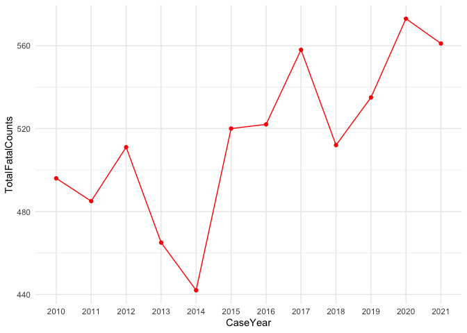
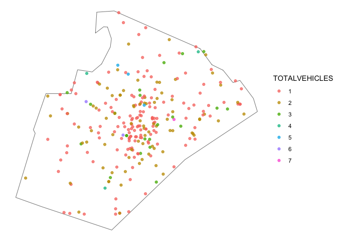

# crashapi

The goal of the crashapi R package is to provide functions for
downloading data from the National Highway Traffic Safety Administration
(NHTSA) [Fatality Analysis Reporting System (FARS)
API](https://crashviewer.nhtsa.dot.gov/crashviewer/CrashAPI/).

What is FARS? NHTSA explains: “The Fatality Analysis Reporting System
(FARS) contains data on all vehicle crashes in the United States that
occur on a public roadway and involve a fatality.”

## Installation

You can install the development version of crashapi using the pak
package:

``` r
pak::pkg_install("elipousson/crashapi")
```

## Background

### Fatality Analysis Reporting System (FARS) API support

Supported APIs for this package include:

Get Crash List Information

Get Crash Details

Get Crashes By Location

Get Crashes By Vehicle

Get Summary Counts

Get Variables and Get Variable Attributes

Get FARS Data By Year

Get Crashes By Occupant (partial support)

Most of these APIs support XML, JSV, CSV, and JSON output formats. This
package only uses JSON with the exception of
[`get_fars_year()`](https://elipousson.github.io/crashapi/reference/get_fars.md)
(which supports downloading CSV files).

For reference, this package also includes a list of terms and NHTSA
technical definitions in `fars_terms` and a list of variable labels in
`fars_vars_labels`.

The FARS API currently provides access to data from 2010 to 2022. The
[NHTSA website](https://www-fars.nhtsa.dot.gov/Help/helplinks.aspx) also
provides additional information on the release data and version status
for the FARS data files available through the API:

| Data Year | File Version | Release Date      |
|-----------|--------------|-------------------|
| 2010      | Final        | December 11, 2012 |
| 2011      | Final        | November 13, 2013 |
| 2012      | Final        | December 12, 2013 |
| 2013      | Final        | December 14, 2014 |
| 2014      | Final        | December 18, 2015 |
| 2015      | Final        | December 16, 2016 |
| 2016      | Final        | December 14, 2017 |
| 2017      | Final        | December 18, 2018 |
| 2018      | Final        | June 24, 2021     |
| 2019      | Final        | March 2, 2022     |
| 2020      | Final        | April 3, 2023     |
| 2021      | Final        | August 19, 2024   |
| 2022      | Annual       | August 19, 2024   |

### Additional data access functionality

The
[`get_fars_zip()`](https://elipousson.github.io/crashapi/reference/get_fars_zip.md)
function can be used to access FARS data files from 1975 to 2020 that
that are not available via the API but are available for download on
through [the NHTSA File Downloads
site](https://www.nhtsa.gov/file-downloads?p=nhtsa/downloads/FARS/) as
zipped CSV or SAS files (not available through the NHTSA FARS API). This
site also provides extensive technical documentation on coding and use
of the FARS data files.

Earlier data along with data from the the [General Estimates
System](https://www.nhtsa.gov/national-automotive-sampling-system-nass/nass-general-estimates-system)
(GES) / [Crash Report Sampling
System](https://www.nhtsa.gov/crash-data-systems/crash-report-sampling-system-crss)
(CRSS) is also available through the [Fatality and Injury Reporting
System Tool](https://cdan.dot.gov/query) (FIRST).

## Examples

``` r
library(crashapi)
library(ggplot2)
#> Warning: package 'ggplot2' was built under R version 4.5.2
```

Most features for the package can be accessed using the
[`get_fars()`](https://elipousson.github.io/crashapi/reference/get_fars.md)
function that selects the appropriate API-specific function based on the
provided parameters. You can also set the API to use with the `api`
parameter or use an API-specific function
(e.g. [`get_fars_summary()`](https://elipousson.github.io/crashapi/reference/get_fars.md)).

For example, you can use the
[`get_fars()`](https://elipousson.github.io/crashapi/reference/get_fars.md)
access state-level summary data on crash and fatality counts.

``` r
# Get summary crash count and fatality count data for Maryland from 2010 to 2019
md_summary <-
  get_fars(
    year = c(2010, 2021),
    state = "MD",
    api = "summary count"
  )

ggplot(md_summary, aes(x = CaseYear, y = TotalFatalCounts)) +
  geom_point(color = "red") +
  geom_line(color = "red", group = 1) +
  theme_minimal()
```



You can download crash data and set geometry to TRUE optionally convert
the data frame into an `sf` object for mapping.

``` r
crashes_sf <-
  get_fars(
    year = c(2018, 2021),
    state = "NC",
    county = "Wake County",
    geometry = TRUE
  )

nc <- sf::st_read(system.file("shape/nc.shp", package = "sf"))
#> Reading layer `nc' from data source 
#>   `C:\Users\Eli.Pousson\AppData\Local\Programs\R\R-4.5.1\library\sf\shape\nc.shp' 
#>   using driver `ESRI Shapefile'
#> Simple feature collection with 100 features and 14 fields
#> Geometry type: MULTIPOLYGON
#> Dimension:     XY
#> Bounding box:  xmin: -84.32385 ymin: 33.88199 xmax: -75.45698 ymax: 36.58965
#> Geodetic CRS:  NAD27
wake_co <- sf::st_transform(nc[nc$NAME == "Wake", ], 4326)

# Map crashes
ggplot() +
  geom_sf(
    data = wake_co,
    fill = NA, color = "black"
  ) +
  geom_sf(
    data = sf::st_crop(crashes_sf, wake_co),
    aes(color = TOTALVEHICLES),
    alpha = 0.75
  ) +
  theme_void()
#> Warning in st_is_longlat(x): bounding box has potentially an invalid value
#> range for longlat data
#> Warning in st_is_longlat(x): bounding box has potentially an invalid value
#> range for longlat data
```



You can list crashes and filter by the number of vehicles involved.

``` r
# Get fatal crashes in New York state from 2019 with 5 to 10 vehicles
get_fars(
  year = 2019,
  state = "NY",
  vehicles = c(5, 10)
)
#>      CountyName                  CrashDate Fatals Peds Persons St_Case State
#> 1     BRONX (5) /Date(1549865820000-0500)/      2    1       7  360042    36
#> 2     ERIE (29) /Date(1551915000000-0500)/      1    0       4  360159    36
#> 3   QUEENS (81) /Date(1561656240000-0400)/      1    0       6  360319    36
#> 4     BRONX (5) /Date(1561866000000-0400)/      1    0      11  360339    36
#> 5    KINGS (47) /Date(1564564080000-0400)/      1    0       5  360440    36
#> 6 SUFFOLK (103) /Date(1563792360000-0400)/      1    0       2  360551    36
#> 7   ORANGE (71) /Date(1558274040000-0400)/      1    0       1  360277    36
#>   StateName TotalVehicles
#> 1  New York             5
#> 2  New York             5
#> 3  New York             5
#> 4  New York             5
#> 5  New York             5
#> 6  New York             6
#> 7  New York             6
```

If you call
[`get_fars()`](https://elipousson.github.io/crashapi/reference/get_fars.md)
or
[`get_fars_crashes()`](https://elipousson.github.io/crashapi/reference/get_fars.md)
with details set to TRUE, additional information from
[`get_fars_cases()`](https://elipousson.github.io/crashapi/reference/get_fars.md)
(including the crash date and time) is appended to the crash data frame.

``` r
# Get fatal crashes for Anne Arundel County, MD for 2019 and append details
crashes_detailed <-
  get_fars(
    year = 2019,
    state = "MD",
    county = "Anne Arundel County",
    details = TRUE
  )
#> ■■■■ 10% | ETA: 19s■■■■■ 15% | ETA: 19s■■■■■■ 18% | ETA: 19s■■■■■■■ 20% | ETA:
#> 18s■■■■■■■■ 22% | ETA: 18s■■■■■■■■■ 25% | ETA: 17s■■■■■■■■■ 28% | ETA:
#> 17s■■■■■■■■■■ 30% | ETA: 17s■■■■■■■■■■■ 32% | ETA: 16s■■■■■■■■■■■ 35% | ETA:
#> 16s■■■■■■■■■■■■ 38% | ETA: 15s■■■■■■■■■■■■■ 40% | ETA: 15s■■■■■■■■■■■■■■ 42% |
#> ETA: 14s■■■■■■■■■■■■■■■ 45% | ETA: 13s■■■■■■■■■■■■■■■ 48% | ETA:
#> 13s■■■■■■■■■■■■■■■■ 50% | ETA: 12s■■■■■■■■■■■■■■■■■ 52% | ETA:
#> 11s■■■■■■■■■■■■■■■■■ 55% | ETA: 11s■■■■■■■■■■■■■■■■■■ 57% | ETA:
#> 10s■■■■■■■■■■■■■■■■■■■ 60% | ETA: 10s■■■■■■■■■■■■■■■■■■■■ 62% | ETA:
#> 9s■■■■■■■■■■■■■■■■■■■■■ 65% | ETA: 8s■■■■■■■■■■■■■■■■■■■■■ 68% | ETA:
#> 8s■■■■■■■■■■■■■■■■■■■■■■ 70% | ETA: 7s■■■■■■■■■■■■■■■■■■■■■■■ 72% | ETA:
#> 7s■■■■■■■■■■■■■■■■■■■■■■■ 75% | ETA: 6s■■■■■■■■■■■■■■■■■■■■■■■■ 78% | ETA:
#> 5s■■■■■■■■■■■■■■■■■■■■■■■■■ 80% | ETA: 5s■■■■■■■■■■■■■■■■■■■■■■■■■■ 82% | ETA:
#> 4s■■■■■■■■■■■■■■■■■■■■■■■■■■■ 85% | ETA: 4s■■■■■■■■■■■■■■■■■■■■■■■■■■■ 88% |
#> ETA: 3s■■■■■■■■■■■■■■■■■■■■■■■■■■■■ 90% | ETA: 2s■■■■■■■■■■■■■■■■■■■■■■■■■■■■■
#> 92% | ETA: 2s■■■■■■■■■■■■■■■■■■■■■■■■■■■■■ 95% | ETA:
#> 1s■■■■■■■■■■■■■■■■■■■■■■■■■■■■■■ 98% | ETA: 1s

# Show 10 fatal crashes at random
dplyr::slice_sample(crashes_detailed, n = 10)
#>    CITY       CITYNAME COUNTY       COUNTYNAME CaseYear FATALS    LATITUDE
#> 1  1415         SEVERN      3 ANNE ARUNDEL (3)     2019      1 39.09596667
#> 2     0 NOT APPLICABLE      3 ANNE ARUNDEL (3)     2019      1 39.19834722
#> 3     0 NOT APPLICABLE      3 ANNE ARUNDEL (3)     2019      1 39.13578611
#> 4     0 NOT APPLICABLE      3 ANNE ARUNDEL (3)     2019      1 38.87208611
#> 5     0 NOT APPLICABLE      3 ANNE ARUNDEL (3)     2019      1 39.05742778
#> 6     0 NOT APPLICABLE      3 ANNE ARUNDEL (3)     2019      1 39.09671667
#> 7   584     FRIENDSHIP      3 ANNE ARUNDEL (3)     2019      1 38.73677222
#> 8     0 NOT APPLICABLE      3 ANNE ARUNDEL (3)     2019      1 39.00807778
#> 9     0 NOT APPLICABLE      3 ANNE ARUNDEL (3)     2019      1 39.13292222
#> 10    0 NOT APPLICABLE      3 ANNE ARUNDEL (3)     2019      1 39.20516111
#>         LONGITUD STATE STATENAME ST_CASE TOTALVEHICLES                 TWAY_ID
#> 1  -76.720419440    24  Maryland  240389             2     SR-175 ANNAPOLIS RD
#> 2  -76.613247220    24  Maryland  240238             1                    SR-2
#> 3  -76.610394440    24  Maryland  240121             1                 CR-1371
#> 4  -76.563958330    24  Maryland  240150             1                  SR-468
#> 5  -76.656836110    24  Maryland  240027             2                    SR-3
#> 6  -76.624222220    24  Maryland  240265             2                 CR-5461
#> 7  -76.593663890    24  Maryland  240318             1 SR-2 SOLOMONS ISLAND RD
#> 8  -76.608936110    24  Maryland  240007             1                    I-97
#> 9  -76.636916670    24  Maryland  240302             1          SR-3 CRAIN HWY
#> 10 -76.621213890    24  Maryland  240192             2                   I-695
#>                  TWAY_ID2 VE_FORMS ARR_HOUR                   ARR_HOURNAME
#> 1                 CR-5454        2       99 Unknown EMS Scene Arrival Hour
#> 2                    <NA>        1       99 Unknown EMS Scene Arrival Hour
#> 3                    <NA>        1       99 Unknown EMS Scene Arrival Hour
#> 4                    <NA>        1       99 Unknown EMS Scene Arrival Hour
#> 5                  SR-175        2       99 Unknown EMS Scene Arrival Hour
#> 6                    <NA>        2       99 Unknown EMS Scene Arrival Hour
#> 7  SR-261 W FRIENDSHIP RD        1       99 Unknown EMS Scene Arrival Hour
#> 8                    <NA>        1       99 Unknown EMS Scene Arrival Hour
#> 9    CR-3828 CRAINMONT DR        1       99 Unknown EMS Scene Arrival Hour
#> 10                   <NA>        2       99 Unknown EMS Scene Arrival Hour
#>    ARR_MIN                       ARR_MINNAME
#> 1       99 Unknown EMS Scene Arrival Minutes
#> 2       99 Unknown EMS Scene Arrival Minutes
#> 3       99 Unknown EMS Scene Arrival Minutes
#> 4       99 Unknown EMS Scene Arrival Minutes
#> 5       99 Unknown EMS Scene Arrival Minutes
#> 6       99 Unknown EMS Scene Arrival Minutes
#> 7       99 Unknown EMS Scene Arrival Minutes
#> 8       99 Unknown EMS Scene Arrival Minutes
#> 9       99 Unknown EMS Scene Arrival Minutes
#> 10      99 Unknown EMS Scene Arrival Minutes
#>                                                                                                                                                                                                                                                                                                                                                                                                                                                                                                                              CEvents
#> 1                                                                                                                                                                                                                                                                                                                                                                                                                     12, 12 Clock Point, 11, 11 Clock Point, 2019, 1, 12, Motor Vehicle In-Transport, 24, Maryland, 240389, 2, 1, 1
#> 2                                                                                                                                                                                                                                                                                                                                                                                                            12, 12 Clock Point, 77, Not a Motor Vehicle, 2019, 1, 8, Pedestrian, 24, Maryland, 240238, 1, 9999, Not a Motor Vehicle
#> 3                                                                                                                                                                                                                                                                                                                                                                                                       0, Non-Collision, 77, Not a Motor Vehicle, 2019, 1, 1, Rollover/Overturn, 24, Maryland, 240121, 1, 9999, Not a Motor Vehicle
#> 4  55, 55, 12, 0, Non-Harmful Event, Non-Harmful Event, 12 Clock Point, Non-Collision, 55, 55, 77, 77, Non-Harmful Event, Non-Harmful Event, Not a Motor Vehicle, Not a Motor Vehicle, 2019, 2019, 2019, 2019, 1, 2, 3, 4, 68, 64, 42, 2, Cross Centerline, Ran Off Roadway - Left, Tree (Standing Only), Fire/Explosion, 24, 24, 24, 24, Maryland, Maryland, Maryland, Maryland, 240150, 240150, 240150, 240150, 1, 1, 1, 1, 5555, 5555, 9999, 9999, Non-Harmful Event, Non-Harmful Event, Not a Motor Vehicle, Not a Motor Vehicle
#> 5                                                                                                                                                                                                                                                                                                                                                                                                                       9, 9 Clock Point, 12, 12 Clock Point, 2019, 1, 12, Motor Vehicle In-Transport, 24, Maryland, 240027, 1, 2, 2
#> 6                                                                                                                                                                                                                                                                                                                                                                                                                       1, 1 Clock Point, 12, 12 Clock Point, 2019, 1, 12, Motor Vehicle In-Transport, 24, Maryland, 240265, 1, 2, 2
#> 7                                                                                                                                                                                                                                                                                               12, 98, 12 Clock Point, Not Reported, 77, 77, Not a Motor Vehicle, Not a Motor Vehicle, 2019, 2019, 1, 2, 33, 33, Curb, Curb, 24, 24, Maryland, Maryland, 240318, 240318, 1, 1, 9999, 9999, Not a Motor Vehicle, Not a Motor Vehicle
#> 8                                                                                                                                                                                                                                                                  55, 0, Non-Harmful Event, Non-Collision, 55, 77, Non-Harmful Event, Not a Motor Vehicle, 2019, 2019, 1, 2, 64, 1, Ran Off Roadway - Left, Rollover/Overturn, 24, 24, Maryland, Maryland, 240007, 240007, 1, 1, 5555, 9999, Non-Harmful Event, Not a Motor Vehicle
#> 9                                                                                                                                                                                                                                                                                                                                                                                                            12, 12 Clock Point, 77, Not a Motor Vehicle, 2019, 1, 8, Pedestrian, 24, Maryland, 240302, 1, 9999, Not a Motor Vehicle
#> 10                                                                                                                                                       6, 55, 12, 6 Clock Point, Non-Harmful Event, 12 Clock Point, 12, 55, 77, 12 Clock Point, Non-Harmful Event, Not a Motor Vehicle, 2019, 2019, 2019, 1, 2, 3, 12, 63, 8, Motor Vehicle In-Transport, Ran Off Roadway - Right, Pedestrian, 24, 24, 24, Maryland, Maryland, Maryland, 240192, 240192, 240192, 1, 2, 2, 2, 5555, 9999, 2, Non-Harmful Event, Not a Motor Vehicle
#>    CF1 CF1NAME CF2 CF2NAME CF3 CF3NAME CrashRFs DAY DAYNAME DAY_WEEK
#> 1    0    None   0    None   0    None       NA  27      27        6
#> 2    0    None   0    None   0    None       NA   2       2        6
#> 3    0    None   0    None   0    None       NA   4       4        7
#> 4    0    None   0    None   0    None       NA  31      31        6
#> 5    0    None   0    None   0    None       NA   4       4        2
#> 6    0    None   0    None   0    None       NA  27      27        3
#> 7    0    None   0    None   0    None       NA  20      20        6
#> 8    0    None   0    None   0    None       NA   9       9        4
#> 9    0    None   0    None   0    None       NA  21      21        7
#> 10   0    None   0    None   0    None       NA   5       5        6
#>    DAY_WEEKNAME DRUNK_DR FUNC_SYS               FUNC_SYSNAME HARM_EV
#> 1        Friday        1        4             Minor Arterial      12
#> 2        Friday        0        3 Principal Arterial - Other       8
#> 3      Saturday        0        5            Major Collector       1
#> 4        Friday        0        5            Major Collector      42
#> 5        Monday        0        3 Principal Arterial - Other      12
#> 6       Tuesday        0        4             Minor Arterial      12
#> 7        Friday        0        3 Principal Arterial - Other      33
#> 8     Wednesday        0        1                 Interstate       1
#> 9      Saturday        0        3 Principal Arterial - Other       8
#> 10       Friday        0        1                 Interstate      12
#>                   HARM_EVNAME HOSP_HR                      HOSP_HRNAME HOSP_MN
#> 1  Motor Vehicle In-Transport      88 Not Applicable (Not Transported)      88
#> 2                  Pedestrian      88 Not Applicable (Not Transported)      88
#> 3           Rollover/Overturn      99                          Unknown      99
#> 4        Tree (Standing Only)      88 Not Applicable (Not Transported)      88
#> 5  Motor Vehicle In-Transport      99                          Unknown      99
#> 6  Motor Vehicle In-Transport      88 Not Applicable (Not Transported)      88
#> 7                        Curb      99                          Unknown      99
#> 8           Rollover/Overturn      88 Not Applicable (Not Transported)      88
#> 9                  Pedestrian      99                          Unknown      99
#> 10 Motor Vehicle In-Transport      88 Not Applicable (Not Transported)      88
#>                          HOSP_MNNAME HOUR        HOURNAME LATITUDENAME LGT_COND
#> 1   Not Applicable (Not Transported)   20   8:00pm-8:59pm  39.09596667        3
#> 2   Not Applicable (Not Transported)   22 10:00pm-10:59pm  39.19834722        6
#> 3  Unknown EMS Hospital Arrival Time   13   1:00pm-1:59pm  39.13578611        1
#> 4   Not Applicable (Not Transported)   11 11:00am-11:59am  38.87208611        1
#> 5  Unknown EMS Hospital Arrival Time   13   1:00pm-1:59pm  39.05742778        1
#> 6   Not Applicable (Not Transported)    7   7:00am-7:59am  39.09671667        1
#> 7  Unknown EMS Hospital Arrival Time   19   7:00pm-7:59pm  38.73677222        3
#> 8   Not Applicable (Not Transported)    5   5:00am-5:59am  39.00807778        2
#> 9  Unknown EMS Hospital Arrival Time   17   5:00pm-5:59pm  39.13292222        1
#> 10  Not Applicable (Not Transported)   12 12:00pm-12:59pm  39.20516111        1
#>               LGT_CONDNAME  LONGITUDNAME MAN_COLL
#> 1           Dark - Lighted -76.720419440        6
#> 2  Dark - Unknown Lighting -76.613247220        0
#> 3                 Daylight -76.610394440        0
#> 4                 Daylight -76.563958330        0
#> 5                 Daylight -76.656836110        6
#> 6                 Daylight -76.624222220        6
#> 7           Dark - Lighted -76.593663890        0
#> 8       Dark - Not Lighted -76.608936110        0
#> 9                 Daylight -76.636916670        0
#> 10                Daylight -76.621213890        1
#>                                                                     MAN_COLLNAME
#> 1                                                                          Angle
#> 2  The First Harmful Event was Not a Collision with a Motor Vehicle in Transport
#> 3  The First Harmful Event was Not a Collision with a Motor Vehicle in Transport
#> 4  The First Harmful Event was Not a Collision with a Motor Vehicle in Transport
#> 5                                                                          Angle
#> 6                                                                          Angle
#> 7  The First Harmful Event was Not a Collision with a Motor Vehicle in Transport
#> 8  The First Harmful Event was Not a Collision with a Motor Vehicle in Transport
#> 9  The First Harmful Event was Not a Collision with a Motor Vehicle in Transport
#> 10                                                                 Front-to-Rear
#>    MILEPT MILEPTNAME MINUTE MINUTENAME MONTH MonthName NHS
#> 1      47         47     31         31     9 September   0
#> 2     388        388     30         30     8    August   0
#> 3      13         13     59         59     5       May   0
#> 4      78         78     26         26     5       May   0
#> 5      57         57     19         19     2  February   0
#> 6      20         20      8          8     8    August   0
#> 7      12         12     16         16     9 September   1
#> 8      26         26     38         38     1   January   1
#> 9      10         10     11         11     9 September   0
#> 10     17         17     41         41     7      July   1
#>                           NHSNAME
#> 1  This section IS NOT on the NHS
#> 2  This section IS NOT on the NHS
#> 3  This section IS NOT on the NHS
#> 4  This section IS NOT on the NHS
#> 5  This section IS NOT on the NHS
#> 6  This section IS NOT on the NHS
#> 7      This section IS ON the NHS
#> 8      This section IS ON the NHS
#> 9  This section IS NOT on the NHS
#> 10     This section IS ON the NHS
#>                                                                                                                                                                                                       NMDrugs
#> 1                                                                                                                                                                                                        NULL
#> 2                                                                                2019, -1.000, NA, -1, NA, -1, NA, 1, Tested, No Drugs Found/Negative, 1, Whole Blood, -1, NA, 1, 24, MD, Maryland, 240238, 0
#> 3                                                                                                                                                                                                        NULL
#> 4                                                                                                                                                                                                        NULL
#> 5                                                                                                                                                                                                        NULL
#> 6                                                                                                                                                                                                        NULL
#> 7                                                                                                                                                                                                        NULL
#> 8                                                                                                                                                                                                        NULL
#> 9  2019, 2019, -1.000, -1.000, NA, NA, -1, -1, NA, NA, -1, -1, NA, NA, 402, 407, BENZOYLECGONINE, COCAINE, 2, 2, Urine, Urine, -1, -1, NA, NA, 1, 1, 24, 24, MD, MD, Maryland, Maryland, 240302, 240302, 0, 0
#> 10                                                                                     2019, -1.000, NA, -1, NA, -1, NA, 1, Tested, No Drugs Found/Negative, 2, Urine, -1, NA, 1, 24, MD, Maryland, 240192, 0
#>    NMPersonRF
#> 1          NA
#> 2          NA
#> 3          NA
#> 4          NA
#> 5          NA
#> 6          NA
#> 7          NA
#> 8          NA
#> 9          NA
#> 10         NA
#>                                                                             NMRace
#> 1                                                                             NULL
#> 2  2019, 0, No, 1, 1, 1, 2, Black or African American, 24, MD, Maryland, 240238, 0
#> 3                                                                             NULL
#> 4                                                                             NULL
#> 5                                                                             NULL
#> 6                                                                             NULL
#> 7                                                                             NULL
#> 8                                                                             NULL
#> 9  2019, 0, No, 1, 1, 1, 2, Black or African American, 24, MD, Maryland, 240302, 0
#> 10 2019, 0, No, 1, 1, 1, 2, Black or African American, 24, MD, Maryland, 240192, 0
#>    NOT_HOUR NOT_HOURNAME NOT_MIN NOT_MINNAME
#> 1        99      Unknown      99     Unknown
#> 2        99      Unknown      99     Unknown
#> 3        99      Unknown      99     Unknown
#> 4        99      Unknown      99     Unknown
#> 5        99      Unknown      99     Unknown
#> 6        99      Unknown      99     Unknown
#> 7        99      Unknown      99     Unknown
#> 8        99      Unknown      99     Unknown
#> 9        99      Unknown      99     Unknown
#> 10       99      Unknown      99     Unknown
#>                                                                                                                                                                                                                                                                                                                                                                                                                                                                                                                                                                                                                                                                                                                                                                                                                                                                                                                                                                                                                                                                                                                                                                                                                                                     NPersons
#> 1                                                                                                                                                                                                                                                                                                                                                                                                                                                                                                                                                                                                                                                                                                                                                                                                                                                                                                                                                                                                                                                                                                                                                                                                                                                       NULL
#> 2  27, 27 Years, 97, Not a Motor Vehicle Occupant, 9, Not Reported, 0, 0.000 % BAC, 2, Test Given, 1, Blood, NA, NA, NA, 3, ANNE ARUNDEL (3), 2019, 2, 2, 2, 2, 22, 22:00-22:59, 40, 40, 8, August, 2240, 2240, 2019, 2019, NA, NA, NA, NA, 7, Died at Scene, 9, Reported as Unknown, NA, NA, NA, NA, NA, NA, 9, Reported as Unknown, NA, NA, NA, NA, NA, NA, 8, Not Reported, 2, Test Given, 8, Not Applicable, 0, Ejection Path Not Applicable, NA, NA, 0, Not Extricated or Not Applicable, NA, NA, 3, Principal Arterial - Other, NA, NA, NA, NA, 8, Pedestrian, 8, Not a Motor Vehicle Occupant, 96, Not a Motor Vehicle Occupant, 7, Non-Hispanic, 0, Not Transported, 22, 10:00pm-10:59pm, NA, NA, NA, NA, NA, NA, 4, Fatal Injury (K), 0, 0, 10, 10, 11, Not at Intersection - On Roadway, Not in Marked Crosswalk, NA, NA, NA, NA, 0, The First Harmful Event was Not a Collision with a Motor Vehicle in Transport, 30, 30, NA, NA, 8, August, NA, NA, 1, 5, Pedestrian, 0, None, 0, None, 0, None, NA, NA, NA, 8, Not a Motor Vehicle Occupant, 96, Not a Motor Vehicle Occupant, NA, NA, NA, NA, 2, Urban, NA, 0, No, 0, Not a Motor Vehicle Occupant, 1, Male, NA, NA, 24, Maryland, 1, NA, 240238, NA, NA, 0, 1, NA, NA, NA, NA, NA, NA, 0, No
#> 3                                                                                                                                                                                                                                                                                                                                                                                                                                                                                                                                                                                                                                                                                                                                                                                                                                                                                                                                                                                                                                                                                                                                                                                                                                                       NULL
#> 4                                                                                                                                                                                                                                                                                                                                                                                                                                                                                                                                                                                                                                                                                                                                                                                                                                                                                                                                                                                                                                                                                                                                                                                                                                                       NULL
#> 5                                                                                                                                                                                                                                                                                                                                                                                                                                                                                                                                                                                                                                                                                                                                                                                                                                                                                                                                                                                                                                                                                                                                                                                                                                                       NULL
#> 6                                                                                                                                                                                                                                                                                                                                                                                                                                                                                                                                                                                                                                                                                                                                                                                                                                                                                                                                                                                                                                                                                                                                                                                                                                                       NULL
#> 7                                                                                                                                                                                                                                                                                                                                                                                                                                                                                                                                                                                                                                                                                                                                                                                                                                                                                                                                                                                                                                                                                                                                                                                                                                                       NULL
#> 8                                                                                                                                                                                                                                                                                                                                                                                                                                                                                                                                                                                                                                                                                                                                                                                                                                                                                                                                                                                                                                                                                                                                                                                                                                                       NULL
#> 9                 47, 47 Years, 97, Not a Motor Vehicle Occupant, 9, Not Reported, 200, 0.200 % BAC, 2, Test Given, 1, Blood, NA, NA, NA, 3, ANNE ARUNDEL (3), 2019, 21, 21, 21, 21, 17, 17:00-17:59, 45, 45, 9, September, 1745, 1745, 2019, 2019, NA, NA, NA, NA, 0, Not Applicable, 9, Reported as Unknown, NA, NA, NA, NA, NA, NA, 9, Reported as Unknown, NA, NA, NA, NA, NA, NA, 8, Not Reported, 2, Test Given, 8, Not Applicable, 0, Ejection Path Not Applicable, NA, NA, 0, Not Extricated or Not Applicable, NA, NA, 3, Principal Arterial - Other, NA, NA, NA, NA, 8, Pedestrian, 8, Not a Motor Vehicle Occupant, 96, Not a Motor Vehicle Occupant, 7, Non-Hispanic, 5, EMS Ground, 17, 5:00pm-5:59pm, NA, NA, NA, NA, NA, NA, 4, Fatal Injury (K), 0, 0, 34, 34, 1, At Intersection - In Marked Crosswalk, NA, NA, NA, NA, 0, The First Harmful Event was Not a Collision with a Motor Vehicle in Transport, 11, 11, NA, NA, 9, September, NA, NA, 1, 5, Pedestrian, 0, None, 0, None, 0, None, NA, NA, NA, 8, Not a Motor Vehicle Occupant, 96, Not a Motor Vehicle Occupant, NA, NA, NA, NA, 2, Urban, NA, 0, No, 0, Not a Motor Vehicle Occupant, 1, Male, NA, NA, 24, Maryland, 1, NA, 240302, NA, NA, 0, 1, NA, NA, NA, NA, NA, NA, 0, No
#> 10                                                                                                                  56, 56 Years, 97, Not a Motor Vehicle Occupant, 9, Not Reported, 0, 0.000 % BAC, 2, Test Given, 1, Blood, NA, NA, NA, 3, ANNE ARUNDEL (3), 2019, 5, 5, 5, 5, 13, 13:00-13:59, 13, 13, 7, July, 1313, 1313, 2019, 2019, NA, NA, NA, NA, 7, Died at Scene, 8, Not Reported, NA, NA, NA, NA, NA, NA, 1, Yes (drugs involved), NA, NA, NA, NA, NA, NA, 8, Not Reported, 2, Test Given, 8, Not Applicable, 0, Ejection Path Not Applicable, NA, NA, 0, Not Extricated or Not Applicable, NA, NA, 1, Interstate, NA, NA, NA, NA, 12, Motor Vehicle In-Transport, 8, Not a Motor Vehicle Occupant, 96, Not a Motor Vehicle Occupant, 7, Non-Hispanic, 0, Not Transported, 12, 12:00pm-12:59pm, NA, NA, NA, NA, NA, NA, 4, Fatal Injury (K), 0, 0, 32, 32, 20, Shoulder/Roadside, NA, NA, NA, NA, 1, Front-to-Rear, 41, 41, NA, NA, 7, July, NA, NA, 1, 5, Pedestrian, 0, None, 0, None, 0, None, NA, NA, NA, 8, Not a Motor Vehicle Occupant, 96, Not a Motor Vehicle Occupant, NA, NA, NA, NA, 2, Urban, NA, 0, No, 0, Not a Motor Vehicle Occupant, 1, Male, NA, NA, 24, Maryland, 2, NA, 240192, NA, NA, 0, 2, NA, NA, NA, NA, NA, NA, 0, No
#>                                                                                                                                                                                                                                             NmCrashes
#> 1                                                                                                                                                                                                                                                NULL
#> 2                                                                                                                                                2019, 2, Failure to Yield Right-Of-Way, 2, Failure to Yield Right-Of-Way, 1, 24, Maryland, 240238, 0
#> 3                                                                                                                                                                                                                                                NULL
#> 4                                                                                                                                                                                                                                                NULL
#> 5                                                                                                                                                                                                                                                NULL
#> 6                                                                                                                                                                                                                                                NULL
#> 7                                                                                                                                                                                                                                                NULL
#> 8                                                                                                                                                                                                                                                NULL
#> 9  2019, 2019, 2, 3, Failure to Yield Right-Of-Way, Failure to Obey Traffic Signs, Signals or Officer, 2, 3, Failure to Yield Right-Of-Way, Failure to Obey Traffic Signs, Signals or Officer, 1, 1, 24, 24, Maryland, Maryland, 240302, 240302, 0, 0
#> 10                                                                                                           2019, 19, Not Visible (Dark clothing, No Lighting, etc.), 19, Not Visible (Dark clothing, No Lighting, etc.), 1, 24, Maryland, 240192, 0
#>                                                                  NmDistract
#> 1                                                                      NULL
#> 2  2019, 96, Not Reported, 96, Not Reported, 1, 24, MD, Maryland, 240238, 0
#> 3                                                                      NULL
#> 4                                                                      NULL
#> 5                                                                      NULL
#> 6                                                                      NULL
#> 7                                                                      NULL
#> 8                                                                      NULL
#> 9  2019, 96, Not Reported, 96, Not Reported, 1, 24, MD, Maryland, 240302, 0
#> 10 2019, 96, Not Reported, 96, Not Reported, 1, 24, MD, Maryland, 240192, 0
#>                                                                NmImpairs
#> 1                                                                   NULL
#> 2  2019, 99, Reported as Unknown if Impaired, 1, 24, Maryland, 240238, 0
#> 3                                                                   NULL
#> 4                                                                   NULL
#> 5                                                                   NULL
#> 6                                                                   NULL
#> 7                                                                   NULL
#> 8                                                                   NULL
#> 9  2019, 99, Reported as Unknown if Impaired, 1, 24, Maryland, 240302, 0
#> 10                    2019, 98, Not Reported, 1, 24, Maryland, 240192, 0
#>                                                          NmPriors PEDS PERMVIT
#> 1                                                            NULL    0       3
#> 2   2019, 3, Crossing Roadway, -1, NA, 1, 24, Maryland, 240238, 0    1       1
#> 3                                                            NULL    0       1
#> 4                                                            NULL    0       1
#> 5                                                            NULL    0       2
#> 6                                                            NULL    0       2
#> 7                                                            NULL    0       1
#> 8                                                            NULL    0       1
#> 9   2019, 3, Crossing Roadway, -1, NA, 1, 24, Maryland, 240302, 0    1       1
#> 10 2019, 14, Other (Specify:), -1, NA, 1, 24, Maryland, 240192, 0    1       2
#>    PERNOTMVIT PERSONS PVH_INVL ParkWorks
#> 1           0       3        0      NULL
#> 2           1       1        0      NULL
#> 3           0       1        0      NULL
#> 4           0       1        0      NULL
#> 5           0       2        0      NULL
#> 6           0       2        0      NULL
#> 7           0       1        0      NULL
#> 8           0       1        0      NULL
#> 9           1       1        0      NULL
#> 10          1       2        0      NULL
#>                                                                                                                                                                                                                                                                                                                                                                                                                                                                                                                                                    PbTypes
#> 1                                                                                                                                                                                                                                                                                                                                                                                                                                                                                                                                                     NULL
#> 2                                                                                                                       0, Not a Cyclist, 0, Not a Cyclist, 7, Not a Cyclist, 7, Not a Cyclist, 7, Not a Cyclist, 2019, 8, Not Applicable, 8, Not Applicable, 27, 27 Years, 0, None Noted, 5, Pedestrian, 1, Male, 0, None Noted, 0, None Noted, 750, Crossing Roadway - Vehicle Not Turning, 760, Pedestrian Failed to Yield, 8, Not Applicable, 8, Not Applicable, 3, Not At Intersection, 3, Travel Lane, 8, Not Applicable, 1, 24, Maryland, 240238, 0
#> 3                                                                                                                                                                                                                                                                                                                                                                                                                                                                                                                                                     NULL
#> 4                                                                                                                                                                                                                                                                                                                                                                                                                                                                                                                                                     NULL
#> 5                                                                                                                                                                                                                                                                                                                                                                                                                                                                                                                                                     NULL
#> 6                                                                                                                                                                                                                                                                                                                                                                                                                                                                                                                                                     NULL
#> 7                                                                                                                                                                                                                                                                                                                                                                                                                                                                                                                                                     NULL
#> 8                                                                                                                                                                                                                                                                                                                                                                                                                                                                                                                                                     NULL
#> 9  0, Not a Cyclist, 0, Not a Cyclist, 7, Not a Cyclist, 7, Not a Cyclist, 7, Not a Cyclist, 2019, 1, Northbound, 3, Straight through, 47, 47 Years, 1, Yes, 5, Pedestrian, 1, Male, 1, Yes, 0, None Noted, 750, Crossing Roadway - Vehicle Not Turning, 760, Pedestrian Failed to Yield, 2, Eastbound, 1, Nearside, 1, At Intersection, 2, Crosswalk Area, 1a, Motorist traveling straight through - Crash Occurred on Near (Approach) Side of Intersection / Pedestrian within crosswalk area, traveled from motorist`s left, 1, 24, Maryland, 240302, 0
#> 10                                                                                     0, Not a Cyclist, 0, Not a Cyclist, 7, Not a Cyclist, 7, Not a Cyclist, 7, Not a Cyclist, 2019, 8, Not Applicable, 8, Not Applicable, 56, 56 Years, 0, None Noted, 5, Pedestrian, 1, Male, 0, None Noted, 0, None Noted, 100, Unusual Circumstances, 140, Vehicle into Vehicle or Vehicle into Object, 8, Not Applicable, 8, Not Applicable, 3, Not At Intersection, 4, Paved Shoulder / Bicycle Lane / Parking Lane, 8, Not Applicable, 1, 24, Maryland, 240192, 0
#>       RAIL       RAILNAME RD_OWNER          RD_OWNERNAME RELJCT1 RELJCT1NAME
#> 1  0000000 Not Applicable        1  State Highway Agency       0          No
#> 2  0000000 Not Applicable        1  State Highway Agency       0          No
#> 3  0000000 Not Applicable        2 County Highway Agency       0          No
#> 4  0000000 Not Applicable        1  State Highway Agency       0          No
#> 5  0000000 Not Applicable        1  State Highway Agency       0          No
#> 6  0000000 Not Applicable        2 County Highway Agency       0          No
#> 7  0000000 Not Applicable        1  State Highway Agency       0          No
#> 8  0000000 Not Applicable        1  State Highway Agency       0          No
#> 9  0000000 Not Applicable        1  State Highway Agency       0          No
#> 10 0000000 Not Applicable        1  State Highway Agency       1         Yes
#>    RELJCT2             RELJCT2NAME REL_ROAD REL_ROADNAME ROAD_FNC ROAD_FNCNAME
#> 1        2            Intersection        1   On Roadway       NA           NA
#> 2        1            Non-Junction        1   On Roadway       NA           NA
#> 3        1            Non-Junction        1   On Roadway       NA           NA
#> 4        1            Non-Junction        4  On Roadside       NA           NA
#> 5        2            Intersection        1   On Roadway       NA           NA
#> 6        8 Driveway Access Related        1   On Roadway       NA           NA
#> 7        3    Intersection-Related        4  On Roadside       NA           NA
#> 8        1            Non-Junction        3    On Median       NA           NA
#> 9        3    Intersection-Related        1   On Roadway       NA           NA
#> 10      18         Through Roadway        1   On Roadway       NA           NA
#>    ROUTE     ROUTENAME RUR_URB RUR_URBNAME SCH_BUS SCH_BUSNAME SP_JUR
#> 1      3 State Highway       2       Urban       0          No      0
#> 2      3 State Highway       2       Urban       0          No      0
#> 3      4   County Road       2       Urban       0          No      0
#> 4      3 State Highway       1       Rural       0          No      0
#> 5      3 State Highway       2       Urban       0          No      0
#> 6      4   County Road       2       Urban       0          No      0
#> 7      3 State Highway       1       Rural       0          No      0
#> 8      1    Interstate       2       Urban       0          No      0
#> 9      3 State Highway       2       Urban       0          No      0
#> 10     1    Interstate       2       Urban       0          No      0
#>                 SP_JURNAME
#> 1  No Special Jurisdiction
#> 2  No Special Jurisdiction
#> 3  No Special Jurisdiction
#> 4  No Special Jurisdiction
#> 5  No Special Jurisdiction
#> 6  No Special Jurisdiction
#> 7  No Special Jurisdiction
#> 8  No Special Jurisdiction
#> 9  No Special Jurisdiction
#> 10 No Special Jurisdiction
#>                                                                             SafetyEQs
#> 1                                                                                NULL
#> 2  2019, -1, NA, 1, No, 1, No, 1, No, 1, No, 1, No, 1, No, 1, 24, Maryland, 240238, 0
#> 3                                                                                NULL
#> 4                                                                                NULL
#> 5                                                                                NULL
#> 6                                                                                NULL
#> 7                                                                                NULL
#> 8                                                                                NULL
#> 9  2019, -1, NA, 1, No, 1, No, 1, No, 1, No, 1, No, 1, No, 1, 24, Maryland, 240302, 0
#> 10 2019, -1, NA, 1, No, 1, No, 1, No, 1, No, 1, No, 1, No, 1, 24, Maryland, 240192, 0
#>    State TYP_INT           TYP_INTNAME VE_TOTAL
#> 1     24       3        T-Intersection        2
#> 2     24       1   Not an Intersection        1
#> 3     24       1   Not an Intersection        1
#> 4     24       1   Not an Intersection        1
#> 5     24       2 Four-Way Intersection        2
#> 6     24       1   Not an Intersection        2
#> 7     24       6            Roundabout        1
#> 8     24       1   Not an Intersection        1
#> 9     24       2 Four-Way Intersection        1
#> 10    24       1   Not an Intersection        2
#>                                                                                                                                                                                                                                                                                                                                                                                                                                                                                                                                                                                                                                                                                                                                                                                                                                                                                                                                                                                                                                                                                                                                                                                                                                                                                                                                                                                                                                                                                                                                                                                                                                                                                                                                                                                                                                                                                                                                                                                                                                                                                                                                                                                                                                                                                                                                                                                                                                                                                                                                                                                                                                                                                                                                                                                                                                                                                                                                                                                                                                                                                                                                                                                                                                                                                                                                                                                                                                                                                                                                                                                                                                                                                                                                                                                                                                                                                                                                                                                                                                                                                                                                                                                                                                                                                                                                                                                                                                                                                                                                                                                                                                                                                                                                                                                                                                                                                                                                                                                                                                                                                                                                                                                                                                                                                                                                                                                                                                                                                                                                                                                                                                                                                                                                                                                                                                                                                                                                                                                                                                                                                                                                                                                                                                                                                                                                                                                                                                                                                                                                                                                                                                                                                                                                                                                                                                                                                                                                                                                                                                                                                                                                                                                                                                                                                                                                                                                                                                                                                                                                                                                                                                                                                                                                                                                                                                                                                                                                                                                                                                                                                                                                                                                                                                                                                                                                                                                                                                                                                                                                                                                                                                                                                                                                                                                                                                                                                                                                                                                                                                                                                                                                                                                                                                                                                                                                                                                                                                                                                                                                                                                                                                                                                                                                                                                                                                                                                                                                                                                                                                                                                                                                                                                                                                                                                                                                                                                                                                                                                                                                                                                                                                                                                                                                                                                                                                                                                                                                                                                                                                                                                                                                                                                                                                                                                                                                                                                                                                                                                                                                                                                                                                                                                                                                                                                                                                                                                                                                                                                                                                                                                                                                                                                                                                                                                                                                                                                                                                                                                                                                                                                                                                                                                                                                                                                                                                                                                                                                                                                                                                                                                                                                                                                                                                                                                                                                                                                                                                                                                                                                                                                                                                                                                                                                                                                                                                                                                                                                                                                                                                                                                                                                                                                                                                                                                                                                                                                                                                                                                                                                                                                                                                                                                                                                                                                                                                                                                                                                                                                                                                                                                                       Vehicles
#> 1  NA, NA, NA, NA, 82, 83, K82-Trafficway Vehicle Turning-Turn Into Path-Turn Into Opposite Directions (Turning Left), K83-Trafficway Vehicle Turning-Turn Into Path-Turn Into Opposite Directions (Going Straight), NA, NA, NA, NA, NA, NA, NA, NA, NA, NA, NA, NA, 21, 80, Large Van-Includes van-based buses (B150-B350, Sportsman, Royal Maxiwagon, Ram, Tradesman,...), Two Wheel Motorcycle (excluding motor scooters), 0, 0, Not a Bus, Not a Bus, 0, 0, Not Applicable (N/A), Not Applicable (N/A), 0, 0, No (CDL), No (CDL), 2019, 2019, NA, NA, 27, 27, 27, 27, 0, 1, 2, 6, Minor Damage, Disabling Damage, 1, 0, Yes, No, 75, 64, 1, 1, Yes, Yes, 38, 0, Failure to Yield Right-of-Way, None, 0, 0, None, None, 0, 0, None, None, 0, 0, None, None, 220, 127, 220 lbs., 127 lbs., 21113, 21113, 21113, 21113, 2019, 2019, 2019, 9, 10, 11, 9 Clock Value, 10 Clock Value, 11 Clock Value, 9, 10, 11, 9 Clock Value, 10 Clock Value, 11 Clock Value, 24, 24, 24, Maryland, Maryland, Maryland, 240389, 240389, 240389, 1, 1, 1, 2019, 2019, 2019, 1, 11, 12, 1 Clock Value, 11 Clock Value, 12 Clock Value, 1, 11, 12, 1 Clock Value, 11 Clock Value, 12 Clock Value, 24, 24, 24, Maryland, Maryland, Maryland, 240389, 240389, 240389, 2, 2, 2, 2019, 99, Reported as Unknown if Distracted, 99, Reported as Unknown if Distracted, 24, Maryland, 240389, 1, 2019, 99, Reported as Unknown if Distracted, 99, Reported as Unknown if Distracted, 24, Maryland, 240389, 2, 2019, 9, Under the Influence of Alcohol, Drugs or Medication, 24, Maryland, 240389, 1, 2019, 0, None/Apparently Normal, 24, Maryland, 240389, 2, 0, 0, Not Applicable, Not Applicable, 0, 0, No or Not Reported, No or Not Reported, 0, 0, No Record, No Record, 0, 0, No Record, No Record, 2019, 0, None, 24, Maryland, 240389, 0, None, 1, 2019, 0, None, 24, Maryland, 240389, 0, None, 2, 0, 0, Not Applicable, Not Applicable, NA, NA, NA, NA, NA, NA, NA, NA, 12, 12, Motor Vehicle In-Transport, Motor Vehicle In-Transport, 0, 0, Not Applicable, Not Applicable, 0, 0, Not Applicable, Not Applicable, 1, 1, No, No, 0, 0, Not Applicable, Not Applicable, 0, 0, Not Applicable, Not Applicable, 0, 0, No, No, 20, 20, 8:00pm-8:59pm, 8:00pm-8:59pm, NA, NA, NA, NA, 11, 12, 11 Clock Point, 12 Clock Point, NA, NA, NA, NA, 0, 0, Not an Articulated Vehicle, Not an Articulated Vehicle, 0, 0, No Record, No Record, 0, 0, No Record, No Record, 3, 3, Valid license for this class vehicle, Valid license for this class vehicle, 0, 0, No Endorsements required for this vehicle, No Endorsements required for this vehicle, 0, 0, No Restrictions or Not Applicable, No Restrictions or Not Applicable, 24, 24, Maryland, Maryland, 6, 6, Valid, Valid, 1, 1, Full Driver License, Full Driver License, 23, 72, GMC, Harley-Davidson, 23461, 72706, GMC G-series van/Savana, Harley-Davidson 750cc or greater, 6, 6, Angle, Angle, 0, 0, Not Applicable, Not Applicable, 0, 0, Not Applicable, Not Applicable, 0, 0, Not Applicable, Not Applicable, 31, 31, 31, 31, 461, 706, G-series van/Savana, 750cc or greater, 2013, 2004, 2013, 2004, 9, 9, 12, 12, Motor Vehicle In-Transport, Motor Vehicle In-Transport, 2019, 98, Not Reported, 98, Not Reported, 24, Maryland, 240389, 1, 2019, 98, Not Reported, 98, Not Reported, 24, Maryland, 240389, 2, September, September, NA, NA, NA, NA, NA, NA, NA, NA, NA, NA, NA, NA, 2, 1, 2, 1, 2, 2, Driver (in this crash) Not Registered Owner (Other Private Owner Listed), Driver (in this crash) Not Registered Owner (Other Private Owner Listed), Tracking, Tracking, 1, 1, Stayed in original travel lane, Stayed in original travel lane, 0, 0, None, None, 0, 0, None, None, 0, 0, None, None, 0, 0, None, None, NA, NA, 0, 0, None, None, 0, 0, None, None, 0, 0, None, None, NA, NA, 11, 14, Turning Left, Negotiating a Curve, 15, 67, Turning Left, From crossing street, turning into opposite direction, 99, 99, Unknown/Not Reported, Unknown/Not Reported, NA, NA, 21, 37, 21 Years, 37 Years, 20, 20, Not Deployed, Not Deployed, 1, 9, Evidential Test (breath, blood, urine), Not Reported, 120, 996, 0.120 % BAC, Test Not Given, 2, 0, Test Given, Test Not Given, 2, 0, Breath Test (AC), Test Not Given, 21, 21, Large Van-Includes van-based buses (B150-B350, Sportsman, Royal Maxiwagon, Ram, Tradesman,...), Large Van-Includes van-based buses (B150-B350, Sportsman, Royal Maxiwagon, Ram, Tradesman,...), NA, NA, 3, 3, ANNE ARUNDEL (3), ANNE ARUNDEL (3), 2019, 2019, 27, 27, 27, 27, 88, 88, Not Applicable (Non-Fatal), Not Applicable (Non-Fatal), 88, 88, Not Applicable (Non-fatal), Not Applicable (Non-fatal), 88, 88, Not Applicable (Non-fatal), Not Applicable (Non-fatal), 88, 88, Not Applicable (Non-Fatal), Not Applicable (Non-Fatal), 8888, 8888, Not Applicable (Non-fatal), Not Applicable (Non-fatal), 8888, 8888, Not Applicable (Non-fatal), Not Applicable (Non-fatal), NA, NA, NA, NA, NA, NA, NA, NA, 0, 0, Not Applicable, Not Applicable, 1, 8, Yes (Alcohol Involved), Not Reported, NA, NA, NA, NA, NA, NA, NA, NA, NA, NA, NA, NA, 8, 8, Not Reported, Not Reported, NA, NA, NA, NA, NA, NA, NA, NA, NA, NA, NA, NA, 8, 8, Not Reported, Not Reported, 0, 0, Test Not Given, Test Not Given, 0, 0, Not Ejected, Not Ejected, 0, 0, Ejection Path Not Applicable, Ejection Path Not Applicable, 0, 0, Not Applicable, Not Applicable, 0, 0, Not Extricated or Not Applicable, Not Extricated or Not Applicable, 0, 0, No or Not Reported, No or Not Reported, 4, 4, Minor Arterial, Minor Arterial, NA, NA, NA, NA, NA, NA, NA, NA, 12, 12, Motor Vehicle In-Transport, Motor Vehicle In-Transport, 7, 7, None Used/Not Applicable, None Used/Not Applicable, 20, 20, Not Applicable, Not Applicable, 0, 0, Not A Fatality (not Applicable), Not A Fatality (not Applicable), 0, 0, Not Transported, Not Transported, 20, 20, 8:00pm-8:59pm, 8:00pm-8:59pm, NA, NA, NA, NA, 11, 11, 11 Clock Point, 11 Clock Point, NA, NA, NA, NA, 0, 0, No Apparent Injury (O), No Apparent Injury (O), 999, 999, Unknown, Unknown, 99, 99, Unknown, Unknown, 0, 0, Occupant of a Motor Vehicle, Occupant of a Motor Vehicle, 23, 23, GMC, GMC, NA, NA, GMC G-series van/Savana, GMC G-series van/Savana, 6, 6, Angle, Angle, 31, 31, 31, 31, 2013, 2013, 2013, 2013, 9, 9, September, September, NA, NA, 2019, -1.000, NA, -1, NA, -1, NA, 0, Test Not Given, 0, Test Not Given, -1, NA, 1, 24, MD, Maryland, 240389, 1, 2019, -1.000, NA, -1, NA, -1, NA, 0, Test Not Given, 0, Test Not Given, -1, NA, 2, 24, MD, Maryland, 240389, 1, 1, 2, 1, 2, Driver of a Motor Vehicle In-Transport, Passenger of a Motor Vehicle In-Transport, 0, 0, None, None, 0, 0, None, None, 0, 0, None, None, NA, NA, NA, NA, 7, 7, None Used/Not Applicable, None Used/Not Applicable, 99, 99, Reported as Unknown, Reported as Unknown, NA, NA, NA, NA, 0, 0, No Rollover, No Rollover, 2, 2, Urban, Urban, 2019, 0, No, 1, 1, 1, 0, Not a Fatality (not Applicable), 24, MD, Maryland, 240389, 1, 2019, 0, No, 1, 1, 2, 0, Not a Fatality (not Applicable), 24, MD, Maryland, 240389, 1, 0, 0, No, No, 11, 13, Front Seat, Left Side, Front Seat, Right Side, 2, 1, Female, Male, 0, 0, No Special Use, No Special Use, 24, 24, Maryland, Maryland, 0, 0, NA, NA, 240389, 240389, 0, 0, No Trailing Units, No Trailing Units, 1, 1, 2, 2, NA, NA, NA, NA, NA, NA, NA, NA, NA, NA, NA, NA, 8, 8, Not Applicable (not a fatality), Not Applicable (not a fatality), 23, 23 Years, 20, Not Deployed, 9, Not Reported, 0, 0.000 % BAC, 2, Test Given, 1, Blood, 80, Two Wheel Motorcycle (excluding motor scooters), NA, 3, ANNE ARUNDEL (3), 2019, 27, 27, 18, 18, 8, 8:00-8:59, 17, 17, 10, October, 817, 817, 2019, 2019, NA, NA, NA, NA, 7, Died at Scene, 0, No (Alcohol Not Involved), NA, NA, NA, NA, NA, NA, 0, No (drugs not involved), NA, NA, NA, NA, NA, NA, 8, Not Reported, 2, Test Given, 8, Not Applicable, 0, Ejection Path Not Applicable, 0, Not Applicable, 0, Not Extricated or Not Applicable, 0, No or Not Reported, 4, Minor Arterial, NA, NA, NA, NA, 12, Motor Vehicle In-Transport, 1, Yes, Indication of Mis-Use, 19, Helmet, Unknown if DOT-Compliant, 7, Non-Hispanic, 0, Not Transported, 20, 8:00pm-8:59pm, NA, NA, 12, 12 Clock Point, NA, NA, 4, Fatal Injury (K), 491, 491, 46, 46, 0, Occupant of a Motor Vehicle, 72, Harley-Davidson, NA, Harley-Davidson 750cc or greater, 6, Angle, 31, 31, 2004, 2004, 9, September, NA, 2019, -1.000, NA, -1, NA, -1, NA, 1, Tested, No Drugs Found/Negative, 1, Whole Blood, -1, NA, 1, 24, MD, Maryland, 240389, 2, 1, 1, Driver of a Motor Vehicle In-Transport, 0, None, 0, None, 0, None, NA, NA, 7, None Used/Not Applicable, 20, None Used/Not Applicable, NA, NA, 0, No Rollover, 2, Urban, 2019, 0, No, 1, 1, 1, 2, Black or African American, 24, MD, Maryland, 240389, 2, 0, No, 11, Front Seat, Left Side, 1, Male, 0, No Special Use, 24, Maryland, 0, NA, 240389, 0, No Trailing Units, 2, 2, NA, NA, NA, NA, NA, NA, 0, No, 24, 24, Maryland, Maryland, 0, 0, No Rollover, No Rollover, 0, 0, No Rollover, No Rollover, 0, 0, No Special Use, No Special Use, 0, 0, No, No, 24, 24, Maryland, Maryland, 240389, 240389, 3, 2, Towed Not Due to Disabling Damage, Towed Due to Disabling Damage, 0, 0, No Trailing Units, No Trailing Units, 998, 998, Not Reported, Not Reported, NA, NA, NA, NA, 777777777777, 777777777777, No Trailing Units, No Trailing Units, NA, NA, NA, NA, 777777777777, 777777777777, No Trailing Units, No Trailing Units, NA, NA, NA, NA, 777777777777, 777777777777, No Trailing Units, No Trailing Units, 0, 0, No Underride or Override Noted, No Underride or Override Noted, NA, NA, NA, NA, 1, 1, Motor Vehicle In-Transport (Inside or Outside the Trafficway), Motor Vehicle In-Transport (Inside or Outside the Trafficway), 1, 2, Straight, Curve - Right, 1, 2, 0, 0, None, None, 0, 0, None, None, 2, 2, 12, 12 Clock Point, 11, 11 Clock Point, 2019, 1, 12, Motor Vehicle In-Transport, 24, Maryland, 240389, 1, 1, 2, 1, 1, 12, 12 Clock Point, 11, 11 Clock Point, 2019, 1, 12, Motor Vehicle In-Transport, 24, Maryland, 240389, 2, 1, 2, 1, 1, 1GDY72CA8D19, 1HD1HBZ114K8, 1GDY72CA8D19, 1HD1HBZ114K8, 1, 1, D, 4, 1, K, 9, 8, G, H, D, D, Y, 1, 7, H, 2, B, C, Z, A, 1, 8, 1, 2, 5, Two lanes, Five lanes, 8, 2, Not Reported, Blacktop, Bituminous, or Asphalt, NA, NA, NA, NA, NA, NA, NA, NA, NA, NA, NA, NA, 8, 1, Not Reported, Level, 98, 40, Not Reported, 40 MPH, 98, 1, Not Reported, Dry, 8, 0, Not Reported, No Controls, 97, 0, Not Reported, No Controls, 1, 5, Two-Way, Not Divided, Two-Way, Not Divided With a Continuous Left-Turn Lane, 0, 0, Not Applicable, Not Applicable, 2, All Wheel Std, NA, N/A, Not Applicable, NA, V-type, YY, CUTAWAY, NA, F, Fuel Injection, 2019, NA, 8, 4.8, 0, 293, 2, RWD, Rear Wheel Drive, 2, NA, NA, OHV, Overhead Valve, 80, GENERAL MOTORS, 4.8L, N, F, S, Sequential, Flexible, 2, 6,001 - 10,000#, Y, NA, NA, C137, General Motors, 27275, GMC, D, Domestic, 1, WENTZVILLE, USA, United States, MO, MISSOURI, NA, NA, 41, 16R245, E, Dual Front Air Bag/Active Belts, NA, NA, S, Passive sentry key, 8, Non Luxury Full Size 3qtr to 1 Ton Van, 4496, 24, Maryland, NA, 240389, N, No, NA, NA, 41, 16R245, N, Standard Axle, S, Single, U, Unknown, HYD, HYDRAULIC, CUT, Cutaway, ME, Medium Duty, D, N, No, T, Truck, 1, GMC, SAVANA, NA, NA, NA, NA, CUTAWAY G3500, 2013, 2, 16, 4, 139, 139, NA, NA, NA, NA, NA, NA, NA, CR, CRUISER, NA, NA, NA, 2019, 4, 2, NA, 1130, 0, 0, NA, NA, 0, NA, NA, NA, NA, NA, NA, NA, NA, NA, NA, NA, NA, NA, NA, N, ON, On - Highway, C139, Harley-Davidson, 17395, HD, D, Domestic, K, KANSAS CITY, USA, United States, MO, MISSOURI, NA, NA, NA, NA, NA, NA, NA, NA, NA, NA, NA, NA, 596, 24, Maryland, NA, 240389, NA, NA, NA, NA, NA, NA, NA, NA, NA, NA, NA, NA, NA, NA, NA, NA, NA, NA, NA, NA, NA, M, Motorcycle, 2, HARLEY-DAVIDSON, VRSCB, NA, NA, NA, NA, NA, 2004, 0, 0, 0, NA, NA, NA, NA, NA, NA, NA, NA, NA, 1st Row (Driver and Passenger), 3, NA, NA, NA, NA, NA, NA, NA, NA, NA, NA, NA, NA, NA, NA, NA, NA, NA, NA, NA, NA, NA, NA, NA, NA, NA, NA, NA, NA, NA, NA, NA, NA, NA, NA, NA, Incomplete - Cutaway, 62, NA, Hydraulic, 2, NA, NA, NA, NA, NA, 2019, NA, NA, NA, NA, NA, NA, Not Applicable, 0, NA, NA, NA, NA, 4800, 292, 4, 2, RWD/Rear-Wheel Drive, 4, NA, NA, NA, NA, NA, NA, NA, NA, NA, NA, NA, NA, 8, NA, NA, NA, L20 - Flex Fuel(Gas/Ethanol), SFI Iron, NA, NA, NA, NA, NA, NA, NA, NA, NA, NA, NA, NA, Sequential Fuel Injection (SFI), 4, Gasoline, 4, Ethanol (E85), 10, NA, NA, NA, NA, Class 2G: 8,001 - 9,000 lb (3,629 - 4,082 kg), 16, NA, NA, NA, NA, NA, NA, NA, NA, NA, NA, NA, NA, GMC, 472, GENERAL MOTORS LLC, 984, Savana, 1856, 2013, Not Applicable, 0, Not Applicable, 0, NA, NA, NA, NA, NA, NA, NA, NA, NA, NA, NA, NA, WENTZVILLE, GMNA, UNITED STATES (USA), 6, MISSOURI, NA, NA, NA, NA, NA, NA, NA, NA, 24, 240389, Manual, 1, NA, NA, NA, NA, NA, , NA, NA, NA, NA, NA, NA, NA, NA, NA, NA, NA, 3500 Cutaway, , NA, NA, NA, NA, NA, 1, 0, 8/20/2021 1:58:37 PM, 1GDY72CA*D1******, INCOMPLETE VEHICLE, 10, 139, NA, NA, NA, NA, NA, NA, NA, NA, Not Applicable, 0, Not Applicable, 0, NA, NA, NA, NA, NA, NA, NA, NA, NA, NA, NA, NA, Not Applicable, 0, Not Applicable, 0, Not Applicable, 0, NA, NA, NA, Not Applicable, 0, NA, NA, NA, NA, NA, NA, NA, NA, NA, NA, NA, NA, NA, NA, Not Applicable, 0, Motorcycle - Custom, 94, NA, NA, NA, Not Applicable, 0, NA, Not Applicable, 0, 2019, NA, NA, NA, Not Applicable, 0, NA, NA, NA, Not Applicable, 0, NA, NA, 1130, 68, 1, NA, NA, NA, Not Applicable, 0, NA, NA, NA, NA, 115, NA, NA, NA, NA, NA, 2, NA, NA, NA, NA, 85, 4, NA, NA, NA, NA, NA, NA, Not Applicable, 0, Not Applicable, 0, NA, NA, Gasoline, 4, NA, NA, NA, NA, NA, NA, Class 1A: 3,000 lb or less (1,360 kg or less), 10, NA, NA, Not Applicable, 0, NA, NA, NA, NA, Not Applicable, 0, Not Applicable, 0, HARLEY DAVIDSON, 3888, HARLEY-DAVIDSON MOTOR COMPANY, 4249, V-Rod, 11141, 2004, NA, NA, NA, NA, NA, NA, Regular Introduction Date, NA, NA, NA, Heavyweight Motorcycle: 901cm3 or larger, NA, Not Applicable, 0, Not Applicable, 0, KANSAS CITY, NA, UNITED STATES (USA), 6, MISSOURI, NA, NA, NA, NA, Not Applicable, 0, NA, NA, 24, 240389, NA, NA, NA, NA, Not Applicable, 0, VRSCB, , NA, NA, NA, NA, NA, NA, NA, NA, NA, NA, NA, , , NA, Not Applicable, 0, Not Applicable, 0, 2, 0, 8/20/2021 2:57:33 PM, 1HD1HBZ1*4K******, MOTORCYCLE, 1, NA, NA, NA, NA, NA, NA, 2, NA, 2019, 0, None, 24, Maryland, 240389, 1, -1, NA, 2019, 0, None, 24, Maryland, 240389, 2, -1, NA, 2019, 0, No Obstruction Noted, 24, Maryland, 240389, 1, -1, NA, 2019, 0, No Obstruction Noted, 24, Maryland, 240389, 2, -1, NA, 11, 11 Clock Point, 2019, 12, Motor Vehicle In-Transport, 24, Maryland, 240389, 1, 1, 12, 12 Clock Point, 2019, 12, Motor Vehicle In-Transport, 24, Maryland, 240389, 2, 1
#> 2                                                                                                                                                                                                                                                                                                                                                                                                                                                                                                                                                                                                                                                                                                                                                                                                                                                                                                                                                                                                                                                                                                                                                                                                                                                                                                                                                                                                                                                                                                                                                                                                                                                                                                                                                                                                                                                                                                                                                                                                                                                                                                                                                                                                                                                                                                                                                                                                                                                                                                                                                                                                                                                                                                                                                                                                                                                                                                                                                                                                                                                                                                                                                                                                                                                                                                                                                                                                                                                                                                                                                                                                                                                                                                                                                                                                                                                                                                                                                                                                                                                                                                                                                                                                                                                                                                                                                                                                                                                                                                                                                                                                                                                                                                                                                                                                                                                                                                                                                                                                                                                                                                                                                                                                                                                                                                                                                                                                                                                                                                                                                                                                                                                                                                                                                                                                                                                                                                                                                                                                                                                                                                                                                                                                                                                                                                                                                                                                                                                                                                                                                                                                                                                                                                                                                                                                                                                                                                                                                                                                                                                                                                                                                                                                                                                                                                                                                                                                                                                                                                                                                                                                                                                                                                                                                                                                                                                                                                                                                                                                                                                                                                                                                                                                                                                                                                                                                                                                                                                                                                                                                                                                                                                                                                                                                                                                                                                                                                                                                                                                                                                                                                                                                                                                                                                                                                                                                                                                                                                                                                                                                                                                                                                                                                                                                                                                                                                                                                                            NA, NA, 13, C13-Single Driver-Forward Impact-Pedestrian/ Animal, NA, NA, NA, NA, NA, NA, 99, Unknown body type, 99, Reported as Unknown, 99, Reported as Unknown, 99, Unknown License Status, 2019, NA, 2, 2, 0, 4, Functional Damage, 0, No, 999, 1, Yes, 6, Careless Driving, 0, None, 0, None, 0, None, 999, Unknown, 99999, Unknown, 2019, 12, 12 Clock Value, 12, 12 Clock Value, 24, Maryland, 240238, 1, 2019, 99, Reported as Unknown if Distracted, 99, Reported as Unknown if Distracted, 24, Maryland, 240238, 1, 2019, 99, Reported as Unknown if Impaired, 24, Maryland, 240238, 1, 0, Not Applicable, 0, No or Not Reported, 99, Unknown, 9999, Unknown, 2019, 0, None, 24, Maryland, 240238, 0, None, 1, 9, Reported as Unknown, NA, NA, NA, NA, 8, Pedestrian, 0, Not Applicable, 0, Not Applicable, 1, No, 0, Not Applicable, 0, Not Applicable, 1, Yes, 22, 10:00pm-10:59pm, NA, NA, 12, 12 Clock Point, NA, NA, 0, Not an Articulated Vehicle, 99, Unknown, 9999, Unknown, 9, Unknown, 9, Unknown, if required, 9, Unknown, 99, Reported as Unknown, 9, Unknown License Status, 9, Unknown License Type, 99, Unknown Make, 99999, Unknown Make Unknown (as to automobile, motored cycle, light truck or truck), 0, The First Harmful Event was Not a Collision with a Motor Vehicle in Transport, 99, Reported as Unknown, 999999999, Reported as Unknown, 99999999999, Reported as Unknown, 30, 30, 999, Unknown (as to automobile, motored cycle, light truck or truck), 9999, Unknown, 8, 8, Pedestrian, 2019, 98, Not Reported, 98, Not Reported, 24, Maryland, 240238, 1, August, NA, NA, NA, NA, NA, NA, 1, 1, 9, Unknown, Tracking, 1, Stayed in original travel lane, 99, Unknown, 99, Unknown, 99, Unknown, 99, Unknown, NA, 99, Unknown, 99, Unknown, 99, Unknown, NA, 99, Unknown, 80, Pedestrian in road, 99, Unknown/Not Reported, NA, 998, Not Reported, 98, Not Reported, 9, Not Reported, 996, Test Not Given, 0, Test Not Given, 0, Test Not Given, 99, Unknown body type, NA, 3, ANNE ARUNDEL (3), 2019, 2, 2, 88, Not Applicable (Non-Fatal), 88, Not Applicable (Non-fatal), 88, Not Applicable (Non-fatal), 88, Not Applicable (Non-Fatal), 8888, Not Applicable (Non-fatal), 8888, Not Applicable (Non-fatal), NA, NA, NA, NA, 0, Not Applicable, 9, Reported as Unknown, NA, NA, NA, NA, NA, NA, 9, Reported as Unknown, NA, NA, NA, NA, NA, NA, 8, Not Reported, 0, Test Not Given, 0, Not Ejected, 0, Ejection Path Not Applicable, 0, Not Applicable, 0, Not Extricated or Not Applicable, 0, No or Not Reported, 3, Principal Arterial - Other, NA, NA, NA, NA, 8, Pedestrian, 7, None Used/Not Applicable, 20, Not Applicable, 0, Not A Fatality (not Applicable), 0, Not Transported, 22, 10:00pm-10:59pm, NA, NA, 12, 12 Clock Point, NA, NA, 0, No Apparent Injury (O), 999, Unknown, 99, Unknown, 0, Occupant of a Motor Vehicle, 99, Unknown Make, NA, Unknown Make Unknown (as to automobile, motored cycle, light truck or truck), 0, The First Harmful Event was Not a Collision with a Motor Vehicle in Transport, 30, 30, 9999, Unknown, 8, August, NA, 2019, -1.000, NA, -1, NA, -1, NA, 0, Test Not Given, 0, Test Not Given, -1, NA, 1, 24, MD, Maryland, 240238, 1, 1, 1, Driver of a Motor Vehicle In-Transport, 0, None, 0, None, 0, None, NA, NA, 7, None Used/Not Applicable, 99, Reported as Unknown, NA, NA, 0, No Rollover, 2, Urban, 2019, 0, No, 1, 1, 1, 0, Not a Fatality (not Applicable), 24, MD, Maryland, 240238, 1, 0, No, 11, Front Seat, Left Side, 8, Not Reported, 0, No Special Use, 24, Maryland, 0, NA, 240238, 9, Unknown, 1, 1, NA, NA, NA, NA, NA, NA, 8, Not Applicable (not a fatality), 99, Reported as Unknown, 0, No Rollover, 0, No Rollover, 0, No Special Use, 0, No, 24, Maryland, 240238, 5, Not Towed, 9, Unknown, 998, Not Reported, NA, NA, 777777777777, No Trailing Units, NA, NA, 777777777777, No Trailing Units, NA, NA, 777777777777, No Trailing Units, 0, No Underride or Override Noted, NA, NA, 1, Motor Vehicle In-Transport (Inside or Outside the Trafficway), 1, Straight, 1, 0, None, 0, None, 1, 12, 12 Clock Point, 77, Not a Motor Vehicle, 2019, 1, 8, Pedestrian, 24, Maryland, 240238, 1, 1, 1, 9999, Not a Motor Vehicle, 999999999999, Reported as Unknown, 9, 9, 9, 9, 9, 9, 9, 9, 9, 9, 9, 9, 4, Four lanes, 2, Blacktop, Bituminous, or Asphalt, NA, NA, NA, NA, NA, NA, 5, Uphill, 45, 45 MPH, 1, Dry, 0, No Controls, 0, No Controls, 3, Two-Way,  Divided, Positive  Median Barrier, 99, Reported as Unknown, NA, NA, NA, NA, NA, NA, NA, NA, NA, NA, NA, NA, 2019, NA, NA, NA, NA, NA, NA, NA, NA, NA, NA, NA, NA, NA, NA, NA, NA, NA, NA, NA, NA, NA, NA, NA, NA, NA, NA, NA, NA, NA, NA, NA, NA, NA, NA, NA, NA, NA, NA, NA, NA, NA, NA, NA, NA, NA, NA, NA, NA, NA, NA, NA, 24, Maryland, NA, 240238, NA, NA, NA, NA, NA, NA, NA, NA, NA, NA, NA, NA, NA, NA, NA, NA, NA, NA, NA, NA, NA, NA, NA, 1, NA, NA, NA, NA, NA, NA, NA, NA, NA, NA, NA, NA, NA, 2019, 0, None, 24, Maryland, 240238, 1, -1, NA, 2019, 0, No Obstruction Noted, 24, Maryland, 240238, 1, -1, NA, 12, 12 Clock Point, 2019, 8, Pedestrian, 24, Maryland, 240238, 1, 1
#> 3                                                                                                                                                                                                                                                                                                                                                                                                                                                                                                                                                                                                                                                                                                                                                                                                                                                                                                                                                                                                                                                                                                                                                                                                                                                                                                                                                                                                                                                                                                                                                                                                                                                                                                                                                                                                                                                                                                                                                                                                                                                                                                                                                                                                                                                                                                                                                                                                                                                                                                                                                                                                                                                                                                                                                                                                                                                                                                                                                                                                                                                                                                                                                                                                                                                                                                                                                                                                                                                                                                                                                                                                                                                                                                                                                                                                                                                                                                                                                                                                                                                                                                                                                                                                                                                                                                                                                                                                                                                                                                                                                                                                                                                                                                                                                                                                                                                                                                                                                                                                                                                                                                                                                                                                                                                                                                                                                                                                                                                                                                                                                                                                                                                                                                                                                                                                                                                                                                                                                                                                                                                                                                                                                                                                                                                                                                                                                                                                                                                                                                                                                                                                                                                                                                                                                                                                                                                                                                                                                                                                                                                                                                                                                                                                                                                                                                                                                                                                                                                                                                                                                                                                                                                                                                                                                                                                                                                                                                                                                                                                                                                                                                                                                                                                                                                                                                                                                                                                                                                                                                                                                                                                                                                             NA, NA, 98, M98-Other Crash Type, NA, NA, NA, NA, NA, NA, 80, Two Wheel Motorcycle (excluding motor scooters), 0, Not a Bus, 0, Not Applicable (N/A), 0, No (CDL), 2019, NA, 4, 4, 1, 2, Minor Damage, 0, No, 71, 1, Yes, 36, Operating the Vehicle in an Erratic, Reckless or Negligent Manner., 0, None, 0, None, 0, None, 245, 245 lbs., 21108, 21108, 2019, 2019, 2019, 2, 3, 4, 2 Clock Value, 3 Clock Value, 4 Clock Value, 2, 3, 4, 2 Clock Value, 3 Clock Value, 4 Clock Value, 24, 24, 24, Maryland, Maryland, Maryland, 240121, 240121, 240121, 1, 1, 1, 2019, 0, Not Distracted, 0, Not Distracted, 24, Maryland, 240121, 1, 2019, 99, Reported as Unknown if Impaired, 24, Maryland, 240121, 1, 0, Not Applicable, 0, No or Not Reported, 0, No Record, 0, No Record, 2019, 0, None, 24, Maryland, 240121, 0, None, 1, 0, Not Applicable, NA, NA, NA, NA, 1, Rollover/Overturn, 0, Not Applicable, 0, Not Applicable, 1, No, 0, Not Applicable, 0, Not Applicable, 0, No, 13, 1:00pm-1:59pm, NA, NA, 0, Non-Collision, NA, NA, 0, Not an Articulated Vehicle, 0, No Record, 0, No Record, 3, Valid license for this class vehicle, 0, No Endorsements required for this vehicle, 0, No Restrictions or Not Applicable, 24, Maryland, 6, Valid, 1, Full Driver License, 98, Other Make, 98709, Other Make Unknown cc, 0, The First Harmful Event was Not a Collision with a Motor Vehicle in Transport, 0, Not Applicable, 0, Not Applicable, 0, Not Applicable, 59, 59, 709, Unknown cc, 2018, 2018, 5, 1, Rollover/Overturn, 2019, 98, Not Reported, 98, Not Reported, 24, Maryland, 240121, 1, May, NA, NA, NA, NA, NA, NA, 1, 1, 2, Driver (in this crash) Not Registered Owner (Other Private Owner Listed), Precrash stability unknown, 1, Stayed in original travel lane, 0, None, 0, None, 0, None, 0, None, NA, 0, None, 0, None, 0, None, NA, 14, Negotiating a Curve, 6, Traveling Too Fast for Conditions or Road Configuration, 99, Unknown/Not Reported, NA, 21, 21 Years, 20, Not Deployed, 9, Not Reported, 0, 0.000 % BAC, 2, Test Given, 1, Blood, 80, Two Wheel Motorcycle (excluding motor scooters), NA, 3, ANNE ARUNDEL (3), 2019, 4, 4, 4, 4, 15, 15:00-15:59, 10, 10, 5, May, 1510, 1510, 2019, 2019, NA, NA, NA, NA, 0, Not Applicable, 0, No (Alcohol Not Involved), NA, NA, NA, NA, NA, NA, 0, No (drugs not involved), NA, NA, NA, NA, NA, NA, 8, Not Reported, 2, Test Given, 8, Not Applicable, 0, Ejection Path Not Applicable, 0, Not Applicable, 0, Not Extricated or Not Applicable, 0, No or Not Reported, 5, Major Collector, NA, NA, NA, NA, 1, Rollover/Overturn, 0, No Indication of Mis-Use, 19, Helmet, Unknown if DOT-Compliant, 7, Non-Hispanic, 5, EMS Ground, 13, 1:00pm-1:59pm, NA, NA, 0, Non-Collision, NA, NA, 4, Fatal Injury (K), 1, 1, 11, 11, 0, Occupant of a Motor Vehicle, 98, Other Make, NA, Other Make Unknown cc, 0, The First Harmful Event was Not a Collision with a Motor Vehicle in Transport, 59, 59, 2018, 2018, 5, May, NA, 2019, -1.000, NA, -1, NA, -1, NA, 522, Ketamine, 1, Whole Blood, -1, NA, 1, 24, MD, Maryland, 240121, 1, 1, 1, Driver of a Motor Vehicle In-Transport, 0, None, 0, None, 0, None, NA, NA, 7, None Used/Not Applicable, 20, None Used/Not Applicable, NA, NA, 0, No Rollover, 2, Urban, 2019, 0, No, 1, 1, 1, 1, White, 24, MD, Maryland, 240121, 1, 0, No, 11, Front Seat, Left Side, 1, Male, 0, No Special Use, 24, Maryland, 0, NA, 240121, 0, No Trailing Units, 1, 1, NA, NA, NA, NA, NA, NA, 0, No, 24, Maryland, 0, No Rollover, 0, No Rollover, 0, No Special Use, 3, Yes, Exceeded Speed Limit, 24, Maryland, 240121, 3, Towed Not Due to Disabling Damage, 0, No Trailing Units, 998, Not Reported, NA, NA, 777777777777, No Trailing Units, NA, NA, 777777777777, No Trailing Units, NA, NA, 777777777777, No Trailing Units, 0, No Underride or Override Noted, NA, NA, 1, Motor Vehicle In-Transport (Inside or Outside the Trafficway), 2, Curve - Right, 1, 0, None, 0, None, 1, 0, Non-Collision, 77, Not a Motor Vehicle, 2019, 1, 1, Rollover/Overturn, 24, Maryland, 240121, 1, 1, 1, 9999, Not a Motor Vehicle, VBKLET40XJM7, VBKLET40XJM7, V, J, M, 7, B, K, L, E, T, 4, 0, X, 3, Three lanes, 2, Blacktop, Bituminous, or Asphalt, NA, NA, NA, NA, NA, NA, 5, Uphill, 35, 35 MPH, 1, Dry, 0, No Controls, 0, No Controls, 2, Two-Way, Divided, Unprotected Median, 0, Not Applicable, NA, NA, NA, NA, NA, NA, NA, EN, ENDURO, NA, NA, NA, 2019, 4, 1, NA, 690, 0, 0, NA, NA, 0, NA, NA, NA, NA, NA, NA, NA, NA, NA, NA, NA, NA, NA, NA, N, DU, Dual, C154, KTM, 10899, KTM, I, Import, M, MATTIGHOFEN, AUT, Austria, NA, NA, NA, NA, NA, NA, NA, NA, NA, NA, NA, NA, NA, NA, 306, 24, Maryland, NA, 240121, NA, NA, NA, NA, NA, NA, NA, NA, NA, NA, NA, NA, NA, NA, NA, NA, NA, NA, NA, NA, NA, M, Motorcycle, 1, KTM, 690, NA, NA, NA, NA, ENDURO R, 2018, 0, 0, 0, NA, NA, NA, Not Applicable, 0, Not Applicable, 0, NA, NA, NA, NA, NA, NA, NA, NA, NA, NA, NA, NA, Not Applicable, 0, Not Applicable, 0, Not Applicable, 0, NA, NA, NA, Not Applicable, 0, NA, NA, NA, NA, NA, NA, NA, NA, NA, NA, NA, NA, NA, NA, Not Applicable, 0, Off-road Vehicle - Enduro (Off-road long distance racing), 86, NA, NA, NA, Not Applicable, 0, NA, Not Applicable, 0, 2019, NA, NA, NA, Not Applicable, 0, NA, NA, NA, Not Applicable, 0, NA, NA, NA, NA, NA, NA, NA, NA, Not Applicable, 0, NA, NA, NA, NA, 66, 68, NA, NA, NA, NA, NA, NA, NA, NA, NA, 49, 4, NA, NA, NA, NA, NA, NA, Not Applicable, 0, Not Applicable, 0, NA, NA, NA, NA, NA, NA, NA, NA, NA, NA, Class 1A: 3,000 lb or less (1,360 kg or less), 10, NA, NA, Not Applicable, 0, NA, NA, NA, NA, Not Applicable, 0, Not Applicable, 0, KTM, 596, KTM SPORTMOTORCYCLE AG, 1165, 690 Enduro, 26521, 2018, NA, NA, NA, NA, NA, NA, NA, NA, NA, Displacement: 600 < 800 cc, NA, NA, Not Applicable, 0, Not Applicable, 0, MATTIGHOFEN, NA, AUSTRIA, 7, NA, NA, NA, NA, NA, Not Applicable, 0, NA, NA, 24, 240121, NA, NA, NA, NA, Not Applicable, 0, Other usage, , NA, NA, NA, NA, NA, NA, NA, NA, NA, NA, NA, , , NA, Not Applicable, 0, Not Applicable, 0, 1, 0,10, 8/20/2021 2:49:33 PM, VBKLET40*JM******, MOTORCYCLE, 1, NA, NA, NA, NA, NA, NA, NA, NA, 2019, 0, None, 24, Maryland, 240121, 1, -1, NA, 2019, 0, No Obstruction Noted, 24, Maryland, 240121, 1, -1, NA, 0, Non-Collision, 2019, 1, Rollover/Overturn, 24, Maryland, 240121, 1, 1
#> 4                                                                                                                                                                                                                                                                                                                                                                                                                                                                                                                                                                                                                                                                                                                                                                                                                                                                                                                                                                                                                                                                                                                                                                                                                                                                                                                                                                                                                                                                                                                                                                                                                                                                                                                                                                                                                                                                                                                                                                                                                                                                                                                                                                                                                                                                                                                                                                                                                                                                                                                                                                                                                                                                                                                                                                                                                                                                                                                                                                                                                                                                                                                                                                                                                                                                                                                                                                                                                                                                                                                                                                                                                                                                                                                                                                                                                                                                                                                                                                                                                                                                                                                                                                                                                                                                                                                                                                                                                                                                                                                                                                                                                                                                                                                                                                                                                                                                                                                                                                                                                                                                                                                                                                                                                                                                                                                                                                                                                                                                                                                                                                                                                                                                                                                                                                                                                                                                                                                                                                                                                                                                                                                                                                                                                                                                                                                                                                                                                                                                                                                                                                                                                                                                                                                                                                                                                                                                                                                                                                                                                                                                                                                                                                                                                                                                                                                                                                                                                                                                                                                                                                                                                                                                                                                                                                      NA, NA, 6, B6-Single Driver-Left Roadside Departure-Drive Off Road, NA, NA, NA, NA, NA, NA, 4, 4-door sedan, hardtop, 0, Not a Bus, 0, Not Applicable (N/A), 0, No (CDL), 2019, NA, 31, 31, 1, 6, Disabling Damage, 0, No, 75, 1, Yes, 0, None, 0, None, 0, None, 0, None, 205, 205 lbs., 21401, 21401, 2019, 2019, 2019, 9, 12, 13, 9 Clock Value, 12 Clock Value, Top, 9, 12, 13, 9 Clock Value, 12 Clock Value, Top, 24, 24, 24, Maryland, Maryland, Maryland, 240150, 240150, 240150, 1, 1, 1, 2019, 99, Reported as Unknown if Distracted, 99, Reported as Unknown if Distracted, 24, Maryland, 240150, 1, 2019, 99, Reported as Unknown if Impaired, 24, Maryland, 240150, 1, 0, Not Applicable, 1, Yes, 8, August, 2017, 2017, 2019, 0, None, 24, Maryland, 240150, 0, None, 1, 0, Not Applicable, NA, NA, NA, NA, 42, Tree (Standing Only), 0, Not Applicable, 0, Not Applicable, 1, No, 0, Not Applicable, 0, Not Applicable, 0, No, 11, 11:00am-11:59am, NA, NA, 12, 12 Clock Point, NA, NA, 0, Not an Articulated Vehicle, 8, August, 2017, 2017, 3, Valid license for this class vehicle, 0, No Endorsements required for this vehicle, 0, No Restrictions or Not Applicable, 24, Maryland, 6, Valid, 1, Full Driver License, 12, Ford, 12016, Ford Crown Victoria  (For 2011 on, code as vehicle model 398), 0, The First Harmful Event was Not a Collision with a Motor Vehicle in Transport, 0, Not Applicable, 0, Not Applicable, 0, Not Applicable, 26, 26, 16, Crown Victoria  (For 2011 on, code as vehicle model 398), 1998, 1998, 5, 42, Tree (Standing Only), 2019, 98, Not Reported, 98, Not Reported, 24, Maryland, 240150, 1, May, NA, NA, NA, NA, NA, NA, 1, 1, 2, Driver (in this crash) Not Registered Owner (Other Private Owner Listed), Precrash stability unknown, 4, Departed roadway, 0, None, 0, None, 0, None, 0, None, NA, 0, None, 0, None, 1, 1, NA, 1, Going Straight, 12, Off the edge of the road on the left side, 99, Unknown/Not Reported, NA, 50, 50 Years, 1, Deployed- Front, 9, Not Reported, 0, 0.000 % BAC, 2, Test Given, 1, Blood, 4, 4-door sedan, hardtop, NA, 3, ANNE ARUNDEL (3), 2019, 31, 31, 31, 31, 11, 11:00-11:59, 40, 40, 5, May, 1140, 1140, 2019, 2019, NA, NA, NA, NA, 7, Died at Scene, 9, Reported as Unknown, NA, NA, NA, NA, NA, NA, 9, Reported as Unknown, NA, NA, NA, NA, NA, NA, 8, Not Reported, 2, Test Given, 0, Not Ejected, 0, Ejection Path Not Applicable, 0, Not Applicable, 1, Extricated, 1, Yes, 5, Major Collector, NA, NA, NA, NA, 42, Tree (Standing Only), 7, None Used/Not Applicable, 20, Not Applicable, 7, Non-Hispanic, 0, Not Transported, 11, 11:00am-11:59am, NA, NA, 12, 12 Clock Point, NA, NA, 4, Fatal Injury (K), 0, 0, 14, 14, 0, Occupant of a Motor Vehicle, 12, Ford, NA, Ford Crown Victoria  (For 2011 on, code as vehicle model 398), 0, The First Harmful Event was Not a Collision with a Motor Vehicle in Transport, 26, 26, 1998, 1998, 5, May, NA, 2019, 2019, 2019, 2019, -1.000, -1.000, -1.000, -1.000, NA, NA, NA, NA, -1, -1, -1, -1, NA, NA, NA, NA, -1, -1, -1, -1, NA, NA, NA, NA, 151, 177, 407, 996, FENTANYL, MORPHINE, COCAINE, Other Drug, 2, 2, 2, 2, Urine, Urine, Urine, Urine, -1, -1, -1, -1, NA, NA, NA, NA, 1, 1, 1, 1, 24, 24, 24, 24, MD, MD, MD, MD, Maryland, Maryland, Maryland, Maryland, 240150, 240150, 240150, 240150, 1, 1, 1, 1, 1, 1, Driver of a Motor Vehicle In-Transport, 0, None, 0, None, 0, None, NA, NA, 0, No Indication of Mis-Use, 3, Shoulder and Lap Belt Used, NA, NA, 0, No Rollover, 1, Rural, 2019, 0, No, 1, 1, 1, 2, Black or African American, 24, MD, Maryland, 240150, 1, 0, No, 11, Front Seat, Left Side, 1, Male, 0, No Special Use, 24, Maryland, 0, NA, 240150, 0, No Trailing Units, 1, 1, NA, NA, NA, NA, NA, NA, 0, No, 24, Maryland, 0, No Rollover, 0, No Rollover, 0, No Special Use, 0, No, 24, Maryland, 240150, 2, Towed Due to Disabling Damage, 0, No Trailing Units, 998, Not Reported, NA, NA, 777777777777, No Trailing Units, NA, NA, 777777777777, No Trailing Units, NA, NA, 777777777777, No Trailing Units, 0, No Underride or Override Noted, NA, NA, 1, Motor Vehicle In-Transport (Inside or Outside the Trafficway), 1, Straight, 1, 0, None, 0, None, 1, 12, 55, 55, 0, 12 Clock Point, Non-Harmful Event, Non-Harmful Event, Non-Collision, 77, 55, 55, 77, Not a Motor Vehicle, Non-Harmful Event, Non-Harmful Event, Not a Motor Vehicle, 2019, 2019, 2019, 2019, 3, 1, 2, 4, 42, 68, 64, 2, Tree (Standing Only), Cross Centerline, Ran Off Roadway - Left, Fire/Explosion, 24, 24, 24, 24, Maryland, Maryland, Maryland, Maryland, 240150, 240150, 240150, 240150, 1, 1, 1, 1, 3, 1, 2, 4, 1, 1, 1, 1, 9999, 5555, 5555, 9999, Not a Motor Vehicle, Non-Harmful Event, Non-Harmful Event, Not a Motor Vehicle, 2FAFP74W2WX1, 2FAFP74W2WX1, 2, W, X, 1, F, A, F, P, 7, 4, W, 2, 2, Two lanes, 2, Blacktop, Bituminous, or Asphalt, NA, NA, NA, NA, NA, NA, 1, Level, 50, 50 MPH, 1, Dry, 0, No Controls, 0, No Controls, 1, Two-Way, Not Divided, 0, Not Applicable, 5, All Wheel Opt, NA, NA, NA, NA, V-type, SD, SEDAN, NA, F, Fuel Injection, 2019, NA, 8, 4.6, 0, 281, 4, RWD, Rear Wheel Drive, 0, NA, NA, NA, NA, NA, NA, NA, NA, G, U, Unknown, Gas, NA, NA, N, NA, NA, C134, Ford, 23135, FORD, D, Domestic, X, ST. THOMAS, CAN, Canada, ON, ONTARIO, NA, NA, NA, NA, E, Dual Front Air Bag/Active Belts, NA, NA, P, Pass Key, K, Non Luxury Traditional Full Size, 3927, 24, Maryland, NA, 240150, NA, NA, NA, NA, 32, 15R225, NA, NA, NA, NA, NA, NA, NA, NA, NA, NA, NA, NA, NA, NA, NA, P, Passenger Car, 1, FORD, CROWN VICTORIA, NA, NA, NA, NA, LX, 1998, 0, 0, 0, 114.4, 114.4, NA, NA, NA, NA, NA, NA, NA, 1st Row (Driver and Passenger), 3, NA, NA, NA, NA, NA, NA, NA, NA, NA, NA, NA, NA, NA, NA, NA, NA, NA, NA, NA, NA, NA, NA, NA, NA, NA, NA, NA, NA, NA, NA, NA, NA, NA, NA, NA, Sedan/Saloon, 13, NA, NA, NA, Not Applicable, 0, NA, Not Applicable, 0, 2019, NA, NA, NA, NA, NA, NA, Not Applicable, 0, NA, NA, NA, NA, 4600, 280, 4, 4, NA, NA, NA, NA, NA, NA, NA, NA, 200, 220, V-Shaped, 2, NA, NA, 8, NA, NA, Ford, NA, 149, NA, NA, NA, Single Overhead Cam (SOHC), 4, NA, NA, NA, NA, NA, NA, NA, NA, Gasoline, 4, NA, NA, NA, NA, NA, NA, NA, NA, NA, NA, NA, NA, NA, NA, NA, NA, NA, NA, NA, NA, FORD, 460, FORD MOTOR COMPANY OF CANADA, LTD., 977, Crown Victoria, 1778, 1998, Not Applicable, 0, Not Applicable, 0, NA, NA, Body Code: FC, NA, NA, EFI: Electronic Fuel Injection, Romeo Engine Plant, NA, NA, NA, NA, NA, NA, TALBOTVILLE, NA, CANADA, 1, ONTARIO, NA, NA, NA, NA, NA, NA, NA, NA, 24, 240150, Manual, 1, NA, NA, NA, NA, LX, , NA, NA, NA, NA, NA, NA, NA, NA, NA, NA, NA, , , NA, Not Applicable, 0, Not Applicable, 0, 1, 0, 8/20/2021 1:35:27 PM, 2FAFP74W*WX******, PASSENGER CAR, 2, NA, NA, NA, NA, NA, NA, NA, NA, 2019, 0, None, 24, Maryland, 240150, 1, -1, NA, 2019, 0, No Obstruction Noted, 24, Maryland, 240150, 1, -1, NA, 12, 55, 55, 0, 12 Clock Point, Non-Harmful Event, Non-Harmful Event, Non-Collision, 2019, 2019, 2019, 2019, 42, 68, 64, 2, Tree (Standing Only), Cross Centerline, Ran Off Roadway - Left, Fire/Explosion, 24, 24, 24, 24, Maryland, Maryland, Maryland, Maryland, 240150, 240150, 240150, 240150, 1, 1, 1, 1, 3, 1, 2, 4
#> 5                                                                                                                                                                                                                                                                                                                                                                                                                                                                                                                                                                                                                                                                                                                                                                                                                                                                                                                                                                                                                                                                                                                                                                                                                                                                                                                                                                                                                                                                                                                                                                                                                                                                                                                                                                                                                                                                                                                                                                                                                                                                                                                                                                                                                                                                                                                                                                                                                                                                                                                                                                                                                                                                                                                                                                                                                                                                                       NA, NA, NA, NA, 89, 88, L89-Intersecting Paths-Straight Paths-Struck on the left, L88-Intersecting Paths-Straight Paths-Striking from the Left, NA, NA, NA, NA, NA, NA, NA, NA, NA, NA, NA, NA, 14, 66, Compact Utility (Utility Vehicle Categories "Small" and "Midsize"), Truck-tractor (Cab only, or with any number of trailing unit; any weight), 0, 0, Not a Bus, Not a Bus, 0, 3, Not Applicable (N/A), Flatbed, 0, 6, No (CDL), Valid, 2019, 2019, NA, NA, 4, 4, 4, 4, 1, 0, 6, 6, Disabling Damage, Disabling Damage, 0, 0, No, No, 68, 68, 1, 1, Yes, Yes, 0, 0, None, None, 0, 0, None, None, 0, 0, None, None, 0, 0, None, None, 130, 999, 130 lbs., Unknown, 21054, 27924, 21054, 27924, 2019, 2019, 2019, 8, 9, 10, 8 Clock Value, 9 Clock Value, 10 Clock Value, 8, 9, 10, 8 Clock Value, 9 Clock Value, 10 Clock Value, 24, 24, 24, Maryland, Maryland, Maryland, 240027, 240027, 240027, 1, 1, 1, 2019, 2019, 2019, 1, 11, 12, 1 Clock Value, 11 Clock Value, 12 Clock Value, 1, 11, 12, 1 Clock Value, 11 Clock Value, 12 Clock Value, 24, 24, 24, Maryland, Maryland, Maryland, 240027, 240027, 240027, 2, 2, 2, 2019, 99, Reported as Unknown if Distracted, 99, Reported as Unknown if Distracted, 24, Maryland, 240027, 1, 2019, 0, Not Distracted, 0, Not Distracted, 24, Maryland, 240027, 2, 2019, 0, None/Apparently Normal, 24, Maryland, 240027, 1, 2019, 0, None/Apparently Normal, 24, Maryland, 240027, 2, 0, 0, Not Applicable, Not Applicable, 0, 0, No or Not Reported, No or Not Reported, 0, 9, No Record, September, 0, 2017, No Record, 2017, 2019, 0, None, 24, Maryland, 240027, 0, None, 1, 2019, 0, None, 24, Maryland, 240027, 0, None, 2, 0, 3, Not Applicable, 26,001 lbs. or more, NA, NA, NA, NA, NA, NA, NA, NA, 12, 12, Motor Vehicle In-Transport, Motor Vehicle In-Transport, 0, 0, Not Applicable, Not Applicable, 0, 0, Not Applicable, Not Applicable, 1, 1, No, No, 0, 0, Not Applicable, Not Applicable, 0, 0, Not Applicable, Not Applicable, 0, 0, No, No, 13, 13, 1:00pm-1:59pm, 1:00pm-1:59pm, NA, NA, NA, NA, 9, 12, 9 Clock Point, 12 Clock Point, NA, NA, NA, NA, 0, 1, Not an Articulated Vehicle, No, 0, 3, No Record, March, 0, 2018, No Record, 2018, 3, 3, Valid license for this class vehicle, Valid license for this class vehicle, 0, 0, No Endorsements required for this vehicle, No Endorsements required for this vehicle, 0, 0, No Restrictions or Not Applicable, No Restrictions or Not Applicable, 24, 37, Maryland, North Carolina, 6, 6, Valid, Valid, 1, 1, Full Driver License, Full Driver License, 37, 82, Honda, Freightliner, 37403, 82884, Honda Element, Freightliner Medium/Heavy - Unknown engine location, 6, 6, Angle, Angle, 0, 57, Not Applicable, US DOT, 0, 1243338, Not Applicable, 1243338, 0, 571243338, Not Applicable, 571243338, 19, 19, 19, 19, 403, 884, Element, Medium/Heavy – Unknown engine location, 2005, 2013, 2005, 2013, 2, 2, 12, 12, Motor Vehicle In-Transport, Motor Vehicle In-Transport, 2019, 98, Not Reported, 98, Not Reported, 24, Maryland, 240027, 1, 2019, 98, Not Reported, 98, Not Reported, 24, Maryland, 240027, 2, February, February, NA, NA, NA, NA, NA, NA, NA, NA, NA, NA, NA, NA, 1, 1, 1, 1, 1, 3, Driver (in this crash) was  Registered Owner, Vehicle Registered as Business/Company/Government Vehicle, Tracking, Tracking, 1, 1, Stayed in original travel lane, Stayed in original travel lane, 0, 0, None, None, 0, 0, None, None, 0, 0, None, None, 0, 2, None, 2, NA, NA, 0, 0, None, None, 0, 0, None, None, 0, 0, None, None, NA, NA, 3, 1, Accelerating in Road, Going Straight, 17, 66, Crossing over (passing through) Junction, From crossing street, across path, 99, 99, Unknown/Not Reported, Unknown/Not Reported, NA, NA, 80, 80 Years, 1, Deployed- Front, 9, Not Reported, 0, 0.000 % BAC, 2, Test Given, 1, Blood, 14, Compact Utility (Utility Vehicle Categories "Small" and "Midsize"), NA, 3, ANNE ARUNDEL (3), 2019, 4, 4, 4, 4, 13, 13:00-13:59, 30, 30, 2, February, 1330, 1330, 2019, 2019, NA, NA, NA, NA, 0, Not Applicable, 0, No (Alcohol Not Involved), NA, NA, NA, NA, NA, NA, 0, No (drugs not involved), NA, NA, NA, NA, NA, NA, 8, Not Reported, 2, Test Given, 0, Not Ejected, 0, Ejection Path Not Applicable, 0, Not Applicable, 9, Unknown, 0, No or Not Reported, 3, Principal Arterial - Other, NA, NA, NA, NA, 12, Motor Vehicle In-Transport, 7, None Used/Not Applicable, 20, Not Applicable, 7, Non-Hispanic, 5, EMS Ground, 13, 1:00pm-1:59pm, NA, NA, 9, 9 Clock Point, NA, NA, 4, Fatal Injury (K), 0, 0, 11, 11, 0, Occupant of a Motor Vehicle, 37, Honda, NA, Honda Element, 6, Angle, 19, 19, 2005, 2005, 2, February, NA, 2019, -1.000, NA, -1, NA, -1, NA, 1, Tested, No Drugs Found/Negative, 1, Whole Blood, -1, NA, 1, 24, MD, Maryland, 240027, 1, 1, 1, Driver of a Motor Vehicle In-Transport, 0, None, 0, None, 0, None, NA, NA, 0, No Indication of Mis-Use, 3, Shoulder and Lap Belt Used, NA, NA, 0, No Rollover, 2, Urban, 2019, 0, No, 1, 1, 1, 1, White, 24, MD, Maryland, 240027, 1, 0, No, 11, Front Seat, Left Side, 2, Female, 0, No Special Use, 24, Maryland, 0, NA, 240027, 0, No Trailing Units, 1, 2, NA, NA, NA, NA, NA, NA, 0, No, 28, 28 Years, 20, Not Deployed, 9, Not Reported, 996, Test Not Given, 0, Test Not Given, 0, Test Not Given, 66, Truck-tractor (Cab only, or with any number of trailing unit; any weight), NA, 3, ANNE ARUNDEL (3), 2019, 4, 4, 88, Not Applicable (Non-Fatal), 88, Not Applicable (Non-fatal), 88, Not Applicable (Non-fatal), 88, Not Applicable (Non-Fatal), 8888, Not Applicable (Non-fatal), 8888, Not Applicable (Non-fatal), NA, NA, NA, NA, 0, Not Applicable, 0, No (Alcohol Not Involved), NA, NA, NA, NA, NA, NA, 0, No (drugs not involved), NA, NA, NA, NA, NA, NA, 8, Not Reported, 0, Test Not Given, 0, Not Ejected, 0, Ejection Path Not Applicable, 0, Not Applicable, 0, Not Extricated or Not Applicable, 0, No or Not Reported, 3, Principal Arterial - Other, NA, NA, NA, NA, 12, Motor Vehicle In-Transport, 7, None Used/Not Applicable, 20, Not Applicable, 0, Not A Fatality (not Applicable), 5, EMS Ground, 13, 1:00pm-1:59pm, NA, NA, 12, 12 Clock Point, NA, NA, 2, Suspected Minor Injury (B), 999, Unknown, 99, Unknown, 0, Occupant of a Motor Vehicle, 82, Freightliner, NA, Freightliner Medium/Heavy - Unknown engine location, 6, Angle, 19, 19, 2013, 2013, 2, February, NA, 2019, -1.000, NA, -1, NA, -1, NA, 0, Test Not Given, 0, Test Not Given, -1, NA, 1, 24, MD, Maryland, 240027, 2, 1, 1, Driver of a Motor Vehicle In-Transport, 0, None, 0, None, 0, None, NA, NA, 0, No Indication of Mis-Use, 3, Shoulder and Lap Belt Used, NA, NA, 0, No Rollover, 2, Urban, 2019, 0, No, 1, 1, 1, 0, Not a Fatality (not Applicable), 24, MD, Maryland, 240027, 2, 0, No, 11, Front Seat, Left Side, 1, Male, 0, No Special Use, 24, Maryland, 0, NA, 240027, 1, One Trailing Unit, 2, 2, NA, NA, NA, NA, NA, NA, 8, Not Applicable (not a fatality), 24, 47, Maryland, Tennessee, 0, 0, No Rollover, No Rollover, 0, 0, No Rollover, No Rollover, 0, 0, No Special Use, No Special Use, 0, 0, No, No, 24, 24, Maryland, Maryland, 240027, 240027, 2, 2, Towed Due to Disabling Damage, Towed Due to Disabling Damage, 0, 1, No Trailing Units, One Trailing Unit, 998, 998, Not Reported, Not Reported, NA, NA, NA, NA, 777777777777, 1GRDM9624FH7, No Trailing Units, 1GRDM9624FH7, NA, NA, NA, NA, 777777777777, 777777777777, No Trailing Units, No Trailing Units, NA, NA, NA, NA, 777777777777, 777777777777, No Trailing Units, No Trailing Units, NA, NA, 2, Trailer, 61, 2019, NA, NA, NA, NA, GREAT DANE TRAILERS, 520, GREAT DANE TRAILERS, 1073, Great Dane Trailers, 13436, 2015, NA, HUNTSVILLE, NA, UNITED STATES (USA), 6, TENNESSEE, 24, 240027, NA, NA, 2, 0, 9/8/2021 2:53:45 PM, 1GRDM962*FH******, TRAILER, 6, 0, 0, No Underride or Override Noted, No Underride or Override Noted, NA, NA, NA, NA, 1, 1, Motor Vehicle In-Transport (Inside or Outside the Trafficway), Motor Vehicle In-Transport (Inside or Outside the Trafficway), 1, 1, Straight, Straight, 1, 2, 0, 0, None, None, 0, 0, None, None, 2, 2, 9, 9 Clock Point, 12, 12 Clock Point, 2019, 1, 12, Motor Vehicle In-Transport, 24, Maryland, 240027, 1, 1, 1, 2, 2, 9, 9 Clock Point, 12, 12 Clock Point, 2019, 1, 12, Motor Vehicle In-Transport, 24, Maryland, 240027, 2, 1, 1, 2, 2, 5J6YH18645L0, 1FUJSLDR1DSB, 5J6YH18645L0, 1FUJSLDR1DSB, 5, 1, 5, D, L, S, 0, B, J, F, 6, U, Y, J, H, S, 1, L, 8, D, 6, R, 4, 1, 3, 3, Three lanes, Three lanes, 2, 2, Blacktop, Bituminous, or Asphalt, Blacktop, Bituminous, or Asphalt, NA, NA, NA, NA, NA, NA, NA, NA, NA, NA, NA, NA, 1, 1, Level, Level, 50, 50, 50 MPH, 50 MPH, 1, 1, Dry, Dry, 3, 3, Device Functioning Properly, Device Functioning Properly, 3, 3, Traffic control signal(on colors) not known whether or not Pedestrian Signal, Traffic control signal(on colors) not known whether or not Pedestrian Signal, 3, 3, Two-Way,  Divided, Positive  Median Barrier, Two-Way,  Divided, Positive  Median Barrier, 0, 6, Not Applicable, Truck Tractor/Semi-Trailer, 2, All Wheel Std, NA, NA, NA, NA, In-Line, UT, Sport Utility Vehicle, NA, F, Fuel Injection, 2019, NA, 4, 2.4, 0, 146, 4, FWD, Front Wheel Drive, 2, N, Not Available, DOHC, Double Overhead Camshaft, NA, NA, NA, Y, G, U, Unknown, Gas, 1, 0 - 6,000#, N, NA, NA, C141, Honda, 20325, HOND, B, Import Built in North America, L, EAST LIBERY, USA, United States, OH, OHIO, NA, NA, NA, NA, E, Dual Front Air Bag/Active Belts, NA, NA, T, Other, P, Non Luxury Compact CUV, 3450, 24, Maryland, NA, 240027, NA, NA, NA, NA, 38, 16R215, U, Unknown, U, Unknown, NA, NA, U, Unknown, SUV, Sport Utility, U, Unknown, NA, NA, NA, T, Truck, 1, HONDA, ELEMENT, NA, NA, NA, NA, EX, 2005, 4, 16, 4, 101.4, 101.4, NA, NA, NA, NA, NA, NA, NA, TR, TRACTOR TRUCK, NA, NA, NA, 2019, NA, 6, 14.8, 0, 903, 0, RWD, Rear Wheel Drive, 4, NA, NA, NA, NA, 30, DETROIT DIESEL, DD15, NA, D, NA, NA, Diesel, 8, 33,000# +, N, NA, NA, C182, Daimler, 0, FRHT, D, Domestic, S, SALTILLO, MEX, Mexico, NA, NA, NA, NA, NA, NA, NA, NA, NA, NA, NA, NA, 9, Commercial Truck, 0, 24, Maryland, NA, 240027, NA, NA, NA, NA, NA, NA, U, Unknown, T, Tandem, NA, NA, AIR, AIR, CLN, Long Conventional, HV, Heavy Duty, NA, NA, NA, T, Truck, 2, FREIGHTLINER, CASCADIA 125, NA, NA, NA, NA, NA, 2013, 0, 0, 6, NA, NA, NA, NA, NA, NA, NA, NA, NA, NA, NA, NA, NA, NA, NA, 1st Row (Driver and Passenger), 3, Standard, 1, NA, NA, NA, NA, NA, NA, NA, NA, NA, NA, NA, NA, NA, NA, NA, NA, NA, NA, NA, NA, NA, NA, NA, NA, NA, NA, NA, Sport Utility Vehicle (SUV)/Multi-Purpose Vehicle (MPV), 7, NA, Hydraulic, 2, Not Applicable, 0, NA, Not Applicable, 0, 2019, NA, NA, NA, NA, NA, NA, Not Applicable, 0, NA, NA, NA, NA, 2359, 144, 2, 5, FWD/Front-Wheel Drive, 1, NA, NA, NA, NA, NA, NA, 160, NA, In-Line, 1, NA, NA, 4, NA, NA, NA, K24A4, 119, NA, NA, NA, Dual Overhead Cam (DOHC), 2, NA, NA, NA, NA, NA, NA, NA, NA, Gasoline, 4, NA, NA, NA, NA, NA, NA, Class 1C: 4,001 - 5,000 lb (1,814 - 2,268 kg), 12, NA, NA, NA, NA, NA, NA, NA, NA, NA, NA, NA, NA, HONDA, 474, HONDA DEVELOPMENT & MANUFACTURING OF AMERICA, LLC, 988, Element, 1868, 2005, Not Applicable, 0, Not Applicable, 0, NA, NA, NA, NA, NA, NA, NA, NA, NA, NA, NA, NA, EAST LIBERTY, NA, UNITED STATES (USA), 6, OHIO, NA, NA, NA, NA, NA, NA, NA, NA, 24, 240027, Manual, 1, NA, NA, NA, NA, NA, , NA, NA, NA, NA, NA, NA, NA, NA, 4, Automatic, 2, EX, , NA, NA, NA, NA, NA, 1, 0, 8/20/2021 2:45:59 PM, 5J6YH186*5L******, MULTIPURPOSE PASSENGER VEHICLE (MPV), 7, NA, NA, NA, NA, NA, NA, NA, NA, 2019, 0, None, 24, Maryland, 240027, 1, -1, NA, 2019, 0, None, 24, Maryland, 240027, 2, -1, NA, 2019, 0, No Obstruction Noted, 24, Maryland, 240027, 1, -1, NA, 2019, 0, No Obstruction Noted, 24, Maryland, 240027, 2, -1, NA, 9, 9 Clock Point, 2019, 12, Motor Vehicle In-Transport, 24, Maryland, 240027, 1, 1, 12, 12 Clock Point, 2019, 12, Motor Vehicle In-Transport, 24, Maryland, 240027, 2, 1
#> 6                                                                                                                                                                                                                                                                                                                                                                                                                                                                                                                                                                                                                                                                                                                                                                                                                                                                                                                                                                                                                                                                                                                                                                                                                                                                                                                                                                                                                                                                                                                                                                                                                                                                                                                                                                                                                                                                                                                                                                                                                                                                                                                                                                                                                                                                                    NA, NA, NA, NA, 69, 68, J69-Trafficway Vehicle Turning-Turn Across Path-Initial Opposite Directions (Going Straight), J68-Trafficway Vehicle Turning-Turn Across Path-Initial Opposite Directions (Left/Right), NA, NA, NA, NA, NA, NA, NA, NA, NA, NA, NA, NA, 80, 4, Two Wheel Motorcycle (excluding motor scooters), 4-door sedan, hardtop, 0, 0, Not a Bus, Not a Bus, 0, 0, Not Applicable (N/A), Not Applicable (N/A), 0, 0, No (CDL), No (CDL), 2019, 2019, NA, NA, 27, 27, 27, 27, 1, 0, 6, 6, Disabling Damage, Disabling Damage, 0, 0, No, No, 71, 69, 1, 1, Yes, Yes, 0, 38, None, Failure to Yield Right-of-Way, 0, 6, None, Careless Driving, 0, 0, None, None, 0, 0, None, None, 160, 155, 160 lbs., 155 lbs., 21060, 21140, 21060, 21140, 2019, 2019, 2019, 1, 11, 12, 1 Clock Value, 11 Clock Value, 12 Clock Value, 1, 11, 12, 1 Clock Value, 11 Clock Value, 12 Clock Value, 24, 24, 24, Maryland, Maryland, Maryland, 240265, 240265, 240265, 2, 2, 2, 2019, 2019, 2019, 1, 2, 12, 1 Clock Value, 2 Clock Value, 12 Clock Value, 1, 2, 12, 1 Clock Value, 2 Clock Value, 12 Clock Value, 24, 24, 24, Maryland, Maryland, Maryland, 240265, 240265, 240265, 1, 1, 1, 2019, 0, Not Distracted, 0, Not Distracted, 24, Maryland, 240265, 2, 2019, 99, Reported as Unknown if Distracted, 99, Reported as Unknown if Distracted, 24, Maryland, 240265, 1, 2019, 99, Reported as Unknown if Impaired, 24, Maryland, 240265, 2, 2019, 0, None/Apparently Normal, 24, Maryland, 240265, 1, 0, 0, Not Applicable, Not Applicable, 0, 0, No or Not Reported, No or Not Reported, 0, 0, No Record, No Record, 0, 0, No Record, No Record, 2019, 0, None, 24, Maryland, 240265, 0, None, 2, 2019, 0, None, 24, Maryland, 240265, 0, None, 1, 0, 0, Not Applicable, Not Applicable, NA, NA, NA, NA, NA, NA, NA, NA, 12, 12, Motor Vehicle In-Transport, Motor Vehicle In-Transport, 0, 0, Not Applicable, Not Applicable, 0, 0, Not Applicable, Not Applicable, 1, 1, No, No, 0, 0, Not Applicable, Not Applicable, 0, 0, Not Applicable, Not Applicable, 0, 0, No, No, 7, 7, 7:00am-7:59am, 7:00am-7:59am, NA, NA, NA, NA, 12, 1, 12 Clock Point, 1 Clock Point, NA, NA, NA, NA, 0, 0, Not an Articulated Vehicle, Not an Articulated Vehicle, 0, 0, No Record, No Record, 0, 0, No Record, No Record, 3, 3, Valid license for this class vehicle, Valid license for this class vehicle, 0, 0, No Endorsements required for this vehicle, No Endorsements required for this vehicle, 0, 0, No Restrictions or Not Applicable, No Restrictions or Not Applicable, 24, 24, Maryland, Maryland, 6, 6, Valid, Valid, 1, 2, Full Driver License, Intermediate Driver License, 37, 20, Honda, Chevrolet, 37705, 20022, Honda 450-749 cc, Chevrolet Cobalt, 6, 6, Angle, Angle, 0, 0, Not Applicable, Not Applicable, 0, 0, Not Applicable, Not Applicable, 0, 0, Not Applicable, Not Applicable, 8, 8, 8, 8, 705, 22, 450-749 cc, Cobalt, 2015, 2006, 2015, 2006, 8, 8, 12, 12, Motor Vehicle In-Transport, Motor Vehicle In-Transport, 2019, 98, Not Reported, 98, Not Reported, 24, Maryland, 240265, 2, 2019, 98, Not Reported, 98, Not Reported, 24, Maryland, 240265, 1, August, August, NA, NA, NA, NA, NA, NA, NA, NA, NA, NA, NA, NA, 1, 1, 1, 1, 1, 2, Driver (in this crash) was  Registered Owner, Driver (in this crash) Not Registered Owner (Other Private Owner Listed), Tracking, Tracking, 1, 1, Stayed in original travel lane, Stayed in original travel lane, 0, 0, None, None, 0, 0, None, None, 0, 0, None, None, 0, 0, None, None, NA, NA, 0, 0, None, None, 0, 0, None, None, 0, 0, None, None, NA, NA, 1, 11, Going Straight, Turning Left, 62, 15, From opposite direction  over left lane line, Turning Left, 99, 99, Unknown/Not Reported, Unknown/Not Reported, NA, NA, 27, 27 Years, 20, Not Deployed, 9, Not Reported, 0, 0.000 % BAC, 2, Test Given, 1, Blood, 80, Two Wheel Motorcycle (excluding motor scooters), NA, 3, ANNE ARUNDEL (3), 2019, 27, 27, 27, 27, 7, 7:00-7:59, 14, 14, 8, August, 714, 714, 2019, 2019, NA, NA, NA, NA, 7, Died at Scene, 0, No (Alcohol Not Involved), NA, NA, NA, NA, NA, NA, 0, No (drugs not involved), NA, NA, NA, NA, NA, NA, 8, Not Reported, 2, Test Given, 8, Not Applicable, 0, Ejection Path Not Applicable, 0, Not Applicable, 0, Not Extricated or Not Applicable, 0, No or Not Reported, 4, Minor Arterial, NA, NA, NA, NA, 12, Motor Vehicle In-Transport, 0, No Indication of Mis-Use, 19, Helmet, Unknown if DOT-Compliant, 7, Non-Hispanic, 0, Not Transported, 7, 7:00am-7:59am, NA, NA, 12, 12 Clock Point, NA, NA, 4, Fatal Injury (K), 0, 0, 6, 6, 0, Occupant of a Motor Vehicle, 37, Honda, NA, Honda 450-749 cc, 6, Angle, 8, 8, 2015, 2015, 8, August, NA, 2019, -1.000, NA, -1, NA, -1, NA, 1, Tested, No Drugs Found/Negative, 1, Whole Blood, -1, NA, 1, 24, MD, Maryland, 240265, 2, 1, 1, Driver of a Motor Vehicle In-Transport, 0, None, 0, None, 0, None, NA, NA, 7, None Used/Not Applicable, 20, None Used/Not Applicable, NA, NA, 0, No Rollover, 2, Urban, 2019, 0, No, 1, 1, 1, 1, White, 24, MD, Maryland, 240265, 2, 0, No, 11, Front Seat, Left Side, 1, Male, 0, No Special Use, 24, Maryland, 0, NA, 240265, 0, No Trailing Units, 2, 2, NA, NA, NA, NA, NA, NA, 0, No, 16, 16 Years, 1, Deployed- Front, 9, Not Reported, 996, Test Not Given, 0, Test Not Given, 0, Test Not Given, 4, 4-door sedan, hardtop, NA, 3, ANNE ARUNDEL (3), 2019, 27, 27, 88, Not Applicable (Non-Fatal), 88, Not Applicable (Non-fatal), 88, Not Applicable (Non-fatal), 88, Not Applicable (Non-Fatal), 8888, Not Applicable (Non-fatal), 8888, Not Applicable (Non-fatal), NA, NA, NA, NA, 0, Not Applicable, 0, No (Alcohol Not Involved), NA, NA, NA, NA, NA, NA, 0, No (drugs not involved), NA, NA, NA, NA, NA, NA, 8, Not Reported, 0, Test Not Given, 0, Not Ejected, 0, Ejection Path Not Applicable, 0, Not Applicable, 0, Not Extricated or Not Applicable, 0, No or Not Reported, 4, Minor Arterial, NA, NA, NA, NA, 12, Motor Vehicle In-Transport, 7, None Used/Not Applicable, 20, Not Applicable, 0, Not A Fatality (not Applicable), 0, Not Transported, 7, 7:00am-7:59am, NA, NA, 1, 1 Clock Point, NA, NA, 0, No Apparent Injury (O), 999, Unknown, 99, Unknown, 0, Occupant of a Motor Vehicle, 20, Chevrolet, NA, Chevrolet Cobalt, 6, Angle, 8, 8, 2006, 2006, 8, August, NA, 2019, -1.000, NA, -1, NA, -1, NA, 0, Test Not Given, 0, Test Not Given, -1, NA, 1, 24, MD, Maryland, 240265, 1, 1, 1, Driver of a Motor Vehicle In-Transport, 0, None, 0, None, 0, None, NA, NA, 0, No Indication of Mis-Use, 3, Shoulder and Lap Belt Used, NA, NA, 0, No Rollover, 2, Urban, 2019, 0, No, 1, 1, 1, 0, Not a Fatality (not Applicable), 24, MD, Maryland, 240265, 1, 0, No, 11, Front Seat, Left Side, 2, Female, 0, No Special Use, 24, Maryland, 0, NA, 240265, 0, No Trailing Units, 1, 2, NA, NA, NA, NA, NA, NA, 8, Not Applicable (not a fatality), 24, 24, Maryland, Maryland, 0, 0, No Rollover, No Rollover, 0, 0, No Rollover, No Rollover, 0, 0, No Special Use, No Special Use, 0, 0, No, No, 24, 24, Maryland, Maryland, 240265, 240265, 2, 2, Towed Due to Disabling Damage, Towed Due to Disabling Damage, 0, 0, No Trailing Units, No Trailing Units, 998, 998, Not Reported, Not Reported, NA, NA, NA, NA, 777777777777, 777777777777, No Trailing Units, No Trailing Units, NA, NA, NA, NA, 777777777777, 777777777777, No Trailing Units, No Trailing Units, NA, NA, NA, NA, 777777777777, 777777777777, No Trailing Units, No Trailing Units, 0, 0, No Underride or Override Noted, No Underride or Override Noted, NA, NA, NA, NA, 1, 1, Motor Vehicle In-Transport (Inside or Outside the Trafficway), Motor Vehicle In-Transport (Inside or Outside the Trafficway), 1, 1, Straight, Straight, 2, 1, 0, 0, None, None, 0, 0, None, None, 2, 2, 1, 1 Clock Point, 12, 12 Clock Point, 2019, 1, 12, Motor Vehicle In-Transport, 24, Maryland, 240265, 2, 1, 1, 2, 2, 1, 1 Clock Point, 12, 12 Clock Point, 2019, 1, 12, Motor Vehicle In-Transport, 24, Maryland, 240265, 1, 1, 1, 2, 2, JH2PC4002FK8, 1G1AK55F6678, JH2PC4002FK8, 1G1AK55F6678, J, 1, F, 6, K, 7, 8, 8, H, G, 2, 1, P, A, C, K, 4, 5, 0, 5, 0, F, 2, 6, 5, 5, Five lanes, Five lanes, 2, 2, Blacktop, Bituminous, or Asphalt, Blacktop, Bituminous, or Asphalt, NA, NA, NA, NA, NA, NA, NA, NA, NA, NA, NA, NA, 1, 1, Level, Level, 45, 45, 45 MPH, 45 MPH, 1, 1, Dry, Dry, 0, 0, No Controls, No Controls, 0, 0, No Controls, No Controls, 5, 5, Two-Way, Not Divided With a Continuous Left-Turn Lane, Two-Way, Not Divided With a Continuous Left-Turn Lane, 0, 0, Not Applicable, Not Applicable, NA, NA, NA, NA, NA, NA, NA, SP, SPORT, NA, NA, NA, 2019, 4, 4, NA, 599, 0, 0, NA, NA, 0, NA, NA, NA, NA, NA, NA, NA, NA, G, NA, NA, Gas, NA, NA, N, ON, On - Highway, C141, Honda, 11490, HOND, I, Import, K, KUMAMOTO, JPN, Japan, NA, NA, NA, NA, NA, NA, NA, NA, NA, NA, NA, NA, NA, NA, 410, 24, Maryland, NA, 240265, NA, NA, NA, NA, NA, NA, NA, NA, NA, NA, NA, NA, NA, NA, NA, NA, NA, NA, NA, NA, NA, M, Motorcycle, 2, HONDA, CBR600, NA, NA, NA, NA, RR, 2015, 0, 0, 0, NA, NA, 5, All Wheel Opt, NA, NA, NA, NA, In-Line, SD, Sedan, NA, F, Fuel Injection, 2019, NA, 4, 2.2, 0, 134, 4, FWD, Front Wheel Drive, 0, N, Not Available, DOHC, Double Overhead Camshaft, NA, NA, NA, NA, G, U, Unknown, Gas, NA, NA, N, NA, NA, C137, General Motors, 12400, CHEV, D, Domestic, 7, LORDSTOWN, USA, United States, OH, OHIO, NA, NA, 29, 15R195, 4, Dual Frnt Ar Bgs/Passenger Sensor/Active Belts, NA, NA, E, Passive engine immobilizer, F, Non Luxury Traditional Compact, 3216, 24, Maryland, NA, 240265, NA, NA, NA, NA, 29, 15R195, NA, NA, NA, NA, NA, NA, NA, NA, NA, NA, NA, NA, NA, NA, NA, P, Passenger Car, 1, CHEVROLET, COBALT, NA, NA, NA, NA, LS, 2006, 0, 0, 0, 103.3, 103.3, NA, Not Applicable, 0, Not Applicable, 0, NA, NA, NA, NA, NA, NA, NA, NA, NA, NA, NA, NA, Not Applicable, 0, Not Applicable, 0, Not Applicable, 0, NA, NA, NA, Not Applicable, 0, NA, NA, NA, NA, NA, NA, NA, NA, NA, NA, NA, NA, NA, NA, Not Applicable, 0, Motorcycle - Sport, 80, NA, NA, NA, Not Applicable, 0, NA, Not Applicable, 0, 2019, NA, NA, NA, Not Applicable, 0, NA, NA, NA, Not Applicable, 0, 49 States (Except California), 1, 599, 36, 0, NA, NA, NA, Not Applicable, 0, NA, NA, NA, NA, 113, NA, NA, NA, NA, NA, 4, NA, NA, NA, PC44E-2400001, 84, 4, NA, NA, NA, NA, NA, NA, Not Applicable, 0, Not Applicable, 0, NA, NA, Gasoline, 4, NA, NA, NA, NA, NA, NA, Class 1A: 3,000 lb or less (1,360 kg or less), 10, NA, NA, Not Applicable, 0, NA, NA, NA, NA, Not Applicable, 0, Not Applicable, 0, HONDA, 474, HONDA MOTOR CO., LTD, 987, CBR600, 14060, 2015, NA, NA, NA, NA, NA, NA, NA, NA, NA, NA, NA, NA, Not Applicable, 0, Not Applicable, 0, KUMAMOTO, KUMAMOTO FACTORY, JAPAN, 3, KIKUCHI, NA, NA, NA, NA, Not Applicable, 0, NA, NA, 24, 240265, NA, NA, NA, NA, Not Applicable, 0, NA, , NA, NA, NA, NA, NA, NA, NA, NA, NA, NA, NA, RR, , NA, Not Applicable, 0, Not Applicable, 0, 2, 0, 8/20/2021 1:51:22 PM, JH2PC400*FK******, MOTORCYCLE, 1, NA, NA, NA, NA, NA, NA, NA, NA, NA, NA, NA, NA, NA, NA, NA, 1st Row (Driver and Passenger), 3, NA, NA, NA, NA, NA, NA, NA, NA, NA, NA, NA, NA, NA, NA, NA, NA, NA, NA, NA, NA, NA, NA, NA, NA, NA, NA, NA, NA, NA, NA, NA, NA, NA, NA, NA, Sedan/Saloon, 13, NA, NA, NA, Not Applicable, 0, NA, Not Applicable, 0, 2019, NA, NA, NA, NA, NA, NA, Not Applicable, 0, NA, NA, NA, NA, 2200, 134, 2, 4, NA, NA, NA, NA, NA, NA, NA, NA, 170, NA, In-Line, 1, NA, NA, 4, NA, NA, GM, L61, 126, NA, NA, NA, Dual Overhead Cam (DOHC), 2, NA, NA, NA, NA, NA, NA, Multipoint Fuel Injection (MPFI), 3, Gasoline, 4, NA, NA, NA, NA, NA, NA, NA, NA, NA, NA, NA, NA, NA, NA, NA, NA, NA, NA, NA, NA, CHEVROLET, 467, GENERAL MOTORS LLC, 984, Cobalt, 4234, 2006, Not Applicable, 0, Not Applicable, 0, NA, NA, NA, NA, NA, NA, NA, Has Occupant Sensor, NA, NA, NA, NA, LORDSTOWN, GMNA, UNITED STATES (USA), 6, OHIO, NA, NA, NA, NA, NA, NA, NA, NA, 24, 240265, Manual, 1, NA, NA, NA, NA, Lev1 - all models, , NA, NA, NA, NA, NA, NA, NA, NA, NA, NA, NA, , , NA, Not Applicable, 0, Not Applicable, 0, 1, 0, 8/20/2021 1:52:19 PM, 1G1AK55F*67******, PASSENGER CAR, 2, NA, NA, NA, NA, NA, NA, NA, 4, 2019, 0, None, 24, Maryland, 240265, 2, -1, NA, 2019, 0, None, 24, Maryland, 240265, 1, -1, NA, 2019, 0, No Obstruction Noted, 24, Maryland, 240265, 2, -1, NA, 2019, 0, No Obstruction Noted, 24, Maryland, 240265, 1, -1, NA, 12, 12 Clock Point, 2019, 12, Motor Vehicle In-Transport, 24, Maryland, 240265, 2, 1, 1, 1 Clock Point, 2019, 12, Motor Vehicle In-Transport, 24, Maryland, 240265, 1, 1
#> 7                                                                                                                                                                                                                                                                                                                                                                                                                                                                                                                                                                                                                                                                                                                                                                                                                                                                                                                                                                                                                                                                                                                                                                                                                                                                                                                                                                                                                                                                                                                                                                                                                                                                                                                                                                                                                                                                                                                                                                                                                                                                                                                                                                                                                                                                                                                                                                                                                                                                                                                                                                                                                                                                                                                                                                                                                                                                                                                                                                                                                                                                                                                                                                                                                                                                                                                                                                                                                                                                                                                                                                                                                                                                                                                                                                                                                                                                                                                                                                                                                                                                                                                                                                                                                                                                                                                                                                                                                                                                                                                                                                                                                                                                                                                                                                                                                                                                                                                                                                                                                                                                                                                                                                                                                                                                                                                                                                                                                                                                                                                                                                                                                                                                                                                                                                                                                                                                                                                                                                                                                                                                                                                                                                                                                                                                                                                                                                                                                                                                                                                                                                                                                                                                                                                                                                                                                                                                                                                                                                                                                                                                                                                                                                                                                                                                                                                                                                                                                                                                                                                                                                                                                                                                                                                                                                                                                                                                                                                                                                                                                                                                                                                                                                                                                                                                                                                                                                                                                                                                                                           NA, NA, 6, B6-Single Driver-Left Roadside Departure-Drive Off Road, NA, NA, NA, NA, NA, NA, 80, Two Wheel Motorcycle (excluding motor scooters), 0, Not a Bus, 0, Not Applicable (N/A), 0, No (CDL), 2019, NA, 20, 20, 1, 6, Disabling Damage, 0, No, 69, 1, Yes, 8, Aggressive Driving / Road Rage, 0, None, 0, None, 0, None, 160, 160 lbs., 21223, 21223, 2019, 2019, 2019, 12, 13, 14, 12 Clock Value, Top, Undercarriage, 12, 13, 14, 12 Clock Value, Top, Undercarriage, 24, 24, 24, Maryland, Maryland, Maryland, 240318, 240318, 240318, 1, 1, 1, 2019, 0, Not Distracted, 0, Not Distracted, 24, Maryland, 240318, 1, 2019, 99, Reported as Unknown if Impaired, 24, Maryland, 240318, 1, 0, Not Applicable, 0, No or Not Reported, 0, No Record, 0, No Record, 2019, 98, Not Reported, 24, Maryland, 240318, 98, Not Reported, 1, 0, Not Applicable, NA, NA, NA, NA, 33, Curb, 0, Not Applicable, 0, Not Applicable, 1, No, 0, Not Applicable, 0, Not Applicable, 0, No, 19, 7:00pm-7:59pm, NA, NA, 12, 12 Clock Point, NA, NA, 0, Not an Articulated Vehicle, 0, No Record, 0, No Record, 3, Valid license for this class vehicle, 0, No Endorsements required for this vehicle, 0, No Restrictions or Not Applicable, 24, Maryland, 6, Valid, 1, Full Driver License, 73, Kawasaki, 73703, Kawasaki 125-349cc, 0, The First Harmful Event was Not a Collision with a Motor Vehicle in Transport, 0, Not Applicable, 0, Not Applicable, 0, Not Applicable, 16, 16, 703, 125-349cc, 2015, 2015, 9, 33, Curb, 2019, 98, Not Reported, 98, Not Reported, 24, Maryland, 240318, 1, September, NA, NA, NA, NA, NA, NA, 1, 1, 1, Driver (in this crash) was  Registered Owner, Tracking, 5, Remained off roadway, 0, None, 0, None, 0, None, 0, None, NA, 0, None, 0, None, 0, None, NA, 1, Going Straight, 12, Off the edge of the road on the left side, 99, Unknown/Not Reported, NA, 26, 26 Years, 20, Not Deployed, 9, Not Reported, 995, Not Reported, 8, Not Reported, 95, Not Reported, 80, Two Wheel Motorcycle (excluding motor scooters), NA, 3, ANNE ARUNDEL (3), 2019, 20, 20, 23, 23, 21, 21:00-21:59, 30, 30, 9, September, 2130, 2130, 2019, 2019, NA, NA, NA, NA, 0, Not Applicable, 9, Reported as Unknown, NA, NA, NA, NA, NA, NA, 9, Reported as Unknown, NA, NA, NA, NA, NA, NA, 8, Not Reported, 8, Not Reported, 8, Not Applicable, 0, Ejection Path Not Applicable, 0, Not Applicable, 0, Not Extricated or Not Applicable, 0, No or Not Reported, 3, Principal Arterial - Other, NA, NA, NA, NA, 33, Curb, 0, No Indication of Mis-Use, 19, Helmet, Unknown if DOT-Compliant, 7, Non-Hispanic, 5, EMS Ground, 19, 7:00pm-7:59pm, NA, NA, 12, 12 Clock Point, NA, NA, 4, Fatal Injury (K), 74, 74, 14, 14, 0, Occupant of a Motor Vehicle, 73, Kawasaki, NA, Kawasaki 125-349cc, 0, The First Harmful Event was Not a Collision with a Motor Vehicle in Transport, 16, 16, 2015, 2015, 9, September, NA, 2019, -1.000, NA, -1, NA, -1, NA, 95, Not Reported, 96, Not Reported, -1, NA, 1, 24, MD, Maryland, 240318, 1, 1, 1, Driver of a Motor Vehicle In-Transport, 0, None, 0, None, 0, None, NA, NA, 7, None Used/Not Applicable, 20, None Used/Not Applicable, NA, NA, 0, No Rollover, 1, Rural, 2019, 0, No, 1, 1, 1, 1, White, 24, MD, Maryland, 240318, 1, 0, No, 11, Front Seat, Left Side, 1, Male, 0, No Special Use, 24, Maryland, 0, NA, 240318, 0, No Trailing Units, 1, 1, NA, NA, NA, NA, NA, NA, 0, No, 51, Virginia, 0, No Rollover, 0, No Rollover, 0, No Special Use, 5, Yes, Specifics Unknown, 24, Maryland, 240318, 2, Towed Due to Disabling Damage, 0, No Trailing Units, 998, Not Reported, NA, NA, 777777777777, No Trailing Units, NA, NA, 777777777777, No Trailing Units, NA, NA, 777777777777, No Trailing Units, 0, No Underride or Override Noted, NA, NA, 1, Motor Vehicle In-Transport (Inside or Outside the Trafficway), 1, Straight, 1, 0, None, 0, None, 1, 98, 12, Not Reported, 12 Clock Point, 77, 77, Not a Motor Vehicle, Not a Motor Vehicle, 2019, 2019, 2, 1, 33, 33, Curb, Curb, 24, 24, Maryland, Maryland, 240318, 240318, 1, 1, 2, 1, 1, 1, 9999, 9999, Not a Motor Vehicle, Not a Motor Vehicle, JKAEX8B1XFDA, JKAEX8B1XFDA, J, F, D, A, K, A, E, X, 8, B, 1, X, 2, Two lanes, 2, Blacktop, Bituminous, or Asphalt, NA, NA, NA, NA, NA, NA, 1, Level, 50, 50 MPH, 1, Dry, 8, Not Reported, 97, Not Reported, 1, Two-Way, Not Divided, 0, Not Applicable, NA, NA, NA, NA, NA, NA, NA, SP, SPORT, NA, NA, NA, 2019, 4, 2, NA, 296, 0, 0, NA, NA, 0, NA, NA, NA, NA, NA, NA, NA, NA, G, NA, NA, Gas, NA, NA, N, ON, On - Highway, C151, Kawaski, 5299, KAWK, I, Import, D, BANGKOK, THA, Thailand, NA, NA, NA, NA, NA, NA, NA, NA, NA, NA, NA, NA, NA, NA, 383, 24, Maryland, NA, 240318, NA, NA, NA, NA, NA, NA, NA, NA, NA, NA, NA, NA, NA, NA, NA, NA, NA, NA, NA, NA, NA, M, Motorcycle, 1, KAWASAKI, EX300, NA, NA, NA, NA, B, 2015, 0, 0, 0, NA, NA, NA, Not Applicable, 0, Not Applicable, 0, NA, NA, NA, NA, NA, NA, NA, NA, NA, NA, Standard, 1, Not Applicable, 0, Not Applicable, 0, Not Applicable, 0, NA, NA, NA, Not Applicable, 0, NA, NA, NA, NA, NA, NA, NA, NA, NA, NA, NA, NA, NA, NA, Not Applicable, 0, Motorcycle - Sport, 80, NA, NA, NA, Not Applicable, 0, NA, Not Applicable, 0, 2019, NA, NA, NA, Not Applicable, 0, NA, NA, NA, Not Applicable, 0, Worldwide, 6, 296, 18, 0, NA, NA, NA, Not Applicable, 0, NA, NA, NA, NA, 38, NA, NA, NA, NA, NA, 2, NA, NA, NA, NA, 29, 4, NA, NA, NA, NA, NA, NA, Not Applicable, 0, Not Applicable, 0, NA, NA, NA, NA, NA, NA, NA, NA, NA, NA, Class 1A: 3,000 lb or less (1,360 kg or less), 10, NA, NA, Not Applicable, 0, NA, NA, NA, NA, Not Applicable, 0, Not Applicable, 0, KAWASAKI, 510, KAWASAKI MOTORS CORP., U.S.A., 1152, Ninja 300, 3392, 2015, NA, NA, NA, NA, NA, NA, Plant Address: 119/10 Moo4, Tambon Pluak Daeng., NA, NA, NA, NA, NA, Not Applicable, 0, Not Applicable, 0, AMPHUR PLUAK DAENG, Kawaski Motors Enterprise Co., LTD, THAILAND, 30, RAYONG, NA, NA, NA, NA, Not Applicable, 0, NA, NA, 24, 240318, NA, NA, NA, NA, Not Applicable, 0, EX300BF/EX300BFA, EX300BS/EX300BSA, NA, NA, NA, NA, NA, NA, NA, NA, NA, NA, NA, ABS, , NA, Not Applicable, 0, Not Applicable, 0, 1, 1, 8/20/2021 1:56:19 PM, JKAEX8B1*FD******, MOTORCYCLE, 1, NA, NA, NA, NA, NA, NA, NA, NA, 2019, 0, None, 24, Maryland, 240318, 1, -1, NA, 2019, 0, No Obstruction Noted, 24, Maryland, 240318, 1, -1, NA, 12, 98, 12 Clock Point, Not Reported, 2019, 2019, 33, 33, Curb, Curb, 24, 24, Maryland, Maryland, 240318, 240318, 1, 1, 1, 2
#> 8                                                                                                                                                                                                                                                                                                                                                                                                                                                                                                                                                                                                                                                                                                                                                                                                                                                                                                                                                                                                                                                                                                                                                                                                                                                                                                                                                                                                                                                                                                                                                                                                                                                                                                                                                                                                                                                                                                                                                                                                                                                                                                                                                                                                                                                                                                                                                                                                                                                                                                                                                                                                                                                                                                                                                                                                                                                                                                                                                                                                                                                                                                                                                                                                                                                                                                                                                                                                                                                                                                                                                                                                                                                                                                                                                                                                                                                                                                                                                                                                                                                                                                                                                                                                                                                                                                                                                                                                                                                                                                                                                                                                                                                                                                                                                                                                                                                                                                                                                                                                                                                                                                                                                                                                                                                                                                                                                                                                                                                                                                                                                                                                                                                                                                                                                                                                                                                                                                                                                                                                                                                                                                                                                                                                                                                                                                                                                                                                                                                                                                                                                                                                                                                                                                                                                                                                                                                                                                                                                                                                                                                                                                                                                                                                                                                                                                                                                                                                                                                                                                                                                                                                                                                                                                                                                                                                                                                                                                                                                                                                                                                                                                                                                                                                                                                                                                                                     NA, NA, 10, B10-Single Driver-Left Roadside Departure-Specifics Unknown, NA, NA, NA, NA, NA, NA, 80, Two Wheel Motorcycle (excluding motor scooters), 0, Not a Bus, 0, Not Applicable (N/A), 6, Valid, 2019, NA, 9, 9, 1, 6, Disabling Damage, 0, No, 68, 1, Yes, 28, Improper Lane Usage, 0, None, 0, None, 0, None, 190, 190 lbs., 21601, 21601, 2019, 2019, 2019, 3, 9, 12, 3 Clock Value, 9 Clock Value, 12 Clock Value, 3, 9, 12, 3 Clock Value, 9 Clock Value, 12 Clock Value, 24, 24, 24, Maryland, Maryland, Maryland, 240007, 240007, 240007, 1, 1, 1, 2019, 97, Lost in Thought / Day dreaming, 97, Lost in Thought / Day dreaming, 24, Maryland, 240007, 1, 2019, 99, Reported as Unknown if Impaired, 24, Maryland, 240007, 1, 0, Not Applicable, 0, No or Not Reported, 0, No Record, 0, No Record, 2019, 0, None, 24, Maryland, 240007, 0, None, 1, 0, Not Applicable, NA, NA, NA, NA, 1, Rollover/Overturn, 0, Not Applicable, 0, Not Applicable, 1, No, 0, Not Applicable, 0, Not Applicable, 0, No, 5, 5:00am-5:59am, NA, NA, 0, Non-Collision, NA, NA, 0, Not an Articulated Vehicle, 0, No Record, 0, No Record, 3, Valid license for this class vehicle, 0, No Endorsements required for this vehicle, 0, No Restrictions or Not Applicable, 24, Maryland, 6, Valid, 1, Full Driver License, 72, Harley-Davidson, 72706, Harley-Davidson 750cc or greater, 0, The First Harmful Event was Not a Collision with a Motor Vehicle in Transport, 0, Not Applicable, 0, Not Applicable, 0, Not Applicable, 38, 38, 706, 750cc or greater, 2016, 2016, 1, 1, Rollover/Overturn, 2019, 98, Not Reported, 98, Not Reported, 24, Maryland, 240007, 1, January, NA, NA, NA, NA, NA, NA, 1, 1, 1, Driver (in this crash) was  Registered Owner, Precrash stability unknown, 4, Departed roadway, 0, None, 0, None, 0, None, 0, None, NA, 0, None, 0, None, 0, None, NA, 14, Negotiating a Curve, 12, Off the edge of the road on the left side, 99, Unknown/Not Reported, NA, 58, 58 Years, 20, Not Deployed, 9, Not Reported, 0, 0.000 % BAC, 2, Test Given, 1, Blood, 80, Two Wheel Motorcycle (excluding motor scooters), NA, 3, ANNE ARUNDEL (3), 2019, 9, 9, 9, 9, 5, 5:00-5:59, 49, 49, 1, January, 549, 549, 2019, 2019, NA, NA, NA, NA, 7, Died at Scene, 0, No (Alcohol Not Involved), NA, NA, NA, NA, NA, NA, 0, No (drugs not involved), NA, NA, NA, NA, NA, NA, 8, Not Reported, 2, Test Given, 8, Not Applicable, 0, Ejection Path Not Applicable, 0, Not Applicable, 0, Not Extricated or Not Applicable, 0, No or Not Reported, 1, Interstate, NA, NA, NA, NA, 1, Rollover/Overturn, 0, No Indication of Mis-Use, 19, Helmet, Unknown if DOT-Compliant, 7, Non-Hispanic, 0, Not Transported, 5, 5:00am-5:59am, NA, NA, 0, Non-Collision, NA, NA, 4, Fatal Injury (K), 0, 0, 11, 11, 0, Occupant of a Motor Vehicle, 72, Harley-Davidson, NA, Harley-Davidson 750cc or greater, 0, The First Harmful Event was Not a Collision with a Motor Vehicle in Transport, 38, 38, 2016, 2016, 1, January, NA, 2019, -1.000, NA, -1, NA, -1, NA, 1, Tested, No Drugs Found/Negative, 1, Whole Blood, -1, NA, 1, 24, MD, Maryland, 240007, 1, 1, 1, Driver of a Motor Vehicle In-Transport, 0, None, 0, None, 0, None, NA, NA, 7, None Used/Not Applicable, 20, None Used/Not Applicable, NA, NA, 0, No Rollover, 2, Urban, 2019, 0, No, 1, 1, 1, 1, White, 24, MD, Maryland, 240007, 1, 0, No, 11, Front Seat, Left Side, 1, Male, 0, No Special Use, 24, Maryland, 0, NA, 240007, 0, No Trailing Units, 1, 1, NA, NA, NA, NA, NA, NA, 0, No, 24, Maryland, 0, No Rollover, 0, No Rollover, 0, No Special Use, 0, No, 24, Maryland, 240007, 2, Towed Due to Disabling Damage, 0, No Trailing Units, 998, Not Reported, NA, NA, 777777777777, No Trailing Units, NA, NA, 777777777777, No Trailing Units, NA, NA, 777777777777, No Trailing Units, 0, No Underride or Override Noted, NA, NA, 1, Motor Vehicle In-Transport (Inside or Outside the Trafficway), 2, Curve - Right, 1, 0, None, 0, None, 1, 0, 55, Non-Collision, Non-Harmful Event, 77, 55, Not a Motor Vehicle, Non-Harmful Event, 2019, 2019, 2, 1, 1, 64, Rollover/Overturn, Ran Off Roadway - Left, 24, 24, Maryland, Maryland, 240007, 240007, 1, 1, 2, 1, 1, 1, 9999, 5555, Not a Motor Vehicle, Non-Harmful Event, 1HD1KEL18GB6, 1HD1KEL18GB6, 1, G, B, 6, H, D, 1, K, E, L, 1, 8, 2, Two lanes, 2, Blacktop, Bituminous, or Asphalt, NA, NA, NA, NA, NA, NA, 1, Level, 65, 65 MPH, 2, Wet, 0, No Controls, 0, No Controls, 3, Two-Way,  Divided, Positive  Median Barrier, 0, Not Applicable, NA, NA, NA, NA, NA, NA, NA, TO, TOURING, NA, NA, NA, 2019, 4, 2, NA, 1690, 0, 0, NA, NA, 0, NA, NA, NA, NA, NA, NA, NA, NA, G, NA, NA, Gas, NA, NA, N, ON, On - Highway, C139, Harley-Davidson, 26399, HD, D, Domestic, B, YORK, USA, United States, PA, PENNSYLVANIA, NA, NA, NA, NA, NA, NA, NA, NA, NA, NA, NA, NA, 861, 24, Maryland, NA, 240007, NA, NA, NA, NA, NA, NA, NA, NA, NA, NA, NA, NA, NA, NA, NA, NA, NA, NA, NA, NA, NA, M, Motorcycle, 1, HARLEY-DAVIDSON, FLHTK, NA, NA, NA, NA, ULTRA LIMITED, 2016, 0, 0, 0, NA, NA, NA, Not Applicable, 0, Not Applicable, 0, NA, NA, NA, NA, NA, NA, NA, NA, NA, NA, NA, NA, Not Applicable, 0, Not Applicable, 0, Not Applicable, 0, NA, NA, NA, Not Applicable, 0, NA, NA, NA, NA, NA, NA, NA, NA, NA, NA, NA, NA, NA, NA, Not Applicable, 0, Motorcycle - Touring / Sport Touring, 81, NA, NA, NA, Not Applicable, 0, NA, Not Applicable, 0, 2019, NA, NA, NA, Not Applicable, 0, NA, NA, NA, Not Applicable, 0, 49 States (Except California), 1, 1690, 103, 1, NA, NA, NA, Not Applicable, 0, NA, NA, NA, NA, 80, NA, NA, NA, NA, NA, 2, NA, NA, NA, NA, 59, 4, NA, NA, NA, NA, NA, NA, Not Applicable, 0, Not Applicable, 0, NA, NA, Gasoline, 4, NA, NA, NA, NA, NA, NA, Class 1A: 3,000 lb or less (1,360 kg or less), 10, NA, NA, Not Applicable, 0, NA, NA, NA, NA, Not Applicable, 0, Not Applicable, 0, HARLEY DAVIDSON, 3888, HARLEY-DAVIDSON MOTOR COMPANY, 4249, FLHTK / ULTRA LIMITED, 12624, 2016, NA, NA, NA, NA, NA, NA, NA, NA, NA, NA, NA, NA, Not Applicable, 0, Not Applicable, 0, YORK, NA, UNITED STATES (USA), 6, PENNSYLVANIA, NA, NA, NA, NA, Not Applicable, 0, NA, NA, 24, 240007, NA, NA, NA, NA, Not Applicable, 0, NA, , NA, NA, NA, NA, NA, NA, NA, NA, NA, NA, NA, , , NA, Not Applicable, 0, Not Applicable, 0, 1, 0, 8/20/2021 1:18:44 PM, 1HD1KEL1*GB******, MOTORCYCLE, 1, NA, NA, NA, NA, NA, NA, NA, NA, 2019, 0, None, 24, Maryland, 240007, 1, -1, NA, 2019, 0, No Obstruction Noted, 24, Maryland, 240007, 1, -1, NA, 0, 55, Non-Collision, Non-Harmful Event, 2019, 2019, 1, 64, Rollover/Overturn, Ran Off Roadway - Left, 24, 24, Maryland, Maryland, 240007, 240007, 1, 1, 2, 1
#> 9                                                                                                                                                                                                                                                                                                                                                                                                                                                                                                                                                                                                                                                                                                                                                                                                                                                                                                                                                                                                                                                                                                                                                                                                                                                                                                                                                                                                                                                                                                                                                                                                                                                                                                                                                                                                                                                                                                                                                                                                                                                                                                                                                                                                                                                                                                                                                                                                                                                                                                                                                                                                                                                                                                                                                                                                                                                                                                                                                                                                                                                                                                                                                                                                                                                                                                                                                                                                                                                                                                                                                                                                                                                                                                                                                                                                                                                                                                                                                                                                                                                                                                                                                                                                                                                                                                                                                                                                                                                                                                                                                                                                                                                                                                                                                                                                                                                                                                                                                                                                                                                                                                                                                                                                                                                                                                                                                                                                                                                                                                                                                                                                                                                                                                                                                                                                                                                                                                                                                                                                                                                                                                                                                                                                                                                                                                                                                                                                                                                                                                                                                                                                                                                                                                                                                                                                                                                                                                                                                                                                                                                                                                                                                                                                                                                                                                                                                                                                                                                                                                                                                                                                                                                                                                                                                                                                                                                                                                                                                                                                                                                                                                                                                                                                                                                                                                                                                                                                                                                     NA, NA, 13, C13-Single Driver-Forward Impact-Pedestrian/ Animal, NA, NA, NA, NA, NA, NA, 2, 2-door sedan,hardtop,coupe, 0, Not a Bus, 0, Not Applicable (N/A), 0, No (CDL), 2019, NA, 21, 21, 0, 4, Functional Damage, 0, No, 77, 1, Yes, 10, Looked But Did Not See, 0, None, 0, None, 0, None, 215, 215 lbs., 21239, 21239, 2019, 2019, 12, 13, 12 Clock Value, Top, 12, 13, 12 Clock Value, Top, 24, 24, Maryland, Maryland, 240302, 240302, 1, 1, 2019, 96, Not Reported, 96, Not Reported, 24, Maryland, 240302, 1, 2019, 0, None/Apparently Normal, 24, Maryland, 240302, 1, 0, Not Applicable, 0, No or Not Reported, 0, No Record, 0, No Record, 2019, 0, None, 24, Maryland, 240302, 0, None, 1, 0, Not Applicable, NA, NA, NA, NA, 8, Pedestrian, 0, Not Applicable, 0, Not Applicable, 1, No, 0, Not Applicable, 0, Not Applicable, 0, No, 17, 5:00pm-5:59pm, NA, NA, 12, 12 Clock Point, NA, NA, 0, Not an Articulated Vehicle, 0, No Record, 0, No Record, 3, Valid license for this class vehicle, 0, No Endorsements required for this vehicle, 0, No Restrictions or Not Applicable, 24, Maryland, 6, Valid, 1, Full Driver License, 37, Honda, 37031, Honda Civic/CRX, del Sol, 0, The First Harmful Event was Not a Collision with a Motor Vehicle in Transport, 0, Not Applicable, 0, Not Applicable, 0, Not Applicable, 11, 11, 31, Civic/CRX, del Sol, 2013, 2013, 9, 8, Pedestrian, 2019, 98, Not Reported, 98, Not Reported, 24, Maryland, 240302, 1, September, NA, NA, NA, NA, NA, NA, 1, 1, 2, Driver (in this crash) Not Registered Owner (Other Private Owner Listed), Tracking, 1, Stayed in original travel lane, 0, None, 0, None, 0, None, 0, None, NA, 0, None, 0, None, 0, None, NA, 1, Going Straight, 81, Pedestrian approaching road, 99, Unknown/Not Reported, NA, 25, 25 Years, 20, Not Deployed, 9, Not Reported, 996, Test Not Given, 0, Test Not Given, 0, Test Not Given, 2, 2-door sedan,hardtop,coupe, NA, 3, ANNE ARUNDEL (3), 2019, 21, 21, 88, Not Applicable (Non-Fatal), 88, Not Applicable (Non-fatal), 88, Not Applicable (Non-fatal), 88, Not Applicable (Non-Fatal), 8888, Not Applicable (Non-fatal), 8888, Not Applicable (Non-fatal), NA, NA, NA, NA, 0, Not Applicable, 0, No (Alcohol Not Involved), NA, NA, NA, NA, NA, NA, 0, No (drugs not involved), NA, NA, NA, NA, NA, NA, 8, Not Reported, 0, Test Not Given, 0, Not Ejected, 0, Ejection Path Not Applicable, 0, Not Applicable, 0, Not Extricated or Not Applicable, 0, No or Not Reported, 3, Principal Arterial - Other, NA, NA, NA, NA, 8, Pedestrian, 7, None Used/Not Applicable, 20, Not Applicable, 0, Not A Fatality (not Applicable), 0, Not Transported, 17, 5:00pm-5:59pm, NA, NA, 12, 12 Clock Point, NA, NA, 0, No Apparent Injury (O), 999, Unknown, 99, Unknown, 0, Occupant of a Motor Vehicle, 37, Honda, NA, Honda Civic/CRX, del Sol, 0, The First Harmful Event was Not a Collision with a Motor Vehicle in Transport, 11, 11, 2013, 2013, 9, September, NA, 2019, -1.000, NA, -1, NA, -1, NA, 0, Test Not Given, 0, Test Not Given, -1, NA, 1, 24, MD, Maryland, 240302, 1, 1, 1, Driver of a Motor Vehicle In-Transport, 0, None, 0, None, 0, None, NA, NA, 0, No Indication of Mis-Use, 3, Shoulder and Lap Belt Used, NA, NA, 0, No Rollover, 2, Urban, 2019, 0, No, 1, 1, 1, 0, Not a Fatality (not Applicable), 24, MD, Maryland, 240302, 1, 0, No, 11, Front Seat, Left Side, 1, Male, 0, No Special Use, 24, Maryland, 0, NA, 240302, 0, No Trailing Units, 1, 1, NA, NA, NA, NA, NA, NA, 8, Not Applicable (not a fatality), 24, Maryland, 0, No Rollover, 0, No Rollover, 0, No Special Use, 0, No, 24, Maryland, 240302, 3, Towed Not Due to Disabling Damage, 0, No Trailing Units, 998, Not Reported, NA, NA, 777777777777, No Trailing Units, NA, NA, 777777777777, No Trailing Units, NA, NA, 777777777777, No Trailing Units, 0, No Underride or Override Noted, NA, NA, 1, Motor Vehicle In-Transport (Inside or Outside the Trafficway), 1, Straight, 1, 0, None, 0, None, 1, 12, 12 Clock Point, 77, Not a Motor Vehicle, 2019, 1, 8, Pedestrian, 24, Maryland, 240302, 1, 1, 1, 9999, Not a Motor Vehicle, 2HGFG3B54DH5, 2HGFG3B54DH5, 2, D, H, 5, H, G, F, G, 3, B, 5, 4, 4, Four lanes, 2, Blacktop, Bituminous, or Asphalt, NA, NA, NA, NA, NA, NA, 1, Level, 40, 40 MPH, 1, Dry, 3, Device Functioning Properly, 2, Traffic control signal (on colors) with Pedestrian Signal, 3, Two-Way,  Divided, Positive  Median Barrier, 0, Not Applicable, 2, All Wheel Std, NA, NA, NA, NA, In-Line, CP, Coupe, NA, F, Fuel Injection, 2019, NA, 4, 1.8, 0, 110, 2, FWD, Front Wheel Drive, 2, N, Not Available, SOHC, Single Overhead Camshaft, NA, NA, NA, Y, G, M, Multiport, Gas, NA, NA, N, NA, NA, C141, Honda, 18765, HOND, B, Import Built in North America, H, ALLISTON, CAN, Canada, ON, ONTARIO, NA, NA, 29, 15R195, 7, Du Frnt/Sd/Hd Air Bgs/Rr Hd Ar Bgs/Act Belts, NA, NA, B, Immobilizer / keyless entry / and alarm, F, Non Luxury Traditional Compact, 2716, 24, Maryland, NA, 240302, N, No, NA, NA, 29, 15R195, NA, NA, NA, NA, NA, NA, NA, NA, NA, NA, NA, NA, NA, N, No, P, Passenger Car, 1, HONDA, CIVIC, NA, NA, NA, NA, LX, 2013, 4, 16, 4, 103.2, 103.2, NA, NA, NA, NA, NA, 1st and 2nd Rows, 4, 1st Row (Driver and Passenger), 3, NA, NA, NA, NA, 1st Row (Driver and Passenger), 3, NA, NA, NA, NA, NA, NA, NA, NA, NA, NA, NA, NA, NA, NA, NA, NA, NA, NA, NA, NA, NA, NA, NA, NA, NA, NA, NA, NA, NA, Coupe, 3, NA, NA, NA, Not Applicable, 0, NA, Not Applicable, 0, 2019, NA, NA, NA, NA, NA, NA, Not Applicable, 0, NA, NA, NA, NA, 1802, 110, 1, 2, NA, NA, NA, NA, NA, NA, NA, NA, 140, NA, In-Line, 1, NA, NA, 4, NA, NA, NA, R18Z1, 104, NA, NA, NA, Single Overhead Cam (SOHC), 4, NA, NA, NA, NA, NA, NA, NA, NA, Gasoline, 4, NA, NA, NA, NA, NA, NA, Class 1B: 3,001 - 4,000 lb (1,360 - 1,814 kg), 11, NA, NA, NA, NA, NA, NA, NA, NA, NA, NA, NA, NA, HONDA, 474, HONDA OF CANADA MFG., INC., 990, Civic, 1863, 2013, Not Applicable, 0, Not Applicable, 0, NA, NA, NA, NA, NA, NA, NA, seat belts: front, rear, rear center, NA, NA, NA, NA, ALLISTON, NA, CANADA, 1, ONTARIO, NA, NA, NA, NA, NA, NA, NA, NA, 24, 240302, Manual, 1, NA, NA, NA, NA, LX, , NA, NA, Direct, 1, NA, NA, NA, NA, 5, Automatic, 2, , , NA, Not Applicable, 0, Not Applicable, 0, 1, 0, 8/20/2021 2:55:06 PM, 2HGFG3B5*DH******, PASSENGER CAR, 2, NA, NA, NA, NA, NA, NA, NA, NA, 2019, 0, None, 24, Maryland, 240302, 1, -1, NA, 2019, 0, No Obstruction Noted, 24, Maryland, 240302, 1, -1, NA, 12, 12 Clock Point, 2019, 8, Pedestrian, 24, Maryland, 240302, 1, 1
#> 10                                                                                                                                                                                                                                                                                                                                                                                                                                                                                                                                                                                                                                                                                                                                                                                                                                                                                                                                                                                                                                                                                                 NA, NA, NA, NA, 21, 20, D21-Same Trafficway, Same Direction-Rear End-Stopped, Straight, D20-Same Trafficway, Same Direction-Rear End-Stopped, NA, NA, NA, NA, NA, NA, NA, NA, NA, NA, NA, NA, 34, 14, Light Pickup, Compact Utility (Utility Vehicle Categories "Small" and "Midsize"), 0, 0, Not a Bus, Not a Bus, 0, 0, Not Applicable (N/A), Not Applicable (N/A), 0, 0, No (CDL), No (CDL), 2019, 2019, NA, NA, 5, 5, 5, 5, 0, 0, 4, 4, Functional Damage, Functional Damage, 0, 0, No, No, 71, 76, 1, 1, Yes, Yes, 0, 0, None, None, 0, 0, None, None, 0, 0, None, None, 0, 0, None, None, 175, 211, 175 lbs., 211 lbs., 21225, 20879, 21225, 20879, 2019, 2019, 2019, 4, 5, 6, 4 Clock Value, 5 Clock Value, 6 Clock Value, 4, 5, 6, 4 Clock Value, 5 Clock Value, 6 Clock Value, 24, 24, 24, Maryland, Maryland, Maryland, 240192, 240192, 240192, 1, 1, 1, 2019, 2019, 2019, 2019, 1, 10, 11, 12, 1 Clock Value, 10 Clock Value, 11 Clock Value, 12 Clock Value, 1, 10, 11, 12, 1 Clock Value, 10 Clock Value, 11 Clock Value, 12 Clock Value, 24, 24, 24, 24, Maryland, Maryland, Maryland, Maryland, 240192, 240192, 240192, 240192, 2, 2, 2, 2, 2019, 0, Not Distracted, 0, Not Distracted, 24, Maryland, 240192, 1, 2019, 0, Not Distracted, 0, Not Distracted, 24, Maryland, 240192, 2, 2019, 0, None/Apparently Normal, 24, Maryland, 240192, 1, 2019, 0, None/Apparently Normal, 24, Maryland, 240192, 2, 0, 0, Not Applicable, Not Applicable, 0, 0, No or Not Reported, No or Not Reported, 0, 10, No Record, October, 0, 2017, No Record, 2017, 2019, 0, None, 24, Maryland, 240192, 0, None, 1, 2019, 0, None, 24, Maryland, 240192, 0, None, 2, 0, 0, Not Applicable, Not Applicable, NA, NA, NA, NA, NA, NA, NA, NA, 12, 12, Motor Vehicle In-Transport, Motor Vehicle In-Transport, 0, 0, Not Applicable, Not Applicable, 0, 0, Not Applicable, Not Applicable, 1, 1, No, No, 0, 0, Not Applicable, Not Applicable, 0, 0, Not Applicable, Not Applicable, 0, 0, No, No, 12, 12, 12:00pm-12:59pm, 12:00pm-12:59pm, NA, NA, NA, NA, 6, 12, 6 Clock Point, 12 Clock Point, NA, NA, NA, NA, 0, 0, Not an Articulated Vehicle, Not an Articulated Vehicle, 0, 9, No Record, September, 0, 2018, No Record, 2018, 3, 3, Valid license for this class vehicle, Valid license for this class vehicle, 0, 0, No Endorsements required for this vehicle, No Endorsements required for this vehicle, 0, 0, No Restrictions or Not Applicable, No Restrictions or Not Applicable, 24, 24, Maryland, Maryland, 6, 6, Valid, Valid, 1, 1, Full Driver License, Full Driver License, 12, 12, Ford, Ford, 12481, 12402, Ford F-Series pickup, Ford Escape, 1, 1, Front-to-Rear, Front-to-Rear, 0, 0, Not Applicable, Not Applicable, 0, 0, Not Applicable, Not Applicable, 0, 0, Not Applicable, Not Applicable, 41, 41, 41, 41, 481, 402, F-Series pickup, Escape, 2014, 2018, 2014, 2018, 7, 7, 12, 8, Motor Vehicle In-Transport, Pedestrian, 2019, 0, Driver Did Not Maneuver to Avoid, 0, Driver Did Not Maneuver to Avoid, 24, Maryland, 240192, 1, 2019, 4, Motor Vehicle, 4, Motor Vehicle, 24, Maryland, 240192, 2, July, July, NA, NA, NA, NA, NA, NA, NA, NA, NA, NA, NA, NA, 1, 1, 1, 1, 2, 2, Driver (in this crash) Not Registered Owner (Other Private Owner Listed), Driver (in this crash) Not Registered Owner (Other Private Owner Listed), Tracking, Precrash stability unknown, 1, 1, Stayed in original travel lane, Stayed in original travel lane, 0, 0, None, None, 0, 0, None, None, 0, 2, None, 2, 0, 0, None, None, NA, NA, 0, 0, None, None, 0, 0, None, None, 0, 0, None, None, NA, NA, 5, 2, Stopped in Roadway, Decelerating in Road, 53, 50, Traveling in same direction with higher speed, Other vehicle stopped, 1, 7, No Avoidance Maneuver, Steering right, NA, NA, 24, 24 Years, 20, Not Deployed, 9, Not Reported, 996, Test Not Given, 0, Test Not Given, 0, Test Not Given, 34, Light Pickup, NA, 3, ANNE ARUNDEL (3), 2019, 5, 5, 88, Not Applicable (Non-Fatal), 88, Not Applicable (Non-fatal), 88, Not Applicable (Non-fatal), 88, Not Applicable (Non-Fatal), 8888, Not Applicable (Non-fatal), 8888, Not Applicable (Non-fatal), NA, NA, NA, NA, 0, Not Applicable, 0, No (Alcohol Not Involved), NA, NA, NA, NA, NA, NA, 0, No (drugs not involved), NA, NA, NA, NA, NA, NA, 8, Not Reported, 0, Test Not Given, 0, Not Ejected, 0, Ejection Path Not Applicable, 0, Not Applicable, 0, Not Extricated or Not Applicable, 0, No or Not Reported, 1, Interstate, NA, NA, NA, NA, 12, Motor Vehicle In-Transport, 7, None Used/Not Applicable, 20, Not Applicable, 0, Not A Fatality (not Applicable), 0, Not Transported, 12, 12:00pm-12:59pm, NA, NA, 6, 6 Clock Point, NA, NA, 0, No Apparent Injury (O), 999, Unknown, 99, Unknown, 0, Occupant of a Motor Vehicle, 12, Ford, NA, Ford F-Series pickup, 1, Front-to-Rear, 41, 41, 2014, 2014, 7, July, NA, 2019, -1.000, NA, -1, NA, -1, NA, 0, Test Not Given, 0, Test Not Given, -1, NA, 1, 24, MD, Maryland, 240192, 1, 1, 1, Driver of a Motor Vehicle In-Transport, 0, None, 0, None, 0, None, NA, NA, 0, No Indication of Mis-Use, 3, Shoulder and Lap Belt Used, NA, NA, 0, No Rollover, 2, Urban, 2019, 0, No, 1, 1, 1, 0, Not a Fatality (not Applicable), 24, MD, Maryland, 240192, 1, 0, No, 11, Front Seat, Left Side, 1, Male, 0, No Special Use, 24, Maryland, 0, NA, 240192, 0, No Trailing Units, 1, 2, NA, NA, NA, NA, NA, NA, 8, Not Applicable (not a fatality), 27, 27 Years, 20, Not Deployed, 9, Not Reported, 996, Test Not Given, 0, Test Not Given, 0, Test Not Given, 14, Compact Utility (Utility Vehicle Categories "Small" and "Midsize"), NA, 3, ANNE ARUNDEL (3), 2019, 5, 5, 88, Not Applicable (Non-Fatal), 88, Not Applicable (Non-fatal), 88, Not Applicable (Non-fatal), 88, Not Applicable (Non-Fatal), 8888, Not Applicable (Non-fatal), 8888, Not Applicable (Non-fatal), NA, NA, NA, NA, 0, Not Applicable, 0, No (Alcohol Not Involved), NA, NA, NA, NA, NA, NA, 0, No (drugs not involved), NA, NA, NA, NA, NA, NA, 8, Not Reported, 0, Test Not Given, 0, Not Ejected, 0, Ejection Path Not Applicable, 0, Not Applicable, 0, Not Extricated or Not Applicable, 0, No or Not Reported, 1, Interstate, NA, NA, NA, NA, 12, Motor Vehicle In-Transport, 7, None Used/Not Applicable, 20, Not Applicable, 0, Not A Fatality (not Applicable), 0, Not Transported, 12, 12:00pm-12:59pm, NA, NA, 12, 12 Clock Point, NA, NA, 0, No Apparent Injury (O), 999, Unknown, 99, Unknown, 0, Occupant of a Motor Vehicle, 12, Ford, NA, Ford Escape, 1, Front-to-Rear, 41, 41, 2018, 2018, 7, July, NA, 2019, -1.000, NA, -1, NA, -1, NA, 0, Test Not Given, 0, Test Not Given, -1, NA, 1, 24, MD, Maryland, 240192, 2, 1, 1, Driver of a Motor Vehicle In-Transport, 0, None, 0, None, 0, None, NA, NA, 0, No Indication of Mis-Use, 3, Shoulder and Lap Belt Used, NA, NA, 0, No Rollover, 2, Urban, 2019, 0, No, 1, 1, 1, 0, Not a Fatality (not Applicable), 24, MD, Maryland, 240192, 2, 0, No, 11, Front Seat, Left Side, 1, Male, 0, No Special Use, 24, Maryland, 0, NA, 240192, 0, No Trailing Units, 2, 2, NA, NA, NA, NA, NA, NA, 8, Not Applicable (not a fatality), 24, 24, Maryland, Maryland, 0, 0, No Rollover, No Rollover, 0, 0, No Rollover, No Rollover, 0, 0, No Special Use, No Special Use, 0, 0, No, No, 24, 24, Maryland, Maryland, 240192, 240192, 5, 3, Not Towed, Towed Not Due to Disabling Damage, 0, 0, No Trailing Units, No Trailing Units, 0, 998, Stopped Motor Vehicle In- Transport, Not Reported, NA, NA, NA, NA, 777777777777, 777777777777, No Trailing Units, No Trailing Units, NA, NA, NA, NA, 777777777777, 777777777777, No Trailing Units, No Trailing Units, NA, NA, NA, NA, 777777777777, 777777777777, No Trailing Units, No Trailing Units, 0, 0, No Underride or Override Noted, No Underride or Override Noted, NA, NA, NA, NA, 1, 1, Motor Vehicle In-Transport (Inside or Outside the Trafficway), Motor Vehicle In-Transport (Inside or Outside the Trafficway), 1, 1, Straight, Straight, 1, 2, 0, 0, None, None, 0, 0, None, None, 2, 2, 6, 6 Clock Point, 12, 12 Clock Point, 2019, 1, 12, Motor Vehicle In-Transport, 24, Maryland, 240192, 1, 1, 1, 2, 2, 6, 55, 12, 6 Clock Point, Non-Harmful Event, 12 Clock Point, 12, 55, 77, 12 Clock Point, Non-Harmful Event, Not a Motor Vehicle, 2019, 2019, 2019, 1, 2, 3, 12, 63, 8, Motor Vehicle In-Transport, Ran Off Roadway - Right, Pedestrian, 24, 24, 24, Maryland, Maryland, Maryland, 240192, 240192, 240192, 2, 2, 2, 1, 2, 3, 1, 2, 2, 2, 5555, 9999, 2, Non-Harmful Event, Not a Motor Vehicle, 1FTFX1CF2EKF, 1FMCU9GD4JUA, 1FTFX1CF2EKF, 1FMCU9GD4JUA, 1, 1, E, J, K, U, F, A, F, F, T, M, F, C, X, U, 1, 9, C, G, F, D, 2, 4, 3, 3, Three lanes, Three lanes, 2, 2, Blacktop, Bituminous, or Asphalt, Blacktop, Bituminous, or Asphalt, NA, NA, NA, NA, NA, NA, NA, NA, NA, NA, NA, NA, 6, 6, Downhill, Downhill, 55, 55, 55 MPH, 55 MPH, 1, 1, Dry, Dry, 0, 0, No Controls, No Controls, 0, 0, No Controls, No Controls, 3, 3, Two-Way,  Divided, Positive  Median Barrier, Two-Way,  Divided, Positive  Median Barrier, 0, 0, Not Applicable, Not Applicable, 2, All Wheel Std, NA, NA, NA, NA, V-type, PK, Pickup, NA, F, Fuel Injection, 2019, NA, 8, 5, 0, 305, 4, RWD, Rear Wheel Drive, 2, N, Not Available, DOHC, Double Overhead Camshaft, 70, FORD, 5.0L, N, F, S, Sequential, Flexible, 2, 6,001 - 10,000#, N, NA, NA, C134, Ford, 28940, FORD, D, Domestic, K, CLAYCOMO, USA, United States, MO, MISSOURI, NA, NA, 46, 17R235, 7, Du Frnt/Sd/Hd Air Bgs/Rr Hd Ar Bgs/Act Belts, NA, NA, G, Sentry key and keyless entry, 4, Non Luxury Full Size Half Ton Pickup, 5043, 24, Maryland, NA, 240192, N, No, NA, NA, 46, 17R235, U, Unknown, S, Single, R, Regular, HYD, HYDRAULIC, EXT, Extended Cab, ME, Medium Duty, B, N, No, T, Truck, 1, FORD, F150, NA, NA, NA, NA, SUPER CAB, 2014, 4, 32, 4, 145, 145, 2, All Wheel Std, NA, NA, NA, NA, In-Line, UT, Sport Utility Vehicle, NA, F, Fuel Injection, 2019, NA, 4, 1.5, 0, 92, 4, 4FD, Front Wheel Drive w/4x4, 4, N, Not Available, DOHC, Double Overhead Camshaft, 70, FORD, NA, U, G, D, Direct, Gas, 1, 0 - 6,000#, N, NA, NA, C134, Ford, 27050, FORD, D, Domestic, U, LOUISVILLE, USA, United States, KY, KENTUCKY, NA, NA, 46, 17R235, 7, Du Frnt/Sd/Hd Air Bgs/Rr Hd Ar Bgs/Act Belts, NA, NA, D, Sentry key / keyless entry / and alarm, P, Non Luxury Compact CUV, 3668, 24, Maryland, NA, 240192, N, No, NA, NA, 46, 17R235, U, Unknown, S, Single, U, Unknown, HYD, HYDRAULIC, SUV, Sport Utility, ME, Medium Duty, NA, Y, Yes, T, Truck, 2, FORD, ESCAPE, NA, NA, NA, NA, SE, 2018, 4, 16, 4, 105.9, 105.9, NA, NA, NA, NA, NA, NA, NA, 1st Row (Driver and Passenger), 3, NA, NA, NA, NA, 1st and 2nd Rows, 4, NA, NA, NA, NA, NA, NA, NA, NA, NA, NA, NA, NA, NA, NA, NA, NA, NA, NA, NA, NA, NA, NA, NA, NA, NA, NA, NA, NA, NA, Pickup, 60, NA, Hydraulic, 2, Not Applicable, 0, NA, Not Applicable, 0, 2019, NA, NA, NA, NA, NA, NA, Not Applicable, 0, NA, NA, NA, NA, 5000, 305, 5, NA, 4x2, 7, NA, NA, NA, NA, NA, NA, 360, NA, V-Shaped, 2, NA, NA, 8, NA, NA, Ford, NA, 268, NA, NA, NA, NA, NA, NA, NA, NA, NA, NA, NA, NA, NA, Gasoline, 4, NA, NA, NA, NA, NA, NA, Class 2F: 7,001 - 8,000 lb (3,175 - 3,629 kg), 15, NA, NA, NA, NA, NA, NA, NA, NA, NA, NA, NA, NA, FORD, 460, FORD MOTOR COMPANY, USA, 976, F-150, 1801, 2014, Not Applicable, 0, Not Applicable, 0, NA, NA, NA, NA, NA, 4V, NA, NA, NA, NA, NA, NA, KANSAS CITY, NA, UNITED STATES (USA), 6, MISSOURI, NA, NA, NA, NA, NA, NA, NA, NA, 24, 240192, Manual, 1, NA, NA, NA, NA, NA, , NA, NA, NA, NA, NA, NA, NA, NA, NA, NA, NA, , , NA, NA, NA, Extra/Super/ Quad/Double/King/Extended, 2, 1, 0, 8/20/2021 1:41:17 PM, 1FTFX1CF*EK******, TRUCK, 3, NA, NA, NA, NA, NA, NA, NA, NA, Cross-Traffic Alert: Optional; Brake Support: Optional; My Key Tech, Hill Start Assist, Optional, 3, Optional, 3, NA, NA, 1st Row (Driver and Passenger), 3, Driver Seat Only, 1, NA, NA, 1st and 2nd Rows, 4, Standard, 1, NA, NA, Standard, 1, Standard, 1, NA, NA, 2, Standard, 1, 25700, NA, NA, NA, NA, NA, NA, NA, NA, NA, NA, NA, NA, NA, Optional, 3, Sport Utility Vehicle (SUV)/Multi-Purpose Vehicle (MPV), 7, NA, Hydraulic, 2, Not Applicable, 0, NA, Not Applicable, 0, 2019, NA, NA, NA, Optional, 3, NA, Not Applicable, 0, Standard, 1, NA, NA, 1500, 91, 1, 4, 4WD/4-Wheel Drive/4x4, 2, Standard, 1, NA, NA, Standard, 1, 170, NA, In-Line, 1, NA, NA, 4, NA, NA, Ford, 1.5L GTDI Sigma w/Premium Fuel, 126, NA, NA, NA, NA, NA, NA, NA, NA, NA, Optional, 3, Stoichiometric Gasoline Direct Injection (SGDI), 1, Gasoline, 4, NA, NA, NA, NA, NA, NA, Class 1C: 4,001 - 5,000 lb (1,814 - 2,268 kg), 12, NA, NA, NA, NA, NA, NA, NA, NA, Optional, 3, Optional, 5, FORD, 460, FORD MOTOR COMPANY, USA, 976, Escape, 1798, 2018, Not Applicable, 0, Not Applicable, 0, NA, NA, NA, NA, NA, NA, NA, NA, NA, NA, NA, NA, LOUISVILLE, Louisville Assembly, UNITED STATES (USA), 6, KENTUCKY, NA, NA, NA, NA, NA, NA, NA, NA, 24, 240192, Manual, 1, 2, 5, Standard, 1, SE, , Left-Hand Drive (LHD), 1, Direct, 1, 114, NA, Standard, 1, 6, Automatic, 2, , , NA, NA, NA, NA, NA, 2, 0, 8/20/2021 2:51:52 PM, 1FMCU9GD*JU******, MULTIPURPOSE PASSENGER VEHICLE (MPV), 7, 105, NA, NA, NA, 17, 17, 4, NA, 2019, 0, None, 24, Maryland, 240192, 1, -1, NA, 2019, 0, None, 24, Maryland, 240192, 2, -1, NA, 2019, 0, No Obstruction Noted, 24, Maryland, 240192, 1, -1, NA, 2019, 0, No Obstruction Noted, 24, Maryland, 240192, 2, -1, NA, 6, 6 Clock Point, 2019, 12, Motor Vehicle In-Transport, 24, Maryland, 240192, 1, 1, 12, 12, 55, 12 Clock Point, 12 Clock Point, Non-Harmful Event, 2019, 2019, 2019, 8, 12, 63, Pedestrian, Motor Vehicle In-Transport, Ran Off Roadway - Right, 24, 24, 24, Maryland, Maryland, Maryland, 240192, 240192, 240192, 2, 2, 2, 3, 1, 2
#>    WEATHER WEATHER1 WEATHER1NAME WEATHER2                         WEATHER2NAME
#> 1        1        1        Clear        0 No Additional Atmospheric Conditions
#> 2       98       98 Not Reported        0 No Additional Atmospheric Conditions
#> 3        1        1        Clear        0 No Additional Atmospheric Conditions
#> 4        1        1        Clear        0 No Additional Atmospheric Conditions
#> 5        1        1        Clear        0 No Additional Atmospheric Conditions
#> 6       10       10       Cloudy        0 No Additional Atmospheric Conditions
#> 7        1        1        Clear        0 No Additional Atmospheric Conditions
#> 8        1        1        Clear        0 No Additional Atmospheric Conditions
#> 9        1        1        Clear        0 No Additional Atmospheric Conditions
#> 10       1        1        Clear        0 No Additional Atmospheric Conditions
#>     WEATHERNAME WRK_ZONE WRK_ZONENAME Weathers YEAR
#> 1         Clear        0         None       NA 2019
#> 2  Not Reported        0         None       NA 2019
#> 3         Clear        0         None       NA 2019
#> 4         Clear        0         None       NA 2019
#> 5         Clear        0         None       NA 2019
#> 6        Cloudy        0         None       NA 2019
#> 7         Clear        0         None       NA 2019
#> 8         Clear        0         None       NA 2019
#> 9         Clear        0         None       NA 2019
#> 10        Clear        0         None       NA 2019
```

## Related packages and projects

- [rfars](https://github.com/s87jackson/rfars) aims to “simplify the
  process of analyzing FARS data” by providing access to FARS downloads
  and preprocessed data back to 2015.
- [stats19](https://github.com/ropensci/stats19) “provides functions for
  downloading and formatting road crash data” from “the UK’s official
  road traffic casualty database, STATS19.”
- [njtr1](https://github.com/gavinrozzi/njtr1): “An R interface to New
  Jersey traffic crash data reported on form NJTR-1.”
- [wisdotcrashdatabase](https://github.com/jacciz/wisdotcrashdatabase):
  “A package used for internal WisDOT crash database pulls and
  analysis.”
- [nzcrash](https://github.com/nacnudus/nzcrash): “An R package to
  distribute New Zealand crash data in a convenient form.”
- [GraphHopper Open Traffic
  Collection](https://github.com/graphhopper/open-traffic-collection):
  “Collections of URLs pointing to traffic information portals which
  contain open data or at least data which is free to use.”
- [Open Crash Data
  Index](https://docs.google.com/spreadsheets/d/1rmn6GbHNkfWLLDEEmA87iuy2yHdh7hBybCTZiQJEY0k/edit?usp=sharing):
  A Google Sheet listing a range of city, county, regional and state
  sources for crash data including non-injury crashes as well as the
  fatal crashes available through the FARS API. Contributions for crash
  data from other U.S. cities and states are welcome.
